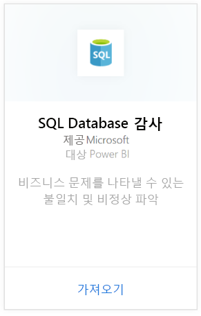
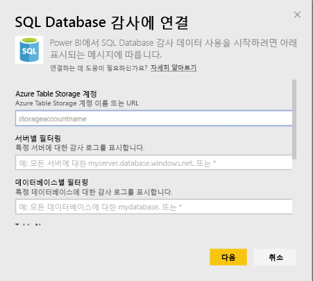
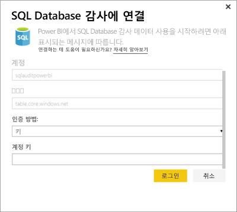
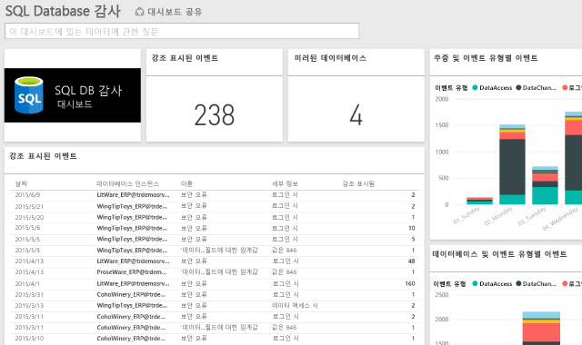

# Power BI용 SQL Database 감사 콘텐츠 팩
Azure용 Power BI 콘텐츠 팩 [SQL Database 감사](http://azure.microsoft.com/documentation/articles/sql-database-auditing-get-started/)를 사용하면 데이터베이스 작업을 이해하고 비즈니스 문제나 의심스러운 보안 위반을 나타낼 수 있는 불일치 및 비정상을 파악할 수 있습니다. 

Power BI용 [SQL Database 감사 콘텐츠 팩](https://app.powerbi.com/getdata/services/sql-db-auditing)에 연결합니다.

>[!NOTE]
>콘텐츠 팩은 그 이름에 "AuditLogs"를 포함하는 모든 표에서 데이터를 가져와 "AuditLogs"라는 단일 데이터 모델 표에 추가합니다. 마지막 250k 이벤트가 포함되고 데이터가 매일 새로 고쳐집니다.

## 연결 방법
1. 왼쪽 탐색 창의 맨 아래에 있는 **데이터 가져오기** 를 선택합니다.
   
    
2. 서비스 상자에서 가져오기를 선택합니다.
   
    
3. **SQL Database 감사**\>**가져오기**를 선택합니다.
   
   
4. Sql 데이터베이스 감사에 연결 창에서 다음을 수행합니다.
   
   - 로그가 저장된 Azure Table Storage 계정 이름 또는 URL을 입력합니다.
   
   - 관심 있는 SQL 서버의 이름을 입력합니다. 모든 서버에 대한 감사 로그를 로드하려면 “\*”을 입력합니다.
   
   - 관심 있는 SQL 데이터베이스의 이름을 입력합니다. 모든 데이터베이스에 대한 감사 로그를 로드하려면 “\*”을 입력합니다.
   
   - 관심 있는 로그가 포함된 Azure 테이블의 이름을 입력합니다. 이름에 "AuditLogs"가 포함된 모든 테이블에서 감사 로그를 로드하려면 “\*”을 입력합니다.
   
   >[!IMPORTANT]
   >모든 감사 로그가 단일 테이블에 저장되더라도 성능상의 이유로 항상 명시적 테이블 이름을 지정하는 것이 좋습니다.
   
   - 관심 있는 감사 로그의 시작 날짜를 입력합니다. 하한 시간 제한 없이 감사 로그를 로드하려면 “\*”을 입력하고, 마지막 날짜부터 감사 로그를 로드하려면 "1d"를 입력합니다.
   
   - 관심 있는 감사 로그의 종료 날짜를 입력합니다. 상한 시간 제한 없이 감사 로그를 로드하려면 “\*”을 입력합니다.
   
   
5. 인증 방법에 대해 **키**를 선택하고 **계정 키** \> **로그인**을 입력합니다.
   
   
6. Power BI가 데이터를 가져오면 왼쪽 탐색 창에 새 대시보드, 보고서 및 데이터 집합이 표시됩니다. 새 항목은 노란색 별표 \*로 표시됩니다.
   
   

**다음 단계**

* 대시보드 맨 위에 있는 [질문 및 답변 상자에 질문](power-bi-q-and-a.md)합니다.
* 대시보드에서 [타일을 변경](service-dashboard-edit-tile.md)합니다.
* [타일을 선택](service-dashboard-tiles.md)하여 원본 보고서를 엽니다.
* 데이터 집합을 매일 새로 고치도록 예약하는 경우 새로 고침 일정을 변경하거나 **지금 새로 고침**을 사용하여 필요할 때 새로 고칠 수 있습니다.

## 다음 단계
[Power BI 데이터 가져오기](service-get-data.md)
[Power BI 시작](service-get-started.md)
