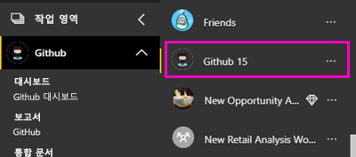

# Power BI로 GitHub에 연결
이 문서에서는 Power BI 템플릿 앱을 사용하여 GitHub 계정에서 데이터를 가져오는 과정을 안내합니다. 템플릿 앱은 대시보드, 보고서 세트 및 데이터 세트로 구성되고 GitHub 데이터를 탐색할 수 있게 해주는 작업 영역을 생성합니다. Power BI용 GitHub 앱은 기여, 이슈, 끌어오기 요청 및 활성 사용자와 관련된 데이터가 포함된 GitHub 리포지토리(리포라고도 함)의 인사이트를 표시합니다.

템플릿 앱을 설치한 후에 대시보드와 보고서를 변경할 수 있습니다. 그런 다음, 조직의 동료에게 앱으로 배포할 수 있습니다.

[GitHub 템플릿 앱](https://app.powerbi.com/groups/me/getapps/services/pbi-contentpacks.pbiapps-github)에 연결하거나 Power BI와 [GitHub 통합](https://powerbi.microsoft.com/integrations/github)에 대해 자세히 알아보세요.

[GitHub 자습서](service-tutorial-connect-to-github.md)를 살펴볼 수도 있습니다. 이 자습서는 Power BI 설명서의 공용 리포지토리에 대한 실제 GitHub 데이터를 설치합니다.

>[!NOTE]
>템플릿 앱을 사용하려면 리포지토리 액세스 권한이 있는 GitHub 계정이 필요합니다. 요구 사항에 대한 자세한 내용은 아래에 나와 있습니다.

## 연결 방법
[!INCLUDE [powerbi-service-apps-get-more-apps](./includes/powerbi-service-apps-get-more-apps.md)]
   
3. **GitHub** \> **지금 받기**를 선택합니다.
4. **이 Power BI 앱을 설치하시겠습니까?** 에서 **설치**를 선택합니다.
4. **앱** 창에서 **GitHub** 타일을 선택합니다.

    

6. **새 앱 시작**에서 **데이터 연결**을 선택합니다.

    

5. 리포지토리의 리포지토리 이름과 리포지토리 소유자를 입력합니다. 아래에서 [해당 매개 변수 찾기](#FindingParams)에 대한 세부 정보를 참조하세요.
   
    

5. GitHub 자격 증명을 입력합니다(브라우저를 사용하여 이미 로그인한 경우 이 단계를 건너뛸 수 있음). 
6. **인증 방법**에 대해 **oAuth2** \> **로그인**을 선택합니다. 
7. GitHub 인증 화면을 따릅니다. Power BI용 GitHub 템플릿 앱에 GitHub 데이터 사용 권한을 부여합니다.
   
   
   
    Power BI는 GitHub 및 데이터에 연결됩니다.  하루에 한 번 데이터가 새로 고쳐집니다. Power BI가 데이터를 가져오면 새 GitHub 작업 영역의 콘텐츠가 표시됩니다.

## 앱 수정 및 배포

GitHub 템플릿 앱을 설치했습니다. 즉, GitHub 앱 작업 영역도 만들었습니다. 작업 영역에서 보고서와 대시보드를 변경한 다음, 조직의 동료에게 ‘앱’으로 배포할 수 있습니다. 

1. 왼쪽 탐색 모음에서 작업 영역 이름 옆에 있는 화살표를 선택합니다. 작업 영역에 대시보드 및 보고서가 포함되어 있는 것을 확인할 수 있습니다.

    

8. 새 [GitHub 대시보드](https://powerbi.microsoft.com/integrations/github)를 선택합니다.    
    

3. 새 GitHub 작업 영역의 모든 콘텐츠를 보려면 왼쪽 탐색 모음에서 **작업 영역** > **GitHub**를 선택합니다.
 
   

    이 보기는 작업 영역의 콘텐츠 목록입니다. 오른쪽 위에 **앱 업데이트**가 표시됩니다. 동료에게 앱을 배포할 준비가 되었으면 여기서 시작합니다. 

    

2. **보고서** 및 **데이터 세트**를 선택하여 작업 영역의 다른 요소를 확인합니다.

    동료에게 [앱을 배포](service-create-distribute-apps.md)하는 방법을 참조하세요.

## 앱에 포함된 내용
Power BI의 GitHub에서 다음 데이터를 사용할 수 있습니다.     

| 표 이름 | 설명 |
| --- | --- |
| 기여 |기여 테이블은 기여자가 작성한 총 추가, 삭제 및 커밋 수를 주별로 집계하여 제공합니다. 상위 100개의 기여자가 포함됩니다. |
| 이슈 |선택한 리포지토리에 대한 모든 이슈를 나열하며 이슈가 닫힐 때까지의 총 시간과 평균 시간, 열린 총 이슈 수, 닫힌 총 이슈 수와 같은 계산을 포함합니다. 리포지토리에 이슈가 없으면 이 표는 비어 있습니다. |
| 끌어오기 요청 |이 표에는 리포지토리에 대한 모든 끌어오기 요청과 요청을 끌어온 사용자가 포함됩니다. 또한 열린 끌어오기 요청 수, 닫힌 끌어오기 요청 수 및 총 끌어오기 요청 수, 요청을 끌어오는 데 걸린 시간, 끌어오기 요청의 평균 소요 시간과 관련된 계산이 포함됩니다. 리포지토리에 이슈가 없으면 이 표는 비어 있습니다. |
| Users |이 테이블에서는 선택한 리포지토리와 관련하여 기여했거나, 이슈를 보고했거나, 끌어오기 요청을 해결한 GitHub 사용자 또는 기여자 목록을 제공합니다. |
| Milestones |선택한 리포지토리에 대한 모든 중요 시점이 포함됩니다. |
| DateTable |이 테이블에는 GitHub 데이터를 날짜별로 분석할 수 있도록 오늘 이후의 날짜와 과거 연도의 날짜가 포함됩니다. |
| ContributionPunchCard |이 표를 선택한 리포지토리에 대한 기여 펀치 카드로 사용할 수 있습니다. 요일 및 시간별로 커밋이 표시됩니다. 이 표는 모델의 다른 표에 연결되어 있지 않습니다. |
| RepoDetails |이 표에서는 선택한 리포지토리에 대한 세부 정보를 제공합니다. |

## 시스템 요구 사항
* 리포지토리에 액세스할 수 있는 GitHub 계정.  
* 처음 로그인하는 동안 GitHub용 Power BI 앱에 부여된 권한. 액세스 권한을 취소에 대한 아래의 세부 정보를 참조하세요.  
* 데이터를 끌어오고 새로 고치는 데 사용할 수 있는 충분한 API 호출.  

### Power BI 권한 부여 취소
Power BI가 GitHub 리포지토리에 연결할 수 없도록 권한 부여를 취소하려면 GitHub에서 액세스를 철회할 수 있습니다. 자세한 내용은 [GitHub 도움말](https://help.github.com/articles/keeping-your-ssh-keys-and-application-access-tokens-safe/#reviewing-your-authorized-applications-oauth) 항목을 참조하세요.

## 매개 변수 찾기
GitHub의 리포지토리 자체를 보면 소유자와 리포지토리를 확인할 수 있습니다.

첫 번째 부분 "Azure"는 소유자이고 두 번째 부분 "azure-sdk-for-php"는 리포지토리 자체입니다.  리포지토리의 URL에도 동일한 두 항목이 표시됩니다.

    <https://github.com/Azure/azure-sdk-for-php> .

## 문제 해결
필요한 경우 GitHub 자격 증명을 확인할 수 있습니다.  

1. 다른 브라우저 창에서 GitHub 웹 사이트로 이동한 다음, GitHub에 로그인합니다. GitHub 사이트의 오른쪽 위에서 로그인한 상태를 확인할 수 있습니다.    
2. GitHub에서 Power BI를 통해 액세스하려는 리포지토리의 URL로 이동합니다. 예: https://github.com/dotnet/corefx.  
3. Power BI로 돌아와서 GitHub에 연결을 시도합니다. GitHub 구성 대화 상자에서 동일한 리포지토리의 리포지토리 이름과 리포지토리 소유자를 사용합니다.  

## 다음 단계

* [자습서: Power BI를 사용하여 GitHub 리포지토리에 연결](service-tutorial-connect-to-github.md)
* [Power BI에서 새 작업 영역 만들기](service-create-the-new-workspaces.md)
* [Power BI에서 앱 설치 및 사용](consumer/end-user-apps.md)
* [외부 서비스용 Power BI 앱에 연결](service-connect-to-services.md)
* 궁금한 점이 더 있나요? [Power BI 커뮤니티에 질문합니다.](http://community.powerbi.com/)

