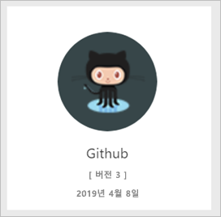
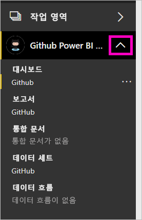
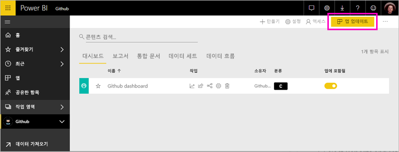

# Power BI로 GitHub에 연결
이 문서에서는 Power BI 템플릿 앱을 사용 하 여 GitHub 계정에서 데이터를 끌어오는 안내 합니다. 템플릿 앱 대시보드, 보고서, 집합 및 GitHub 데이터를 탐색할 수 있도록 데이터 집합을 사용 하 여 작업 영역을 생성 합니다. Power BI 용 GitHub 앱은 GitHub 리포지토리에 참여, 문제, 끌어오기 요청 및 활성 사용자 데이터를 사용 하 여 리포지토리 라고도에 대 한 정보를 보여 줍니다.

템플릿 앱을 설치한 후에 대시보드 및 보고서를 변경할 수 있습니다. 그런 다음 조직의 동료에 게 앱으로 배포할 수 있습니다.

에 연결 합니다 [GitHub 템플릿 앱](https://app.powerbi.com/getdata/services/github) 자세히 또는 합니다 [GitHub 통합](https://powerbi.microsoft.com/integrations/github) Power BI를 사용 하 여 합니다.

시도할 수도 있습니다는 [GitHub 자습서](service-tutorial-connect-to-github.md)합니다. Power BI 설명서에 대 한 공용 리포지토리에 대 한 실제 GitHub 데이터를 설치합니다.

>[!NOTE]
>템플릿 앱 리포지토리에 액세스할 수 있는 GitHub 계정이 필요 합니다. 요구 사항에 대한 자세한 내용은 아래에 나와 있습니다.

## 연결 방법
[!INCLUDE [powerbi-service-apps-get-more-apps](./includes/powerbi-service-apps-get-more-apps.md)]
   
3. 선택 **GitHub** \> **지금**합니다.
4. **Power BI 앱이 설치?** 선택 **설치**합니다.
4. 에 **앱** 창 합니다 **GitHub** 타일입니다.

    

6. **새 앱을 시작 하세요**를 선택 **데이터 연결**합니다.

    

5. 리포지토리의 리포지토리 이름과 리포지토리 소유자를 입력합니다. 아래에서 [해당 매개 변수 찾기](#FindingParams)에 대한 세부 정보를 참조하세요.
   
    

5. (이 단계 건너뛸 수 있음 브라우저가 이미 로그인 하는 경우) GitHub 자격 증명을 입력 합니다. 
6. **인증 방법**에 대해 **oAuth2** \> **로그인**을 선택합니다. 
7. GitHub 인증 화면을 따릅니다. Power BI 템플릿 앱 권한이 GitHub 데이터에 대 한 GitHub에 권한을 부여 합니다.
   
   
   
    Power BI는 GitHub 및 데이터에 연결합니다.  하루에 한 번 데이터가 새로 고쳐집니다. Power BI가 데이터를 가져오면 새 GitHub 작업 영역의 내용을 표시 합니다.

## 수정, 앱 배포

GitHub 템플릿 앱을 설치 했습니다. 즉, GitHub 앱 작업 영역도 만들었습니다. 작업 영역에서 보고서 및 대시보드를 다음으로 배포를 *앱* 조직의 동료에 게 합니다. 

1. 왼쪽된 탐색 모음에서 작업 영역 이름 옆의 화살표를 선택 합니다. 작업 영역 대시보드 및 보고서를 포함 하는 것이 표시 됩니다.

    

8. 새 선택 [GitHub 대시보드](https://powerbi.microsoft.com/integrations/github)합니다.    
    

3. 왼쪽된 탐색 모음에서 새 GitHub 작업 영역의 모든 콘텐츠를 보려면 선택 **작업 영역** > **GitHub**합니다.
 
   

    이 보기에는 작업 영역 콘텐츠 목록입니다. 오른쪽 위 모서리에 표시 **앱 업데이트**합니다. 동료에 게 앱을 배포할 준비가 있는 경우 시작할 수 있습니다. 

    

2. 선택 **보고서** 하 고 **데이터 집합** 작업 영역에서 다른 요소를 확인 합니다.

    읽어보세요 [앱 배포](service-create-distribute-apps.md) 동료에 게 합니다.

## 앱에는 무엇이 포함
Power BI의 GitHub에서 다음 데이터를 사용할 수 있습니다.     

| 표 이름 | 설명 |
| --- | --- |
| 참여 |참여 표는 총 추가, 삭제 및 수를 주별로 집계 참가자가 만든 커밋을 제공 합니다. 상위 100개의 참가자가 포함됩니다. |
| 문제 |선택한 리포지토리에 대한 모든 문제를 나열하며 문제가 닫힐 때까지의 총 시간과 평균 시간, 열린 총 문제 수, 닫힌 총 문제 수와 같은 계산을 포함합니다. 리포지토리에 문제가 없으면 이 표는 비어 있습니다. |
| 끌어오기 요청 |이 표에는 리포지토리에 대한 모든 끌어오기 요청과 요청을 끌어온 사용자가 포함됩니다. 또한 얼마나 많은 열고, 닫힌 총 끌어오기 요청에 관련 된 계산이, 요청을 끌어오는 데 걸린 기간 및 끌어오기 요청의 평균 소요 포함 합니다. 리포지토리에 문제가 없으면 이 표는 비어 있습니다. |
| 사용자 |이 표에서 GitHub 사용자 또는 참여, 문제를 제출 하거나 선택한 리포지토리에 대 한 끌어오기 요청을 해결 않은 참가자의 목록을 제공 합니다. |
| 중요 시점 |선택한 리포지토리에 대한 모든 중요 시점이 포함됩니다. |
| DateTable |이 테이블에서 현재 및 과거 연도의 날짜 GitHub 데이터를 분석할 수 있도록 하는 날짜를 포함 합니다. |
| ContributionPunchCard |이 표를 선택한 리포지토리에 대한 참여 펀치 카드로 사용할 수 있습니다. 요일 및 시간별로 커밋이 표시됩니다. 이 표는 모델의 다른 표에 연결되어 있지 않습니다. |
| RepoDetails |이 표에서는 선택한 리포지토리에 대한 세부 정보를 제공합니다. |

## 시스템 요구 사항
* 리포지토리에 액세스할 수 있는 GitHub 계정.  
* 처음 로그인하는 동안 GitHub용 Power BI 앱에 부여된 권한. 액세스 권한을 취소에 대한 아래의 세부 정보를 참조하세요.  
* 데이터를 끌어오고 새로 고치는 데 사용할 수 있는 충분한 API 호출.  

### Power BI 권한 부여 취소
GitHub 리포지토리에 연결할 권한을 Power BI에서 GitHub에서 액세스를 해지할 수 있습니다. 이 참조 하세요 [GitHub 도움말](https://help.github.com/articles/keeping-your-ssh-keys-and-application-access-tokens-safe/#reviewing-your-authorized-applications-oauth) 세부 정보에 대 한 항목입니다.

## 매개 변수 찾기
GitHub의 리포지토리 자체를 보면 소유자와 리포지토리를 확인할 수 있습니다.

첫 번째 부분 "Azure"는 소유자이고 두 번째 부분 "azure-sdk-for-php"는 리포지토리 자체입니다.  리포지토리의 URL에도 동일한 두 항목이 표시됩니다.

    <https://github.com/Azure/azure-sdk-for-php> .

## 문제 해결
필요한 경우 GitHub 자격 증명을 확인할 수 있습니다.  

1. 다른 브라우저 창에서 GitHub 웹 사이트로 이동 하 고 GitHub에 로그인 합니다. GitHub 사이트의 오른쪽 위에서 로그인한 상태를 확인할 수 있습니다.    
2. GitHub에서 Power BI를 통해 액세스하려는 리포지토리의 URL로 이동합니다. 예: https://github.com/dotnet/corefx.  
3. Power BI로 돌아와서 GitHub에 연결을 시도합니다. GitHub 구성 대화 상자에서 동일한 리포지토리의 리포지토리 이름과 리포지토리 소유자를 사용합니다.  

## 다음 단계

* [자습서: Power BI를 사용 하 여 GitHub 리포지토리에 연결](service-tutorial-connect-to-github.md)
* [Power BI에서 새 작업 영역 만들기](service-create-the-new-workspaces.md)
* [Power BI에서 앱 설치 및 사용](consumer/end-user-apps.md)
* [외부 서비스용 Power BI 앱에 연결](service-connect-to-services.md)
* 궁금한 점이 더 있나요? [Power BI 커뮤니티에 질문합니다.](http://community.powerbi.com/)

