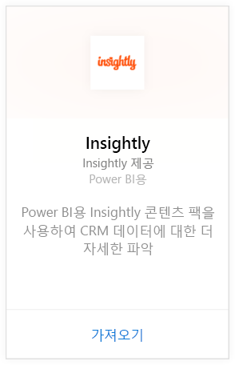
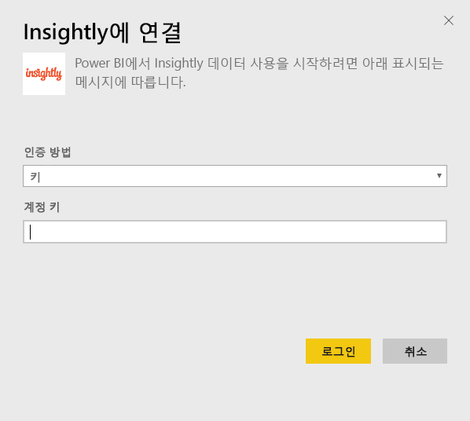
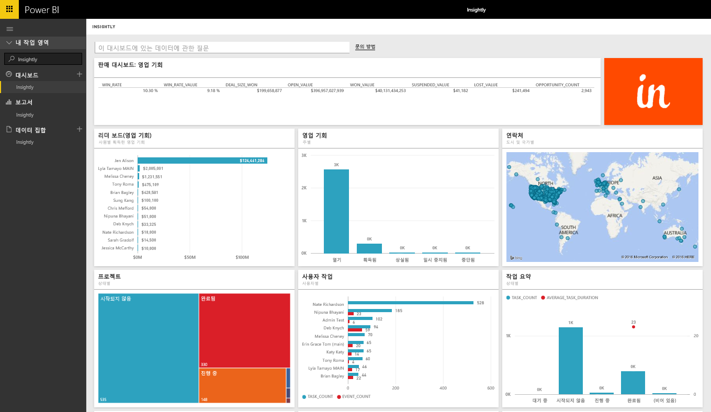
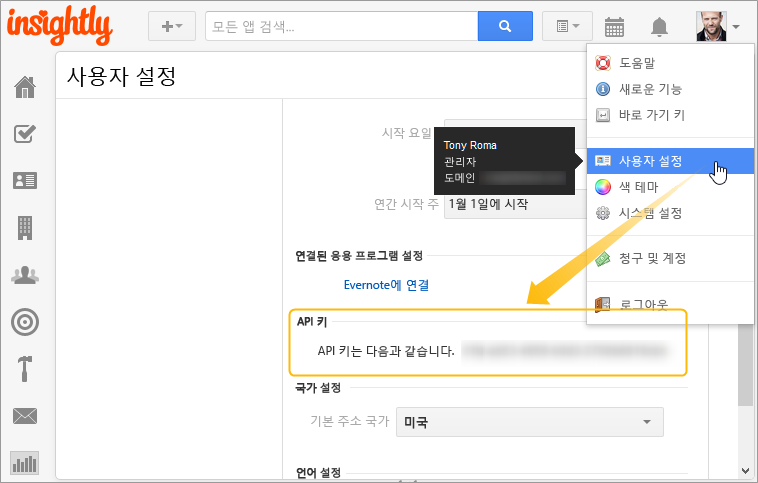

# Power BI로 Insightly에 연결
Insightly 콘텐츠 팩과 함께 Power BI의 Insightly CRM 데이터를 시각화하고 공유합니다. Insightly API 키를 사용해서 Power BI에 연결하여 CRM 데이터에서 보고서 및 대시보드를 보고 빌드합니다. Power BI를 사용하여 새로운 방식으로 데이터를 분석하고, 강력한 그래프와 차트를 만들고, 지도에 연락처, 잠재 고객 및 조직을 표시할 수 있습니다.

Power BI용 [Insightly 콘텐츠 팩](https://app.powerbi.com/getdata/services/insightly)에 연결합니다.

## 연결 방법
1. 왼쪽 탐색 창의 맨 아래에 있는 **데이터 가져오기** 를 선택합니다.
   
   
2. **서비스** 상자에서 **가져오기**를 선택합니다.
   
   
3. **Insightly** \> **가져오기**를 선택합니다.
   
   
4. 인증 형식으로 **키** 를 선택하고, Insight API 키를 제공한 다음 **로그인**을 선택합니다. 아래에서 [이 값 찾기](#FindingParams)에 대한 세부 정보를 참조하세요.
   
   
5. 승인되면 가져오기 프로세스가 자동으로 시작됩니다. 완료되면 새 대시보드, 보고서 및 모델이 탐색 창에 나타납니다. 대시보드를 선택하여 가져온 데이터를 표시합니다.
   
     

**다음 단계**

* 대시보드 맨 위에 있는 [질문 및 답변 상자에 질문](service-q-and-a.md)합니다.
* 대시보드에서 [타일을 변경](service-dashboard-edit-tile.md)합니다.
* [타일을 선택](service-dashboard-tiles.md)하여 원본 보고서를 엽니다.
* 데이터 집합을 매일 새로 고치도록 예약하는 경우 새로 고침 일정을 변경하거나 **지금 새로 고침**을 사용하여 필요할 때 새로 고칠 수 있습니다.

## 포함된 내용
콘텐츠 팩에는 해당하는 레코드의 필드를 가진 다음과 같은 테이블이 포함됩니다.

| 표 |  |  |  |
| --- | --- | --- | --- |
| 연락처 |영업 기회 |파이프라인 단계 |작업 완료 날짜 |
| 사용자 지정 필드 |영업 기회 종료 날짜 |프로젝트 완료 날짜 |태스크 |
| Events |영업 기회 예측 날짜 |프로젝트 |팀/멤버 |
| 잠재 고객 |조직 |태그 |사용자 |

또한 여러 테이블 및 보고서는 다음과 같은 고유한 계산된 필드를 포함합니다.  

* "그룹화된" 영업 기회가 있는 테이블은 월, 분기 또는 연도 별 분석을 위한 종료 날짜, 영업 기회 실제 종료 날짜, 프로젝트 완료 날짜 및 태스크 완료 날짜를 예측합니다.  
* 영업 기회에 대한 가중치 값 필드입니다(영업 기회 값 * 획득 가능성).  
* 시작 및 완료 날짜를 기준으로 하는 태스크에 대한 평균 및 총 기간 필드입니다.  
* 영업 기회 승률(획득 횟수/총 영업 기회 수) 및 승률 값(획득 값/총 영업 기회의 값)에 대한 계산된 필드가 있는 보고서입니다.  

## 시스템 요구 사항
Insightly API에 액세스할 수 있는 Insightly 계정은 필수입니다. 표시 권한은 Power BI에 대한 연결을 설정하는 데 사용되는 API 키에 따라 달라집니다. 표시되는 모든 Insightly 레코드는 다른 사용자와 공유하는 Power BI 보고서 및 대시보드에도 표시됩니다.

## 매개 변수 찾기
**API 키**

Insightly에서 API 키를 복사하려면 Insightly 프로필 메뉴에서 사용자 설정을 선택하고 아래로 스크롤합니다. 이 문자열은 데이터를 Power BI에 연결하는 데 사용됩니다.

## 문제 해결
Insightly API를 통해 사용자 데이터를 가져옵니다. 가져오는 데이터에는 Insightly 구독 계획 수준에 따른 일일 제한이 있습니다. 제한은 API 설명서의 속도 제한/제한 요청 섹션에 나열됩니다. https://api.insight.ly/v2.2/Help#!/Overview/Introduction#ratelimit

제공된 보고서에서는 Insightly의 기본 필드를 사용하며, 사용자 지정 항목은 포함하지 않을 수 있습니다. 사용 가능한 모든 필드를 보려면 보고서를 편집 하세요.

## 다음 단계
[Power BI에서 시작](service-get-started.md)

[Power BI에서 데이터 가져오기](service-get-data.md)

