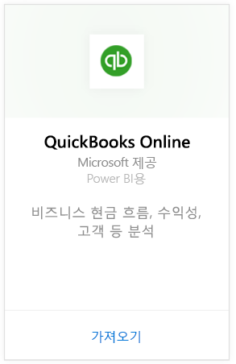
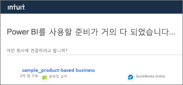
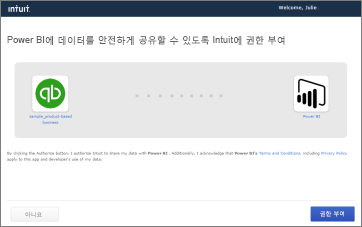
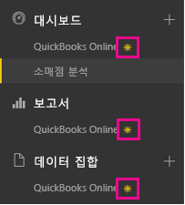
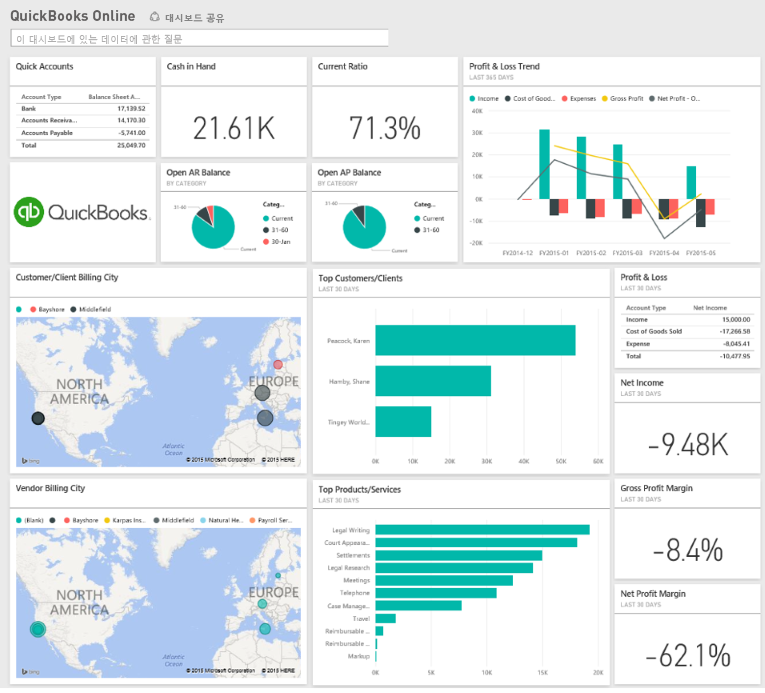

# Power BI로 QuickBooks Online에 연결
Power BI용 QuickBooks Online 데이터에 연결하면 비즈니스 현금 흐름, 수익성, 고객 등에 대한 통찰력을 제공하는 Power BI 대시보드 및 Power BI 보고서가 즉시 표시됩니다. 제공된 대시보드 및 보고서를 그대로 사용하거나, 가장 관심 있는 정보를 강조 표시하도록 사용자 지정합니다. 하루에 한 번 자동으로 데이터가 새로 고쳐집니다.

Power BI용 [QuickBooks Online 콘텐츠 팩](https://dxt.powerbi.com/getdata/services/quickbooks-online)에 연결합니다.

>[!NOTE]
>QuickBooks Online 데이터를 Power BI로 가져오려면 QuickBooks Online 계정의 관리자여야 하며 관리자 계정 자격 증명으로 로그인해야 합니다. QuickBooks Desktop 소프트웨어에서 이 커넥터를 사용할 수 없습니다. 

## 연결 방법
1. 왼쪽 탐색 창의 맨 아래에 있는 **데이터 가져오기**를 선택합니다.
   
    
2. **서비스** 상자에서 **가져오기**를 선택합니다.
   
    
3. **QuickBooks Online**을 선택한 다음 **가져오기**를 선택합니다.
   
   
4. 인증 방법에 대해 **oAuth2**를 선택하고 **로그인**을 선택합니다. 
5. 메시지가 표시되면 QuickBooks Online 자격 증명을 입력하고 QuickBooks Online 인증 프로세스를 따릅니다. 브라우저에서 QuickBooks Online에 이미 로그인한 경우 자격 증명을 묻는 메시지가 표시되지 않을 수도 있습니다.
   >[!NOTE]
   >QuickBooks 온라인 계정의 관리자 자격 증명이 필요합니다.
6. 다음 화면에서 Power BI에 연결하려는 회사를 선택합니다.
   
   
7. 다음 화면에서 **권한 부여**를 선택하여 가져오기 프로세스를 시작합니다. 이 작업은 회사 데이터의 크기에 따라 몇 분 정도 걸릴 수 있습니다. 
   
   
   
   Power BI가 데이터를 가져오면 왼쪽 탐색 창에 새 대시보드, 보고서 및 데이터 세트가 표시됩니다. 새 항목은 노란색 별표 \*로 표시됩니다.
   
   
8. QuickBooks Online 대시보드를 선택합니다. Power BI가 가져온 데이터를 표시하기 위해 자동으로 생성한 대시보드입니다. 이 대시보드를 수정하여 원하는 방식으로 데이터를 표시할 수 있습니다. 
   
   

**다음 단계**

* 대시보드 맨 위에 있는 [질문 및 답변 상자에 질문](consumer/end-user-q-and-a.md)합니다.
* 대시보드에서 [타일을 변경](service-dashboard-edit-tile.md)합니다.
* [타일을 선택](consumer/end-user-tiles.md)하여 원본 보고서를 엽니다.
* 데이터 세트을 매일 새로 고치도록 예약하는 경우 새로 고침 일정을 변경하거나 **지금 새로 고침**을 사용하여 필요할 때 새로 고칠 수 있습니다.

## 문제 해결
**“ 오류가 발생했습니다."**

**권한 부여**를 선택하면 다음 메시지가 표시됩니다.

" 오류가 발생했습니다." 이 창을 닫고 다시 시도하세요.

이 회사의 다른 사용자가 애플리케이션을 이미 구독했습니다. [관리자 메일]로 연락하여 이 구독을 변경하세요."

...이는 회사의 다른 관리자가 Power BI를 사용하여 회사 데이터에 이미 연결되었음을 의미합니다. 해당 관리자에게 대시보드를 공유하도록 요청하세요. 현재 한 명의 관리자 사용자만 특정 QuickBooks Online 회사 데이터 세트를 Power BI에 연결할 수 있습니다. Power BI가 대시보드를 만든 후 관리자는 동일한 Power BI 테넌트의 여러 동료와 공유할 수 있습니다.

**"이 앱은 해당 국가의 연결을 허용하도록 설정되어 있지 않습니다"**

현재 Power BI는 QuickBooks Online의 미국 버전만 지원합니다. 

## 다음 단계
[Power BI란?](power-bi-overview.md)

[Power BI 서비스의 디자이너를 위한 기본 개념](service-basic-concepts.md)

