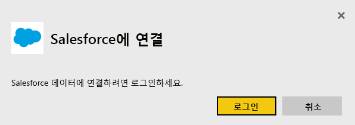
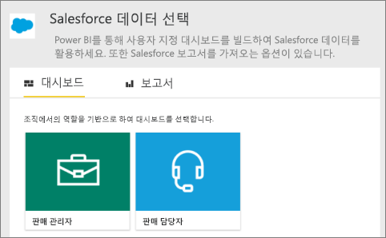
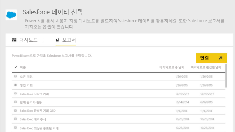
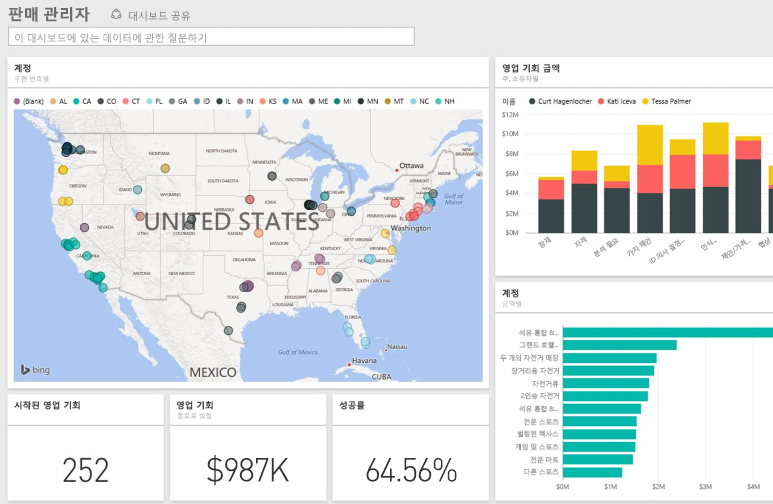

# Power BI로 Salesforce에 연결
Power BI를 사용하면 Salesforce.com 계정에 쉽게 연결할 수 있습니다. 이 연결을 통해 Salesforce 데이터를 검색하고 대시보드와 보고서를 자동으로 제공받을 수 있습니다.

Power BI와 [Salesforce 통합](https://powerbi.microsoft.com/integrations/salesforce)에 대해 자세히 알아보세요.

## 연결 방법
1. Power BI의 탐색 창 아래쪽에서 **데이터 가져오기**를 선택합니다.
   
    
2. **서비스** 상자에서 **가져오기**를 선택합니다.
   
    
3. **Salesforce에 대한 분석**을 선택하고 **가져오기**를 선택합니다.  
   
   
4. **로그인**을 선택하여 로그인 흐름을 시작합니다.
   
    
5. 메시지가 표시되면 Salesforce 자격 증명을 입력합니다. **허용**을 선택하여 Power BI가 기본 Salesforce 정보 및 데이터에 액세스할 수 있게 합니다.
   
   
6. 드롭다운 옵션을 사용하여 Power BI로 가져오려는 항목을 구성합니다.
   
   * **대시보드**
     
     가상 사용자(예: **판매 관리자**)에 따라 미리 정의된 대시보드를 선택합니다. 이러한 대시보드는 사용자 지정 필드를 포함하지 않는 특정 Salesforce 표준 데이터의 세트를 검색합니다.
     
     
   * **보고서**
     
     Salesforce 계정에서 사용자 지정 보고서를 하나 이상 선택합니다. 이러한 보고서는 Salesforce의 뷰와 일치하며 사용자 지정 필드 또는 개체의 데이터를 포함할 수 있습니다.
     
     
     
     보고서가 표시되지 않는 경우 Salesforce 계정에서 추가하거나 만든 후 다시 연결합니다.

7. **연결**을 선택하여 가져오기 프로세스를 시작합니다. 가져오는 동안 가져오기가 진행 중임을 보여 주는 알림이 표시됩니다. 가져오기가 완료되면 탐색 창에 나열된 Salesforce 데이터에 대한 대시보드, 보고서 및 데이터 세트가 표시됩니다.
   
   

대시보드를 변경하여 원하는 방법으로 데이터를 표시할 수 있습니다. Q&A 또는 [타일 선택](consumer/end-user-tiles.md)을 통해 질문하여 기본 보고서를 열고 [대시보드 타일을 편집하거나 제거](service-dashboard-edit-tile.md)할 수 있습니다.

**다음 단계**

* 대시보드 맨 위에 있는 [질문 및 답변 상자에 질문](consumer/end-user-q-and-a.md)합니다.
* 대시보드에서 [타일을 편집 또는 제거](service-dashboard-edit-tile.md)합니다.
* [타일을 선택](service-dashboard-tiles.md)하여 원본 보고서를 엽니다.
* 데이터 세트를 매일 새로 고치도록 예약하는 경우 새로 고침 일정을 변경하거나 **지금 새로 고침**을 사용하여 필요할 때 새로 고칠 수 있습니다.

## 시스템 요구 사항 및 고려 사항

- API에 액세스할 수 있는 프로덕션 Salesforce 계정을 사용하여 연결되어 있어야 합니다.

- 로그인하는 동안 Power BI 앱에 권한이 부여되어야 합니다.

- 계정에 데이터를 끌어오고 새로 고치는 데 사용할 수 있는 충분한 API 호출이 있어야 합니다.

- 새로 고치려면 유효한 인증 토큰이 필요합니다. Salesforce에서는 애플리케이션당 5개 인증 토큰으로 제한되므로 5개 이하의 Salesforce 데이터 세트를 가져와야 합니다.

- Salesforce 보고서 API에는 최대 2,000개의 데이터 행을 지원하는 제한 사항이 있습니다.

## 문제 해결

오류가 발생하는 경우 위의 요구 사항을 검토하세요. 

사용자 지정 또는 샌드박스 도메인에 로그인하는 것은 현재 지원되지 않습니다.

### "원격 서버에 연결할 수 없습니다." 메시지

Salesforce 계정에 연결하려고 시도할 때 "원격 서버에 연결할 수 없음" 메시지가 표시되면 다음 포럼에서 이 솔루션을 참조하세요. [Salesforce 커넥터 로그인 오류 메시지: 원격 서버에 연결할 수 없음](https://www.outsystems.com/forums/Forum_TopicView.aspx?TopicId=17674&TopicName=log-in-error-message-unable-to-connect-to-the-remote-server&)

## 다음 단계
[Power BI란?](fundamentals/power-bi-overview.md)

[Power BI 서비스용 데이터 원본](service-get-data.md)

