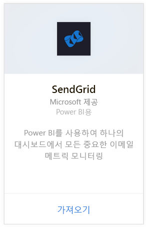
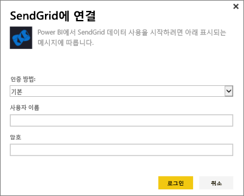
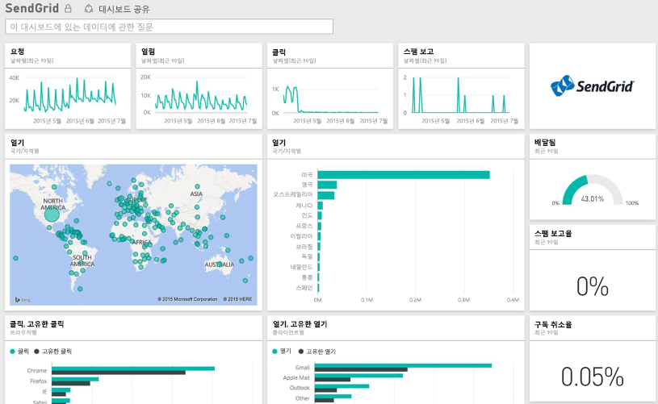

# Power BI로 SendGrid에 연결
SendGrid용 Power BI 콘텐츠 팩을 사용하면 SendGrid 계정을 파악하고 통계를 추출할 수 있습니다. SendGrid 콘텐츠 팩을 통해 대시보드에 SendGrid 통계를 시각화할 수 있습니다.

Power BI용 [SendGrid 콘텐츠 팩](https://app.powerbi.com/getdata/services/sendgrid)에 연결합니다.

## 연결 방법
1. 왼쪽 탐색 창의 맨 아래에 있는 **데이터 가져오기** 를 선택합니다.
   
    
2. **서비스** 상자에서 **가져오기**를 선택합니다.
   
    
3. **SendGrid** 콘텐츠 팩을 선택하고 **가져오기**를 클릭합니다.
   
    
4. 메시지가 표시되면 SendGrid 사용자 이름과 암호를 제공합니다. **로그인**을 선택합니다.
   
   
5. Power BI가 데이터를 가져오면 왼쪽 탐색 창에 지난 90일간의 이메일 통계가 채워진 새 대시보드, 보고서 및 데이터 세트가 표시됩니다. 새 항목은 노란색 별표 \*로 표시됩니다.
   
   

**다음 단계**

* 대시보드 맨 위에 있는 [질문 및 답변 상자에 질문](consumer/end-user-q-and-a.md)합니다.
* 대시보드에서 [타일을 변경](service-dashboard-edit-tile.md)합니다.
* [타일을 선택](consumer/end-user-tiles.md)하여 원본 보고서를 엽니다.
* 데이터 세트를 매일 새로 고치도록 예약하는 경우 새로 고침 일정을 변경하거나 **지금 새로 고침**을 사용하여 필요할 때 새로 고칠 수 있습니다.

## 포함된 내용
SendGrid 대시보드에서 사용할 수 있는 메트릭은 다음과 같습니다.

* 전체 메일 통계 - 요청, 배달됨, 반송됨, 스팸 차단됨, 스팸 보고서 등입니다.
* 범주별 메일 통계
* 지리별 메일 통계
* ISP별 메일 통계
* 디바이스, 클라이언트, 브라우저별 메일 통계

## 다음 단계
[Power BI란?](power-bi-overview.md)

[데이터 가져오기](service-get-data.md)

