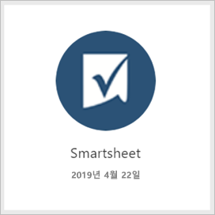
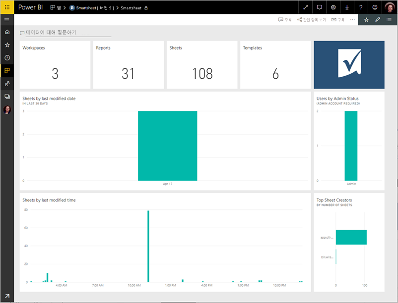
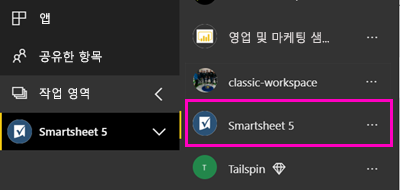
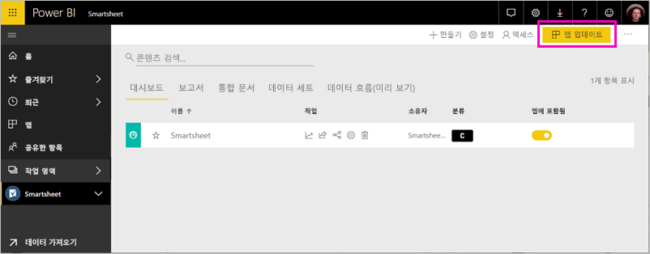

# Power BI로 Smartsheet에 연결
이 문서에서는 Power BI 템플릿 앱을 사용하여 Smartsheet 계정에서 데이터를 가져오는 방법을 안내합니다. Smartsheet는 간편하게 협업하고 파일을 공유할 수 있는 플랫폼을 제공합니다. Power BI 용 Smartsheet 템플릿 앱은 Smartsheet 계정의 개요를 표시하는 대시보드, 보고서 및 데이터 집합을 제공합니다. [Power BI Desktop](desktop-connect-to-data.md)을 사용하여 계정의 개별 시트에 직접 연결할 수도 있습니다. 

템플릿 앱을 설치한 후에 대시보드 및 보고서를 변경할 수 있습니다. 그런 다음 조직의 동료에게 앱으로 배포할 수 있습니다.

Power BI용 [Smartsheet 템플릿 앱](https://app.powerbi.com/groups/me/getdata/services/smartsheet)에 연결합니다

>[!NOTE]
>Smartsheet 관리자 계정은 추가 액세스 권한이 있으므로 Power BI 템플릿 앱을 로드하고 연결하는 데 선호됩니다.

## 연결 방법

[!INCLUDE [powerbi-service-apps-get-more-apps](./includes/powerbi-service-apps-get-more-apps.md)]

3. **Smartsheet** \> **지금 받기**를 선택합니다.
4. **Power BI 앱 설치?** 에서 **설치**를 선택합니다.
4. **앱** 창에서 **Smartsheet** 타일을 선택합니다.

    

6. **새 앱을 시작하세요**에서 **연결**을 선택합니다.

    

4. 인증 방법에 대해 **oAuth2 \> 로그인**을 선택합니다.
   
   메시지가 표시되면 Smartsheet 자격 증명을 입력하고 인증 프로세스를 따릅니다.
   
   
   
   

5. Power BI가 데이터를 가져오면 Smartsheet 대시보드가 열립니다.
   
   

## 수정, 앱 배포

Smartsheet 템플릿 앱을 설치했습니다. 즉, Smartsheet 앱 작업 영역도 만들었습니다. 작업 영역에서 보고서 및 대시보드를 변경한 다음, 조직의 동료에게 *앱*으로 배포합니다. 

1. 새 Smartsheet 작업 영역의 모든 콘텐츠를 보려면 왼쪽 탐색 모음에서 **작업 영역** > **Smartsheet**를 선택합니다. 

    

    이 보기는 작업 영역 콘텐츠 목록입니다. 오른쪽 위 모서리에 **앱 업데이트**가 표시됩니다. 동료에게 앱을 배포할 준비가 된 경우 시작할 수 있습니다. 

    

2. **보고서**와 **데이터 세트**를 선택하여 작업 영역의 다른 요소를 확인합니다.

    동료에게 [앱 배포](service-create-distribute-apps.md)를 읽어보세요.

## 포함된 내용
Power BI용 Smartsheet 템플릿 앱은 보고서, 대시보드 및 작업 영역의 수, 사용자 소유의 시트, 시트가 수정된 때와 같은 Smartsheet 계정의 개요를 포함합니다. 관리자는 또한 시트를 많이 생성한 사용자 등 해당 시스템에서 사용자 관련 일부 정보를 확인할 수 있습니다.  

계정의 개별 시트에 직접 연결하려면 [Power BI Desktop](desktop-connect-to-data.md)에서 Smartsheet 커넥터를 사용할 수 있습니다.  

## 다음 단계

* [Power BI에서 새 작업 영역 만들기](service-create-the-new-workspaces.md)
* [Power BI에서 앱 설치 및 사용](consumer/end-user-apps.md)
* [외부 서비스용 Power BI 앱에 연결](service-connect-to-services.md)
* 궁금한 점이 더 있나요? [Power BI 커뮤니티에 질문합니다.](http://community.powerbi.com/)