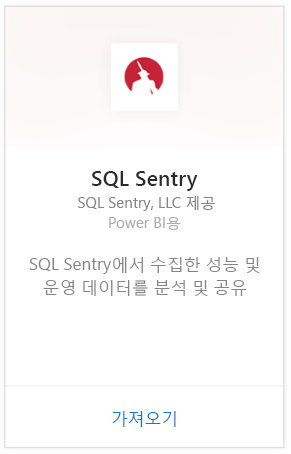
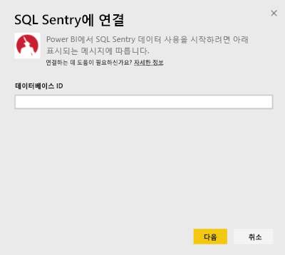
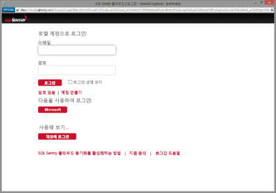
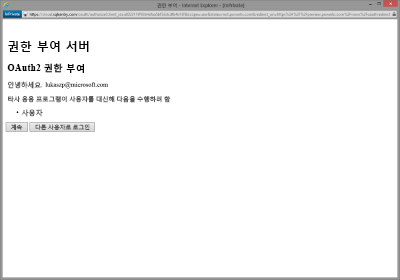
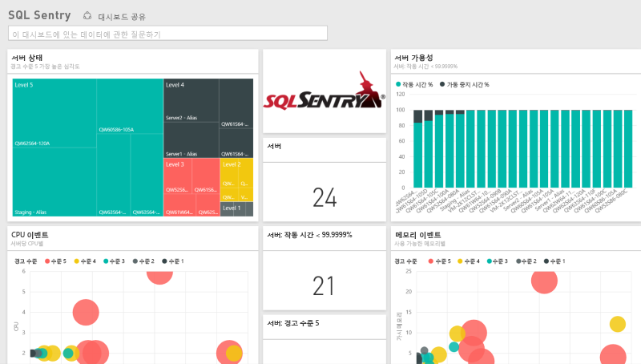
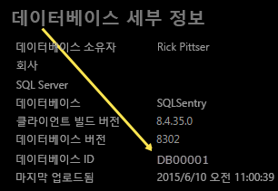

# Power BI로 SQL Sentry에 연결
Power BI를 사용하면 SQL Sentry를 통해 수집한 성능 데이터를 쉽게 분석할 수 있습니다. Power BI는 데이터를 검색한 다음 해당 데이터를 기반으로 하여 기본 대시보드 및 관련 보고서를 작성합니다.

Power BI용 [SQL Sentry 콘텐츠 팩](https://app.powerbi.com/groups/me/getdata/services/sql-sentry)에 연결합니다.

>[!NOTE]
>연결하려면 http://cloud.sqlsentry.com에 연결하는 데 사용하는 SQL Sentry 계정에 대한 액세스 권한과 모니터링할 데이터베이스 ID가 필요합니다.  데이터베이스 ID를 찾을 위치에 대한 지침이 아래에 나와 있습니다.

## 연결 방법
1. 왼쪽 탐색 창의 맨 아래에 있는 **데이터 가져오기** 를 선택합니다.
   
   
2. **서비스** 상자에서 **가져오기**를 선택합니다.
   
    
3. **SQL Sentry \> 가져오기**를 선택합니다.
   
   
4. Power BI에서 모니터링하려는 데이터베이스의 **데이터베이스 ID** 를 제공합니다. 아래에서 [이 값 찾기](#FindingParams)에 대한 세부 정보를 참조하세요.
   
   
5. 인증 방법에 대해 **oAuth2 \> 로그인**을 선택합니다.
   
   메시지가 표시되면 cloud.sqlsentry.com 자격 증명을 입력하고 SQL Sentry 인증 프로세스를 따릅니다.
   
   
   
   처음 연결하는 경우 Power BI에 계정에 대한 읽기 전용 액세스를 허용하라는 메시지가 표시됩니다. 허용을 선택하여 가져오기 프로세스를 시작합니다.  가져오기 프로세스는 계정의 데이터 볼륨에 따라 몇 분 정도 걸릴 수 있습니다.
   
   
6. Power BI가 데이터를 가져오면 왼쪽 탐색 창에 새 대시보드, 보고서 및 데이터 집합이 표시됩니다. 새 항목은 노란색 별표 \*로 표시됩니다.
   
   
7. SQL Sentry 대시보드를 선택합니다.
   
   Power BI가 데이터를 표시하기 위해 만든 기본 대시보드입니다. 이 대시보드를 수정하여 원하는 방식으로 데이터를 표시할 수 있습니다.
   
   

**다음 단계**

* 대시보드 맨 위에 있는 [질문 및 답변 상자에 질문](service-q-and-a.md)합니다.
* 대시보드에서 [타일을 변경](service-dashboard-edit-tile.md)합니다.
* [타일을 선택](service-dashboard-tiles.md)하여 원본 보고서를 엽니다.
* 데이터 집합을 매일 새로 고치도록 예약하는 경우 새로 고침 일정을 변경하거나 **지금 새로 고침**을 사용하여 필요할 때 새로 고칠 수 있습니다.

## 포함된 내용
Power BI의 SQL Sentry에서 다음 데이터를 사용할 수 있습니다.

| 표 이름 | 설명 |
| --- | --- |
| 연결 |이 표에서 연결을 정의한 SQL Sentry에 대한 정보를 제공합니다. |
| 날짜  |이 테이블에는 성능 데이터를 수집하고 보존한 가장 빠른 날짜부터 오늘까지의 날짜가 들어 있습니다. |
| 가동 중지 시간  |이 테이블에는 사용자 환경에서 모니터링된 각 서버에 대한 가동 중지 시간 및 작동 시간과 관련된 정보가 들어 있습니다. |
| 메모리 사용량  |이 테이블에는 각 서버에서 사용 가능한 메모리의 양에 대한 데이터가 들어 있습니다.  |
| 서버  |이 테이블에는 사용자 환경의 각 서버에 대한 레코드가 들어 있습니다. |
| 서버 상태  |이 테이블에는 심각도 및 개수를 포함하여 사용자 환경에서 사용자 지정 조건에 따라 생성된 모든 이벤트에 대한 데이터가 포함되어 있습니다. |

## 매개 변수 찾기
새 웹 브라우저 창에서 <https://cloud.sqlsentry.com>에 로그인하여 **데이터베이스 ID**를 찾을 수 있습니다.  **데이터베이스 ID** 는 기본 개요 페이지에 나열됩니다.

    

**데이터베이스 ID** 는 데이터베이스 세부 정보 화면에도 표시됩니다.

    

## 문제 해결
일부 앱의 데이터가 Power BI에 표시되지 않으면 올바른 데이터베이스 ID를 사용하고 있는지 그리고 데이터를 볼 권한이 있는지 확인합니다. 

<https://cloud.sqlsentry.com>에 동기화 중인 SQL Sentry 데이터베이스의 소유자가 아닌 경우 관리자에게 연락하여 수집된 데이터를 볼 수 있는 권한이 있는지 확인하세요.

## 다음 단계
[Power BI 시작](service-get-started.md)

[Power BI에 대한 데이터 가져오기](service-get-data.md)

