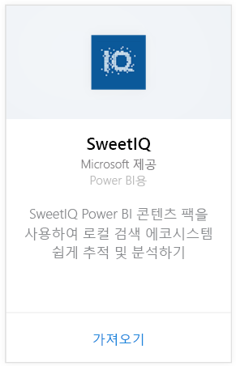
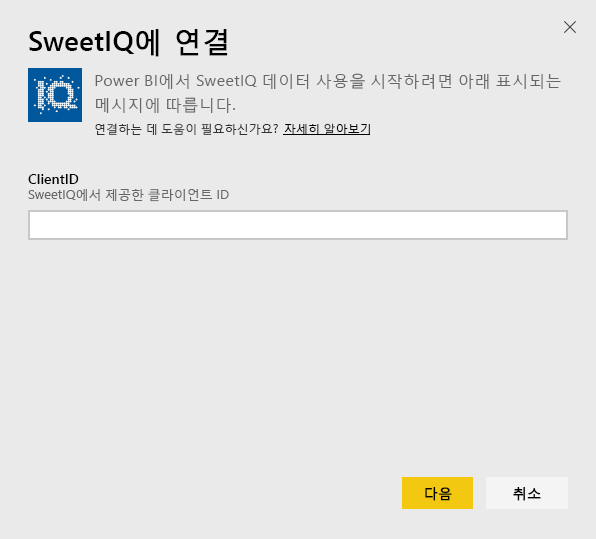
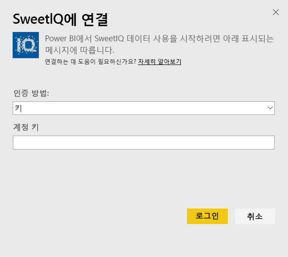
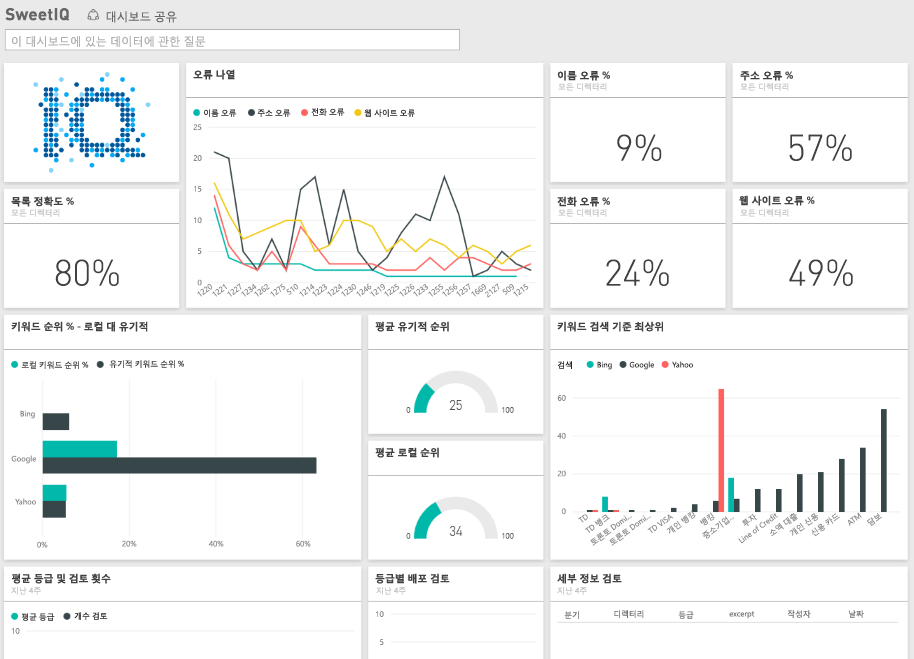

# Power BI로 SweetIQ에 연결
Power BI 콘텐츠 팩은 SweetIQ 계정에서 데이터를 가져오고 데이터를 쉽게 탐색할 수 있는 기본 콘텐츠 집합을 생성합니다. SweetIQ 콘텐츠 팩을 사용하여 위치, 목록, 평점 및 리뷰에 대한 데이터를 분석합니다. 데이터가 매일 새로 고쳐지도록 설정되어 모니터링하는 데이터를 최신 상태를 유지합니다.

Power BI용 [SweetIQ 콘텐츠 팩](https://app.powerbi.com/groups/me/getdata/services/sweetiq)에 연결합니다.

## 연결 방법
1. 왼쪽의 탐색 창에서 **데이터 가져오기**를 클릭합니다.
   
    
2. **SweetIQ**를 선택하고 **가져오기**를 클릭합니다.
   
    
3. SweetIQ 클라이언트 ID를 제공합니다. 일반적으로 영숫자 값입니다. 이 값 찾기에 대한 자세한 내용은 아래를 참조하세요.
   
    
4. **키** 인증 형식을 선택하고 Sweet IQ API 키를 제공합니다. 일반적으로 영숫자 값입니다. 이 값 찾기에 대한 자세한 내용은 아래를 참조하세요.
   
    
5. Power BI가 데이터를 로드를 시작합니다. 이 작업은 계정의 데이터의 크기에 따라 시간이 걸릴 수 있습니다. 로드가 완료되면 새 대시보드, 보고서 및 데이터 세트가 왼쪽 탐색 창에 표시됩니다.
   
    

**다음 단계**

* 대시보드 맨 위에 있는 [질문 및 답변 상자에 질문](consumer/end-user-q-and-a.md)합니다.
* 대시보드에서 [타일을 변경](service-dashboard-edit-tile.md)합니다.
* [타일을 선택](consumer/end-user-tiles.md)하여 원본 보고서를 엽니다.
* 데이터 세트를 매일 새로 고치도록 예약하는 경우 새로 고침 일정을 변경하거나 **지금 새로 고침**을 사용하여 필요할 때 새로 고칠 수 있습니다.

## 매개 변수 찾기
이 콘텐츠 팩의 클라이언트 ID와 API 키는 SweetIQ 사용자 이름 및 암호와 다릅니다.

계정이 액세스할 수 있는 클라이언트 중 하나에 대한 클라이언트 ID를 선택합니다. SweetIQ 계정의 "클라이언트 관리" 아래에서 클라이언트 목록을 찾을 수 있습니다.

특정 클라이언트에 대한 데이터에 액세스하려면 API 키에 대해 관리자에게 문의합니다.

## 다음 단계
[Power BI란?](power-bi-overview.md)

[Power BI에 대한 데이터 가져오기](service-get-data.md)

