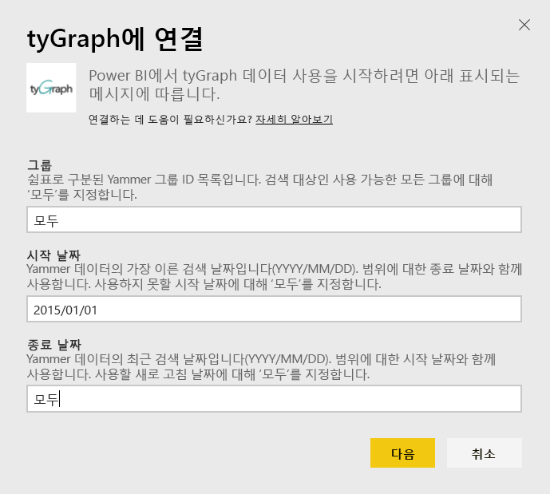
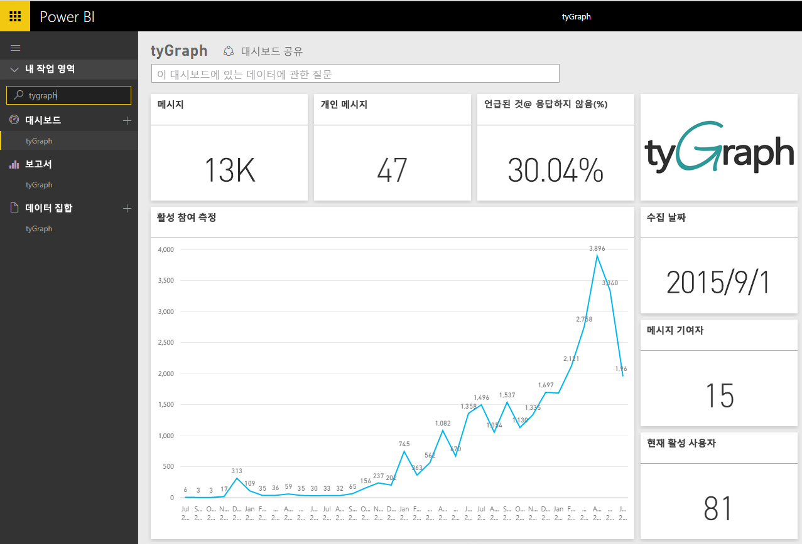

# Power BI로 tyGraph에 연결
Power BI 콘텐츠 팩을 사용하여 Power BI에서 tyGraph 데이터를 보고 탐색합니다. tyGraph 계정에 연결하고 대시보드, 보고서 및 데이터 세트를 로드하여 시작합니다. 기본 콘텐츠에 활성 참여 측정(MAE 점수) 및 주요 참가자와 같은 정보가 포함됩니다. 가장 중요한 정보를 강조 표시하려면 추가로 사용자 지정합니다.  설정한 일정에 따라 데이터가 자동으로 새로 고쳐집니다.

[Power BI용 tyGraph](https://app.powerbi.com/getdata/services/tygraph)에 연결합니다.

## 연결 방법
1. 왼쪽 탐색 창의 맨 아래에 있는 **데이터 가져오기** 를 선택합니다.
   
   
2. **서비스** 상자에서 **가져오기**를 선택합니다.
   
   
3. **tyGraph** \> **가져오기**를 선택합니다.
   
   
4. 연결하려는 그룹 및 시간 범위를 지정합니다. 그렇지 않은 경우 "모두"를 지정하여 모든 데이터를 가져옵니다. 예상되는 날짜 형식을 기록합니다(YYYY/MM/DD). 아래에서 [매개 변수 찾기](#FindingParams)에 대한 세부 정보를 참조하세요.
   
   
5. 연결할 tyGraph 키를 제공합니다. 아래에서 이 값 찾기에 대한 세부 정보를 참조하세요.
   
    **Yammer 확인된 관리자인 경우**  
    tyGraph 계정이 성공적으로 만들어지면 해당 API 키가 메일로 전송됩니다. 더 이상 키를 찾을 수 없다면 support@unlimitedviz.com으로 메일을 전송하여 새 키를 요청할 수 있습니다. tyGraph 계정이 아직 없는 경우 [http://www.tygraph.com/](http://www.tygraph.com/)에서 평가판을 시작할 수 있습니다. 
   
    **Yammer 확인된 관리자가 아닌 경우**
   
    tyGraph 콘텐츠 팩을 사용하려면 Yammer 확인된 관리자가 만든 tyGraph 계정이 필요합니다. 이 계정을 만든 후에 같은 조직 내의 사용자에게 추가 키를 발급할 수 있습니다. 확인된 관리자가 tyGraph 계정을 아직 만들지 않은 경우 연락하여 만들도록 합니다. tyGraph 계정이 있는 경우 <support@unlimitedviz.com>으로 메일을 전송하여 키를 요청할 수 있습니다.
   
    
6. 인증이 성공하면 가져오기 프로세스가 자동으로 시작됩니다. 완료되면 새 대시보드, 보고서 및 모델이 탐색 창에 나타납니다. 대시보드를 선택하여 가져온 데이터를 표시합니다.
   
    

**다음 단계**

* 대시보드 맨 위에 있는 [질문 및 답변 상자에 질문](consumer/end-user-q-and-a.md)합니다.
* 대시보드에서 [타일을 변경](service-dashboard-edit-tile.md)합니다.
* [타일을 선택](consumer/end-user-tiles.md)하여 원본 보고서를 엽니다.
* 데이터 세트을 매일 새로 고치도록 예약하는 경우 새로 고침 일정을 변경하거나 **지금 새로 고침**을 사용하여 필요할 때 새로 고칠 수 있습니다.

## 매개 변수 찾기
액세스할 수 있는 모든 그룹에 대한 데이터를 가져오거나 하위 집합을 지정하도록 선택할 수 있습니다. 날짜별으로 데이터의 하위 집합을 만들 수도 있습니다. 여러 tyGraph 대시보드를 만들어 그룹 및/또는 날짜의 특정 집합을 모니터링할 수 있습니다. 이러한 매개 변수에 대한 세부 정보는 다음과 같습니다.

**그룹**

tyGraph API는 특정 그룹 ID별로 데이터를 필터링할 수 있습니다. 이러한 데이터는 쉼표로 구분된 목록으로 콘텐츠 팩에 제공됩니다. 

    Example: 2427647,946595,1154464

그룹에 대한 피드를 탐색하고 URL을 검토하여 Yammer에 특정 그룹에 대한 그룹 ID를 식별할 수 있습니다.

위의 예에서 Yammer 그룹 ID는 4054844입니다.

**시작 날짜**

시작 날짜를 사용하면 반환되는 데이터에 대한 가장 오래된 값을 제한할 수 있습니다. 이 날짜 이후에 생성된 데이터만 콘텐츠 팩에 로드됩니다. 시작 날짜 형식은 YYYY/MM/DD입니다. 

    Example: 2013/10/29

위의 예제에서 2013년 10월 29일 이후의 모든 데이터가 콘텐츠 팩에 로드됩니다. 

**종료 날짜** 종료 날짜를 사용하면 반환되는 데이터에 대한 최신 값을 제한할 수 있습니다. 날짜 범위에서 데이터를 로드할 시작 날짜와 함께 사용할 수 있습니다. 이 날짜 이전에 생성된 데이터만 콘텐츠 팩에 로드됩니다. 종료 날짜의 형식은 YYYY/MM/DD입니다. 

    Example: 2014/10/20

위 예에서 2014년 10월 20일 이전의 모든 데이터가 콘텐츠 팩에 로드됩니다. 

## 다음 단계
[Power BI에서 시작](service-get-started.md)

[Power BI에서 데이터 가져오기](service-get-data.md)

