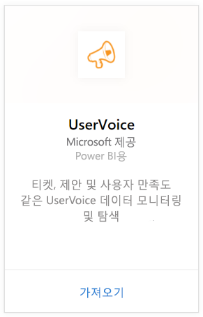
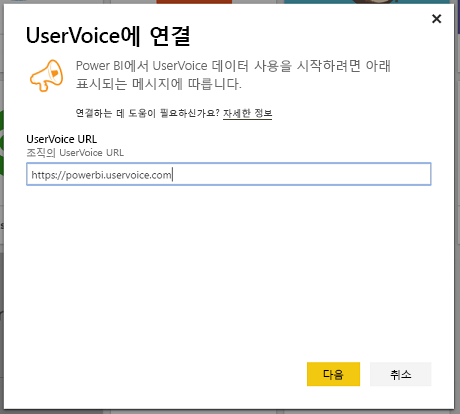
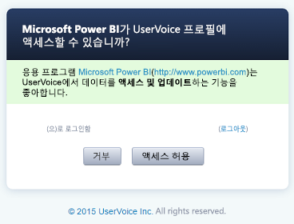
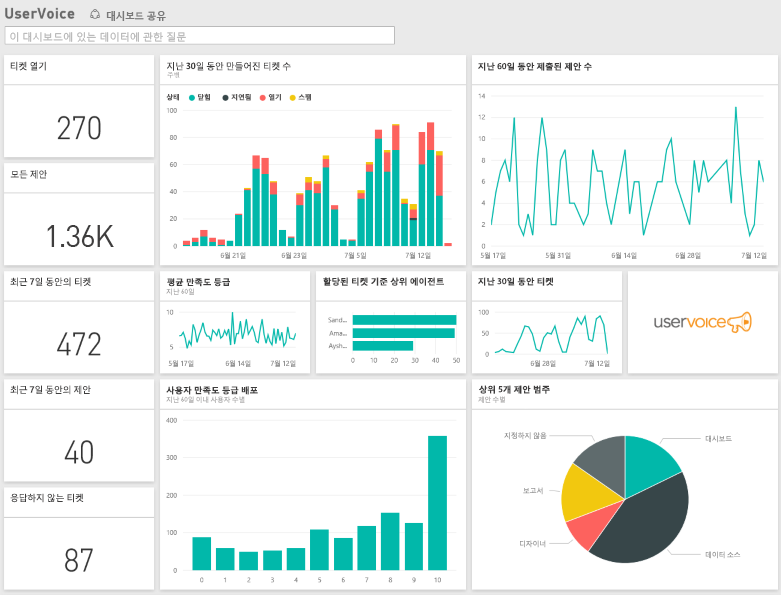

# Power BI로 UserVoice에 연결
Power BI 및 UserVoice 콘텐츠 팩에서 UserVoice 데이터 추적 및 탐색이 쉽습니다. Power BI는 티켓, 제안 및 만족도를 포함하여 데이터를 검색한 다음 해당 데이터를 기반으로 기본 대시보드 및 보고서를 작성합니다.

Power BI용 [UserVoice 콘텐츠 팩](https://app.powerbi.com/getdata/services/uservoice)에 연결합니다.

>[!NOTE]
>Power BI 콘텐츠 팩에 연결하려면 관리자 계정이 필요합니다. 이 콘텐츠 팩은 또한 UserVoice API를 활용하며 UserVoice 제한 내에서 사용해야 합니다. 아래 세부 정보를 참조하세요.

## 연결 방법
1. 왼쪽 탐색 창의 맨 아래에 있는 **데이터 가져오기** 를 선택합니다.
   
   
2. **서비스** 상자에서 **가져오기**를 선택합니다.
   
    
3. **UserVoice**를 선택한 다음 **가져오기**를 선택합니다.
   
   
4. 메시지가 표시되면 UserVoice URL을 입력합니다. URL은 정확하게 다음 패턴에 따라 `https://fabrikam.uservoice.com` "fabrikam"을 제품 또는 서비스 이름으로 대체합니다.
   
   >[!NOTE]
   >끝에 슬래시가 없고 연결이 http**s**로 되어 있는지 확인합니다.
   
   
5. 메시지가 표시되면 UserVoice 자격 증명을 입력하고 UserVoice 인증 프로세스를 따릅니다. 브라우저에서 UserVoice에 이미 로그인한 경우 자격 증명을 묻는 메시지가 표시되지 않을 수도 있습니다. "액세스를 허용"을 클릭하여 Power BI 응용 프로그램에 데이터에 대한 액세스 권한을 부여합니다.
   
   >[!NOTE]
   >UserVoice 계정에 대한 관리자 자격 증명이 필요합니다.
   
   
6. Power BI는 UserVoice 데이터를 검색하고 즉시 사용 가능한 대시보드 및 보고서를 만듭니다. Power BI는 모든 제안 사항, 열려 있는 모든 티켓, 닫힌 티켓을 포함하여 최근 30일 내에 생성된 모든 티켓, 모든 사용자 만족도 평점 등의 데이터를 검색합니다.
   
   

**다음 단계**

* 대시보드 맨 위에 있는 [질문 및 답변 상자에 질문](power-bi-q-and-a.md)합니다.
* 대시보드에서 [타일을 변경](service-dashboard-edit-tile.md)합니다.
* [타일을 선택](service-dashboard-tiles.md)하여 원본 보고서를 엽니다.
* 데이터 집합을 매일 새로 고치도록 예약하는 경우 새로 고침 일정을 변경하거나 **지금 새로 고침**을 사용하여 필요할 때 새로 고칠 수 있습니다.

## 문제 해결
**"매개 변수 유효성 검사를 하지 못했습니다. 모든 매개 변수가 유효한지 확인하세요."**

UserVoice URL 입력 후에 이 오류가 표시되면 다음 요구 사항이 충족되었는지 확인합니다.

* URL은 `https://fabrikam.uservoice.com` 패턴을 따라 "fabrikam"을 올바른 UserVoice URL 접두사로 바꿉니다.
* 모든 문자가 소문자인지 확인합니다.
* URL이 'http**s**'인지 확인합니다.
* URL의 끝에 슬래시가 없는지 확인합니다.

**"로그인하지 못했습니다."**

자격 증명을 사용하여 로그인한 후에 “로그인하지 못했습니다.” 오류가 표시되면 사용 중인 계정에 사용자 계정에서 UserVoice 데이터를 검색할 권한이 없는 것입니다. 관리자 계정인지 확인하고 다시 시도하세요.

"**오류가 발생했습니다.**"

데이터를 로드하는 동안 이 오류 메시지가 표시되면 UserVoice 계정이 월별 API 사용 할당량을 초과하지 않았는지 확인합니다. 상태가 양호해 보이면 다시 연결해 보세요. 문제가 지속되면 [https://community.powerbi.com](https://community.powerbi.com/)의 Power BI 지원부에 문의하세요.

**기타**  

Power BI UserVoice 콘텐츠 팩은 UserVoice의 API를 사용하여 사용자 데이터를 검색합니다. API 사용을 모니터링하여 제한을 초과하지 않는지 확인합니다. UserVoice 계정에 많은 양의 데이터가 있는 경우 API 사용에 미치는 영향을 최소화하려면 새로 고침 빈도를 현재 기본값인 하루에 한 번에서 필요에 따라 평일 또는 이틀에 한 번만 새로 고치도록 변경합니다. 다른 방법은 조직의 모든 관리자가 API에 불필요한 부하를 만드는 대신 한 관리자가 콘텐츠 팩을 만들어 팀의 나머지 사람들과 공유하는 것입니다.

## 다음 단계
[Power BI에서 시작](service-get-started.md)

[Power BI에서 데이터 가져오기](service-get-data.md)

