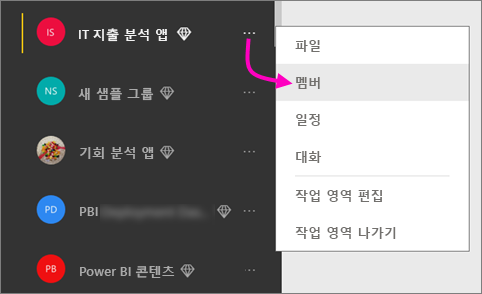
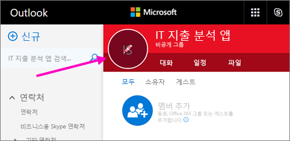
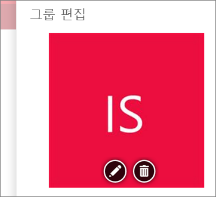
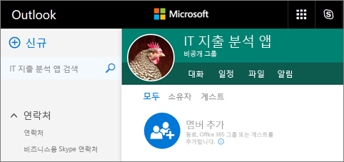
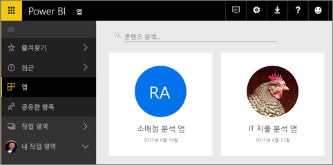
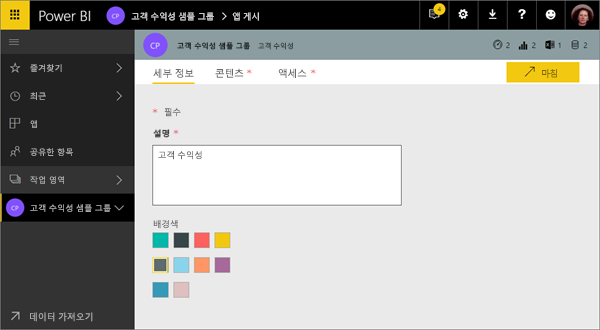
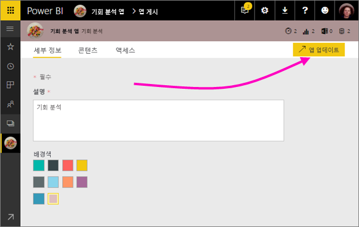
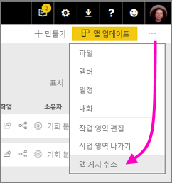

# Power BI에서 대시보드 및 보고서로 앱 생성 및 게시

Power BI에서 *앱*을 만들어 관련된 대시보드 및 보고서를 한 곳에 결합한 다음, 조직의 대규모 사용자 그룹에 게시할 수 있습니다. 또한 Google 웹로그 분석 및 Microsoft Dynamics CRM과 같은 [외부 서비스에 대한 Power BI 앱](service-connect-to-services.md)에 연결할 수 있습니다.

비즈니스 사용자는 비즈니스를 실행하기 위해 여러 Power BI 대시보드 및 보고서가 필요한 경우가 많습니다. 앱에 모두 포함되기 때문에 이러한 모든 대시보드의 이름 및 위치를 기억할 필요가 없습니다.  

현재 미리 보기 중인 Power BI 앱을 사용하면 대시보드 및 보고서의 컬렉션을 만들고 이러한 앱을 전체 조직 또는 특정 사람 또는 그룹에 게시할 수 있습니다. 보고서 작성자 또는 관리자인 경우 앱을 사용하면 대시보드 컬렉션에 대한 권한을 더 손쉽게 관리할 수 있습니다.

비즈니스 사용자는 몇 가지 방법으로 앱을 가져옵니다. Power BI 관리자가 권한을 부여한 경우 동료의 Power BI 계정에 해당 앱을 자동으로 설치할 수 있습니다. 그렇지 않은 경우 Microsoft AppSource에서 해당 앱을 설치하거나 직접 링크를 보낼 수 있습니다. 한 곳에 모두 있으므로, 손쉽게 콘텐츠를 찾고 되돌아갈 수 있습니다. 업데이트를 자동으로 가져오므로, 데이터 새로 고침 빈도를 조절할 수 있습니다. [비즈니스 사용자의 앱 환경](service-install-use-apps.md)에 대해 자세히 알아보기

### 앱에 대한 라이선스
앱 작성자는 Power BI Pro 라이선스가 필요합니다. 앱 사용자인 경우 두 가지 옵션이 있습니다.

* 옵션 1: 모든 비즈니스 사용자는 **Power BI Pro** 라이선스가 있어야 앱을 볼 수 있습니다. 
* 옵션 2: 조직의 무료 사용자는 앱이 Power BI 프리미엄 용량에 있는 경우에 앱 콘텐츠를 볼 수 있습니다. 자세한 내용은 [Power BI 프리미엄이란?](service-premium.md)을 참조하세요.

### 앱 및 조직 콘텐츠 팩
앱은 조직 콘텐츠 팩이 진화된 것입니다. 조직 콘텐츠 팩이 이미 있는 경우 앱과 함께 계속 작동합니다.

이제 앱의 개요에 대해 살펴봤으므로, 앱을 만드는 곳인 *앱 작업 영역*에 대해 이야기해 보겠습니다. 

## 비디오: 앱 및 앱 작업 영역
<iframe width="640" height="360" src="https://www.youtube.com/embed/Ey5pyrr7Lk8?showinfo=0" frameborder="0" allowfullscreen></iframe>

## 앱 작업 영역
*앱 작업 영역*은 앱을 만드는 곳이므로, 앱을 만들려면 먼저 앱 작업 영역을 만들어야 합니다. Power BI의 그룹 작업 영역에서 작업해본 경험이 있다면 앱 작업 영역이 익숙할 것입니다. 앱의 콘텐츠를 위한 영역 및 컨테이너를 스테이징하는 그룹 작업 영역이 진화된 것입니다. 

동료를 이러한 작업 영역에 구성원 또는 관리자로 추가할 수 있습니다. 모든 앱 작업 영역 구성원 및 관리자는 Power BI Pro 라이선스가 필요합니다. 작업 영역에서 사용자는 대시보드, 보고서는 물론, 더 광범위한 대상 그룹이나 조직 전체에 게시할 계획이 있는 기타 문서에 대해 공동 작업할 수 있습니다. 

콘텐츠가 준비되면 게시할 대시보드 및 보고서를 선택한 다음 앱을 게시합니다. 더 광범위한 대상 그룹에 직접 링크를 보내거나, **AppSource에서 더 많은 앱 다운로드 및 탐색**으로 이동하여 앱 탭에서 앱을 찾을 수 있습니다. 이러한 사람들은 해당 앱의 콘텐츠를 수정할 수 없지만, Power BI 서비스에서, 또는 모바일 앱 중 하나와 상호 작용할 수 있습니다(데이터 필터링, 강조 표시 및 정렬 등). 

## 앱 작업 영역 만들기
[!INCLUDE [powerbi-service-create-app-workspace](./includes/powerbi-service-create-app-workspace.md)]

비어 있습니다. 이제 콘텐츠를 추가하면 됩니다. 처음 만들 때, 작업 영역에서 Office 365에 전파하도록 한 시간 정도 기다려야 할 수 있습니다. 

콘텐츠 추가는 작업 영역의 다른 사람은 보고 작업할 수도 있다는 점을 제외하고 내 작업 영역에 콘텐츠를 추가하는 것과 같습니다. 큰 차이점은 완료되면 콘텐츠를 앱으로 게시할 수 있다는 것입니다. 앱 작업 영역에 있는 동안에는 파일을 업로드하거나 연결하고, 내 작업 영역에서 하는 것처럼 타사 서비스에 연결할 수 있습니다. 예:

* Microsoft Dynamics CRM, Salesforce 또는 Google Analytics 등의 [서비스에 연결](service-connect-to-services.md)
* Excel, CSV 또는 Power BI Desktop(PBIX) 파일 등의 [파일에서 데이터 가져오기](service-get-data-from-files.md)

## 앱에 이미지 추가(선택 사항)
기본적으로 Power BI는 해당 앱에 앱의 이니셜이 포함된 작은 컬러 원을 만듭니다. 하지만 이미지로 사용자 지정할 수도 있습니다. 이미지를 추가하려면 Exchange Online 라이선스가 필요합니다.

1. **작업 영역**을 선택하고 작업 영역 이름 옆의 줄임표(...), **구성원**을 차례로 선택합니다. 
   
     
   
    작업 영역에 대한 Office 365 Outlook 계정은 새로운 브라우저 창에서 열립니다.
2. 왼쪽 위에 있는 컬러 원에 마우스를 올려 놓으면 연필 아이콘으로 바뀝니다. 선택합니다.
   
     
3. 연필 아이콘을 다시 선택한 후 사용하려는 이미지를 찾습니다.
   
     
4. **저장**을 선택합니다.
   
     
   
    이미지는 Office 365 Outlook 창에서 컬러 원을 대체합니다. 
   
     
   
    몇 분 후 Power BI의 앱에도 나타납니다.
   
     

## 앱 게시
앱 작업 영역에서 대시보드 및 보고서가 준비되면 앱 형태로 게시합니다. 작업 영역의 모든 보고서와 대시보드를 게시할 필요는 없습니다. 준비된 것만 게시할 수 있습니다. 

1. 작업 영역 목록 뷰에서 앱에 포함할 대시보드와 보고서를 결정합니다.

     

     보고서를 게시하지 않기로 선택한 경우 보고서 옆에 경고와 관련 대시보드가 표시됩니다. 앱을 게시할 수는 있지만 관련 대시보드가 해당 보고서의 타일에서 누락됩니다.

     

1. 오른쪽 위에서 **앱 게시** 단추를 선택하여 해당 작업 영역의 모든 콘텐츠를 공유하는 프로세스를 시작합니다.
   
     

2. 사람들이 해당 앱을 찾는 데 도움이 되도록 **세부 정보**에서 설명을 입력합니다. 배경색을 지정하여 개인 설정할 수 있습니다.
   
     

3. **콘텐츠**에서 앱의 일부로 게시하려는 콘텐츠(해당 작업 영역에서 선택한 모든 항목)가 보입니다. 또한, 사람들이 앱으로 이동하여 처음 보게 되는 대시보드 또는 보고서로 앱 시작 페이지를 설정할 수도 있습니다. **없음**을 선택할 수 있습니다. 그러면 앱의 모든 콘텐츠 목록을 표시합니다. 
   
     

4. **액세스**에서 앱에 액세스할 수 있는 사람을 조직의 모든 사람, 특정 사람, Active Directory 보안 그룹 중에서 결정합니다. 권한이 있는 경우 받는 사람에 대해 앱 자동 설치를 선택할 수 있습니다.

    

5. **마침**을 선택하면 게시할 준비가 되었음을 확인하는 메시지가 나타납니다. 성공 대화 상자에서는 이 앱에 대한 직접 링크인 URL을 복사하여 이를 공유한 사람에게 보낼 수 있습니다.
   
     

앱을 게시한 비즈니스 사용자는 몇 가지 다른 방법으로 찾을 수 있습니다. 자동으로 설치할 수 있으면 Power BI 계정의 [앱] 아래에 표시됩니다. 앱에 대한 직접 링크를 보내거나, Microsoft AppSource에서 검색할 수 있습니다(액세스할 수 있는 모든 앱 확인 가능). 어떤 방법이든지 [앱]으로 이동할 때마다 목록에서 이 앱을 보게 됩니다.

[비즈니스 사용자의 앱 환경](service-install-use-apps.md)에 대해 자세히 알아보기

## 게시된 앱 변경
앱 게시 후, 변경하거나 업데이트하고 싶을 수 있습니다. 해당 앱 작업 영역의 관리자 또는 구성원인 경우 업데이트하기 쉽습니다. 

1. 앱에 해당하는 앱 작업 영역을 엽니다. 
   
     
2. 대시보드 또는 보고서를 엽니다. 원하는 변경 사항을 적용할 수 있습니다.
   
     앱 작업 영역은 스테이징 영역이므로, 앱을 다시 게시할 때까지 변경 사항은 반영되지 않습니다. 이를 통해 게시된 앱에 영향을 미치지 않고 변경 사항을 적용할 수 있습니다.  
 
1. 콘텐츠의 앱 작업 영역 목록으로 돌아가서 **앱 업데이트**를 선택합니다.
   
     

4. 필요한 경우 **세부 정보**, **콘텐츠**, **액세스**를 업데이트하고 **앱 업데이트**를 선택합니다.
   
     

해당 앱을 게시한 사람들은 자동으로 업데이트된 버전의 앱을 보게 됩니다. 

## 앱 게시 취소
앱 작업 영역의 모든 멤버는 앱 게시를 취소할 수 있습니다.

* 앱 작업 영역의 오른쪽 위 모서리 > **앱 게시 취소**에서 줄임표(**...**)를 선택합니다.
  
     

이 작업은 게시된 모든 사용자의 앱을 제거하고 더 이상 액세스 권한을 갖지 않습니다. 앱 작업 영역 또는 해당 내용을 삭제하지 않습니다.

## Power BI 앱 FAQ
### 앱 작업 영역이 그룹 작업 영역과 다른점
이 릴리스에서는 그룹 작업 영역을 앱 작업 영역으로 명칭을 변경했습니다. 이러한 작업 영역 중에서 앱을 게시할 수 있습니다. 대부분 부분에서 기능은 그룹 작업 영역과 동일하게 유지됩니다. 향후 몇 개월에 걸쳐 앱 작업 영역에 다음과 같은 몇 가지 사항을 개선할 계획입니다. 

* 앱 응용 프로그램을 만들어도 그룹 작업 영역에서 하는 것처럼 Office 365에 해당 요소가 만들어지지 않습니다. 따라서 백그라운드에서 만들어지는 다른 Office 365에 대해 염려하지 않고 많은 수의 앱 작업 영역을 만들 수 있습니다(파일을 저장하기 위해 Office 365 그룹의 비즈니스용 OneDrive는 여전히 사용할 수 있음). 
* 현재 구성원 및 관리자 목록에는 개인만 추가할 수 있습니다. 곧 여러 AD 보안 그룹 또는 최신 그룹을 이러한 목록에 추가할 수 있는 기능이 지원되어 관리가 더 쉬워집니다.  

### 앱이 조직 콘텐츠 팩과 다른점
앱은 콘텐츠 팩이 단순하게 진화한 것으로, 몇 가지 주요 다른점이 있습니다. 

* 비즈니스 사용자가 콘텐츠 팩을 설치한 후에는 그룹화된 ID를 잃게 됩니다. 그저 다른 대시보드 및 보고서가 혼재된 대시보드 및 보고서 목록일 뿐입니다. 한편으로, 앱은 설치 후에도 그룹화와 ID를 유지합니다. 이를 통해 비즈니스 사용자는 시간이 지나도 계속 해당 앱으로 이동할 수 있습니다.  
* 어떠한 작업 영역에서도 여러 콘텐츠 팩을 만들 수 있지만 앱은 해당 작업 영역과 일대일 관계를 맺습니다. 따라서 앱이 훨씬 더 파악하기 쉽고 장기적으로 유지할 수 있습니다. 이 영역을 개선하는 방법에 대한 자세한 내용은 Power BI 블로그의 로드맵 섹션을 참조하세요. 
* 시간이 지나면 조직 콘텐츠 팩의 사용을 중단할 계획이므로, 지금부터 앱을 만드는 것이 좋습니다.  

### 그룹의 읽기 전용 구성원
그룹에서 콘텐츠를 볼 수만 있는 읽기 전용 구성원을 추가할 수 있습니다. 이 방식의 주요 문제는 구성원으로 보안 그룹을 추가할 수 없다는 것이었습니다. 

앱을 사용하면 앱 작업 영역의 읽기 전용 버전을 보안 그룹을 포함한 폭넓은 대상에 게시할 수 있습니다. 최종 사용자에게 영향을 주지 않고 앱에서 대시보드 및 보고서에 대한 변경 사항을 스테이징할 수 있습니다. 향후에는 이러한 방식으로 앱을 사용하는 것이 좋습니다. 장기적으로, 작업 영역의 읽기 전용 구성원도 사용을 중단할 계획입니다.  

## 다음 단계
* [Power BI에서 앱 설치 및 사용](service-install-use-apps.md)
* [외부 서비스용 Power BI 앱](service-connect-to-services.md)
* 궁금한 점이 더 있나요? [Power BI 커뮤니티에 질문합니다.](http://community.powerbi.com/)

