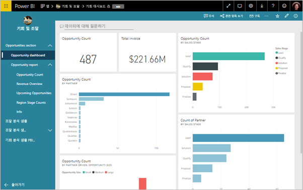
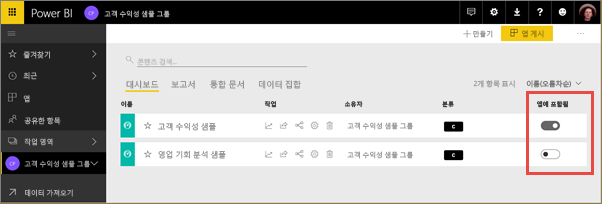
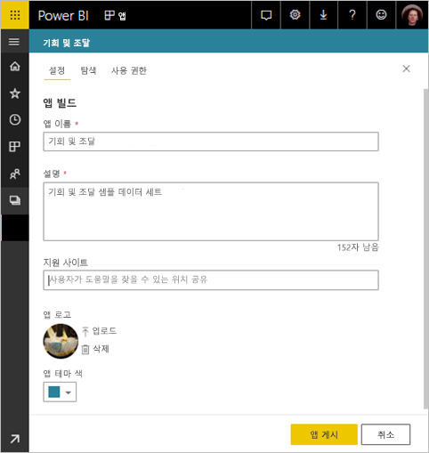
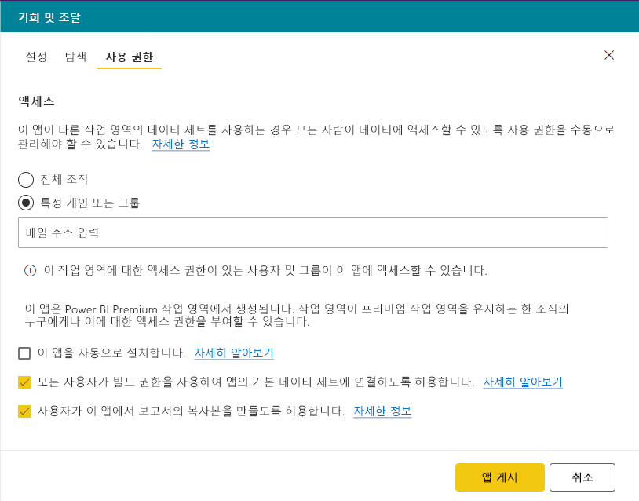
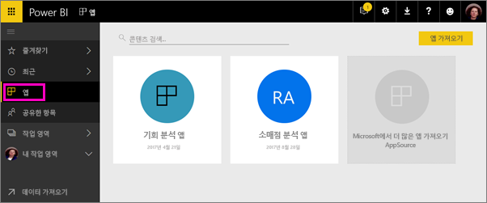

# Power BI에서 앱 게시

Power BI에서 공식 패키지 콘텐츠를 만든 다음으로 광범위 한 대상에 게 배포할 수 있습니다는 *앱*합니다. *앱 작업 영역*에서 앱을 만듭니다. 여기서 동료와 Power BI 콘텐츠에 대해 공동 작업할 수 있습니다. 그런 다음, 조직의 대규모 사용자 그룹에 완성된 앱을 게시할 수 있습니다. 

비즈니스 사용자는 비즈니스를 실행하기 위해 여러 Power BI 대시보드 및 보고서가 필요한 경우가 많습니다. Power BI 앱을 사용하면 대시보드 및 보고서의 컬렉션을 만들고 이러한 앱을 전체 조직 또는 특정 사람 또는 그룹에 게시할 수 있습니다. 보고서 작성자 또는 관리자인 경우 앱을 사용하면 이러한 컬렉션에 대한 사용 권한을 더 쉽게 관리할 수 있습니다.

비즈니스 사용자는 몇 가지 방법으로 앱을 가져옵니다.

- 찾을 수 하며 Microsoft AppSource에서 앱을 설치 합니다.
- 이러한 직접 링크를 보낼 수 있습니다.
- Power BI 관리자가 사용자에게 사용 권한을 부여한 경우 동료의 Power BI 계정에서 해당 앱을 자동으로 설치할 수 있습니다.

사용자가 해당 반대로 콘텐츠를 쉽게 찾을 수 있도록 자체 기본 제공 탐색을 사용 하 여 앱을 만들 수 있습니다. 앱의 내용을 수정할 수는 없습니다. Power BI 서비스 또는 모바일 앱 중 하나에서 상호 작용 – 필터링, 강조 표시 및 자체 데이터를 정렬 합니다. 업데이트를 자동으로 가져오므로, 데이터 새로 고침 빈도를 조절할 수 있습니다. [비즈니스 사용자의 앱 환경](consumer/end-user-apps.md)에 대해 자세히 알아보기

## 앱에 대한 라이선스
을 만들거나 앱을 업데이트 하려면 Power BI Pro 라이선스가 필요 합니다. 앱에 대 한 *소비자*, 두 가지 옵션이 있습니다.

* 옵션 1: 모든 비즈니스 사용자는 **Power BI Pro** 라이선스가 있어야 앱을 볼 수 있습니다. 
* 옵션 2: 앱 작업 영역, Power BI 프리미엄 용량에 상주 하는 경우 조직의 무료 사용자가 앱 콘텐츠를 볼 수 있습니다. 자세한 내용은 [Power BI 프리미엄이란?](service-premium.md)을 참조하세요.

## 앱 게시
작업 영역의 대시보드 및 보고서가 준비되면 게시하려는 대시보드 및 보고서를 선택한 다음, 앱으로 게시합니다. 

1. 작업 영역 목록 뷰에서 대시보드 및 보고서를 결정할 **앱에 포함 된**합니다.

     

     관련된 대시보드를 있는 보고서를 포함 하지 않으려는 경우 보고서 옆에 경고가 표시 됩니다. 앱을 게시할 수 있지만 관련된 대시보드가 해당 보고서의 타일이 없습니다.

     

2. 선택 된 **앱 게시** 만들기 및 작업 영역에서 앱 게시 프로세스를 시작 하려면 오른쪽 위에 있는 단추입니다.
   
     

3. **설치**, 이름 및 사람들이 앱을 찾을 수 있도록 설명을 입력 합니다. 개인 설정 테마 색을 설정할 수 있습니다. 또한 지원 사이트에 대 한 링크를 추가할 수 있습니다.
   
     

4. 온 **탐색**, 앱의 일부로 게시할 콘텐츠를 선택 합니다. 섹션에서 콘텐츠를 구성 하려면 앱 탐색을 추가 합니다. 참조 [앱에 대 한 탐색 환경을 디자인](#design-the-navigation-experience-for-your-app) 대 한 자세한 내용은이 문서의.
   
     

5. 온 **액세스**, 앱에 대 한 액세스 권한이 있는 사용자를 결정 합니다. 
    - [클래식 작업 영역](service-create-workspaces.md): 조직, 특정 사용자 또는 Azure Active Directory (AAD) 보안 그룹의 모든 사용자.
    - 에 [새 환경 작업 영역](service-create-the-new-workspaces.md): 특정 사용자, AAD 보안 그룹 및 메일 그룹 및 Office 365 그룹입니다.

6. 권한이 있는 경우 받는 사람에 게 앱을 자동으로 설치할 수 있습니다. Power BI 관리자는 Power BI 관리 포털에서 이 설정을 사용하도록 설정할 수 있습니다. 에 대해 자세히 알아보세요 [앱을 자동으로 설치](#automatically-install-apps-for-end-users) 이 문서의.

     

7. 선택 하면 **앱 게시**을 게시할 준비가 되었음을 확인 하 라는 메시지가 표시 됩니다. 에 **이 앱 공유** 대화 상자에서이 앱에 직접 연결 되는 URL을 복사할 수 있습니다.
   
     

사람들에 게 직접 링크 공유한, 또는 앱으로 이동 하 여 앱 탭에서 찾을 수는 보낼 수 있습니다 **다운로드 및 AppSource에서 더 많은 앱을 탐색**합니다. [비즈니스 사용자의 앱 환경](consumer/end-user-apps.md)에 대해 자세히 알아보기

## 게시된 앱 변경
앱 게시 후, 변경하거나 업데이트하고 싶을 수 있습니다. 관리자 또는 새 앱 작업 영역의 구성원 인 경우 업데이트 하는 것이 쉽습니다. 

1. 앱에 해당하는 앱 작업 영역을 엽니다. 
   
     

2. 대시보드 또는 보고서에 대 한 변경 내용을 확인 합니다.
 
     앱 작업 영역은 스테이징 영역이므로 다시 게시할 때까지 앱의 변경 내용은 반영되지 않습니다. 이를 통해 게시된 앱에 영향을 미치지 않고 변경 사항을 적용할 수 있습니다.  
 
    > [!IMPORTANT]
    > 보고서를 제거 하 고 보고서를 앱으로 다시 추가 하는 경우에 앱을 업데이트 하는 경우 앱 소비자가 손실 책갈피, 주석 등과 같은 모든 사용자 지정 합니다.  
 
3. 선택한 내용을 앱 작업 영역 목록으로 돌아가 **앱 업데이트** 오른쪽 위 모퉁이에서.
   
1. 업데이트 **설치**, **탐색**, 및 **권한**, 필요한 경우 선택 **앱 업데이트**합니다.
   
해당 앱을 게시한 사람들은 자동으로 업데이트된 버전의 앱을 보게 됩니다. 

## 앱에 대 한 탐색 환경을 디자인합니다
합니다 **새 탐색 작성기** 옵션을 사용 하면 앱에 대 한 사용자 지정 탐색을 빌드할 수 있습니다. 사용자 지정 탐색 쉽게 찾고 콘텐츠를 사용 하 여 앱에서 사용자가 있습니다. 기존 앱에는이 옵션을 해제 및 새 앱에 있는 옵션을 기본값으로 있습니다.

옵션을 해제 하는 경우 선택할 수 있습니다 합니다 **앱 방문 페이지** 되려면 **특정 콘텐츠**, 예: 대시보드 또는 보고서 또는 선택 **None** 의 기본 목록을 표시 하려면 사용자에 게 콘텐츠입니다.

켜면 **새 탐색 작성기**, 사용자 지정 탐색을 디자인할 수 있습니다. 기본적으로 모든 보고서, 대시보드 및 앱에 포함 된 Excel 통합 문서는 단순 목록으로 나열 됩니다. 

추가 하 여 앱 탐색을 사용자 지정할 수 있습니다.
* 위 항목 다시 정렬 / 아래쪽 화살표입니다. 
* 항목 이름 바꾸기는 **세부 정보를 보고**를 **대시보드 세부 정보가**, 및 **통합 문서 세부 정보**합니다.
* 탐색 창에서 특정 항목을 숨깁니다.
* 사용 하는 **새로 만들기** 추가 하는 옵션 **섹션** 그룹 관련 콘텐츠.
* 사용 하 여는 **새로 만들기** 추가 하는 옵션을 **링크** 왼쪽된 탐색 창에 외부 리소스입니다. 

추가 하는 경우는 **링크**의 **세부 정보 링크** 선택할 수 있습니다 링크를 엽니다. 기본적으로 링크를 열 합니다 **현재 탭**를 선택할 수 있지만 **새 탭**, 또는 **콘텐츠 영역의**합니다. 

### 새 탐색 작성기 옵션 사용 시 고려 사항
새 탐색 작성기를 사용 하는 경우 염두에 일반적인 것 들과 다음과 같습니다.
* 보고서 페이지는 확장 가능한 섹션으로 앱의 탐색 영역에서 표시 됩니다.
* 새 탐색 작성기를 해제 및 게시 하거나 업데이트 하면 앱에 대 한 사용자 지정 손실 됩니다. 예를 들어, 섹션, 정렬, 링크 및 탐색 항목에 대 한 사용자 지정 이름을 모두 손실 됩니다.

앱 탐색 및 콘텐츠 영역 옵션을 선택 하면 링크를 추가 합니다 하는 경우:
* 링크 포함 될 수 있는지 확인 합니다. 일부 서비스는 Power BI와 같은 타사 사이트에서 해당 콘텐츠를 포함 하는 차단 합니다.
* 다른 작업 영역에서 대시보드 또는 보고서와 같은 Power BI 서비스 콘텐츠를 포함 합니다. 지원 되지 않습니다. 
* Power BI Report Server를 포함 합니다. 원래를 통해 콘텐츠를 온-프레미스 배포에서 URL 콘텐츠를 포함 합니다. 단계를 따르세요 [Power BI 보고서 서버 URL을 만드는](https://docs.microsoft.com/power-bi/report-server/quickstart-embed#creating-the-power-bi-report-server-report-url) URL을 가져옵니다. 일반 인증 규칙 적용 되므로 온-프레미스 서버에 VPN 연결이 필요 콘텐츠를 보고 합니다. 
* 보안 경고가 포함 된 콘텐츠의 맨 위에 있는 Power BI에 없는 콘텐츠를 나타내기 위해 표시 됩니다.

## 최종 사용자에 대해 자동으로 앱 설치
관리자 권한 제공을 하는 경우 앱을 자동으로 설치할 수 있습니다 *푸시* 최종 사용자에 게 합니다. 이 푸시 기능을 사용 하면 권한이 있는 사용자 또는 그룹에 올바른 앱을 배포 하기가 쉽습니다. 최종 사용자의 앱 콘텐츠 목록에서 앱 자동으로 표시 됩니다. Microsoft AppSource에서 찾거나 설치 링크를 따라 필요가 있습니다. 관리자가 사용 하도록 설정 하는 방법을 참조 하세요 [최종 사용자에 게 앱 푸시](service-admin-portal.md#push-apps-to-end-users) Power BI 관리자 포털 문서에서.

### 최종 사용자에 게 앱을 자동으로 푸시하는 방법
관리자가 사용 권한을 할당하면 **앱을 자동으로 설치**하는 새로운 옵션이 표시됩니다. 확인란을 선택 하 고 선택 하는 경우 **앱 게시** (또는 **앱 업데이트**), 모든 사용자에 게 앱 푸시 또는에 정의 된 그룹의 **권한을** 합니다 에서앱의섹션**액세스** 탭 합니다.

### 사용자에 푸시하는 앱을 얻는 방법
앱을 푸시한 후 표시 앱 목록에 자동으로 합니다. 따라서에서 있습니다 수 레이 앱 해당 특정 사용자 또는 작업 역할이 바로 액세스를 조직의 필요에 합니다.

### 앱을 자동으로 설치하기 위한 고려 사항
앱을 최종 사용자에게 푸시할 때 유의할 사항은 다음과 같습니다.

* 사용자에게 앱을 자동으로 설치하는 데 시간이 걸릴 수 있습니다. 대부분의 앱 사용자에 게 앱 푸시에 바로 설치 시간이 걸릴 수 있습니다.  앱에 있는 항목의 수 및 액세스 권한이 부여된 사용자의 수에 따라 다릅니다. 사용자가 필요로 하기 전에 업무 외 시간 동안 충분히 앱을 푸시하는 것이 좋습니다. 앱의 가용성에 대한 광범위 통신을 보내기 전에 여러 사용자에게 확인합니다.

* 브라우저를 새로 고칩니다. 앱 목록에서 푸시된 앱을 표시하기 전에 사용자를 새로 고치거나 해당 브라우저를 닫았다가 다시 열어야 합니다.

* 사용자가 앱 목록에 앱을 즉시 확인 하지 않습니다, 경우 해야 새로 고침 또는 닫고 브라우저입니다.

* 사용자에게 과도한 부하가 걸리지 않도록 하세요. 사용자가 미리 설치된 앱이 유용함을 인식할 수 있도록 너무 많은 앱을 푸시하지 않도록 합니다. 타이밍을 조정하기 위해 최종 사용자에게 앱을 푸시할 수 있는 사용자를 제어하는 것이 좋습니다. 최종 사용자에 게 푸시된 조직의 앱을 가져오기 위해 연락 지점을 설정 합니다.

* 초대를 수락 하지 않은 게스트 사용자에 자동으로 설치 된 앱을 가져오지 않습니다.  

## 앱 게시 취소
앱 작업 영역의 모든 멤버는 앱 게시를 취소할 수 있습니다.

>[!IMPORTANT]
>앱 게시를 취소하면 앱 사용자의 사용자 지정 정보가 손실됩니다. 모든 개인 책갈피, 의견 또는 앱의 콘텐츠를 사용 하 여 연결 된 구독 잃게 됩니다. 앱을 제거해야 할 경우에만 앱 게시를 취소합니다.
> 
> 

* 앱 작업 영역의 오른쪽 위 모서리 &gt; 줄임표( **...** )에서 **앱 게시 취소**를 선택합니다.
  
     

이 작업은 게시된 모든 사용자의 앱을 제거하고 더 이상 액세스 권한을 갖지 않습니다. 앱 작업 영역 또는 해당 내용을 삭제하지 않습니다.

## 게시 된 앱 보기

앱 소비자가 앱을 연 경우 표준 Power BI 왼쪽된 탐색 창 대신 만든 탐색을 표시 됩니다. 앱 탐색 정의한 섹션에서 대시보드와 보고서를 나열 합니다. 방금 하는 대신 각 보고서의 개별 페이지도 나열 보고서 이름입니다.

## 다음 단계
* [앱 작업 영역 만들기](service-create-workspaces.md)
* [Power BI에서 앱 설치 및 사용](consumer/end-user-apps.md)
* [외부 서비스용 Power BI 앱](service-connect-to-services.md)
* [Power BI 관리 포털](https://docs.microsoft.com/power-bi/service-admin-portal)
* 궁금한 점이 더 있나요? [Power BI 커뮤니티에 질문합니다.](http://community.powerbi.com/)
