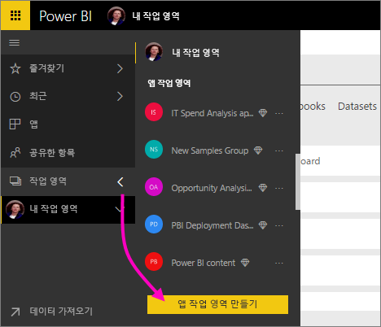
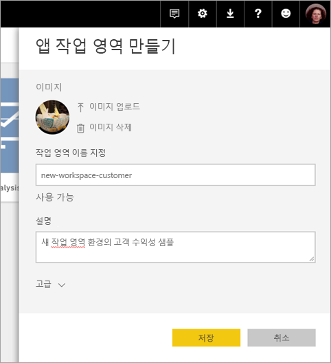
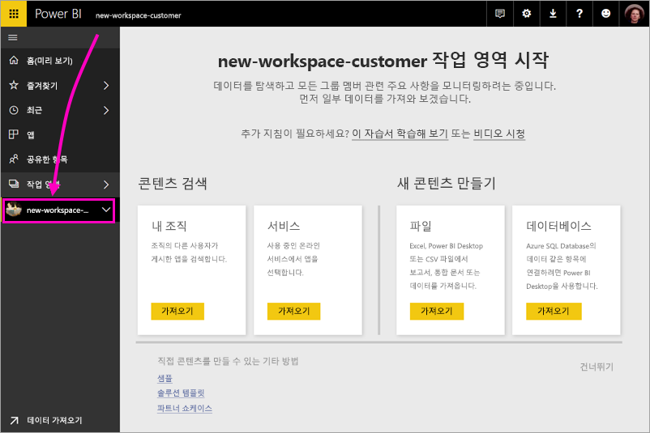
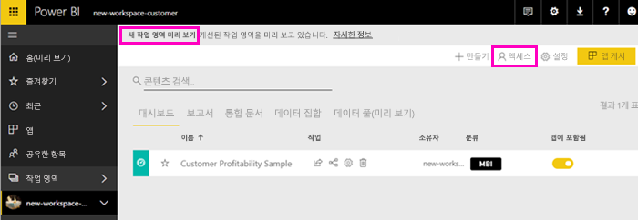
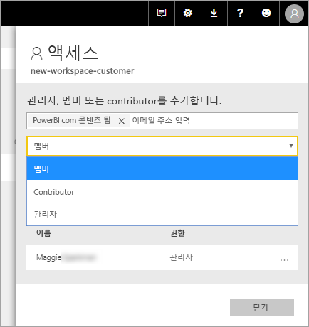

# Power BI에서 새 작업 영역 만들기(미리 보기)

Power BI는 새 작업 영역 환경을 미리 보기 상태로 소개합니다. 작업 영역에서는 *앱*에 포함하고 전체 조직 또는 특정 사람 또는 그룹에 배포할 수 있는 대시보드 및 보고서의 컬렉션을 만들기 위해 동료와 공동 작업할 수 있습니다. 

새 작업 영역 미리 보기에서 다음을 수행할 수 있습니다.

- 보안 그룹, 배포 목록, Office 365 그룹 및 개인과 같은 사용자 그룹에 작업 영역 역할을 할당합니다.
- Office 365 그룹을 만들지 않고 Power BI에서 작업 영역을 만듭니다.
- 작업 영역에서 더 유연한 사용 권한 관리에 대해 세분화된 작업 영역 역할을 사용합니다.
 
새 작업 영역 중 하나를 만들면 연결된 기본 Office 365 그룹을 만들지 않습니다. 모든 작업 영역 관리는 Office 365가 아닌 Power BI에 위치합니다. Office 365 그룹을 통해 콘텐츠에 대한 사용자 액세스 권한을 계속 관리하기 위해 작업 영역에 Office 365 그룹을 추가할 수 있습니다. 그러나 추가로 보안 그룹, 배포 목록을 사용하고, Power BI 내에서 직접 개인을 추가하여 작업 영역 액세스 권한을 관리하는 유연한 방법을 제공할 수 있습니다. 이제 Power BI에 작업 영역 관리가 제공되므로 Power BI 관리자는 조직에서 작업 영역을 만들 수 있는 사용자를 결정합니다. 자세한 내용은 [Power BI 관리 포털 문서, 작업 영역 섹션](service-admin-portal.md#workspace-settings)을 참조하세요. 

새 작업 영역에 멤버, 기여자 또는 관리자로 사용자 그룹이나 개인을 추가합니다. 사용자 그룹의 모든 사용자는 정의된 역할을 가져옵니다. 개인이 여러 사용자 그룹에 위치한 경우 역할에서 제공하는 가장 높은 수준의 사용 권한을 얻을 수 있습니다.  다양한 역할에 대한 설명은 이 아티클의 뒷부분에서 [새 작업 영역의 역할](#roles-in-the-new-workspaces)을 참조하세요.

작업 영역에 있는 추가된 모든 사용자에게는 Power BI Pro 라이선스가 필요합니다. 작업 영역에서 이러한 사용자는 물론, 더 광범위한 대상 그룹이나 조직 전체에 게시할 계획이 있는 대시보드, 보고서에 대해 공동 작업을 수행할 수 있습니다. 조직 내 다른 사용자에게 콘텐츠를 배포하려는 경우 해당 사용자에게 Power BI Pro 라이선스를 할당하거나 Power BI Premium 용량에 작업 영역을 배치할 수 있습니다.

새 작업 영역을 사용하여 몇 가지 기능을 다시 설계하고 있습니다. 미리 보기와 함께 영구적으로 적용될 수 있는 변경 내용에 대한 설명은 이 아티클의 뒷부분에서 [다르게 작동하는 앱 작업 영역 기능](#app-workspace-features-that-work-differently) 을 참조하세요. 미리 보기 기능이므로 몇 가지 제한 사항에 주의해야 합니다. 현재 제한 사항의 설명에 대해서는 이 아티클의 뒷부분에서 [알려진 문제](#known-issues)를 참조하세요. 

## 새로운 앱 작업 영역 롤아웃

미리 보기 기간 중에 이전 및 새 작업 영역은 나란히 공존할 수 있고 만들 수 있습니다. 새 작업 영역에 대한 미리 보기가 끝나고 일반적으로 사용할 수 있으면 이전 작업 영역이 잠시 존재할 수 있습니다. 만들 수 없고 새 작업 영역 인프라에 작업 영역을 마이그레이션할 준비를 해야 합니다. 걱정하지 마세요. 마이그레이션 완료하는 데 몇 달이 걸립니다.

## 새로운 앱 작업 영역 중 하나 만들기

1. 웹 작업 영역을 만들어 시작합니다. **작업 영역** > **앱 작업 영역 만들기**를 선택합니다.
   
     

2. **개선된 작업 영역을 미리 보기**에서 **지금 사용해 보기**를 선택합니다.
   
     

2. 작업 영역에 이름을 지정합니다. 이름을 사용할 수 없는 경우 편집하여 고유한 ID를 입력합니다.
   
     앱의 이름은 작업 영역과 동일합니다.
   
1. 원하는 경우 이미지를 추가합니다. 파일 크기는 45KB보다 작은 수입니다.
 
    

1. **저장**을 선택합니다.

    새 작업 영역에 대한 **시작** 화면에 데이터를 추가할 수 있습니다. 

    

1. 예를 들어 **샘플** > **고객 수익성 샘플**을 선택합니다.

    이제 작업 영역 콘텐츠 목록에 **새 작업 영역 미리 보기**가 표시됩니다. 사용자가 관리자이므로 새 작업인 **액세스**도 표시됩니다.

    

1. **액세스**를 선택합니다.

1. 보안 그룹, 배포 목록, Office 365 그룹 또는 개인을 이러한 작업 영역에 멤버, 기여자 또는 관리자로 추가합니다. 다양한 역할에 대한 설명은 이 아티클의 뒷부분에서 [새 작업 영역의 역할](#roles-in-the-new-workspaces)을 참조하세요.

    

9. **추가** > **닫기**를 선택합니다.

1. Power BI는 작업 영역을 만들고 엽니다. 구성원으로 속해 있는 작업 영역 목록에 나타납니다. 사용자가 관리자이므로, 줄임표(…)를 선택하여 뒤로 이동하고 작업 영역 설정을 변경하여 새 멤버를 추가하거나 해당 사용 권한을 변경할 수 있습니다.

     

## 앱 작업 영역에 콘텐츠 추가

새로운 스타일의 앱 작업 영역을 만들면 콘텐츠를 추가할 수 있습니다. 콘텐츠를 추가하는 작업은 한 가지 예외를 제외하면 새로운 스타일의 작업 영역 및 이전 스타일의 작업 영역에서 비슷합니다. 앱 작업 영역에 있는 동안에는 고유한 내 작업 영역에서처럼 파일을 업로드하거나 연결할 수 있습니다. 새로운 작업 영역에서는 Microsoft Dynamics CRM, Salesforce 또는 Google Analytics와 같은 조직 콘텐츠 팩 또는 타사 콘텐츠 팩에 연결할 수 없습니다. 현재 작업 영역에서 콘텐츠 팩에 연결할 수 있습니다.

앱 작업 영역에서 콘텐츠 목록의 콘텐츠를 볼 때 앱 작업 영역의 이름이 소유자로 나열됩니다.

### 새 작업 영역에서 타사 서비스에 연결(미리 보기)

새 작업 영역 환경에서 앱에 집중하도록 변경이 진행 중입니다. 타사 서비스의 앱을 통해 사용자가 Microsoft Dynamics CRM, Salesforce 또는 Google Analytics와 같은 사용할 서비스에서 데이터를 쉽게 가져올 수 있습니다.
조직 앱을 통해 필요한 내부 데이터를 사용자에게 제공합니다. 사용자가 앱 내에서 찾은 콘텐츠를 사용자 지정할 수 있도록 조직 앱에 기능을 추가할 예정입니다. 그러면 콘텐츠 팩에 대한 필요성이 제거됩니다. 

새 작업 영역 미리 보기를 사용하여 조직 콘텐츠 팩을 만들거나 사용할 수 없습니다. 대신 타사 서비스에 연결하기 위해 제공된 앱을 사용하거나 내부 팀이 현재 사용하는 콘텐츠 팩의 앱을 제공하도록 요청할 수 있습니다. 

## 새 작업 영역의 역할

역할을 통해 팀이 공동 작업할 수 있도록 작업 영역에서 수행할 수 있는 작업 및 사용자를 관리할 수 있습니다. 새 작업 영역을 사용하면 개인 및 사용자 그룹(보안 그룹, Office 365 그룹 및 배포 목록)에 역할을 할당할 수 있습니다. 

사용자 그룹에 역할을 할당하면 그룹의 개인은 콘텐츠에 대한 액세스 권한을 갖습니다. 사용자 그룹을 중첩하는 경우 포함된 모든 사용자에게는 사용 권한이 있습니다. 다양한 역할을 가진 여러 사용자 그룹에 있는 사용자에게는 가장 높은 수준의 사용 권한이 부여됩니다. 

새 작업 영역은 세 가지 역할(제공 관리자, 멤버 및 기여자)을 제공합니다.

**관리자는 다음 작업을 수행할 수 있습니다.**

- 작업 영역 업데이트 및 삭제 
- 다른 관리자를 비롯한 사람 추가/제거
- 멤버가 수행할 수 있는 모든 작업 수행

**멤버는 다음 작업을 수행할 수 있습니다.** 

- 낮은 권한을 가진 멤버 또는 다른 사용자 추가
- 앱 게시 및 업데이트
- 항목 공유 또는 앱 공유
- 다른 사용자가 항목을 다시 공유하도록 허용
- 기여자가 수행할 수 있는 모든 작업 수행

**기여자는 다음 작업을 수행할 수 있습니다.** 

- 작업 영역에서 콘텐츠 만들기, 편집 및 삭제 
- 작업 영역에 보고서 게시, 콘텐츠 삭제
- 새 사용자에게 콘텐츠에 대한 액세스 권한을 부여할 수 없습니다. 새 콘텐츠를 공유할 수 없지만 작업 영역, 항목 또는 앱을 이미 공유하는 사용자와 공유할 수 있습니다. 
- 그룹의 멤버를 수정할 수 없음
 
액세스 권한이 없는 사용자가 요청할 수 있도록 서비스 전체에서 요청 액세스 워크플로의 빌드가 진행 중입니다. 현재 대시보드, 보고서 및 앱에 대한 요청 액세스 워크플로가 존재합니다.

## 앱 배포

콘텐츠가 준비되면 게시할 대시보드 및 보고서를 선택한 다음, *앱*으로 게시합니다. 각 작업 영역에서 하나의 앱을 만들 수 있습니다. 동료는 몇 가지 다른 방법으로 앱을 설치할 수 있습니다. Power BI 관리자가 사용자에게 사용 권한을 부여한 경우 동료의 Power BI 계정에서 해당 앱을 자동으로 설치할 수 있습니다. 그렇지 않으면 Microsoft AppSource에서 해당 앱을 찾아 설치하거나 직접 링크를 보낼 수 있습니다. 업데이트를 자동으로 가져오므로, 데이터 새로 고침 빈도를 조절할 수 있습니다. 자세한 내용은 [Power BI에서 대시보드 및 보고서로 앱 생성 및 게시](service-create-distribute-apps.md)를 참조하세요.

## 이전 앱 작업 영역을 새 앱 작업 영역으로 변환

미리 보기 기간 동안 이전 앱 작업 영역을 새 앱 작업 영역으로 자동으로 변환할 수 없습니다. 그러나 새 앱 작업 영역을 만들고 콘텐츠를 새 위치에 게시할 수 있습니다. 

새 작업 영역이 GA(일반 공급)되면 이전 작업 영역을 자동으로 마이그레이션하도록 옵트인할 수 있습니다. GA 이후 어떤 시점에서 마이그레이션해야 합니다.

## Power BI 앱 FAQ

### 현재 앱 작업 영역과 새 앱 작업 영역의 차이점
* 앱 작업 영역을 만들어도 앱 작업 영역에서처럼 Office 365에 해당 엔터티를 만들지 않습니다. (역할을 할당하여 Office 365 그룹을 작업 영역에 추가할 수 있습니다.) 
* 현재 앱 작업 영역에 멤버 및 관리자 목록에는 개인만 추가할 수 있습니다. 새 앱 작업 영역에서 사용자 관리를 간소화하기 위해 이러한 목록에 여러 AD 보안 그룹, 배포 항목 또는 Office 365 그룹을 추가할 수 있습니다. 
- 현재 앱 작업 영역에서 조직 콘텐츠 팩을 만들 수 있습니다. 새 앱 작업 영역에서 콘텐츠 팩을 만들 수 없습니다.
- 현재 앱 작업 영역에서 조직 콘텐츠 팩을 사용할 수 있습니다. 새 앱 작업 영역에서 콘텐츠 팩을 사용할 수 없습니다.
- 미리 보기 상태에서 일부 기능이 새 앱 작업 영역에 아직 활성화되지 않았습니다. 세부 정보는 다음 섹션인 [기타 계획된 새 작업 영역 기능](service-create-the-new-workspaces.md#other-planned-new-app-workspace-preview-features)을 참조하세요.

## 예정된 새 앱 작업 영역 미리 보기 기능

다른 새 앱 작업 영역 미리 보기 기능을 계속 개발 중이지만 미리 보기를 시작하지 않았으므로 아직 사용 불가능합니다.

- **작업 영역 나가기** 단추가 없습니다.
- 사용 메트릭이 아직 지원되지 않습니다.
- 프리미엄 작동 원리: 프리미엄 용량에서 작업 영역을 할당하고 만들 수 있지만 용량 내에서 작업 영역을 이동하려면 자겁 영역의 설정으로 이동합니다.
- SharePoint 웹 파트 포함은 아직 지원되지 않습니다.
- 데이터/파일 가져오기에서 Office 365 그룹에 대해 **OneDrive** 단추가 없습니다.

## 다르게 작동하는 앱 작업 영역 기능

일부 기능은 새 앱 작업 영역의 현재 앱 작업 영역과 다르게 작동합니다. 이러한 차이점은 고객에게서 받은 피드백에 기반하여 의도적이고, 작업 영역을 사용한 공동 작업에서 더 유연한 접근 방식을 가능하게 합니다.

- 멤버는 다시 공유할 수 있거나 없습니다. 기여자 역할에서 대체됩니다.
- 읽기 전용 작업 영역: 사용자에게 작업 영역에 대한 읽기 전용 액세스 권한을 부여하는 대신 곧 출시 예정인 뷰어 역할에 사용자를 할당합니다. 그러면 작업 영역의 콘텐츠에 유사한 읽기 전용 액세스 권한을 허용합니다.

## 알려진 문제

다음과 같은 문제를 알고 있고 해결 방법을 개발 중입니다.

- 이메일에 대한 구독의 받는 사람으로 추가된 무료 사용자 또는 사용자 그룹은 수신해야 할 이메일을 받지 못할 수 있습니다. 새 작업 영역 환경이 프리미엄 용량에 위치하지만 구독을 만든 사용자의 내 작업 영역이 프리미엄 용량에 없는 경우에 이 문제가 발생합니다. 내 작업 영역이 프리미엄 용량에 위치하면 무료 사용자 및 사용자 그룹은 이메일을 받게 됩니다.
- 경우에 따라 프리미엄 용량에서 공유 용량으로 작업 영역을 이동한 후에 무료 사용자 및 사용자 그룹이 수신하지 말아야 할 이메일을 계속 받게 됩니다. 구독을 만든 사용자의 내 작업 영역이 프리미엄 용량에 위치한 경우에 이 문제가 발생합니다.

## 다음 단계
* [현재 작업 영역 만들기](service-create-workspaces.md)
* [Power BI에서 앱 설치 및 사용](service-create-distribute-apps.md)
* 궁금한 점이 더 있나요? [Power BI 커뮤니티에 질문합니다.](http://community.powerbi.com/)
