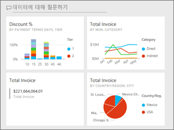
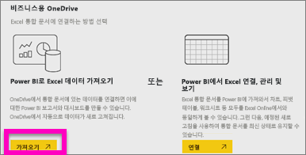
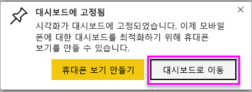
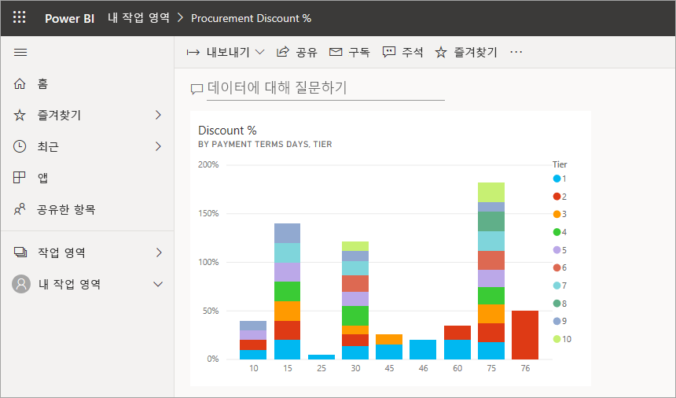

# 보고서에서 Power BI 대시보드 만들기
지금까지 [Power BI의 대시보드](service-dashboards.md)에 대해 살펴보았으며 이제 직접 만들려고 합니다. 보고서에서, 처음부터, 데이터 집합에서 대시보드를 만들거나 기존 대시보드를 복제하는 등 다양한 방법으로 대시보드를 만들 수 있습니다.  이 항목과 비디오에서는 기존 보고서에서 시각적 개체를 핀 고정하여 새 대시보드를 만드는 방법을 보여 줍니다.

> **참고**: 대시보드는 Power BI Desktop이 아닌 Power BI 서비스의 기능입니다. Power BI 모바일에서는 대시보드를 만들 수 없지만 [보고 공유](mobile-apps-view-dashboard.md)할 수는 있습니다.
> 
> 

## 비디오: 보고서에서 시각적 개체 및 이미지를 고정하여 대시보드를 만듭니다.
Amanda가 보고서에서 시각화를 핀 고정하여 새 대시보드를 만드는 과정을 시청합니다. 그런 다음 비디오 아래 단계에 따라 조달 분석 샘플을 직접 사용해 보세요.

<iframe width="560" height="315" src="https://www.youtube.com/embed/lJKgWnvl6bQ" frameborder="0" allowfullscreen></iframe>

## 보고서로 데이터 집합 가져오기
Power BI 샘플 데이터 집합 중 하나를 가져오고 이를 사용하여 새 대시보드를 만듭니다. 사용할 샘플은 두 개의 PowerView 시트가 있는 Excel 통합 문서입니다. Power BI에서 통합 문서를 가져오면 데이터 집합과 보고서를 작업 영역에 추가합니다.  보고서는 PowerView 시트에서 자동으로 생성됩니다.

1. [이 링크를 선택](http://go.microsoft.com/fwlink/?LinkId=529784)하여 조달 분석 샘플 Excel 파일을 다운로드하고 저장합니다. 비즈니스용 OneDrive에 파일을 저장하는 것이 좋습니다.
2. 브라우저에서 Power BI 서비스(app.powerbi.com)를 엽니다.
3. 기존 작업 영역 또는 새 앱 작업 영역 만들기를 선택합니다.
4. 왼쪽 탐색 창에서 **데이터 가져오기**를 선택합니다.
   
    
5. **파일**을 선택합니다.
   
   
6. 조달 분석 샘플 Excel 파일을 저장한 위치로 이동합니다. 이를 선택하고 **연결**을 선택합니다.
   
   
7. 이 연습에서는 **가져오기**를 선택합니다.
   
    
8. 성공 메시지가 나타나면 **x**를 선택하여 닫습니다.
   
   

### 보고서를 열고 타일을 대시보드에 핀 고정합니다.
1. 같은 작업 영역에서 **보고서** 탭을 선택합니다. 새로 가져온 보고서에는 노란색 별표가 함께 표시됩니다. 열려는 보고서 이름을 선택합니다.
   
    
2. 보고서는 [읽기용 보기](service-interact-with-a-report-in-reading-view.md)로 열립니다. 맨 아래에는 할인 분석과 지출 개요 등의 두 탭이 있습니다. 각 탭은 보고서의 페이지를 나타냅니다.
   
    
3. 시각화 위로 마우스를 가져 가면 사용할 수 있는 옵션이 표시됩니다. 시각화를 대시보드에 추가하려면 핀 고정  아이콘을 선택합니다.
   
    
4. 새 대시보드를 만들고 있으므로 **새 대시보드**에 대한 옵션을 선택하고 이름을 지정합니다. 
   
   
5. **핀 고정**을 선택하면, Power BI에서 현재 작업 영역에 새 대시보드를 만듭니다. **대시보드에 고정됨** 메시지가 나타나면 **대시보드로 이동**을 선택합니다. 보고서를 저장할지 묻는 메시지가 표시되면 **저장**을 선택합니다.
   
     
6. Power BI에 새 대시보드가 열리고 방금 핀 고정한 시각화인 한 개의 타일이 있습니다. 
   
   
7. 보고서로 돌아가려면 타일을 선택합니다. 새 대시보드에 몇 개 타일을 고정합니다. 이번에는 **대시보드에 고정** 창이 표시될 때 **기존 대시보드**를 선택합니다.  
   
   

축하합니다. 첫 번째 대시보드를 만들었습니다! 이제 대시보드가 있으며 훨씬 많은 작업을 수행할 수 있습니다.  아래 제시된 **다음 단계** 중 하나를 시도하거나 재생하고 직접 탐색해 보세요.   

## 다음 단계
* [타일 크기 조정 및 이동](service-dashboard-edit-tile.md)
* [대시보드 타일에 대한 모든 정보](service-dashboard-tiles.md)
* [앱을 만들어 대시보드 공유](service-create-distribute-apps.md)
* [Power BI - 기본 개념](service-basic-concepts.md)
* [Power BI의 대시보드](service-dashboards.md)
* [멋진 대시보드를 디자인하기 위한 팁](service-dashboards-design-tips.md)

궁금한 점이 더 있나요? [Power BI 커뮤니티를 이용하세요.](http://community.powerbi.com/)

