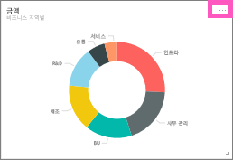
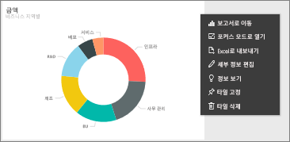

# 대시보드 타일 편집 또는 제거
대시보드에서 타일의 모양과 기본 동작을 변경할 수 있습니다.

<iframe width="560" height="315" src="https://www.youtube.com/embed/lJKgWnvl6bQ" frameborder="0" allowfullscreen></iframe>

이 문서는 다음 내용을 다룹니다.

* [타일을 다른 대시보드에 고정](#different)
* [타일의 이름 바꾸기](#rename)
* [타일 이동](#move)
* [타일의 크기 바꾸기](#resize)
* [타일에 하이퍼링크 추가](#hyperlink)
* [타일 삭제](#delete)
  
  > [!TIP]
  > 타일 자체에 표시된 시각화를 변경하려면 해당 타일을 삭제하고 새 [대시보드 타일](service-dashboard-tiles.md)을 추가합니다.
  > 
  > 

## 시작 방법
1. 타일이 하나 이상 있는 [대시보드](service-dashboards.md)를 엽니다. 
   
   
2. 마우스 커서로 대시보드 타일을 가리키고 줄임표를 선택하여 옵션을 표시합니다.
   
   

## 대시보드에 타일 고정
1. **타일 고정** 아이콘 을 선택합니다.
2. 기존 대시보드 또는 새 대시보드에 고정할지 결정합니다. 
   
   
3. **고정**을 선택합니다.

- - -

## 타일 이름 바꾸기 및 타일 세부 정보 편집
타일 세부 정보 아이콘 을 선택하여 제목을 편집하고 마지막 새로 고침 시간을 표시합니다.

- - -

## 타일 이동
타일을 선택한 상태로 대시보드 캔버스의 새 위치로 끌어옵니다.

- - -

## 타일 크기 조정
1x1 타일 단위에서 5x5까지, 타일을 다양한 크기로 만들 수 있습니다. 핸들(오른쪽 하단)을 선택하고 끌어 타일 크기를 조정합니다.
    

- - -

## 기본 하이퍼링크 변경
기본적으로 타일을 선택하면 타일이 만들어진 보고서나 질문 및 답변(타일이 질문 및 답변에서 만들어진 경우)으로 이동합니다. 웹 페이지, 다른 대시보드 또는 보고서(동일한 작업 영역에서), SSRS 보고서 또는 기타 온라인 콘텐츠에 연결하려면 사용자 지정 링크를 추가합니다.

1. **세부 정보 편집** 아이콘 을 선택하여 타일 제목을 편집합니다.
2. **사용자 지정 링크 설정** 옆에 확인 표시를 배치하고 링크 형식을 선택합니다.    
   
   * 외부 링크의 경우 URL을 입력합니다.     
   * 현재 작업 영역에서 대시보드 또는 보고서에 연결하려면 드롭다운 메뉴에서 선택합니다.
   
   

- - -

## 타일 삭제
* **타일 삭제** 아이콘 을 선택하여 타일을 삭제합니다. 타일을 삭제해도 기본 보고서 또는 시각화는 삭제되지 않습니다.

- - -
## 다음 단계
[Power BI의 대시보드 타일](service-dashboard-tiles.md)

[Power BI의 대시보드](service-dashboards.md)

[Power BI - 기본 개념](service-basic-concepts.md)

궁금한 점이 더 있나요? [Power BI 커뮤니티를 이용하세요.](http://community.powerbi.com/)

