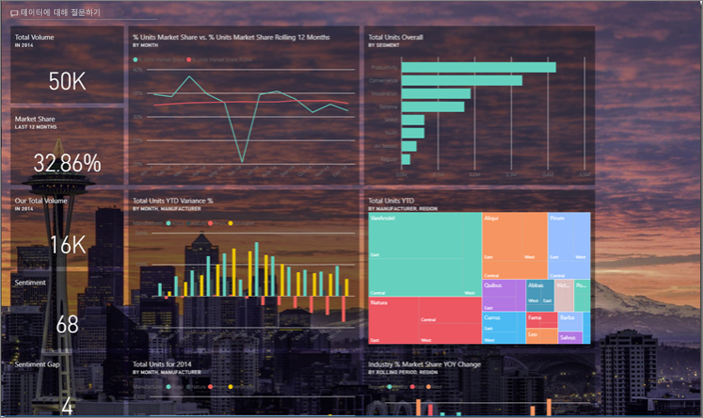
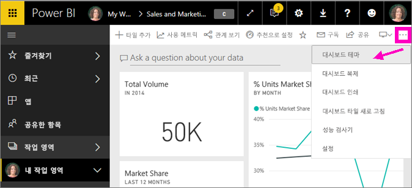
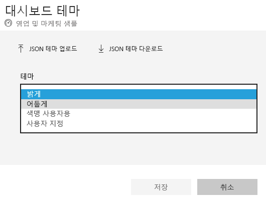
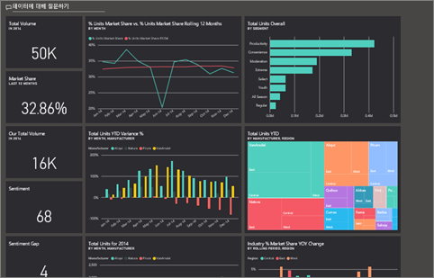
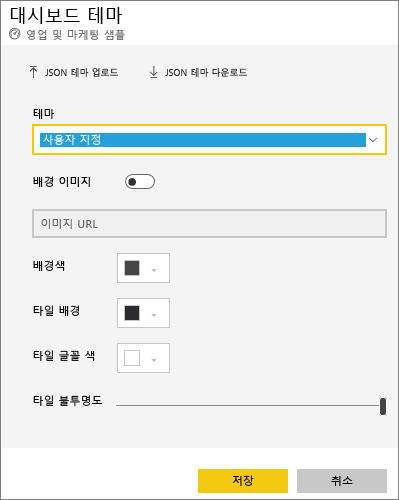
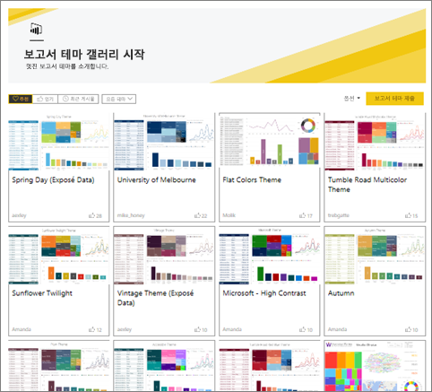
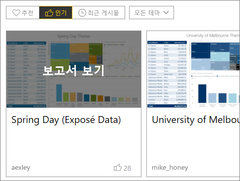
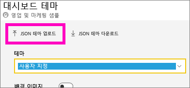
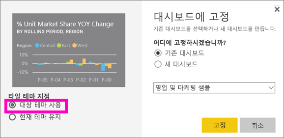

# Power BI 서비스에서 대시보드 테마 사용
**대시보드 테마**를 사용하여 전체 대시보드에 회사 색, 계절 색 지정 또는 적용하려는 기타 색 테마 등의 색 테마를 적용할 수 있습니다. **대시보드 테마**를 적용하는 경우 대시보드의 모든 시각적 개체에서는 선택한 테마를 사용합니다(몇 가지 예외 적용, 이 아티클의 뒷부분에서 설명).

대시보드에서 보고서 시각적 개체의 색을 변경해도 보고서에서 시각적 개체에 영향을 주지 않습니다. 또한 이미 [보고서 테마가 적용](desktop-report-themes.md)된 보고서의 타일을 고정할 때 현재 테마를 유지하거나 대시보드 테마를 사용하도록 선택합니다.

## 필수 조건
* 이를 수행하려면 [영업 및 마케팅 샘플 대시보드](sample-datasets.md)를 엽니다.

## 대시보드 테마 작동 방식
시작하려면 직접 만들었고(또는 편집 권한이 있고) 사용자 지정하려는 대시보드를 엽니다. 줄임표(...)를 선택하고 **대시보드 테마**를 선택합니다.

표시되는 대시보드 창에서 미리 작성된 테마 중 하나를 선택합니다.  아래 예제에서 **어둡게**를 선택했습니다.

## 사용자 지정 테마 만들기

Power BI 대시보드의 기본 테마는 **밝게**입니다. 색을 사용자 지정하거나 고유한 테마를 만들려면 드롭다운 목록에서 **사용자 지정**을 선택합니다. 

사용자 지정 옵션을 사용하여 고유한 대시보드 테마를 만듭니다. 배경 이미지를 추가하는 경우 이미지는 적어도 1920x1080 해상도를 사용하는 것이 좋습니다. 이미지를 배경으로 사용하려면 이미지를 공개 웹 사이트에 업로드하고 URL을 복사한 이후 **이미지 URL** 필드에 붙여넣으세요. 

### JSON 테마 사용
사용자 지정 테마를 만드는 또 다른 방법은 대시보드에 사용하려는 모든 색에 대한 설정을 포함하는 JSON 파일을 업로드하는 것입니다. Power BI Desktop에서 보고서 작성자는 JSON 파일을 사용하여 [보고서의 테마를 만듭니다](desktop-report-themes.md). 대시보드에 대해 이러한 동일한 JSON 파일을 업로드할 수 있습니다. 또는 Power BI 커뮤니티의 [테마 갤러리 페이지](https://community.powerbi.com/t5/Themes-Gallery/bd-p/ThemesGallery)에서 JSON 파일을 찾아 업로드할 수 있습니다. 

JSON 파일로 사용자 지정 테마를 저장한 다음, 다른 대시보드 작성자와 공유할 수도 있습니다. 

### 테마 갤러리에서 테마 사용

기본 제공 및 사용자 지정 옵션과 마찬가지로 테마가 업로드되면 대시보드의 모든 타일에 색이 자동으로 적용됩니다. 

1. 테마 위로 마우스를 가져가고 **보고서 보기**를 선택합니다.

    

2. 아래로 스크롤하여 JSON 파일에 대한 링크를 찾습니다.  다운로드 아이콘을 선택하고 파일을 저장합니다.

    

3. Power BI 서비스로 다시 돌아가서 사용자 지정 대시보드 테마 창에서 **JSON 테마 업로드**를 선택합니다.

    

4. JSON 테마 파일을 저장한 위치로 이동하고 **열기**를 선택합니다.

5. 대시보드 테마 페이지에서 **저장**을 선택합니다. 새 테마가 대시보드에 적용됩니다.

    

## 고려 사항 및 제한 사항

* 보고서가 대시보드 테마의 다양한 테마를 사용하는 경우 시각적 개체가 현재 테마를 유지할지 또는 다양한 원본의 시각적 개체 간에 일관성을 위해 대시보드 테마를 사용할지 여부를 제어할 수 있습니다. 타일을 대시보드에 고정하는 경우 보고서 테마를 유지하려면 **현재 테마 유지**를 선택합니다. 대시보드의 시각적 개체는 투명도 설정을 포함하여 보고서 테마를 유지합니다. 

    Power BI Desktop에서 보고서를 만들고, [보고서 테마를 추가](desktop-report-themes.md)한 다음, Power BI 서비스에 보고서를 게시한 경우에만 **타일 테마 지정** 옵션이 표시됩니다. 

    

    타일을 다시 고정하고 **대시보드 테마 사용**을 선택하려고 합니다.

    

* 대시보드 테마는 고정된 라이브 보고서 페이지, iframe 타일, SSRS 타일, 통합 문서 타일 또는 이미지에 적용할 수 없습니다.
* 모바일 디바이스에서 대시보드 테마를 볼 수는 있지만 대시보드 테마를 만드는 작업은 Power BI 서비스에서만 수행할 수 있습니다. 
* 대시보드 사용자 지정 테마는 보고서의 고정된 타일에서만 작동합니다. 

