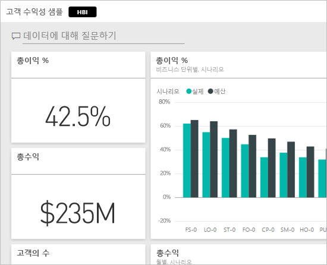
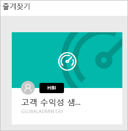
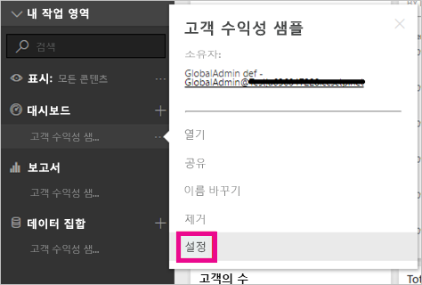
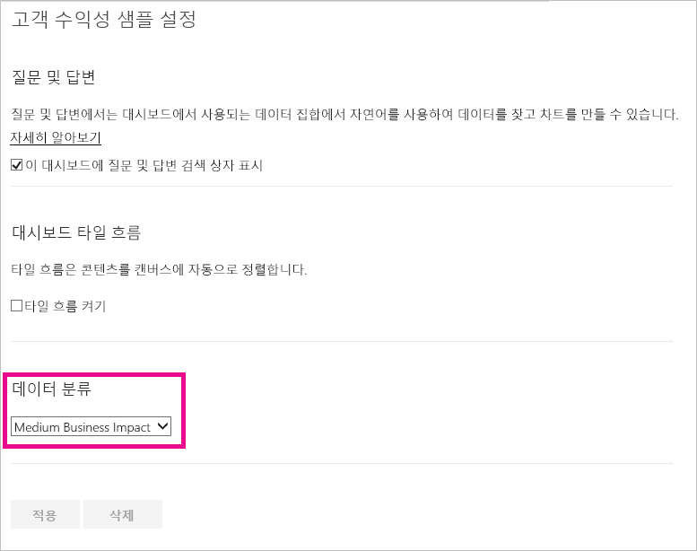
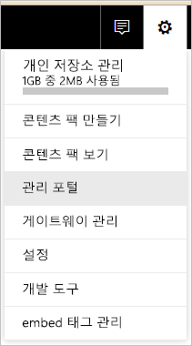
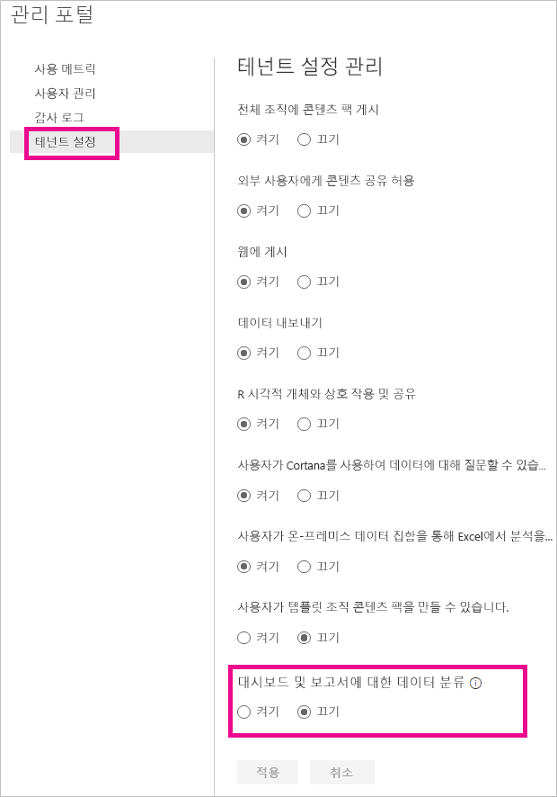
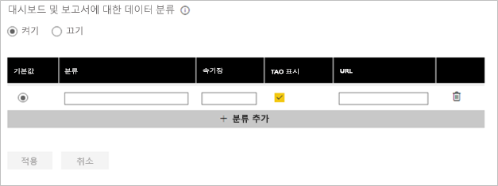
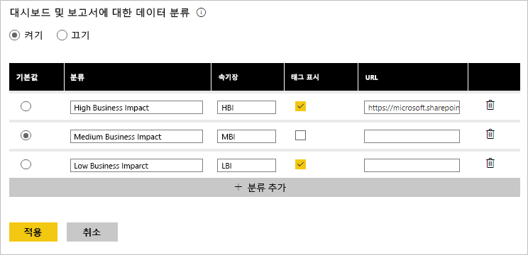

# 대시보드 데이터 분류
다양한 대시보드가 있기 때문에, 연결하는 데이터 원본에 따라, 데이터의 민감도에 따라 사용자 및 데이터를 공유하는 동료가 서로 다른 수준의 주의를 기울이도록 해야 할 필요성을 느낄 수 있습니다. 회사 외부의 사람과 절대로 공유하거나 인쇄하지 말아야 하는 대시보드가 있는가 하면, 자유롭게 공유할 수 있는 대시보드도 있습니다. 대시보드 데이터 분류를 사용하면, 대시보드를 보는 사람들이 사용해야 할 보안 수준에 대한 인식을 높일 수 있습니다. 콘텐츠를 보는 모든 사람이 데이터 민감도에 대해 동일한 수준의 이해를 갖도록 사내 IT 부서에서 정의한 분류를 사용하여 대시보드에 태그를 지정할 수 있습니다.

## 데이터 분류 태그
데이터 분류 태그는 대시보드 이름 옆에 표시되어, 데이터를 보는 모든 누구나가 대시보드에 적용해야 하는 보안 수준과 대시보드에 포함된 데이터를 볼 수 있도록 합니다.

즐겨찾기 목록의 대시보드 타일 옆에도 표시됩니다.

태그 위에 마우스를 가져가면, 분류의 전체 이름이 표시됩니다.

관리자가 태그에 추가적인 정보를 제공하는 URL을 설정할 수도 있습니다.

> [!NOTE]
> 관리자의 분류 설정에 따라, 일부 분류 유형은 대시보드에 태그로 표시되지 않을 수 있습니다. 대시보드 소유자는 대시보드 설정에서 자신의 대시보드 분류 유형을 언제나 확인할 수 있습니다.
> 
> 

## 대시보드의 분류 설정
회사에 데이터 분류를 사용하도록 설정되어 있으면, 모든 대시보드가 기본 분류 유형으로 시작되며, 대시보드 소유자는 대시보드 보안 수준에 맞게 분류를 변경할 수 있습니다.

분류 유형을 변경하려면, 다음을 수행합니다.

1. 대시보드 이름 옆의 **줄임표(...)**를 선택하고 **설정**을 선택하여 대시보드 설정으로 이동합니다.
   
    
2. 대시보드 설정에서, 대시보드에 대한 현재 분류를 보고 드롭다운을 사용하여 분류 유형을 변경할 수 있습니다.
   
    
3. 완료되면 **적용**을 선택합니다.

변경 내용을 적용한 후에, 대시보드를 다시 로드하면 대시보드를 공유한 모든 이에게 업데이트된 내용이 표시됩니다.

## 관리자의 데이터 분류 태그 작업
데이터 분류는 조직의 전역 관리자에 의해 설정됩니다. 데이터 분류를 사용하도록 설정하려면, 다음을 수행합니다.

1. 설정 기어(단추)를 선택하고 **관리 포털**을 선택합니다.
   
    
2. **테넌트 설정** 탭에서 **대시보드 및 보고서에 대한 데이터 분류**를 켜기로 전환합니다.
   
    

켜기로 설정되면, 조직의 다양한 분류를 만드는 양식이 제공됩니다.

각각의 분류에는 **이름**과 **속기장**이 있고, 이것이 대시보드에 표시됩니다. 각 분류에 대해, **태그 표시**를 선택하여 대시보드에 속기장을 표시할지 여부를 결정할 수 있습니다. 대시보드에 분류 유형을 표시하지 않기로 결정하더라도, 소유자는 대시보드 설정을 확인하여 유형을 볼 수 있습니다. 또한, 필요에 따라 조직의 분류 지침 및 사용 요건에 대한 자세한 정보를 포함하는 **URL**을 추가할 수 있습니다.  

마지막으로 결정할 내용은 어떤 분류 유형을 기본값으로 할지 입니다.  

양식에 분류 유형을 입력한 후에, **적용**을 선택하여 변경 내용을 저장합니다.

이 시점에, 모든 대시보드에 기본 분류가 할당되고, 대시보드 소유자가 자신의 콘텐츠에 적합한 유형으로 분류 유형을 업데이트할 수 있게 됩니다. 나중에 이 곳에 돌아와서 분류 유형을 추가하거나 제거하거나 기본값을 변경할 수 있습니다.  

> [!NOTE]
> 변경을 위해 다시 돌아오는 경우 기억해야 할 중요한 내용이 몇 가지 있습니다.
> 
> * 데이터 분류를 해제하면, 모든 태그가 기억되지 않습니다. 나중에 다시 사용하도록 설정하는 경우, 처음부터 다시 시작해야 합니다.  
> * 분류 유형을 제거하면, 제거된 분류 유형이 할당되어 있는 모든 대시보드는 소유자가 다시 설정할 때까지 기본값으로 다시 할당됩니다.  
> * 기본값을 변경하면, 소유자가 분류 유형을 할당해 놓지 않은 모든 대시보드는 새 기본값으로 변경됩니다.
> 
> 

