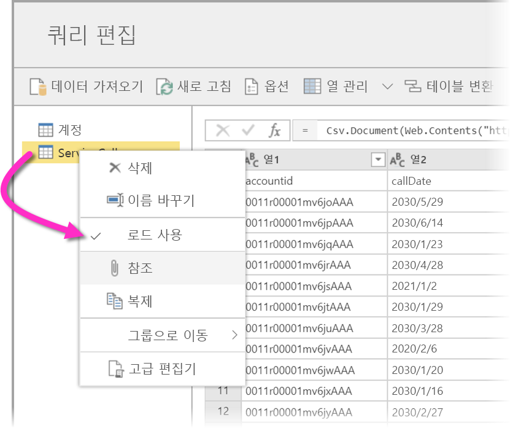
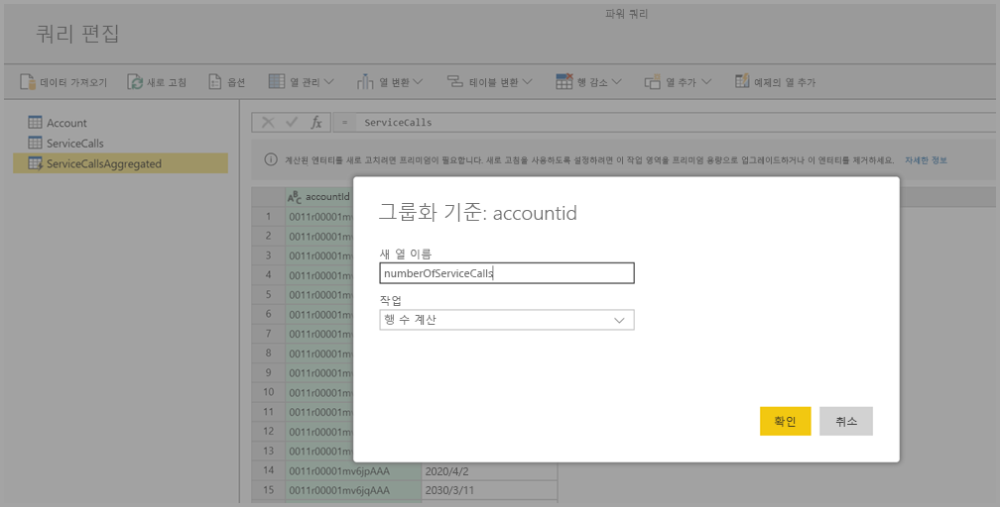
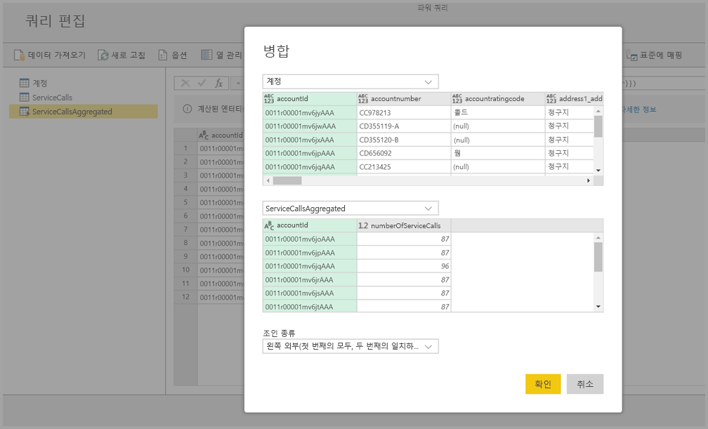
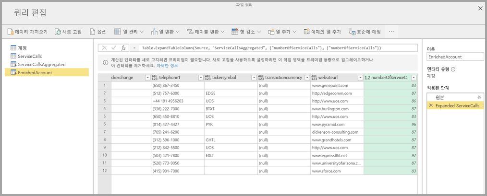

# Power BI Premium의 계산된 엔터티 사용(미리 보기)

Power BI Premium 구독과 함께 **데이터 흐름**을 사용하는 경우 **스토리지 내 계산**을 수행할 수 있습니다. 이렇게 하면 기존 데이터 흐름에서 계산을 수행하고 결과를 반환하여 보고서 만들기와 분석에 초점을 맞출 수 있습니다. 

**스토리지 내 계산**을 수행하려면 먼저 데이터 흐름을 만들고 해당 Power BI 데이터 흐름 스토리지로 데이터를 가져와야 합니다. 데이터가 포함된 데이터 흐름이 있으면 스토리지 내 계산을 수행하는 엔터티인 **계산된 엔터티**를 만들 수 있습니다. 

데이터 흐름 데이터를 Power BI에 연결할 수 있는 방법은 다음 두 가지입니다.

* [셀프 서비스 제작한 데이터 흐름 사용](service-dataflows-create-use.md)
* 외부 데이터 흐름 사용

다음 절에서는 데이터 흐름 데이터에서 계산된 엔터티를 만드는 방법에 대해 설명합니다.

> [!NOTE]
> 데이터 흐름 기능은 미리 보기로 제공되며 일반 공급 전에 변경되고 업데이트될 수 있습니다.

## 계산된 엔터티를 만드는 방법 

엔터티 목록이 있는 데이터 흐름이 있으면 해당 엔터티에서 계산을 수행할 수 있습니다.

Power BI 서비스의 데이터 흐름 제작 도구에서 **엔터티 편집**을 선택한 후 계산된 엔터티의 기초로 사용하고 계산을 수행할 엔터티를 마우스 오른쪽 단추로 클릭합니다. 상황에 맞는 메뉴에서 **참조**를 선택합니다.

엔터티가 계산된 엔터티로 적합하려면 다음 이미지에 표시된 대로 **로드 사용** 선택 항목이 선택되어 있어야 합니다. 이 상황에 맞는 메뉴를 표시할 엔터티를 마우스 오른쪽 단추로 클릭합니다.

**로드 사용**을 선택하여 해당 소스가 참조된 엔터티인 새 엔터티를 만듭니다. 다음 이미지에 표시된 대로 아이콘이 변경되어 **계산된** 아이콘이 표시됩니다.

이 새로 만든 엔터티에서 수행하는 모든 변환은 Power BI 데이터 흐름 스토리지에 이미 상주하는 데이터에서 실행됩니다. 즉, 쿼리가 데이터를 가져온 외부 데이터 원본(예: 데이터를 끌어온 SQL Database)에 대해 실행되지 않고 데이터 흐름 스토리지에 상주하는 데이터에서 수행됩니다.

### 사용 사례 예
계산된 엔터티로 어떤 종류의 변환을 수행할 수 있나요? 스토리지 내 계산을 수행하는 경우 Power BI 또는 M 편집기의 변환 사용자 인터페이스를 사용하여 일반적으로 지정하는 모든 변환이 지원됩니다. 

다음과 같은 예를 고려해 보세요. Dynamics 365 구독의 모든 고객에 대한 원시 데이터가 포함된 ‘계정’ 엔터티가 있습니다. 해당 연도에 매일 다른 계정에서 수행한 지원 통화 데이터가 포함되어 있는 서비스 센터의 *ServiceCalls* 원시 데이터도 있습니다.

*ServiceCalls*의 데이터로 ‘계정’ 엔터티를 보강하려 한다고 가정해 보겠습니다. 

먼저 ServiceCalls에서 데이터를 집계하여 작년에 각 계정에 대해 수행된 지원 통화 수를 계산해야 합니다. 

다음으로는 ‘계정’ 엔터티를 *ServiceCallsAggregated* 엔터티와 병합하여 보강된 **계정** 테이블을 계산할 것입니다.

그러면 다음 이미지에 *EnrichedAccount*로 표시된 것과 같은 결과를 볼 수 있습니다.

됐습니다. 변환은 원본 데이터가 아니라 Power BI Premium 구독에 상주하는 데이터 흐름의 데이터에서 수행됩니다.

## 고려 사항 및 제한 사항

Power BI Premium 용량에서 작업 영역을 제거하면 연결된 데이터 흐름이 더 이상 새로 고쳐지지 않음을 유의해야 합니다. 

## 다음 단계

이 문서에서는 Power BI 서비스에서 사용할 수 있는 계산된 엔터티와 데이터 흐름을 설명했습니다. 다음은 몇 가지 유용한 추가 문서입니다.

* [데이터 흐름을 사용하여 셀프 서비스 데이터 준비](service-dataflows-overview.md)
* [Power BI에서 데이터 흐름 만들기 및 사용](service-dataflows-create-use.md)
* [온-프레미스 데이터 원본으로 만든 데이터 흐름 사용(미리 보기)](service-dataflows-on-premises-gateways.md)
* [Power BI 데이터 흐름에 사용할 수 있는 개발자 리소스(미리 보기)](service-dataflows-developer-resources.md)

파워 쿼리 및 예약된 새로 고침에 대한 자세한 내용은 다음 문서를 참조하세요.
* [Power BI Desktop을 사용한 쿼리 개요](desktop-query-overview.md)
* [예약된 새로 고침 구성](refresh-scheduled-refresh.md)

공통 데이터 모델에 대한 자세한 내용은 해당 개요 문서를 참조할 수 있습니다.
* [공통 데이터 모델 - 개요 ](https://docs.microsoft.com/powerapps/common-data-model/overview)

