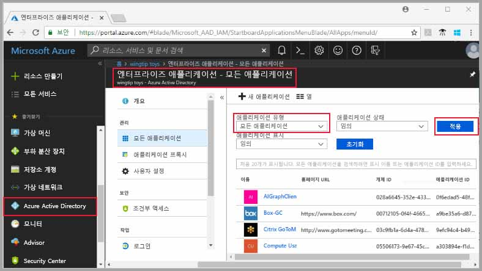
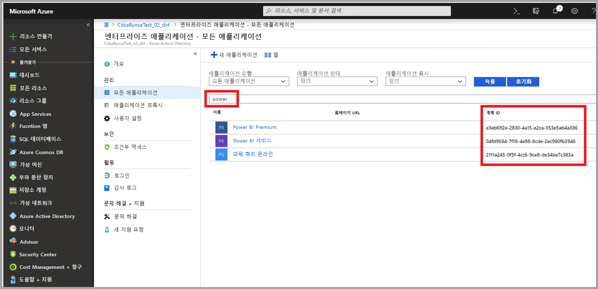
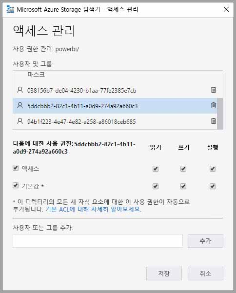
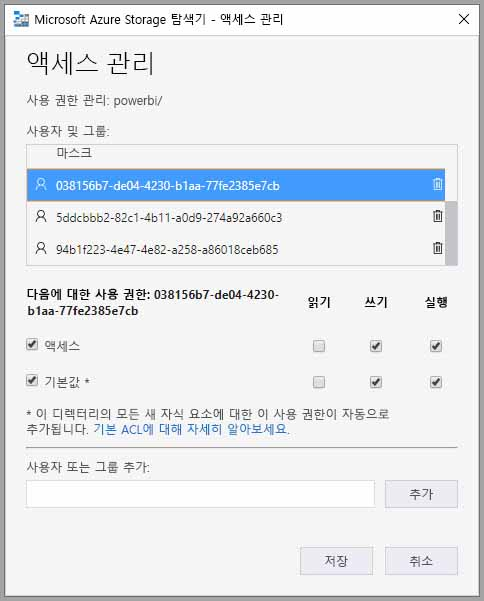
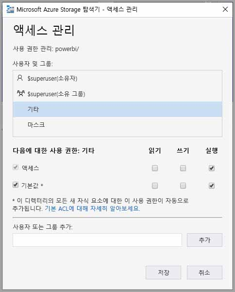
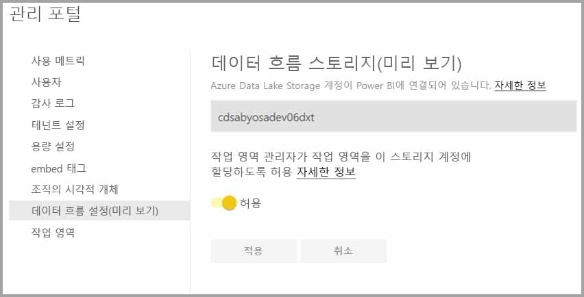

# 데이터 흐름 스토리지를 위해 Azure Data Lake Storage Gen2 연결

조직의 Azure Data Lake Storage Gen2 계정에 데이터 흐름을 저장하도록 Power BI 작업 영역을 구성할 수 있습니다. 이 문서에서는 이를 수행하는 데 필요한 일반적인 단계를 설명하고 그 과정에서 지침 및 모범 사례를 제공합니다. 다음을 포함하여 Data Lake에 데이터 흐름 정의 및 데이터 파일을 저장하도록 작업 영역을 구성하는 몇 가지 장점이 있습니다.

* Azure Data Lake Storage Gen2는 데이터에 대한 확장성 높은 스토리지 기능을 제공합니다.
* IT 부서의 개발자는 데이터 흐름 데이터 및 정의 파일을 사용하여 [Azure Data Services의 GitHub 샘플](https://aka.ms/cdmadstutorial)에 설명된 대로 Azure Data Services 및 AI 서비스를 활용할 수 있습니다.
* 조직의 개발자가 데이터 흐름 및 Azure에 개발자 리소스를 사용하여 데이터 흐름 데이터를 내부 애플리케이션 및 사업 부문 솔루션을 통합할 수 있습니다.

Azure Data Lake Storage Gen2를 데이터 흐름에 사용하려면 다음이 필요합니다.

* **Power BI 테넌트** - AAD(Azure Active Directory) 테넌트에서 하나 이상의 계정이 Power BI에 가입되어 있어야 합니다.
* **전역 관리자 계정** - 이 계정은 데이터 흐름 정의 및 데이터를 Azure Data Lake Storage Gen2 계정에 저장하도록 Power BI를 연결 및 구성하는 데 필요합니다.
* **Azure 구독** - Azure Data Lake Storage Gen2를 사용하려면 Azure 구독이 필요합니다.
* **리소스 그룹** - 이미 있는 리소스 그룹을 사용하거나 새로 만들 수 있습니다.
* **Data Lake Storage Gen2 기능을 사용할 수 있는 Azure Storage 계정** 

> [!TIP]
> Azure 구독이 없는 경우 시작하기 전에 [체험 계정](https://azure.microsoft.com/free/)을 만듭니다.

> [!WARNING]
> 데이터 흐름 스토리지 위치가 구성되고 나면 이를 변경할 수 없습니다. 고려해야 할 다른 중요한 요소는 이 문서의 끝 부분에 있는 [고려 사항 및 제한 사항](#considerations-and-limitations) 섹션을 참조하세요.

## Power BI에 대한 Azure Data Lake Storage Gen2 준비

Azure Data Lake Storage Gen2 계정으로 Power BI를 구성하려면 먼저 스토리지 계정을 만들고 구성해야 합니다. Power BI에 대한 요구 사항을 살펴보겠습니다.

1. 스토리지 계정은 Power BI 테넌트와 동일한 AAD 테넌트에서 만들어야 합니다.
2. 스토리지 계정은 Power BI 테넌트와 동일한 지역에 만들어야 합니다. Power BI 테넌트의 위치를 확인하려면 [내 Power BI 테넌트는 어디에 있나요?](service-admin-where-is-my-tenant-located.md) 문서를 참조하세요.
3. 스토리지 계정에서 ‘계층 구조 네임스페이스’ 기능이 사용 가능해야 합니다. 
4. Power BI 서비스에는 스토리지 계정에 대한 ‘독자’ 역할이 부여되어야 합니다. 
5. **powerbi**라는 파일 시스템을 만들어야 합니다.
6. Power BI 서비스에는 사용자가 만든 **powerbi** 파일 시스템의 권한이 부여되어야 합니다.

다음 섹션에서는 Azure Data Lake Storage Gen2 계정을 구성하는 데 필요한 단계를 자세히 설명합니다.

### 스토리지 계정 만들기

[Create an Azure Data Lake Storage Gen2 storage account](https://docs.microsoft.com/azure/storage/blobs/data-lake-storage-quickstart-create-account)(Azure Data Lake Storage Gen2 스토리지 계정 만들기) 문서의 단계를 따릅니다.

1. Power BI 테넌트와 동일한 위치를 선택하고 스토리지를 **StorageV2(범용 v2)** 로 설정해야 합니다.
2. 계층 구조 네임스페이스 기능을 사용하도록 설정해야 합니다.
3. 복제 설정을 **RA-GRS(읽기 액세스 지역 중복 스토리지)** 로 설정하는 것이 좋습니다.

### Power BI 서비스에 독자 역할을 부여합니다.

그런 다음, 만들어진 스토리지 계정에서 Power BI 서비스에 독자 역할을 부여해야 합니다. 기본 제공 역할이므로 단계는 간단합니다. 

[기본 제공 RBAC 역할 할당](https://docs.microsoft.com/azure/storage/common/storage-auth-aad-rbac#assign-a-built-in-rbac-role)의 단계를 따르세요.

**역할 할당 추가** 창에서 Power BI 서비스에 할당할 **독자** 역할을 선택합니다. 그런 다음, 검색을 사용하여 **Power BI 서비스**를 찾습니다. 다음 이미지는 Power BI 서비스에 할당된 **독자** 역할을 보여 줍니다.

> [!NOTE]
> 사용 권한이 포털에서 Power BI로 전파되도록 30분 이상 허용합니다. 포털에서 사용 권한을 변경할 때마다 이러한 사용 권한이 Power BI에 반영되는 데 30분이 걸릴 수 있습니다. 

### Power BI용 파일 시스템 만들기

스토리지 계정을 Power BI에 추가하려면 먼저 *powerbi*라는 파일 시스템을 만들어야 합니다. Azure Databricks, HDInsight, AZCopy 또는 Azure Storage Explorer 사용을 포함하여 다양한 방법으로 파일 시스템을 만들 수 있습니다. 이 섹션에서는 Azure Storage Explorer를 사용하여 파일 시스템을 만드는 간단한 방법을 보여 줍니다.

이 단계를 수행하려면 Azure Storage Explorer 버전 1.6.2 이상을 설치해야 합니다. Windows, Macintosh 또는 Linux용 Azure Storage Explorer를 설치하려면 [Azure Storage Explorer](https://azure.microsoft.com/features/storage-explorer/)를 참조하세요.

1. Azure Storage Explorer를 성공적으로 설치하면 처음 시작할 때 [Microsoft Azure Storage Explorer - 연결] 창이 표시됩니다. Storage Explorer는 스토리지 계정에 연결하는 여러 가지 방법을 제공하지만 현재 필요한 설정에 지원되는 방법은 한 가지뿐입니다. 

2. 왼쪽 창에서 사용자가 위에서 만든 스토리지 계정을 찾고 확장합니다.

3. Blob 컨테이너를 마우스 오른쪽 단추로 클릭하고 상황에 맞는 메뉴에서 [Blob 컨테이너 만들기]를 선택합니다.

   

4. 텍스트 상자가 Blob 컨테이너 폴더 아래에 나타납니다. 이름을 *powerbi*로 입력합니다. 

   

5. 작업이 완료되면 Enter 키를 눌러 Blob 컨테이너 만들기

   

다음 섹션에서는 사용자가 만든 파일 시스템의 전체 권한을 Power BI 서비스 제품군에 부여합니다. 

### 파일 시스템에 Power BI 권한 부여

파일 시스템에 권한을 부여하려면 Power BI 서비스 액세스 권한을 부여하는 ACL(액세스 제어 목록) 설정을 적용합니다. 이를 수행하는 첫 번째 단계는 테넌트에서 Power BI 서비스 ID를 얻는 것입니다. Azure Portal의 **엔터프라이즈 앱** 섹션에서 AAD(Azure Active Directory) 애플리케이션을 볼 수 있습니다.

테넌트 애플리케이션을 찾으려면 다음 단계를 수행합니다.

1. [Azure Portal](https://portal.azure.com/)의 탐색 패널에서 **Azure Active Directory**를 선택합니다.
2. Azure **Active Directory** 블레이드에서 **엔터프라이즈 애플리케이션**을 선택합니다.
3. **애플리케이션 유형** 드롭다운 메뉴에서 **모든 애플리케이션**을 선택한 후 **적용을** 선택합니다. 테넌트 애플리케이션의 샘플이 다음 이미지와 비슷하게 표시됩니다.

    

4. 검색 창에 *Power*를 입력하면 Power BI 및 파워 쿼리 애플리케이션의 개체 ID 컬렉션이 나타납니다. 이후 단계에서는 세 가지 값 모두가 필요합니다.  

    

5. 검색 결과에서 Power BI Premium 서비스 및 파워 쿼리 온라인의 개체 ID를 모두 선택하고 복사합니다. 이후 단계에서 해당 값을 붙여넣도록 준비합니다.

6. 그런 다음, **Azure Storage Explorer**를 사용하여 이전 섹션에서 만든 *powerbi* 파일 시스템으로 이동합니다. [Set file and directory level permissions using Azure Storage explorer](https://docs.microsoft.com/azure/storage/blobs/data-lake-storage-how-to-set-permissions-storage-explorer)(Azure Storage 탐색기를 사용하여 파일 및 디렉터리 수준 권한 설정)의 [Managing access](https://docs.microsoft.com/azure/storage/blobs/data-lake-storage-how-to-set-permissions-storage-explorer#managing-access)(액세스 관리) 섹션에 있는 지침을 따릅니다.

7. 5단계에서 수집한 두 개의 Power BI Premium 개체 ID 각각에 대해 **읽기**, **쓰기**, **실행** 액세스 및 기본값 ACL을 *powerbi* 파일 시스템에 할당합니다.

   

8. 4단계에서 수집한 파워 쿼리 온라인 개체 ID에 대해 **쓰기**, **실행** 액세스 및 기본값 ACL을 *powerbi* 파일 시스템에 할당합니다.

   

9. 또한 **기타**에 대해 **실행** 액세스 및 기본값 ACL을 할당합니다.

    

## Power BI에 Azure Data Lake Storage Gen2 연결

Azure Portal에서 Azure Data Lake Storage Gen2 계정을 설정했으면, **Power BI 관리 포털**에서 계정을 Power BI에 연결합니다. 또한 Power BI 관리 포털의 **데이터 흐름 스토리지** 설정 섹션에서 Power BI 데이터 흐름 스토리지를 관리합니다. 시작 및 기본 사용에 대한 자세한 내용은 [관리 포털에 도달하는 방법](service-admin-portal.md)을 참조하세요.

다음 단계를 통해 **Azure Data Lake Storage Gen2** 계정을 연결합니다.

1. **Power BI 관리 포털**의 **데이터 흐름 설정** 탭으로 이동합니다.

     

2. **Azure Data Lake Storage Gen2 연결** 단추를 선택합니다. 다음과 같은 창이 나타납니다.

     

3. 스토리지 계정의 **구독 ID**를 제공합니다.
4. 스토리지 계정이 만들어진 **리소스 그룹 이름**을 제공합니다.
5. **스토리지 계정 이름**을 제공합니다.
6. **연결**을 선택합니다.

이러한 단계가 성공적으로 완료되면 Azure Data Lake Storage Gen2 계정이 Power BI에 연결됩니다. 

> [!NOTE]
> Power BI 관리 포털에서 Azure Data Lake Storage Gen2에 대한 연결을 구성하려면 전역 관리자 권한이 있어야 합니다. 하지만 전역 관리자는 관리 포털에서 외부 스토리지를 연결할 수 없습니다.  

그런 다음, 조직의 사용자가 데이터 흐름 정의 및 데이터 스토리지에 이 스토리지 계정을 사용할 수 있도록 해당 작업 영역을 구성할 수 있어야 합니다. 다음 섹션에서 이 작업을 수행해 보겠습니다. 

## 관리자가 작업 영역을 할당하도록 허용

기본적으로 데이터 흐름 정의 및 데이터 파일은 Power BI에서 제공하는 스토리지에 저장됩니다. 고유한 스토리지 계정의 데이터 흐름 파일에 액세스하려면 작업 영역 관리자가 먼저 새 스토리지 계정에서 데이터 흐름 할당 및 저장을 허용하도록 작업 영역을 구성해야 합니다. 작업 영역 관리자가 데이터 흐름 스토리지 설정을 구성하려면 먼저 **Power BI 관리 포털**에서 스토리지 할당 권한을 부여받아야 합니다.

스토리지 할당 권한을 부여하려면 **Power BI 관리 포털**의 **데이터 흐름 설정** 탭으로 이동합니다. ‘작업 영역 관리자가 이 스토리지 계정에 작업 영역을 할당하도록 허용’하는 라디오 단추가 있고 이 단추를 **허용**으로 설정해야 합니다.  해당 슬라이더를 사용하도록 설정한 후 **적용** 단추를 선택하여 변경 내용을 적용합니다. 

 

이제 끝났습니다! Power BI 작업 영역 관리자는 이제 사용자가 만든 파일 시스템에 워크플로를 할당할 수 있습니다.

## 고려 사항 및 제한 사항

이 기능은 미리 보기 기능이며 해당 동작은 릴리스에 접근할 때 변경될 수 있습니다. 데이터 흐름 스토리지를 사용하는 경우 고려해야 하는 몇 가지 고려 사항과 제한 사항이 있습니다.

* 데이터 흐름 스토리지 위치가 구성되고 나면 이를 변경할 수 없습니다.
* 기본적으로 Azure Data Lake Storage Gen2에 저장된 데이터 흐름의 소유자만 해당 데이터에 액세스할 수 있습니다. Azure에 저장된 데이터 흐름의 권한을 추가 사용자에게 부여하려면 데이터 흐름의 CDM 폴더에 사용자를 추가해야 합니다. 
* 동일한 스토리지 계정에 저장된 경우에만 연결된 엔터티를 사용하여 데이터 흐름을 만들 수 있습니다.
* Power BI 공유 용량의 온-프레미스 데이터 원본은 조직의 Data Lake에 저장된 데이터 흐름에서 지원되지 않습니다.
* 스냅숏은 ADLS Gen 2에서 자동으로 삭제되지 않습니다. 공간을 확보하려면 Azure 함수를 만들어 이전 스냅샷을 주기적으로 정리할 수 있습니다.

이 섹션에 설명된 대로 몇 가지 알려진 문제도 있습니다.

데이터 흐름의 소유자가 아니거나 Lake에서 CDM 폴더 권한이 부여되지 않은 경우 Power BI Desktop 고객은 **Azure Data Lake Storage 계정**에 저장된 데이터 흐름에 액세스할 수 없습니다. 시나리오는 다음과 같습니다.

1. Anna는 새 작업 영역을 만들고 조직의 데이터 레이크에 데이터 흐름을 저장하도록 구성했습니다. 
2. Anna가 만든 작업 영역의 구성원인 Ben은 Power BI Desktop 및 데이터 흐름 커넥터를 이용하여 Anna가 만든 데이터 흐름에서 데이터를 가져오려고 합니다.
3. Ben은 Data Lake의 데이터 흐름 CDM 폴더에 대한 권한이 없으므로 유사한 오류가 발생합니다.

일반적인 질문 및 답변은 다음과 같습니다.

**질문:** 이전에 작업 영역에서 데이터 흐름을 만들었는데 스토리지 위치를 변경하면 어떻게 되나요?

**답변:** 데이터 흐름이 만들어진 후에는 데이터 흐름의 스토리지 위치를 변경할 수 없습니다. 

**질문:** 작업 영역의 데이터 흐름 스토리지 위치는 언제 변경할 수 있나요?

**답변:** 작업 영역의 데이터 흐름 스토리지 위치는 작업 영역에 데이터 흐름이 포함되지 않은 경우에만 변경할 수 있습니다.

## 다음 단계

이 문서에서는 데이터 흐름 스토리지를 위해 Azure Data Lake Gen2를 연결하는 방법을 설명했습니다. 자세한 내용은 다음 문서를 참조하세요.

데이터 흐름, CDM 및 Azure Data Lake Storage Gen2에 대한 자세한 내용은 다음 문서를 참조하세요.

* [데이터 흐름 및 Azure Data Lake 통합(미리 보기)](service-dataflows-azure-data-lake-integration.md)
* [작업 영역 데이터 흐름 설정 구성(미리 보기)](service-dataflows-configure-workspace-storage-settings.md)
* [CDM 폴더를 Power BI에 데이터 흐름으로 추가(미리 보기)](service-dataflows-add-cdm-folder.md)

전반적인 데이터 흐름에 대한 내용은 다음 문서를 참조하세요.

* [Power BI에서 데이터 흐름 만들기 및 사용](service-dataflows-create-use.md)
* [Power BI Premium의 계산된 엔터티 사용](service-dataflows-computed-entities-premium.md)
* [온-프레미스 데이터 원본으로 만든 데이터 흐름 사용](service-dataflows-on-premises-gateways.md)
* [Power BI 데이터 흐름에 사용할 수 있는 개발자 리소스](service-dataflows-developer-resources.md)

Azure Storage에 대한 자세한 내용은 다음 문서를 참조하세요.
* [Azure Storage 보안 가이드](https://docs.microsoft.com/azure/storage/common/storage-security-guide)

공통 데이터 모델에 대한 자세한 내용은 해당 개요 문서를 참조할 수 있습니다.
* [공통 데이터 모델 - 개요 ](https://docs.microsoft.com/powerapps/common-data-model/overview)
* [CDM 폴더](https://go.microsoft.com/fwlink/?linkid=2045304)
* [CDM 모델 파일 정의](https://go.microsoft.com/fwlink/?linkid=2045521)

또한 언제든지 [Power BI 커뮤니티에 질문](https://community.powerbi.com/)할 수 있습니다.
