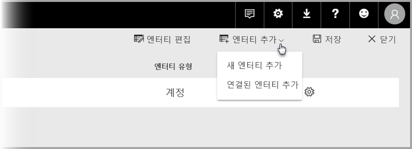

# Power BI의 데이터 흐름 간에 엔터티 연결(미리 보기)

Power BI의 데이터 흐름을 사용하면 단일 조직 데이터 스토리지 원본을 보유할 수 있으므로 비즈니스 분석가가 데이터를 준비하고 관리하여 조직의 여러 분석 앱 간에 재사용할 수 있습니다. 

데이터 흐름 간에 엔터티를 연결하면 데이터를 유지 관리할 필요 없이 다른 사람이 소유한 다른 데이터 흐름에서 이미 수집하고, 정리하고, 변환한 엔터티를 재사용할 수 있습니다. 연결된 엔터티는 단순히 다른 데이터 흐름의 엔터티를 가리키며 데이터를 *복사하거나 복제하지 않습니다*.

연결된 엔터티는 **읽기 전용**입니다. 연결된 엔터티에 대한 변환을 만들려면 연결된 엔터티에 대한 참조를 사용하여 계산된 엔터티를 새로 만들어야 합니다.

## 연결된 엔터티 가용성

연결된 엔터티를 새로 고치려면 [Power BI Premium](service-premium.md) 구독이 필요합니다. 연결된 엔터티는 Power BI Premium 용량에 호스트된 작업 영역의 모든 데이터 흐름에서 사용할 수 있습니다. 원본 데이터 흐름에 대한 제한 사항은 없습니다.

연결된 엔터티는 새 Power BI 작업 영역에서만 제대로 작동합니다. [새 Power BI 작업 영역](service-create-the-new-workspaces.md)에 대해 자세히 알아볼 수 있습니다. 모든 연결된 데이터 흐름이 제대로 작동하려면 새 작업 영역에 있어야 합니다.

> [!NOTE]
> 엔터티는 표준 엔터티인지 계산된 엔터티인지 여부에 따라 다릅니다. 표준 엔터티(일반적으로 간단히 엔터티라고 함)는 SQL 데이터베이스와 같은 외부 데이터 원본을 쿼리합니다. 계산된 엔터티에는 Power BI의 프리미엄 용량이 필요하며 이 엔터티는 Power BI 스토리지에 이미 있는 데이터에서 변환을 실행합니다. 
>
>데이터 흐름이 프리미엄 용량 작업 영역에 없는 경우에는 변환이 스토리지 내 변환으로 정의되지만 않으면 단일 쿼리를 계속 참조하거나 두 개 이상의 쿼리를 결합할 수 있습니다. 이러한 참조를 표준 엔터티로 간주합니다. 이를 수행하려면 참조된 쿼리의 **로드 사용** 옵션을 꺼서 데이터가 구체화되지 않고 스토리지에 수집되지 않도록 합니다. 여기서 **로드 사용 = false**인 쿼리를 참조하고, 구체화하려는 결과 쿼리에만 **로드 사용**을 **켜기**로 설정할 수 있습니다.

## 데이터 흐름 간에 엔터티를 연결하는 방법

Power BI의 데이터 흐름 간에 엔터티를 연결하는 몇 가지 방법이 있습니다. 다음 이미지에 표시된 대로 데이터 흐름 제작 도구에서 **연결된 엔터티 추가**를 선택할 수 있습니다. 

Power BI 서비스의 **엔터티 추가** 메뉴 항목에서 **연결된 엔터티 추가**를 선택할 수도 있습니다.

엔터티를 연결하려면 Power BI 자격 증명으로 로그인해야 합니다.

**탐색기** 창이 열리면 연결할 수 있는 엔터티 세트를 선택할 수 있습니다. 표시된 엔터티는 Power BI 테넌트의 모든 작업 영역에서 권한이 있는 엔터티입니다. 

연결된 엔터티를 선택하면 제작 도구의 데이터 흐름에 대한 엔터티 목록에 연결된 엔터티로 식별되는 특수 아이콘과 함께 표시됩니다.

연결된 엔터티의 데이터 흐름 설정에서 원본 데이터 흐름을 볼 수도 있습니다.

## 연결된 엔터티의 새로 고침 논리
연결된 엔터티의 기본 새로 고침 논리는 원본 데이터 흐름이 대상 데이터 흐름과 동일한 작업 영역에 상주하는지 여부에 따라 달라집니다. 다음 절에는 각각의 경우에 대한 동작이 설명되어 있습니다.

### 작업 영역 간 링크

서로 다른 작업 영역에 있는 엔터티의 링크에 대한 새로 고침은 외부 데이터 원본과 같이 작동합니다. 데이터 흐름이 새로 고쳐지는 경우 원본 데이터 흐름의 엔터티에 최신 데이터가 사용됩니다. 원본 데이터 흐름이 새로 고쳐지는 경우 대상 데이터 흐름의 데이터에 자동으로 영향을 주지 않습니다.

### 동일한 작업 영역의 링크

원본 데이터 흐름의 데이터가 새로 고쳐지는 경우 해당 이벤트는 자동으로 해당 데이터를 기반으로 한 모든 계산된 엔터티를 포함하여 동일한 작업 영역의 모든 대상 데이터 흐름에 있는 종속 엔터티에 대해 새로 고침 프로세스를 트리거합니다. 대상 데이터 흐름의 다른 모든 엔터티를 데이터 흐름 일정에 따라 새로 고칩니다. 두 개 이상의 원본에 종속된 엔터티는 해당 원본 중 어떤 원본이든 업데이트될 때마다 해당 데이터를 업데이트합니다.

전체 새로 고침 프로세스가 동시에 커밋된다는 점에 유의해야 합니다. 이로 인해 대상 데이터 흐름 새로 고침이 새로 고침에 실패하는 경우 원본 데이터 흐름도 해당 새로 고침에 실패합니다.

## 데이터 흐름의 보고서를 보는 경우 권한

데이터 흐름을 기반으로 한 데이터가 포함된 Power BI 보고서를 만드는 경우 사용자는 원본 데이터 흐름에 대한 액세스 권한이 있는 경우에만 연결된 엔터티를 볼 수 있습니다.

## 제한 사항 및 고려 사항

연결된 엔터티로 작업하는 경우 유의해야 할 몇 가지 제한 사항이 있습니다.

* 참조 홉은 최대 다섯 개입니다.
* 연결된 엔터티의 순환 종속성은 허용되지 않습니다.
* 데이터 흐름은 [새 Power BI 작업 영역](service-create-the-new-workspaces.md)에 상주해야 합니다.

## 다음 단계

다음 문서는 데이터 흐름을 만들거나 데이터 흐름으로 작업하는 데 유용할 수 있습니다. 

* [Power BI의 셀프 서비스 데이터 준비(미리 보기)](service-dataflows-overview.md)
* [Power BI에서 데이터 흐름 만들기 및 사용](service-dataflows-create-use.md)
* [Power BI Premium의 계산된 엔터티 사용(미리 보기)](service-dataflows-computed-entities-premium.md)
* [온-프레미스 데이터 원본으로 만든 데이터 흐름 사용(미리 보기)](service-dataflows-on-premises-gateways.md)
* [Power BI 데이터 흐름에 사용할 수 있는 개발자 리소스(미리 보기)](service-dataflows-developer-resources.md)

파워 쿼리 및 예약된 새로 고침에 대한 자세한 내용은 다음 문서를 참조하세요.
* [Power BI Desktop을 사용한 쿼리 개요](desktop-query-overview.md)
* [예약된 새로 고침 구성](refresh-scheduled-refresh.md)

공통 데이터 모델에 대한 자세한 내용은 해당 개요 문서를 참조할 수 있습니다.
* [공통 데이터 모델 - 개요 ](https://docs.microsoft.com/powerapps/common-data-model/overview)

