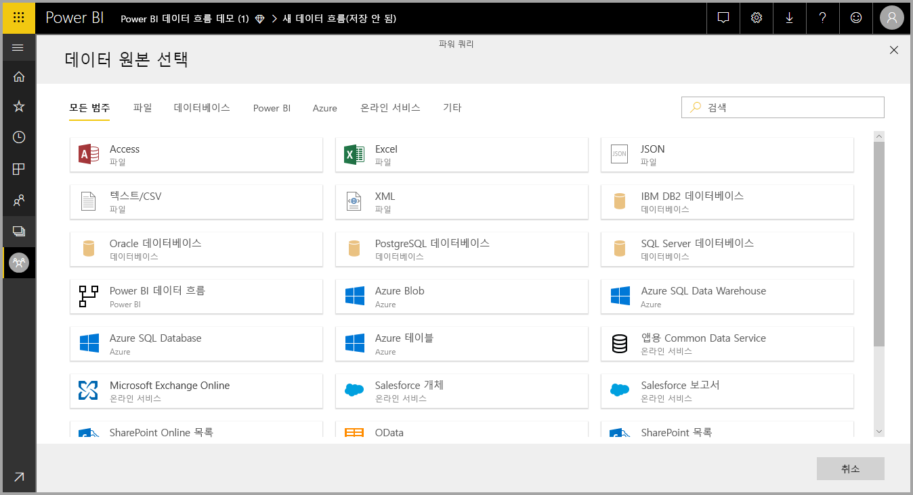
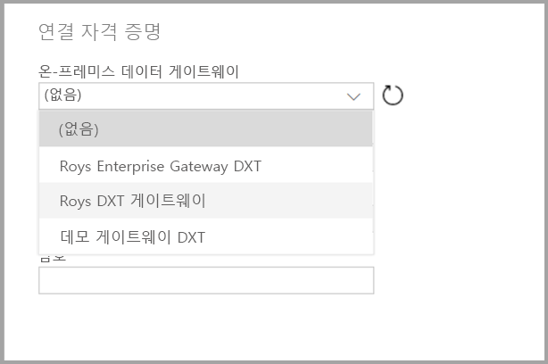

# 온-프레미스 데이터 원본으로 만든 데이터 흐름 사용(미리 보기)

**데이터 흐름**을 사용하면 다양한 원본에서 데이터 컬렉션을 만들고, 데이터를 정리하고 변환한 후 Power BI 스토리지로 로드할 수 있습니다. 데이터 흐름을 만드는 경우 온-프레미스 데이터 원본을 사용할 수도 있습니다. 이 문서에서는 데이터 흐름 만들기와 연결된 요구 사항과 해당 연결을 사용하도록 설정하려면 **엔터프라이즈 게이트웨이**를 어떻게 구성해야 하는지를 명확하게 설명합니다.

> [!NOTE]
> 데이터 흐름 기능은 미리 보기로 제공되며 일반 공급 전에 변경되고 업데이트될 수 있습니다.
 
## 데이터 흐름에 사용할 엔터프라이즈 게이트웨이 구성

데이터 흐름에서 온-프레미스 데이터 원본을 사용하려면 데이터 흐름을 만드는 사용자에게 **엔터프라이즈 게이트웨이**가 설치되고 구성되어 있어야 합니다. 또한 데이터 흐름을 만드는 사용자가 해당 게이트웨이를 데이터 흐름에 사용하려면 엔터프라이즈 게이트웨이 관리자여야 합니다.

> [!NOTE]
> 데이터 흐름은 엔터프라이즈 게이트웨이를 사용하는 경우에만 지원됩니다.

## 데이터 흐름에서 온-프레미스 데이터 원본 사용

데이터 흐름을 만드는 경우 다음 이미지에 표시된 대로 데이터 원본 목록에서 온-프레미스 데이터 원본을 선택합니다.

항목을 선택하면 온-프레미스 데이터에 액세스하는 데 사용할 엔터프라이즈 게이트웨이에 대한 연결 세부 정보를 입력하라는 메시지가 표시됩니다. 게이트웨이 자체를 선택하고 선택한 게이트웨이에 대한 자격 증명을 입력해야 합니다. 사용자가 관리자인 게이트웨이만 드롭다운 목록에 표시됩니다.

## 게이트웨이 모니터링

데이터 세트에 사용되는 게이트웨이를 모니터링하는 것과 동일한 방법으로 데이터 흐름에 사용되는 엔터프라이즈 게이트웨이를 모니터링할 수 있습니다.

다음 이미지에 표시된 대로, Power BI의 데이터 흐름 설정 화면에서 데이터 흐름의 게이트웨이 상태를 모니터링하고 데이터 흐름에 게이트웨이를 할당할 수 있습니다.

## 게이트웨이 변경

지정된 데이터 흐름에 사용되는 엔터프라이즈 게이트웨이는 다음 두 가지 방법으로 변경할 수 있습니다.

1. **제작 도구에서** - 데이터 흐름 제작 도구를 사용하여 모든 쿼리에 할당된 게이트웨이를 변경할 수 있습니다.

    > [!NOTE]
    > 데이터 흐름이 새 게이트웨이를 사용하여 필요한 데이터 원본을 찾거나 만들려고 시도합니다. 시도할 수 없는 경우 선택한 게이트웨이에서 필요한 모든 데이터 흐름을 사용할 수 있을 때까지 게이트웨이를 변경할 수 없습니다.

2. **설정 화면에서** - Power BI 서비스의 데이터 흐름 설정 화면을 사용하여 할당된 게이트웨이를 변경할 수 있습니다.

엔터프라이즈 게이트웨이에 대해 자세히 알아보려면 [온-프레미스 데이터 게이트웨이](service-gateway-onprem.md)를 참조하세요.

## 고려 사항 및 제한 사항

엔터프라이즈 게이트웨이 및 데이터 흐름 사용에는 몇 가지 알려진 제한 사항이 있습니다.

* 각 데이터 흐름은 게이트웨이를 하나만 사용할 수 있습니다. 따라서 모든 쿼리가 동일한 게이트웨이를 사용하도록 구성되어야 합니다.
* 게이트웨이를 변경하면 전체 데이터 흐름에 영향을 줍니다.
* 여러 게이트웨이가 필요한 경우 여러 데이터 흐름을(게이트웨이마다 하나씩) 빌드하고 계산 또는 엔터티 참조 기능을 사용하여 데이터를 통합하는 것이 좋습니다.
* 데이터 흐름은 엔터프라이즈 게이트웨이를 사용하는 경우에만 지원됩니다. 개인 게이트웨이는 드롭다운 목록 및 설정 화면에서 선택할 수 없습니다.

## 다음 단계

이 문서에는 데이터 흐름에 온-프레미스 데이터 원본을 사용하는 방법과 이러한 데이터에 액세스하는 데 게이트웨이를 사용하고 구성하는 방법이 제공되어 있습니다. 다음 문서도 도움이 될 수 있습니다.

* [데이터 흐름을 사용하여 셀프 서비스 데이터 준비](service-dataflows-overview.md)
* [Power BI에서 데이터 흐름 만들기 및 사용](service-dataflows-create-use.md)
* [Power BI Premium의 계산된 엔터티 사용(미리 보기)](service-dataflows-computed-entities-premium.md)
* [Power BI 데이터 흐름에 사용할 수 있는 개발자 리소스(미리 보기)](service-dataflows-developer-resources.md)

파워 쿼리 및 예약된 새로 고침에 대한 자세한 내용은 다음 문서를 참조하세요.
* [Power BI Desktop을 사용한 쿼리 개요](desktop-query-overview.md)
* [예약된 새로 고침 구성](refresh-scheduled-refresh.md)

공통 데이터 모델에 대한 자세한 내용은 해당 개요 문서를 참조할 수 있습니다.
* [공통 데이터 모델 - 개요 ](https://docs.microsoft.com/powerapps/common-data-model/overview)

