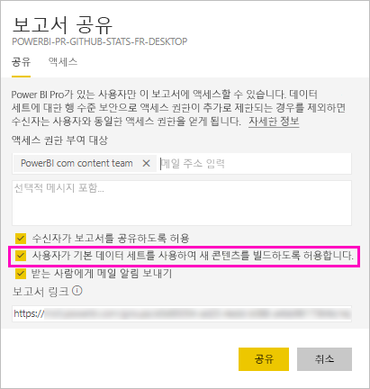

# 데이터 세트 공유(미리 보기)

Power BI Desktop의 *데이터 모델* 작성자는 Power BI 서비스에서 *데이터 세트*로 공유할 수 있습니다. 그런 다음, 보고서 작성자는 공유한 데이터 세트를 쉽게 검색하고 다시 사용할 수 있습니다. 빌드 권한을 사용하여 데이터를 공유하는 방법과 데이터에 액세스할 수 있는 사용자를 제어하는 방법에 대해 알아봅니다.

## 데이터 세트 공유 단계

1. 먼저 Power BI Desktop에서 데이터 모델을 사용하여 .pbix 파일을 만듭니다. 이 데이터 세트를 다른 사용자에게 제공하여 보고서를 빌드할 계획이라면 .pbix 파일에서 보고서를 디자인하지 않을 수도 있습니다.

    .pbix 파일을 Office 365 그룹에 저장하는 것이 가장 좋습니다.

1. .pbix 파일을 Power BI 서비스의 [새 환경 작업 영역](service-create-the-new-workspaces.md)에 게시합니다.
    
    이미 이 작업 영역의 다른 멤버는 이 데이터 세트를 기반으로 다른 작업 영역에서 보고서를 만들 수 있습니다.

1. 이 작업 영역에서 [앱을 게시](service-create-distribute-apps.md)할 수도 있습니다. 이렇게 하면 **권한** 페이지에서 권한이 있는 사용자와 수행할 수 있는 사용자를 지정할 수 있습니다.

    > [!NOTE]
    > **전체 조직**을 선택하면 조직 내 어느 누구도 빌드 권한을 갖지 못합니다. 이 문제는 이미 알려져 있습니다. 대신 **특정 개인 또는 그룹**에 이메일 주소를 지정합니다.  전체 조직에 빌드 권한을 부여하려면 전체 조직에 대한 이메일 별칭을 지정합니다.

    

1. 이미 게시된 경우 **앱 게시**를 선택하거나 **앱 업데이트**를 선택합니다.

## 공유 데이터 세트에 대한 사용 권한 빌드

빌드 권한 유형은 데이터 세트에만 관련이 있습니다. 이를 통해 사용자는 보고서, 대시보드, Q&A의 고정된 타일 및 Insights Discovery와 같은 데이터 세트에 새로운 콘텐츠를 빌드할 수 있습니다. Excel에서 분석을 통한 Excel 시트, XMLA 및 기본 데이터 내보내기와 같이 Power BI 외부의 데이터 세트를 기반으로 새 콘텐츠를 빌드할 수도 있습니다.

사용자는 다음과 같은 다양한 방법으로 빌드 권한을 가져옵니다.

- 참가자 역할 이상이 지정된 작업 영역의 구성원인 경우, 데이터 세트 빌드 권한과 보고서 복사 권한이 자동으로 부여됩니다.
 
- 데이터 세트가 있는 작업 영역의 멤버는 권한 센터의 특정 사용자 또는 보안 그룹에 권한을 할당할 수 있습니다. 데이터 세트 옆에 있는 줄임표(...) > **사용 권한 관리**를 선택합니다.

    

    그러면 권한을 설정하고 변경할 수 있는 해당 데이터 세트에 대한 권한 센터가 열립니다.

    

- 데이터 세트가 상주하는 작업 영역의 관리자 또는 멤버는 앱 게시 중에 앱에 대한 사용 권한이 있는 사용자에게도 기본 데이터 세트에 대한 빌드 권한을 부여할 수 있습니다. 자세한 내용은 이 문서에서 [데이터 세트 공유 단계](#steps-to-sharing-your-dataset)를 참조하세요.

- 데이터 세트에 대한 공유 및 빌드 권한이 있다고 가정해 봅니다. 해당 데이터 세트 위에 빌드된 보고서 또는 대시보드를 공유할 때 수신자가 기본 데이터 세트에 대한 빌드 권한도 갖도록 지정할 수 있습니다.

    

개인의 데이터 세트 빌드 권한을 제거할 수 있습니다. 이렇게 하면 공유 데이터 세트를 기반으로 빌드된 보고서를 계속 볼 수 있지만 더 이상 편집할 수는 없습니다.

## 보다 세부적인 사용 권한

Power BI는 기존 권한인 읽기 및 재공유를 보완하기 위해 2019년 6월에 빌드 권한을 도입했습니다. 그 당시에 앱 사용 권한, 공유 또는 작업 영역 액세스를 통해 이미 데이터 세트에 대한 읽기 권한이 있었던 모든 사용자도 동일한 데이터 세트에 대한 빌드 권한을 갖게 되었습니다. 읽기 권한은 이미 Excel 또는 내보내기의 분석을 사용하여 데이터 세트 위에 새 콘텐츠를 빌드할 수 있는 권한을 부여했기 때문에 자동으로 빌드 권한이 부여됩니다.

보다 세분화된 빌드 권한을 통해 기존 보고서나 대시보드의 콘텐츠만 볼 수 있는 사용자와 기본 데이터 세트에 연결된 콘텐츠를 만들 수 있는 사용자를 선택할 수 있습니다.

데이터 세트가 데이터 세트 작업 영역 외부의 보고서에서 사용되고 있는 경우 해당 데이터 세트를 삭제할 수 없습니다. 대신 오류 메시지가 표시됩니다.

빌드 권한을 제거할 수 있습니다. 이렇게 하면 권한을 해지한 사용자는 여전히 보고서를 볼 수 있지만 더 이상 보고서를 편집하거나 기본 데이터를 내보낼 수는 없습니다. 읽기 권한만 있는 사용자도 여전히 요약된 데이터를 내보낼 수 있습니다. 

## 데이터 세트 사용 현황 추적

작업 영역에 공유 데이터 세트가 있는 경우 다른 작업 영역의 보고서가 이를 기반으로 하는지를 알아야 할 수 있습니다.

1. 데이터 세트 목록 보기에서 **관련 항목 보기**를 선택합니다.

    

1. **관련 콘텐츠** 대화 상자에 모든 관련 항목이 표시됩니다. 이 목록에는 이 작업 영역 및 **기타 작업 영역**에서 관련 항목이 표시됩니다.
 
    

## 다음 단계

- [작업 영역에서 데이터 세트 사용(미리 보기)](service-datasets-across-workspaces.md)
- 궁금한 점이 더 있나요? [Power BI 커뮤니티에 질문합니다.](http://community.powerbi.com/)
