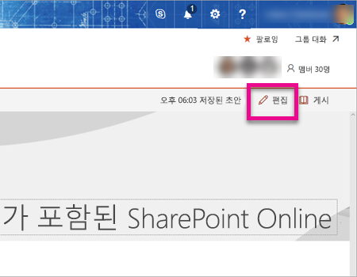
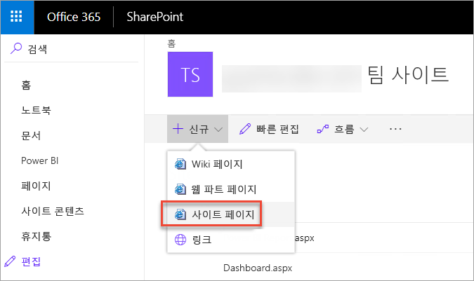
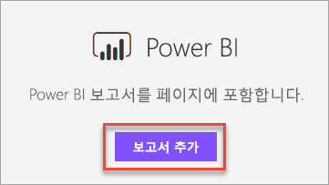
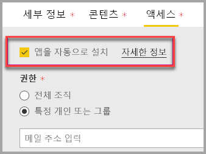

# SharePoint Online에 보고서 웹 파트 포함

SharePoint Online용 Power BI의 새로운 보고서 웹 파트를 사용하면 SharePoint Online 페이지에서 대화형 Power BI 보고서를 쉽게 포함시킬 수 있습니다.

새로운 **SharePoint Online에 포함** 옵션을 사용하는 경우 포함된 보고서는 매우 안전해져 안전한 내부 포털을 쉽게 만들 수 있습니다.

## 요구 사항

**SharePoint Online에 포함** 보고서가 작동하도록 하면 몇 가지 요구 사항이 있습니다.

* Power BI Pro 라이선스 또는 Power BI 라이선스를 포함한 [Power BI Premium 용량(EM 또는 P SKU)](service-premium.md#premium-capacity-nodes)이 필요합니다.
* SharePoint Online용 Power BI 웹 파트는 [최신 페이지](https://support.office.com/article/Allow-or-prevent-creation-of-modern-site-pages-by-end-users-c41d9cc8-c5c0-46b4-8b87-ea66abc6e63b)가 필요합니다.

## 보고서 포함

SharePoint Online에 보고서를 포함하기 위해 먼저 보고서의 URL을 가져온 다음, SharePoint Online 내의 새로운 Power BI 웹 파트에서 해당 URL을 사용합니다.

### URL를 보고서로 가져오기

1. Power BI 서비스에서 보고서를 봅니다.

2. **파일** 메뉴 항목을 선택합니다.

3. **SharePoint Online에 포함**를 선택합니다.

    

4. 대화 상자에서 URL을 복사합니다.

    

### SharePoint Online 페이지에 Power BI 보고서 추가

1. SharePoint Online에서 원하는 페이지를 열고 **편집**을 선택합니다.

    

    또는 SharePoint Online에서 **+ 새로 만들기**를 선택하여 새 최신 사이트 페이지를 만듭니다.

    

2. **+** 를 선택하고 **Power BI** 웹 파트를 선택합니다.

    

3. **앱 보고서**를 선택합니다.

    

4. 속성 창에 보고서 URL을 붙여 넣습니다. 이 보고서 URL은 위 단계에서 복사한 URL입니다. 보고서를 자동으로 로드합니다.

    

5. **게시**를 선택하여 변경 사항을 SharePoint Online 사용자가 볼 수 있도록 합니다.

    

## 보고서에 액세스 부여

SharePoint Online에 보고서를 포함시키는 것이 사용자에게 보고서를 볼 수 있는 권한을 자동으로 주는 것은 아닙니다. 보고서를 볼 수 있는 권한은 Power BI 서비스 내에서 설정됩니다.

> [!IMPORTANT]
> Power BI 서비스 내에서 보고서를 볼 수 있는 사람이 누구인지 확인하고 목록에 없는 사람에게 액세스 권한을 부여합니다.

Power BI 서비스 내에서 보고서에 액세스 권한을 부여하는 방법에는 두 가지가 있습니다. Office 365 그룹을 사용하여 SharePoint Online 팀 사이트를 빌드하는 경우 사용자를 **Power BI 서비스 내 앱 작업 영역** 및 **SharePoint 페이지**의 구성원으로 나열합니다. 자세한 내용은 [앱 작업 영역을 관리](service-manage-app-workspace-in-power-bi-and-office-365.md)하는 방법을 참조하세요.

또는 앱 내에 보고서를 포함하여 사용자와 보고서를 직접 공유할 수 있습니다. 앱 내에 보고서를 포함하려면 몇 가지 단계를 수행해야 합니다.  

1. 앱 작성자는 Pro 사용자입니다.

2. 작성자는 앱 작업 영역에서 보고서를 만듭니다. **Power BI 무료 사용자**와 공유하려면 앱 작업 영역을 **Premium 작업 영역**으로 설정해야 합니다.

3. 작성자가 앱을 게시한 후 설치합니다. 작성자는 SharePoint Online에 포함하는 데 사용되는 보고서 URL에 액세스할 수 있는 앱을 설치해야 합니다.

4. 이제 모든 최종 사용자도 앱을 설치해야 합니다. 그러나 [Power BI 관리 포털](service-admin-portal.md)에서 사용할 수 있는 **앱을 자동으로 설치** 기능을 사용하여 최종 사용자를 위해 앱이 미리 설치되도록 설정할 수 있습니다.

   

5. 작성자가 앱을 열고 보고서로 이동합니다.

6. 작성자는 앱이 설치한 보고서의 포함 보고서 URL을 복사합니다. 앱 작업 영역의 원래 보고서 URL을 사용하지 마세요.

7. SharePoint Online에서 새 팀 사이트를 만듭니다.

8. 6단계에서 복사한 보고서 URL을 Power BI 웹 파트에 추가합니다.

9. SharePoint Online 페이지 및 직접 만든 Power BI 앱에서 데이터를 사용할 모든 최종 사용자 및/또는 그룹을 추가합니다.

    > [!NOTE]
    > **사용자 또는 그룹은 SharePoint 페이지에서 보고서를 보려면 SharePoint Online 페이지 및 Power BI 앱의 보고서에 대한 액세스 권한이 둘 다 필요합니다.**

10. 이제 최종 사용자가 SharePoint Online의 팀 사이트로 이동하여 해당 페이지에서 보고서를 볼 수 있습니다.

## Multi-Factor Authentication

Power BI 환경에서 다단계 인증을 사용하여 로그인해야 하는 경우 ID를 확인하기 위해 보안 장치에 로그인하라는 메시지가 나타날 수 있습니다. 이는 다단계 인증을 사용하여 SharePoint Online에 로그인하지 않았지만 Power BI 환경에서 보안 장치에 의해 유효성이 검사된 계정이 필요한 경우 발생합니다.

> [!NOTE]
> 다단계 인증은 아직 Azure Active Directory 2.0으로 지원되지 않습니다. 사용자는 *오류*라는 메시지를 수신합니다. 사용자가 해당 보안 장치를 사용하여 SharePoint Online에 다시 로그인하면 보고서를 볼 수 있습니다.

## 웹 파트 설정

다음은 SharePoint Online용 Power BI 웹 파트에 필요한 조정할 수 있는 설정에 대한 설명입니다.

| 속성 | 설명 |
| --- | --- |
| 페이지 이름 |웹 파트에 의해 표시되는 기본 페이지를 설정합니다. 드롭다운에서 값을 선택합니다. 페이지가 표시되지 않는 경우는 보고서가 한 페이지이거나 붙여 넣은 URL에 페이지 이름이 포함된 경우입니다. URL에서 보고서 섹션을 제거하여 특정 페이지를 선택합니다. |
| 디스플레이 |보고서를 SharePoint Online 페이지 내에 맞추는 옵션입니다. |
| 탐색 창 표시 |페이지 탐색 창을 표시하거나 숨깁니다. |
| 필터 창 표시 |필터 창을 표시하거나 숨깁니다. |

## 로드되지 않는 보고서

Power BI 웹 파트 내에서 보고서가 로드되지 않고 다음과 같은 메시지가 표시될 수 있습니다.

*이 콘텐츠는 사용할 수 없습니다.*

이 메시지가 표시되는 데는 일반적으로 두 가지 이유가 있습니다.

1. 보고서에 대한 액세스 권한이 없습니다.
2. 보고서가 삭제되었습니다.

이 문제를 해결하려면 SharePoint Online 페이지의 소유자에게 문의하세요.

## 라이선싱

SharePoint에서 보고서를 보는 사용자에게 **Power BI Pro 라이선스**가 필요하거나, **[Power BI Premium 용량(EM 또는 P SKU)](service-admin-premium-purchase.md)** 에 있는 작업 영역에 있어야 합니다.

## 알려진 문제 및 제한 사항

* 오류: "An error occurred, please try logging out and back in and then revisiting this page.(오류가 발생했습니다. 로그아웃했다가 다시 로그인한 후 이 페이지를 다시 방문하세요.) Correlation ID: undefined, http response status: 400, server error code 10001, message: Missing refresh token”(오류가 발생했습니다. 로그아웃했다가 다시 로그인한 후 이 페이지를 다시 방문하세요. 상관 관계 ID: 정의되지 않음, HTTP 응답 상태: 400, 서버 오류 코드 10001, 메시지: 누락된 새로 고침 토큰)
  
  이 오류가 발생하면 아래 문제 해결 단계 중 하나를 시도하세요.
  
  1. SharePoint에서 로그아웃했다가 다시 로그인합니다. 다시 로그인하기 전에 모든 브라우저 창을 닫아야 합니다.

  2. 사용자 계정에 MFA(다단계 인증)이 필요한 경우 다단계 인증 장치(휴대폰 앱, 스마트 카드 등)를 사용하여 SharePoint에 로그인했는지 확인합니다.
  
  3. Azure B2B 게스트 사용자 계정은 지원되지 않습니다. 파트가 로드 중임을 나타내는 Power BI 로고가 사용자에게 표시되지만 보고서는 표시되지 않습니다.

* Power BI는 SharePoint Online에서 지원하는 것과 동일한 지역화된 언어를 지원하지 않습니다. 결과적으로 포함된 보고서 내에 적절한 지역화가 표시되지 않을 수 있습니다.

* Internet Explorer 10을 사용하는 경우 문제가 발생할 수 있습니다. [Power BI](consumer/end-user-browsers.md) 및 [Office 365](https://products.office.com/office-system-requirements#Browsers-section)에 대한 브라우저 지원을 보면 됩니다.

* [소버린 클라우드](https://powerbi.microsoft.com/en-us/clouds/)에서는 Power BI 웹 파트를 사용할 수 없습니다.

* 클래식 SharePoint Server는 이 웹 파트에서 지원되지 않습니다.

* [URL 필터](service-url-filters.md)는 SPO 웹 파트에서 지원되지 않습니다.

## 다음 단계

[최종 사용자의 최신 사이트 페이지 작성 허용 또는 금지](https://support.office.com/article/Allow-or-prevent-creation-of-modern-site-pages-by-end-users-c41d9cc8-c5c0-46b4-8b87-ea66abc6e63b)  
[Power BI에서 앱 만들기 및 배포](service-create-distribute-apps.md)  
[동료 및 다른 사용자와 대시보드 공유](service-share-dashboards.md)  
[Power BI 프리미엄이란?](service-premium.md)  

궁금한 점이 더 있나요? [Power BI 커뮤니티에 질문합니다.](http://community.powerbi.com/)