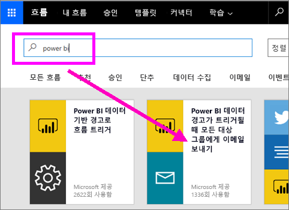
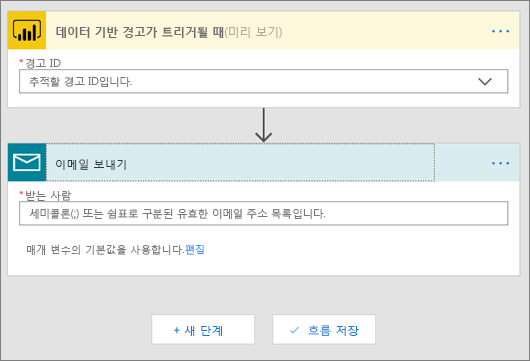
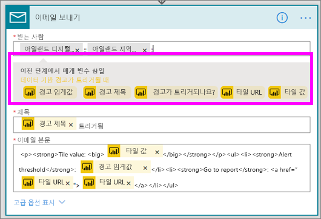
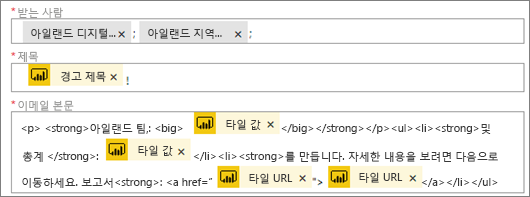
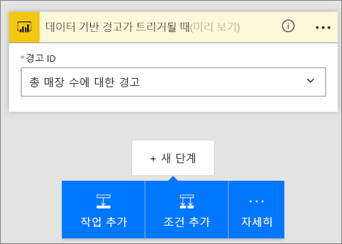

# Power Automate 및 Power BI

[Power Automate](https://flow.microsoft.com/documentation/getting-started)는 비즈니스 사용자가 사용하는 애플리케이션 및 SaaS 서비스 수가 증가함에 따라 워크플로 자동화를 위해 제공되는 SaaS입니다. Flow를 사용하면 즐겨 찾는 앱과 서비스(Power BI 포함)를 통합하여 작업을 자동화함으로써 알림 가져오기, 파일 동기화, 데이터 수집 등을 수행할 수 있습니다. 워크플로 자동화를 사용하면 반복 작업이 쉬워집니다.

[이제 Flow를 사용하여 시작합니다.](https://flow.microsoft.com/documentation/getting-started)

Sirui에서 Power BI 경고가 트리거될 때 동료에게 자세한 전자 메일을 전송 하는 흐름을 만드는 것을 감시합니다. 그런 다음 비디오 아래에 있는 단계별 지침을 따라서 직접 시도해 볼 수 있습니다.

<iframe width="560" height="315" src="https://www.youtube.com/embed/YhmNstC39Mw" frameborder="0" allowfullscreen></iframe>

## Power BI 데이터 경고로 트리거하는 흐름 만들기

### 필수 조건
이 자습서에서는 흐름을 만드는 두 가지 방법, 즉 템플릿을 이용하는 방법과 처음부터 새로 만드는 방법을 보여줍니다. 과정을 따르려면 [Power BI에서 데이터 경고를 만들고](service-set-data-alerts.md), Slack 체험 계정을 만든 다음, [Power Automate에 등록합니다](https://flow.microsoft.com/#home-signup)(무료).

## Power BI를 사용하여 템플릿을 기반으로 하는 흐름 만들기
이 작업에서는 Power BI 데이터 경고(알림)에 의해 트리거되는 간단한 흐름을 만드는 템플릿을 사용합니다.

1. Power Automate(flow.microsoft.com)에 로그인합니다.
2. **내 흐름**을 선택합니다.
   
   
3. **템플릿에서 만들기**를 선택합니다.
   
    
4. [검색] 상자를 사용하여 Power BI 템플릿을 찾고 **Power BI 데이터 경고가 트리거될 때 모든 대상 그룹에 전자 메일 보내기 > 계속**을 선택합니다.
   
    

### 흐름 작성
이 템플릿에는 트리거 1개(아일랜드의 새 올림픽 메달에 대한 Power BI 데이터 경고)와 작업 1개(메일 보내기)가 있습니다. 필드를 선택하면 Flow는 포함시킬 수 있는 동적 콘텐츠를 표시합니다.  이 예에서 타일 값 및 타일 URL이 메시지 본문에 포함되어 있습니다.

1. 트리거 드롭다운 목록에서 Power BI 데이터 경고를 선택합니다. **아일랜드의 새 메달**을 선택합니다. 경고를 만드는 방법을 알아보려면 [Power BI에서 데이터 경고](service-set-data-alerts.md)를 참조하세요.
   
   
2. 유효한 메일 주소를 하나 이상 입력하고 **편집**(아래에 표시) 또는 **Add dynamic content**(동적 콘텐츠 추가)를 선택합니다. 
   
   

3. Flow에서 유지하거나 수정할 수 있는 제목 및 메시지를 작성합니다. Power BI에서 경고를 만들 때 설정한 모든 값을 사용할 수 있습니다. 커서를 놓고 강조 표시된 회색 영역에서 선택하면 됩니다. 

   

1.  예를 들어 Power BI에서 **다른 메달을 땀**이라는 경고 제목을 만든 경우 **경고 제목**을 선택하여 메일 제목 필드에 텍스트를 추가할 수 있습니다.

    

    그리고 기본 메일 본문을 사용하거나 직접 만들 수 있습니다. 위 예에는 메시지에 대한 몇 가지 수정 사항이 포함되어 있습니다.

1. 완료되면 **흐름 만들기** 또는 **흐름 저장**을 선택합니다.  흐름이 생성되고 평가가 이루어집니다.  Flow에서 오류를 발견하면 알려줍니다.
2. 오류가 발견되면 **흐름 편집**을 선택하여 오류를 해결하고 그렇지 않으면 **완료**를 선택하여 새 흐름을 실행합니다.
   
   
5. 데이터 경고가 트리거되면 명시한 주소로 메일이 전송됩니다.  
   
   

## Power BI를 사용하는 흐름(빈 값)을 새로 만들기
이 작업에서는 Power BI 데이터 경고(알림)에 의해 트리거되는 간단한 흐름을 처음부터 새로 만듭니다.

1. Power Automate에 로그인합니다.
2. **내 흐름** > **빈 페이지에서 만들기**를 선택합니다.
   
   
3. [검색] 상자를 사용하여 Power BI 트리거를 찾고 **Power BI - 데이터 기반 경고가 트리거된 경우**를 선택합니다.

### 흐름 작성
1. 드롭다운 목록에서 경고의 이름을 선택합니다.  경고를 만드는 방법을 알아보려면 [Power BI에서 데이터 경고](service-set-data-alerts.md)를 참조하세요.
   
    
2. **새 단계** > **작업 추가**를 선택합니다.
   
   
3. **Outlook**을 검색하고 **이벤트 만들기**를 선택합니다.
   
   
4. 이벤트 필드를 입력합니다. 필드를 선택하면 Flow는 포함시킬 수 있는 동적 콘텐츠를 표시합니다.
   
   
5. 완료되면 **흐름 만들기**를 선택합니다.  Flow는 흐름을 저장하고 평가합니다. 오류가 없는 경우 이 흐름을 실행하려면 **완료**를 선택합니다.  새 흐름이 **내 흐름** 페이지에 추가됩니다.
   
   
6. 흐름이 Power BI 데이터 경고에 의해 트리거되면 이와 유사한 Outlook 이벤트 알림을 받게 됩니다.
   
    

## 다음 단계
* [Power Automate 시작](https://flow.microsoft.com/documentation/getting-started/)
* [Power BI 서비스에서 데이터 경고 설정](service-set-data-alerts.md)
* [iPhone에서 데이터 경고 설정](consumer/mobile/mobile-set-data-alerts-in-the-mobile-apps.md)
* [Windows 10용 Power BI 모바일 앱의 데이터 경고 설정](consumer/mobile/mobile-set-data-alerts-in-the-mobile-apps.md)
* 궁금한 점이 더 있나요? [Power BI 커뮤니티를 이용하세요.](https://community.powerbi.com/)

