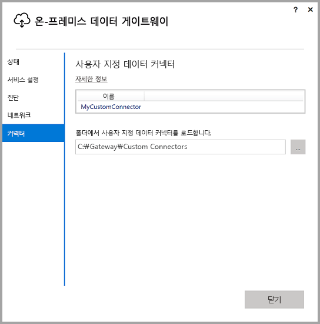
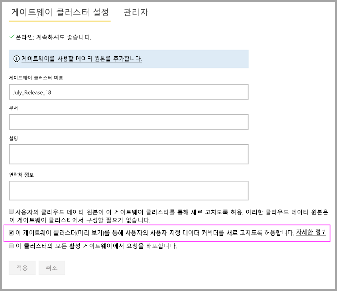
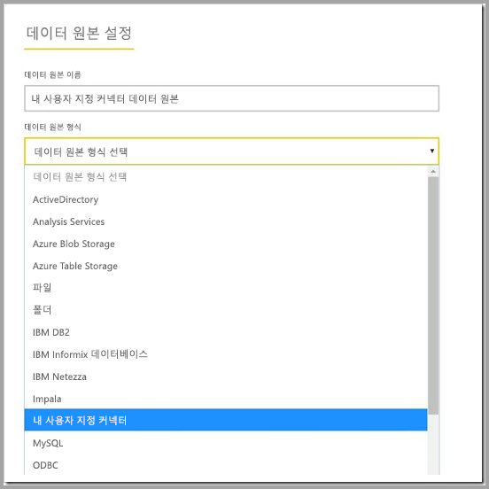

# 온-프레미스 데이터 게이트웨이에서 사용자 지정 데이터 커넥터 사용

Power BI용 데이터 커넥터를 사용하면 애플리케이션, 서비스 또는 데이터 원본의 데이터에 연결하고 액세스할 수 있습니다. 사용자 지정 데이터 커넥터를 개발하고 Power BI Desktop에서 사용할 수 있습니다.

Power BI용 사용자 지정 데이터 커넥터를 개발하는 방법에 대한 자세한 내용은 [여기](http://aka.ms/dataconnectors)에서 설명서를 확인하세요.

사용자 지정 데이터 커넥터를 사용하는 Power BI Desktop에서 보고서를 빌드할 때 온-프레미스 데이터 게이트웨이를 사용하여 Power BI 서비스의 해당 보고서를 새로 고칠 수 있습니다.

## 이 기능을 설정하고 사용하는 방법에 대한 가이드는 다음과 같습니다.

온-프레미스 데이터 게이트웨이의 2018년 7월 이상 버전을 설치하는 경우 사용자 지정 커넥터를 로드할 폴더를 선택하는 옵션을 사용하여 구성자의 "커넥터" 탭을 확인할 수 있습니다. 게이트웨이 서비스를 실행하는 사용자가 액세스할 수 있는 폴더를 선택했는지 확인합니다(기본적으로 "NT SERVICE\PBIEgwService"). 게이트웨이는 자동으로 해당 폴더에 있는 사용자 지정 커넥터 파일을 로드하므로 해당 파일이 데이터 커넥터의 목록에 표시됩니다.

온-프레미스 데이터 게이트웨이의 개인 버전을 사용하는 경우 이 시점에서 Power BI 서비스에 Power BI 보고서를 업로드하고 게이트웨이를 사용하여 새로 고칠 수 있습니다.

엔터프라이즈 버전의 게이트웨이인 경우 사용자 지정 커넥터에 대한 데이터 원본을 만들어야 합니다. Power BI 서비스의 게이트웨이 설정 페이지에서 이 클러스터에서 사용자 지정 커넥터를 사용하도록 허용할 게이트웨이 클러스터를 선택하면 새로운 옵션이 표시됩니다. 클러스터의 모든 게이트웨이가 이 옵션을 사용할 수 있도록 2018년 7월 이후 업데이트 릴리스를 설치했는지 확인합니다. 이제 이 클러스터에서 사용자 지정 커넥터를 사용하는 해당 옵션을 선택합니다.

이 옵션을 사용하는 경우 이제 사용자 지정 커넥터를 이 게이트웨이 클러스터에서 만들 수 있는 사용 가능한 데이터 원본으로 표시합니다. 새 사용자 지정 커넥터를 사용하여 데이터 원본을 만들면 이제 Power BI 서비스에서 사용자 지정 커넥터를 사용하여 Power BI 보고서를 새로 고칠 수 있습니다.

## 고려 사항 및 제한 사항

* 만든 폴더가 백그라운드 게이트웨이 서비스에 액세스할 수 있는지 확인합니다. 일반적으로 사용자의 Windows 폴더 또는 시스템 폴더 아래에 있는 폴더에는 액세스할 수 없습니다. 폴더에 액세스할 수 없는 경우 게이트웨이 구성기는 메시지를 표시합니다(개인 버전의 게이트웨이에 적용되지 않음).
* 사용자 지정 커넥터를 온-프레미스 데이터 게이트웨이에서 작업하려면 사용자 지정 커넥터의 코드에서 "TestConnection" 섹션을 구현해야 합니다. Power BI Desktop에서 사용자 지정 커넥터를 사용하는 경우에는 필요하지 않습니다. 이러한 이유로 해당 커넥터는 게이트웨이가 아닌 데스크톱으로 작업할 수 있습니다. TestConnection 섹션을 구현하는 방법은 [이 설명서](https://github.com/Microsoft/DataConnectors/blob/master/docs/m-extensions.md#implementing-testconnection-for-gateway-support)를 참조하세요.

## 다음 단계

* [데이터 원본 관리 - Analysis Services](service-gateway-enterprise-manage-ssas.md)  
* [데이터 원본 관리 - SAP HANA](service-gateway-enterprise-manage-sap.md)  
* [데이터 원본 관리 - SQL Server](service-gateway-enterprise-manage-sql.md)  
* [데이터 원본 관리 - Oracle](service-gateway-onprem-manage-oracle.md)  
* [데이터 원본 관리 - 가져오기/예약된 새로 고침](service-gateway-enterprise-manage-scheduled-refresh.md)  
* [온-프레미스 데이터 게이트웨이 심층 분석](service-gateway-onprem-indepth.md)  
* [온-프레미스 데이터 게이트웨이(개인 모드)](service-gateway-personal-mode.md)
* [온-프레미스 데이터 게이트웨이에 대한 프록시 설정 구성](service-gateway-proxy.md)  
* [Power BI에서 온-프레미스 데이터 원본으로 SSO(Single Sign-On)에 대해 Kerberos 사용](service-gateway-sso-kerberos.md)  

궁금한 점이 더 있나요? [Power BI 커뮤니티를 이용하세요.](http://community.powerbi.com/)
