# 데이터 원본 관리

[!INCLUDE [gateway-rewrite](includes/gateway-rewrite.md)]

Power BI는 다양한 온-프레미스 데이터 원본을 지원하고 각 데이터 원본에는 고유한 요구 사항이 있습니다. 단일 데이터 원본이나 여러 데이터 원본에 게이트웨이를 사용할 수 있습니다. 이 예제에서는 SQL Server를 데이터 원본으로 추가하는 방법을 보여주지만 단계는 다른 데이터 원본의 경우와 비슷합니다.

>[!NOTE]
>API를 사용하여 대부분의 데이터 원본 관리 작업을 수행할 수도 있습니다. 자세한 내용은 [Rest API(게이트웨이)](/rest/api/power-bi/gateways)를 참조하세요.

## 데이터 소스 추가

>[!NOTE]
>메일이 없는 그룹은 추가할 수 없습니다.

1. Power BI 서비스의 오른쪽 위 모서리에서 기어 아이콘  > **게이트웨이 관리**를 선택합니다.

    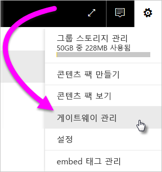

2. 게이트웨이 > **데이터 원본 추가**를 선택하거나 게이트웨이 > **데이터 원본 추가**로 이동합니다.

    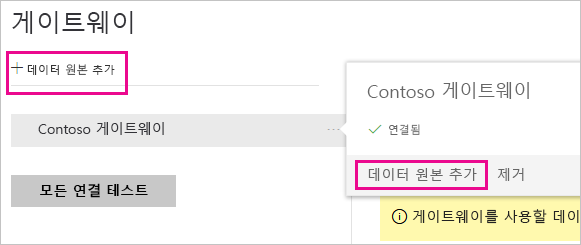

3. **데이터 원본 유형**을 선택합니다.

    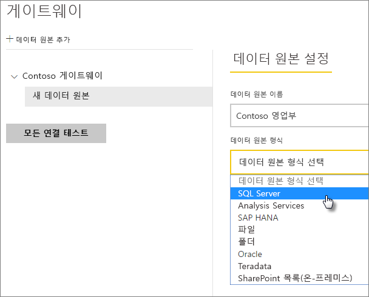

4. 데이터 원본에 대한 정보를 입력합니다. 이 예제에서는 **서버**, **데이터베이스** 및 기타 정보입니다.  

    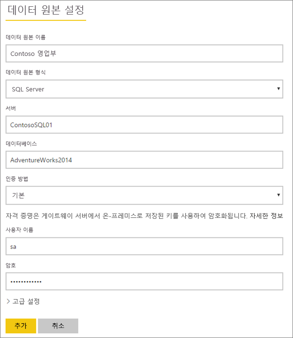

5. SQL Server의 경우 **Windows** 또는 **기본**(SQL 인증)의 **인증 방법**을 선택합니다. **기본**을 선택하는 경우 데이터 원본에 대한 자격 증명을 입력합니다.

6. **고급 설정**에서 선택적으로 데이터 원본에 대한 [개인 정보 수준](https://support.office.com/article/Privacy-levels-Power-Query-CC3EDE4D-359E-4B28-BC72-9BEE7900B540)을 구성합니다([DirectQuery](desktop-directquery-about.md)에 적용되지 않음).

    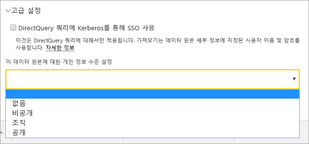

7. **추가**를 선택합니다. 프로세스가 성공하면 ‘연결 성공’이 표시됩니다. 

    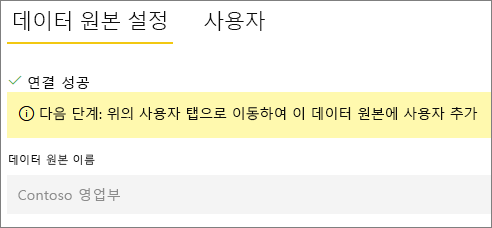

이제 이 데이터 원본을 사용하여 Power BI 대시보드 및 보고서에 SQL Server의 데이터를 포함할 수 있습니다.

## 데이터 원본 제거

더 이상 사용하지 않는 경우 데이터 원본을 제거할 수 있습니다. 데이터 원본을 제거하면 해당 데이터 원본을 사용하는 모든 대시보드와 보고서가 제거된다는 것에 유의하세요.

데이터 원본을 제거하려면 데이터 원본으로 이동한 다음, **제거**를 선택합니다.

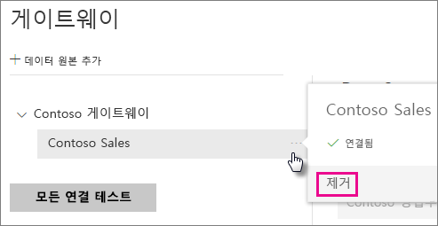

## 예약된 새로 고침 또는 DirectQuery에 데이터 원본 사용

데이터 원본을 만든 후 DirectQuery 연결 또는 예약된 새로 고침을 통해 사용할 수 있습니다.

> [!NOTE]
>서버 및 데이터베이스 이름은 온-프레미스 데이터 게이트웨이 내에서 Power BI Desktop 및 데이터 원본 간에 일치해야 합니다.

게이트웨이에서 데이터 세트 및 데이터 원본 간의 링크는 서버 이름 및 데이터베이스 이름을 기반으로 합니다. 이 이름은 일치해야 합니다. 예를 들어 Power BI Desktop에서 서버 이름에 대한 IP 주소를 제공하는 경우 게이트웨이 구성에서 데이터 원본에 대한 IP 주소를 사용해야 합니다. Power BI Desktop에서 *SERVER\INSTANCE*를 사용하는 경우 게이트웨이에 대해 구성된 데이터 원본에서 동일한 것을 사용해야 합니다.

게이트웨이에서 구성된 데이터 원본의 **사용자** 탭에 나열되고 서버 및 데이터베이스 이름이 일치하는 경우 예약된 새로 고침으로 사용하기 위한 옵션으로 게이트웨이가 표시됩니다.

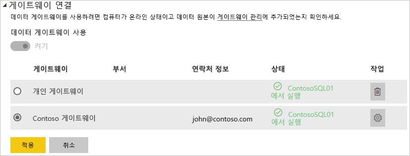

> [!WARNING]
> 데이터 세트에 여러 데이터 원본이 포함된 경우 각 데이터 원본을 게이트웨이에 추가해야 합니다. 게이트웨이에 하나 이상의 데이터 원본을 추가하지 않으면 예약된 새로 고침에 사용 가능한 게이트웨이가 표시되지 않습니다.

### 제한 사항

OAuth는 온-프레미스 데이터 게이트웨이를 통해 사용자 지정 커넥터에만 지원되는 인증 체계입니다. OAuth가 필요한 다른 데이터 원본을 추가할 수 없습니다. OAuth가 필요한 데이터 원본이 데이터 세트에 있고 이 데이터 원본이 사용자 지정 커넥터가 아니면 예약된 새로 고침에 게이트웨이를 사용할 수 없습니다.

## 사용자 관리

게이트웨이에 데이터 원본을 추가한 후 사용자 및 이메일 사용 보안 그룹에 특정 데이터 원본(전체 게이트웨이가 아님)에 대한 액세스 권한을 부여합니다. 데이터 원본 사용자 목록은 데이터 원본의 데이터를 포함하는 보고서를 게시할 수 있는 사용자만 제어합니다. 보고서 소유자는 대시보드, 콘텐츠 팩 또는 앱을 만든 다음, 이를 다른 사용자와 공유할 수 있습니다.

사용자 및 보안 그룹에게 게이트웨이에 대한 관리 권한을 부여할 수도 있습니다.

### 데이터 원본에 사용자 추가

1. Power BI 서비스의 오른쪽 위 모서리에서 기어 아이콘  > **게이트웨이 관리**를 선택합니다.

2. 사용자를 추가할 데이터 원본을 선택합니다.

3. **사용자**를 선택하고 선택한 데이터 원본에 대한 액세스 권한을 부여하려는 조직 내 사용자를 입력합니다. 예를 들어 다음 화면에서는 Maggie와 Adam을 추가하고 있습니다.

    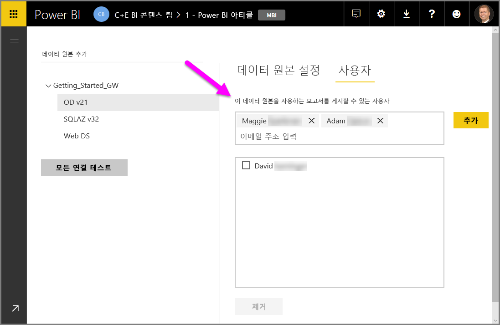

4. **추가**를 선택하면 추가된 구성원이 상자에 표시됩니다.

    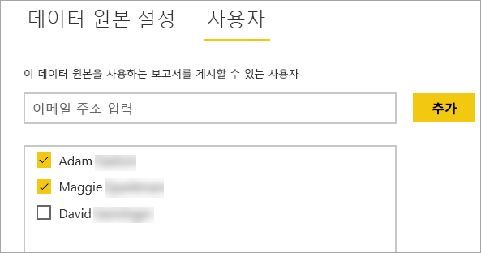

매우 간단합니다. 액세스를 부여하려는 각각의 데이터 원본에 사용자를 추가해야 합니다. 각 데이터 원본에는 별도의 사용자 목록이 있고 각 데이터 원본마다 개별적으로 사용자를 추가해야 합니다.

### 데이터 원본에서 사용자 제거

데이터 원본에 대한 **사용자** 탭에서 이 데이터 원본을 사용하는 사용자 및 보안 그룹을 제거할 수 있습니다.

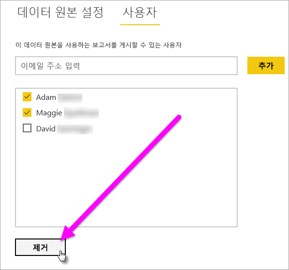

## 클라우드에 암호화된 자격 증명 저장

게이트웨이에 데이터 소스를 추가할 때 해당 데이터 소스에 대한 자격 증명을 제공해야 합니다. 데이터 소스에 대한 모든 쿼리는 이러한 자격 증명을 사용하여 실행됩니다. 자격 증명은 클라우드에 저장하기 전에 클라우드에서 암호를 해독할 수 없도록 대칭형 암호화를 사용하여 안전하게 암호화됩니다. 자격 증명은 게이트웨이를 실행 중인 머신으로 전송되어 데이터 원본이 액세스될 때 온-프레미스에서 암호 해독됩니다.

## 사용 가능한 데이터 원본 유형 목록

온-프레미스 데이터 게이트웨이는 Power BI에 대해 다음 데이터 원본을 지원합니다. 온-프레미스 데이터 원본 외에도 방화벽, VPN 또는 가상 네트워크 뒤의 원본에는 데이터 게이트웨이가 필요할 수 있습니다.

| **데이터 원본** | **라이브/DirectQuery** | **사용자 구성 수동 또는 예약 새로 고침** |
| --- | --- | --- |
| ActiveDirectory |아니요 |예 |
| Amazon Redshift |예 |예 |
| Analysis Services |예 |예 |
| AtScale 큐브 |예 |예 |
| Azure Blob Storage |아니요 |예 |
| Azure DevOps Server |아니요 |예 |
| Azure Table Storage |아니요 |예 |
| BI 커넥터 |예 |예 |
| Denodo |예 |예 |
| Dremio |예 |예 |
| EmigoDataSourceConnector |아니요 |예 |
| Essbase |예 |예 |
| Exasol |예 |예 |
| 파일 |아니요 |예 |
| 폴더 |아니요 |예 |
| Paxata |아니요 |예 |
| IBM DB2 |예 |예 |
| IBM Informix 데이터베이스 |아니요 |예 |
| IBM Netezza |예 |예 |
| Impala |예 |예 |
| Jethro ODBC |예 |예 |
| Kyligence Enterprise |예 |예 |
| MarkLogic ODBC |예 |예 |
| Microsoft Graph 보안 |아니요 |예 |
| MySQL |아니요 |예 |
| ODBC |아니요 |예 |
| OData |아니요 |예 |
| OleDb |아니요 |예 |
| Oracle |예 |예 |
| PostgreSQL |아니요 |예 |
| QubolePresto |예 |예 |
| Quick Base Connector |아니요 |예 |
| SAP Business Warehouse 메시지 서버 |예 |예 |
| SAP Business Warehouse 서버 |예 |예 |
| SAP HANA |예 |예 |
| SQL Server |예 |예 |
| SharePoint |아니요 |예 |
| Snowflake |예 |예 |
| Spark |예 |예 |
| SurveyMonkey |아니요 |예 |
| Sybase |아니요 |예 |
| TeamDesk.Database |아니요 |예 |
| Teradata |예 |예 |
| Vertica |예 |예 |
| 웹 |아니요 |예 |
| Workforce Dimensions |아니요 |예 |

## 다음 단계

* [데이터 원본 관리 - Analysis Services](service-gateway-enterprise-manage-ssas.md)
* [데이터 원본 관리 - SAP HANA](service-gateway-enterprise-manage-sap.md)
* [데이터 원본 관리 - SQL Server](service-gateway-enterprise-manage-sql.md)
* [데이터 원본 관리 - Oracle](service-gateway-onprem-manage-oracle.md)
* [데이터 원본 관리 - 가져오기/예약된 새로 고침](service-gateway-enterprise-manage-scheduled-refresh.md)
* [데이터 게이트웨이 배포 지침](service-gateway-deployment-guidance.md)

궁금한 점이 더 있나요? [Power BI 커뮤니티를 이용하세요.](http://community.powerbi.com/)
