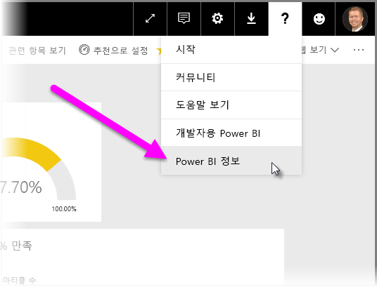

# Power BI에 대한 데이터 게이트웨이 배포 지침

[!INCLUDE [gateway-rewrite](includes/gateway-rewrite.md)]

이 문서는 네트워크 환경에서 Power BI의 데이터 게이트웨이를 배포하기 위한 고려 사항 및 지침을 제공합니다.

온-프레미스 데이터 게이트웨이를 다운로드, 설치, 구성 및 관리하는 방법에 대한 자세한 내용은 [온-프레미스 데이터 게이트웨이란?](/data-integration/gateway/service-gateway-onprem)을 참조하세요. 온-프레미스 데이터 게이트웨이 및 Power BI에 대해 자세한 내용은 [Microsoft Power 블로그](https://powerbi.microsoft.com/blog/) 및 [Microsoft Power BI 커뮤니티](https://community.powerbi.com/) 사이트를 참조하세요.

## 온-프레미스 데이터 게이트웨이에 대한 설치 고려 사항

Power BI 클라우드 서비스의 온-프레미스 데이터 게이트웨이를 설치하기 전에 몇 가지 유념해야 할 고려 사항이 있습니다. 다음 섹션에서 이 고려 사항을 설명합니다.

### 사용자 수

게이트웨이를 사용하는 보고서를 사용하는 사용자 수는 게이트웨이 설치 위치를 결정하는 중요한 메트릭입니다. 다음은 고려해야 할 몇 가지 질문입니다.

* 사용자는 서로 다른 시간에 이러한 보고서를 사용하고 있나요?
* 어떤 유형의 연결을 사용하고 있나요(DirectQuery 또는 가져오기)?
* 모든 사용자가 동일한 보고서를 사용하고 있나요?

모든 사용자가 매일 같은 시간에 지정된 보고서에 액세스하는 경우 모든 요청을 처리할 수 있는 컴퓨터에 게이트웨이를 설치해야 합니다. 컴퓨터가 적절한지 아닌지를 확인하는 데 도움이 될 수 있는 성능 카운터 및 최소 요구 사항은 다음 섹션을 참조하세요.

Power BI의 제약 조건 때문에 *보고서*당 하나의 *게이트웨이*만 사용할 수 있습니다. 보고서가 여러 데이터 원본을 기반으로 할 때에도 이러한 모든 데이터 원본은 단일 게이트웨이를 통과해야 합니다. 대시보드가 *여러* 보고서를 기반으로 하는 경우 기여하는 각 보고서에 대한 전용 게이트웨이를 사용할 수 있습니다. 이러한 방식으로 단일 대시보드에 기여하는 여러 보고서 간에 게이트웨이 부하를 분산시킵니다.

### 연결 유형

Power BI는 다음 두 가지 유형의 연결을 제공합니다. DirectQuery 및 가져오기. 일부 데이터 원본에서는 두 연결 유형을 모두 지원하지 않습니다. 보안 요구 사항, 성능, 데이터 제한 및 데이터 모델 크기와 같은 여러 요인이 사용자의 선택에 영향을 미칠 수 있습니다. [사용 가능한 데이터 원본 유형 목록](service-gateway-data-sources.md#list-of-available-data-source-types) 섹션에서 연결 유형 및 지원되는 데이터 원본에 대해 자세히 알아볼 수 있습니다.

사용되는 연결 유형에 따라 게이트웨이 사용량이 다를 수 있습니다. 예를 들어 가능하면 예약된 새로 고침 데이터 원본에서 DirectQuery 데이터 원본을 분리해 보세요. 이러한 원본은 서로 다른 보고서에 있고 분리할 수 있다고 가정합니다. 원본을 분리하면 회사의 기본 대시보드에 사용되는 대형 데이터 모델의 아침의 예약된 새로 고침처럼 게이트웨이에 수천 개의 DirectQuery 요청이 동시에 대기하는 것을 방지합니다. 

다음은 각 옵션에 대해 고려해야 할 사항입니다.

* **예약된 새로 고침**: 쿼리 크기 및 하루당 발생하는 새로 고침 수에 따라 권장되는 최소 하드웨어 요구 사항 간의 상태를 유지하거나 더 높은 성능 컴퓨터로 업그레이드하도록 선택할 수 있습니다. 지정된 쿼리가 접힌 상태가 아닌 경우 게이트웨이 컴퓨터에서 변환이 수행됩니다. 결과적으로, 게이트웨이 컴퓨터는 사용 가능한 RAM이 많을수록 이점이 있습니다.

* **DirectQuery**: 사용자가 보고서를 열거나 데이터를 볼 때마다 쿼리가 전송됩니다. 1,000명이 넘는 사용자가 동시에 데이터에 액세스할 것으로 예상하는 경우 컴퓨터에 강력하고 유능한 하드웨어 구성 요소가 있는지 확인합니다. CPU 코어가 많을수록 DirectQuery 연결의 처리량이 향상됩니다.

컴퓨터 설치 요구 사항에 관한 자세한 내용은 온-프레미스 데이터 게이트웨이 [설치 요구 사항](/data-integration/gateway/service-gateway-install#requirements)을 참조하세요.

### 위치

게이트웨이 설치의 위치는 쿼리 성능에 상당한 영향을 줄 수 있습니다. 네트워크 대기 시간을 최소화하기 위해 게이트웨이, 데이터 원본 위치 및 Power BI 테넌트가 서로 최대한 가까이 있는지 확인하세요. Power BI 서비스 선택에서 Power BI 테넌트 위치를 결정하려면 오른쪽 위 모퉁이에서 **?** 오른쪽 상단 모퉁이의 아이콘. 그런 다음 **Power BI 정보**를 선택합니다.

Azure Analysis Services와 함께 Power BI 게이트웨이를 사용하려는 경우에는 데이터 영역이 둘 다 일치해야 합니다. 여러 서비스의 데이터 영역을 설정하는 방법에 대한 자세한 내용은 [이 동영상](https://guyinacube.com/2018/01/power-bi-azure-analysis-services-gateway-data-region/)을 시청하세요.

## 다음 단계

* [프록시 설정 구성](/data-integration/gateway/service-gateway-proxy)  
* [게이트웨이 문제 해결 - Power BI](service-gateway-onprem-tshoot.md)  
* [온-프레미스 데이터 게이트웨이 FAQ - Power BI](service-gateway-power-bi-faq.md)  

궁금한 점이 더 있나요? [Power BI 커뮤니티](http://community.powerbi.com/)를 사용해 보세요.

