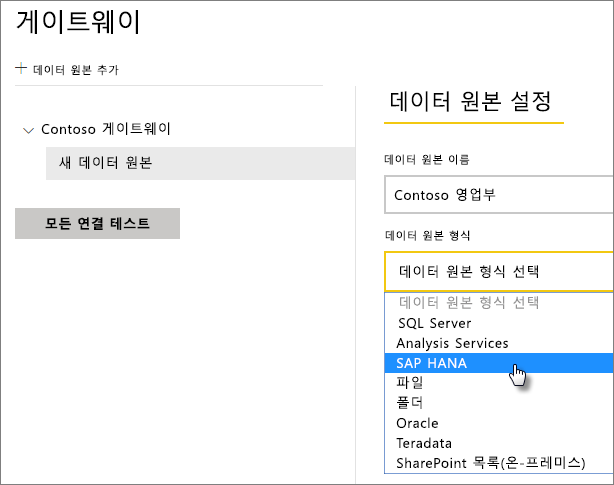
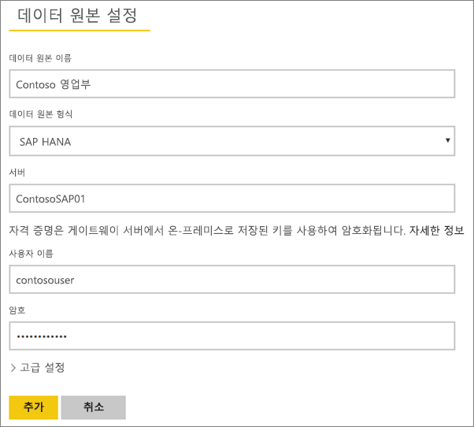
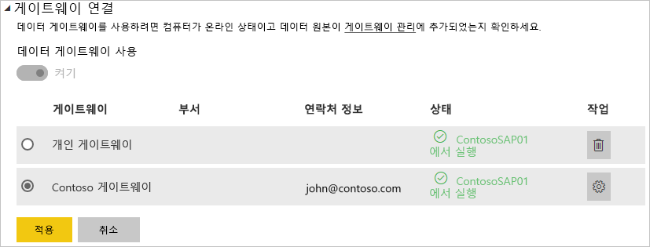

# 데이터 원본 관리 - SAP HANA

[!INCLUDE [gateway-rewrite](includes/gateway-rewrite.md)]

[온-프레미스 데이터 게이트웨이를 설치](/data-integration/gateway/service-gateway-install)한 후에는 게이트웨이와 함께 사용할 수 있는 [데이터 원본을 추가](service-gateway-data-sources.md#add-a-data-source)해야 합니다. 이 문서에서는 예약된 새로 고침 또는 DirectQuery에 사용되는 게이트웨이 및 SAP HANA 데이터 원본으로 작업하는 방법을 살펴봅니다.

## 데이터 소스 추가

데이터 원본을 추가하는 방법에 대한 자세한 내용은 [데이터 원본 추가](service-gateway-data-sources.md#add-a-data-source)를 참조하세요. **데이터 원본 형식**에서 **SAP HANA**를 선택합니다.

SAP HANA 데이터 원본 형식을 선택한 후 데이터 원본에 대한 **서버**, **사용자 이름** 및 **암호** 정보를 입력합니다.

> [!NOTE]
> 데이터 소스에 대한 모든 쿼리는 이러한 자격 증명을 사용하여 실행됩니다. 자격 증명을 저장하는 방법에 대한 자세한 내용은 [클라우드에 암호화된 자격 증명 저장](service-gateway-data-sources.md#store-encrypted-credentials-in-the-cloud)을 참조하세요.

모든 항목을 입력한 후 **추가**를 선택합니다. 이제 온-프레미스의 SQL SAP HANA 서버에 대해 예약된 새로 고침 또는 DirectQuery를 위해 이 데이터 원본을 사용할 수 있습니다. 성공한 경우 *연결 성공*이 표시됩니다.

### 고급 설정

필요한 경우 데이터 원본의 프라이버시 수준을 구성할 수 있습니다. 이 설정은 데이터가 결합하는 방식을 제어합니다. 예약된 새로 고침에만 사용됩니다. DirectQuery에는 적용되지 않습니다. 데이터 원본의 프라이버시 수준에 대한 자세한 내용은 [프라이버시 수준(파워 쿼리)](https://support.office.com/article/Privacy-levels-Power-Query-CC3EDE4D-359E-4B28-BC72-9BEE7900B540)을 참조하세요.

## 데이터 원본 사용

데이터 원본을 만든 후 DirectQuery 연결 또는 예약된 새로 고침을 통해 사용할 수 있습니다.

> [!NOTE]
> 서버 및 데이터베이스 이름은 온-프레미스 데이터 게이트웨이 내에서 Power BI Desktop 및 데이터 원본 간에 일치해야 합니다.

게이트웨이 내에서 데이터 세트 및 데이터 원본 간의 링크는 서버 이름 및 데이터베이스 이름을 기반으로 합니다. 해당 이름은 서로 일치해야 합니다. 예를 들어 Power BI Desktop 내에서 서버 이름에 대한 IP 주소를 제공하는 경우 게이트웨이 구성 내에서 데이터 원본에 대한 IP 주소를 사용해야 합니다. Power BI Desktop에서 *SERVER\INSTANCE*를 사용하는 경우 게이트웨이에 대해 구성된 데이터 원본에서 이를 사용해야 합니다.

이 요구 사항은 DirectQuery와 예약된 새로 고침에 대한 경우입니다.

### DirectQuery 연결로 데이터 원본 사용

서버 및 데이터베이스 이름이 Power BI Desktop 및 게이트웨이에 대해 구성된 데이터 원본 간과 일치하는지 확인합니다. 또한 DirectQuery 데이터 세트를 게시하려면 사용자가 데이터 원본의 **사용자** 탭에 나열되는지 확인해야 합니다. DirectQuery의 경우 처음으로 데이터를 가져올 때 Power BI Desktop 내에서 선택이 발생합니다. DirectQuery를 사용하는 방법에 대한 자세한 내용은 [Power BI Desktop에서 DirectQuery 사용](desktop-use-directquery.md)을 참조하세요.

게시한 후 Power BI Desktop 또는 **데이터 가져오기**에서 보고서 작업을 시작해야 합니다. 연결을 사용할 수 있으려면 게이트웨이 내에서 데이터 원본을 만든 후 몇 분 정도가 걸릴 수 있습니다.

### 예약된 새로 고침으로 데이터 원본 사용

게이트웨이 내에서 구성된 데이터 원본의 **사용자** 탭에 나열되고 서버 이름 및 데이터베이스 이름이 일치하는 경우 예약된 새로 고침으로 사용하기 위한 옵션으로 게이트웨이가 표시됩니다.

## 다음 단계

* [온-프레미스 데이터 게이트웨이 문제 해결](/data-integration/gateway/service-gateway-tshoot)
* [게이트웨이 문제 해결 - Power BI](service-gateway-onprem-tshoot.md) 

궁금한 점이 더 있나요? [Power BI 커뮤니티](http://community.powerbi.com/)에 질문합니다.

