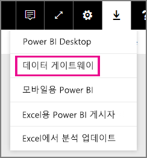
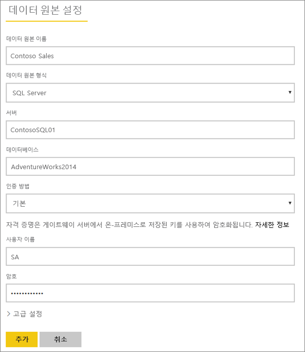
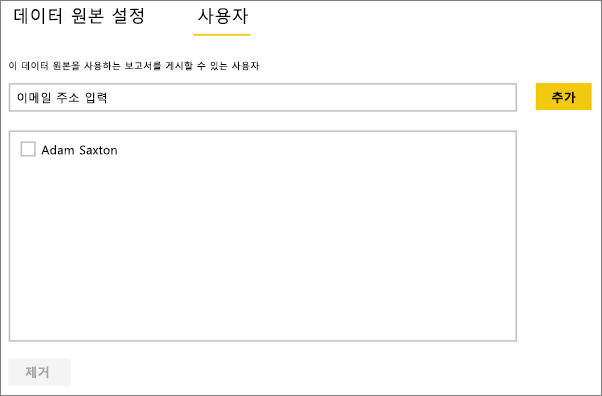
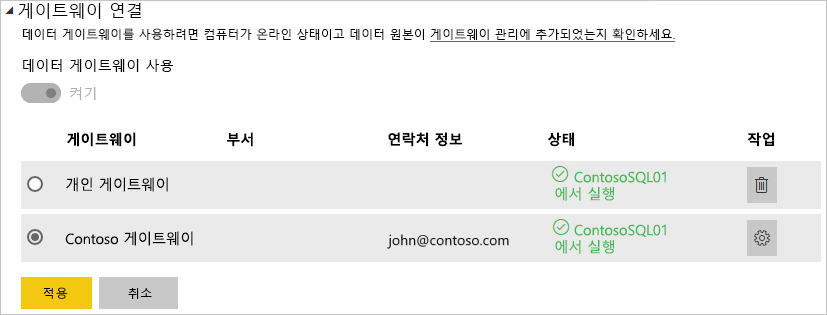

# 데이터 원본 관리 - SQL Server
온-프레미스 데이터 게이트웨이를 설치한 후에는 게이트웨이와 함께 사용할 데이터 원본을 추가할 수 있습니다. 이 문서에서는 게이트웨이 및 데이터 소스로 작업하는 방법을 살펴봅니다. 예약된 새로 고침 또는 DirectQuery에 대해 SQL Server 데이터 원본을 사용할 수 있습니다.

## 게이트웨이 다운로드 및 설치
Power BI 서비스에서 게이트웨이를 다운로드할 수 있습니다. **다운로드** > **데이터 게이트웨이**를 선택하거나 [게이트웨이 다운로드 페이지](https://go.microsoft.com/fwlink/?LinkId=698861)로 이동합니다.

## 게이트웨이 추가
게이트웨이를 추가하려면 해당 환경의 서버에 게이트웨이를 [다운로드](https://go.microsoft.com/fwlink/?LinkId=698861)하여 설치하기만 하면 됩니다. 게이트웨이를 설치하면 **게이트웨이 관리**아래의 게이트웨이 목록에 표시됩니다.

> [!NOTE]
> 하나 이상의 게이트웨이에 대한 관리자가 아닌 경우 **게이트웨이 관리**가 표시되지 않습니다. 이것은 사용자가 관리자로 게이트웨이에 추가되었거나, 게이트웨이를 직접 설치 및 구성했을 때 발생합니다.
> 
> 

## 게이트웨이 제거
게이트웨이를 제거하면 해당 게이트웨이에 속한 모든 데이터 원본도 삭제됩니다.  또한 이러한 데이터 소스를 사용하는 모든 대시보드 및 보고서와의 연결도 끊어집니다.

1. 오른쪽 위 모퉁이에서 기어 아이콘  > **게이트웨이 관리**를 선택합니다.
2. 게이트웨이 > **제거**
   
   

## 데이터 소스 추가
게이트웨이를 선택하고 **데이터 소스 추가**를 클릭하거나 게이트웨이 > **데이터 소스 추가**로 이동하여 데이터 소스를 추가할 수 있습니다.

그런 다음 목록에서 **데이터 소스 형식** 을 선택합니다.

> [!NOTE]
> DirectQuery를 사용할 때 게이트웨이는 **SQL Server 2012 SP1** 및 후속 버전만 지원합니다.
> 
> 

그런 다음 **서버** 및 **데이터베이스**를 포함하는 데이터 소스에 대한 정보를 입력합니다.  

**인증 방법**을 선택해야 할 수 있습니다.  인증 방법은 **Windows** 또는 **기본**입니다.  Windows 인증 대신 SQL 인증을 사용하려는 경우 **기본** 을 선택합니다. 그런 다음 이 데이터 소스에 사용할 자격 증명을 입력합니다.

> [!NOTE]
> Kerberos SSO(Single Sign On)가 구성되어 해당 데이터 원본에 대해 활성화되지 않은 한 데이터 원본에 대한 모든 쿼리는 이 자격 증명을 사용하여 실행됩니다. SSO에서 가져오기 데이터 세트는 저장된 자격 증명을 사용하지만 DirectQuery 데이터 세트는 현재 Power BI 사용자를 사용하여 SSO를 통한 쿼리를 실행합니다. 자세한 내용은 온-프레미스 데이터 게이트웨이 기본 문서를 통해 [자격 증명](service-gateway-onprem.md#credentials)이 저장되는 방법을 확인해 보거나, [Power BI에서 온-프레미스 데이터 원본으로 SSO(Single Sign-On)에 대해 Kerberos 사용](service-gateway-sso-kerberos.md) 방법을 설명하는 문서를 참조하세요.
> 
> 

모든 항목을 입력한 다음 **추가**를 클릭합니다.  이제 온-프레미스의 SQL Server에 대해 예약된 새로 고침 또는 DirectQuery를 위해 이 데이터 원본을 사용할 수 있습니다. 성공한 경우 *연결 성공* 이 표시됩니다.

### 고급 설정
데이터 원본에 대한 개인 정보 보호 수준을 구성할 수 있습니다. 데이터가 조합되는 방식을 제어합니다. 예정된 새로 고침에만 사용됩니다. DirectQuery에는 적용되지 않습니다. [자세히 알아보기](https://support.office.com/article/Privacy-levels-Power-Query-CC3EDE4D-359E-4B28-BC72-9BEE7900B540)

## 데이터 원본 제거
데이터 원본을 제거하면 지정된 데이터 원본을 사용하는 모든 대시보드 또는 보고서와의 연결이 끊어집니다.  

데이터 원본을 제거하려면 데이터 원본 > **제거**로 이동합니다.

## 관리자 관리
게이트웨이의 관리자 탭에서 게이트웨이를 관리할 수 있는 사용자(또는 보안 그룹)를 추가 및 제거할 수 있습니다.

## 사용자 관리
사용자 탭에서 데이터 원본에 대해 이 데이터 원본을 사용할 수 있는 사용자 또는 보안 그룹을 추가 및 제거할 수 있습니다.

> [!NOTE]
> 사용자 목록은 보고서를 게시할 수 있는 사용자를 제어합니다. 보고서 소유자는 대시보드 또는 콘텐츠 팩을 만들 수 있으며 이를 다른 사용자와 공유합니다.
> 
> 

## 데이터 원본 사용
데이터 원본을 만든 후 DirectQuery 연결 또는 예약된 새로 고침을 통해 사용할 수 있습니다.

> [!NOTE]
> 서버 및 데이터베이스 이름은 온-프레미스 데이터 게이트웨이 내에서 Power BI Desktop 및 데이터 원본 간에 일치해야 합니다.
> 
> 

게이트웨이 내에서 데이터 세트 및 데이터 원본 간의 링크는 서버 이름 및 데이터베이스 이름을 기반으로 합니다. 이는 일치해야 합니다. 예를 들어 **Power BI Desktop** 내에서 서버 이름에 대한 IP 주소를 제공하는 경우 게이트웨이 구성 내에서 데이터 원본에 대한 IP 주소를 사용해야 합니다. Power BI Desktop에서 *서버\인스턴스*를 사용하는 경우 게이트웨이에 대해 구성된 데이터 원본 내에서 동일한 것을 사용해야 합니다.

DirectQuery와 예약된 새로 고침에 대한 경우입니다.

### DirectQuery 연결로 데이터 원본 사용
서버 및 데이터베이스 이름이 **Power BI Desktop** 및 게이트웨이에 대해 구성된 데이터 원본 간과 일치하는지 확인해야 합니다. DirectQuery 데이터 세트를 게시하기 위해 사용자가 데이터 원본의 **사용자** 탭에 나열되는지 확인해야 합니다. Directquery의 경우 처음으로 데이터를 가져올 때 Power BI Desktop 내에서 선택이 발생합니다. [자세히 알아보기](desktop-use-directquery.md)

게시한 후 Power BI Desktop 또는 **데이터 가져오기**에서 보고서 작업을 시작해야 합니다. 연결을 사용할 수 있으려면 게이트웨이 내에서 데이터 원본을 만든 후 몇 분 정도가 걸릴 수 있습니다.

### 예약된 새로 고침으로 데이터 원본 사용
게이트웨이 내에서 구성된 데이터 원본의 **사용자** 탭에 나열되고 서버 및 데이터베이스 이름이 일치하는 경우 예약된 새로 고침으로 사용하기 위한 옵션으로 게이트웨이가 표시됩니다.

## 다음 단계
* [온-프레미스 데이터 게이트웨이](service-gateway-onprem.md)  
* [온-프레미스 데이터 게이트웨이 심층 분석](service-gateway-onprem-indepth.md)  
* [온-프레미스 데이터 게이트웨이 문제 해결](service-gateway-onprem-tshoot.md)
* [Power BI에서 온-프레미스 데이터 원본으로 SSO(Single Sign-On)에 대해 Kerberos 사용](service-gateway-sso-kerberos.md) 
* 궁금한 점이 더 있나요? [Power BI 커뮤니티를 이용하세요.](http://community.powerbi.com/)

