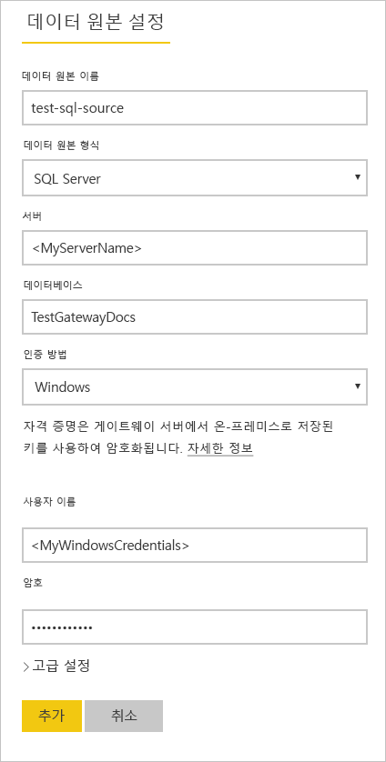
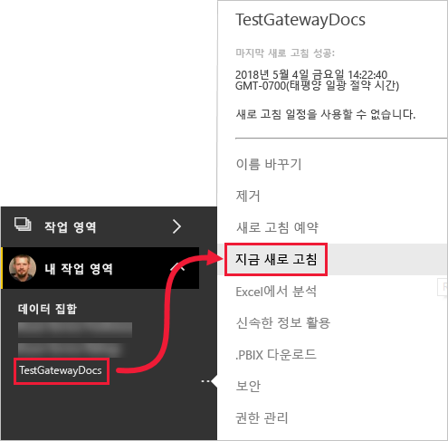

# <a name="tutorial-connect-to-on-premises-data-in-sql-server"></a>자습서: SQL Server에서 온-프레미스 데이터에 연결

온-프레미스 데이터 게이트웨이는 온-프레미스 네트워크 내에 설치하는 소프트웨어로서, 이 게이트웨이를 통해 해당 네트워크의 데이터에 액세스할 수 있습니다. 이 자습서에서는 SQL Server에서 가져온 샘플 데이터를 기반으로 Power BI Desktop에서 보고서를 빌드합니다. 그런 다음, Power BI 서비스에 보고서를 게시하고 서비스가 온-프레미스 데이터에 액세스할 수 있도록 게이트웨이를 구성합니다. 이 액세스는 서비스가 데이터를 새로 고쳐 보고서를 최신 상태로 유지할 수 있음을 의미합니다.

이 자습서에서는 다음 작업을 수행하는 방법을 알아봅니다.
> [!div class="checklist"]
> * SQL Server의 데이터에서 보고서 만들기
> * Power BI 서비스에 보고서 게시
> * SQL Server를 게이트웨이 데이터 원본으로 추가
> * 보고서에서 데이터 새로 고침

아직 Power BI에 등록하지 않은 경우 시작하기 전에 [평가판에 등록합니다](https://app.powerbi.com/signupredirect?pbi_source=web).


## <a name="prerequisites"></a>필수 조건

* [Power BI Desktop 설치](https://powerbi.microsoft.com/desktop/)
* 로컬 컴퓨터에 [SQL Server 설치](https://docs.microsoft.com/sql/database-engine/install-windows/install-sql-server) 
* 동일한 로컬 컴퓨터(프로덕션에서는 일반적으로 다른 컴퓨터가 됨)에 [온-프레미스 데이터 게이트웨이 설치](service-gateway-install.md)


## <a name="set-up-sample-data"></a>샘플 데이터 설정

먼저 SQL Server에 샘플 데이터를 추가하면 자습서의 나머지 부분에서 해당 데이터를 사용할 수 있습니다.

1. SSMS(SQL Server Management Studio)에서 SQL Server 인스턴스에 연결하고 테스트 데이터베이스를 만듭니다.

    ```sql
    CREATE DATABASE TestGatewayDocs
    ```

2. 직접 만든 데이터베이스에서 테이블을 추가하고 데이터를 삽입합니다.

    ```sql
    USE TestGatewayDocs

    CREATE TABLE Product (
        SalesDate DATE,
        Category  VARCHAR(100),
        Product VARCHAR(100),
        Sales MONEY,
        Quantity INT
    )

    INSERT INTO Product VALUES('2018-05-05','Accessories','Carrying Case',9924.60,68)
    INSERT INTO Product VALUES('2018-05-06','Accessories','Tripod',1350.00,18)
    INSERT INTO Product VALUES('2018-05-11','Accessories','Lens Adapter',1147.50,17)
    INSERT INTO Product VALUES('2018-05-05','Accessories','Mini Battery Charger',1056.00,44)
    INSERT INTO Product VALUES('2018-05-06','Accessories','Telephoto Conversion Lens',1380.00,18)
    INSERT INTO Product VALUES('2018-05-06','Accessories','USB Cable',780.00,26)
    INSERT INTO Product VALUES('2018-05-08','Accessories','Budget Movie-Maker',3798.00,9)
    INSERT INTO Product VALUES('2018-05-09','Digital video recorder','Business Videographer',10400.00,13)
    INSERT INTO Product VALUES('2018-05-10','Digital video recorder','Social Videographer',3000.00,60)
    INSERT INTO Product VALUES('2018-05-11','Digital','Advanced Digital',7234.50,39)
    INSERT INTO Product VALUES('2018-05-07','Digital','Compact Digital',10836.00,84)
    INSERT INTO Product VALUES('2018-05-08','Digital','Consumer Digital',2550.00,17)
    INSERT INTO Product VALUES('2018-05-05','Digital','Slim Digital',8357.80,44)
    INSERT INTO Product VALUES('2018-05-09','Digital SLR','SLR Camera 35mm',18530.00,34)
    INSERT INTO Product VALUES('2018-05-07','Digital SLR','SLR Camera',26576.00,88)
    ```

3. 테이블에서 데이터를 선택하여 확인합니다.

    ```sql
    SELECT * FROM Product
    ```

    


## <a name="build-and-publish-a-report"></a>보고서 빌드 및 게시

이제 작업할 샘플 데이터가 있으므로 Power BI Desktop에서 SQL Server에 연결하고 해당 데이터를 기반으로 보고서를 빌드합니다. 그런 다음, Power BI 서비스에 보고서를 게시합니다.

1. Power BI Desktop의 **홈** 탭에서 **데이터 가져오기** > **SQL Server**를 선택합니다.

2. **서버** 아래에 서버 이름을 입력하고 **데이터베이스** 아래에 “TestGatewayDocs”를 입력합니다. **확인**을 선택합니다. 

    

3. 자격 증명을 확인한 다음, **연결**을 선택합니다.

4. **탐색기**에서 **Product** 테이블을 선택한 후 **로드**를 선택합니다.

    

5. Power BI Desktop **보고서** 보기의 **시각화** 창에서 **누적 세로 막대형 차트**를 선택합니다.

        

6. 보고서 캔버스에서 세로 막대형 차트를 선택한 상태로 **필드** 창에서 **제품** 및 **판매** 필드를 선택합니다.  

    

    이제 차트는 다음과 같이 표시됩니다.

    

    **SLR 카메라**가 현재 최고 판매량입니다. 이 값은 이 자습서의 뒷부분에서 데이터를 업데이트하고 보고서를 새로 고치면 변경됩니다.

7. 이름을 “TestGatewayDocs.pbix”로 지정하여 보고서를 저장합니다.

8. **홈** 탭에서 **게시** > **내 작업 영역** > **선택**을 선택합니다. 로그인할지 묻는 메시지가 표시되면 Power BI 서비스에 로그인합니다. 

    

9. **성공** 화면에서 **Power BI에서 ‘TestGatewayDocs.pbix’ 열기**를 선택합니다.


## <a name="add-sql-server-as-a-gateway-data-source"></a>SQL Server를 게이트웨이 데이터 원본으로 추가

Power BI Desktop에서는 SQL Server에 직접 연결하지만 Power BI 서비스에는 브리지로 작동하는 게이트웨이가 필요합니다. 이제 SQL Server 인스턴스를 이전 문서에서 만든 게이트웨이의 데이터 원본으로 추가합니다([필수 구성 요소](#prerequisites) 아래에 나열됨). 

1. Power BI 서비스의 오른쪽 위 모서리에서 기어 아이콘  > **게이트웨이 관리**를 선택합니다.

    

2. **데이터 원본 추가**를 선택하고 **데이터 원본 이름**으로 “test-sql-source”를 입력합니다.

    

3. **SQL Server**의 **데이터 원본 유형**을 선택한 다음, 표시된 대로 다른 값을 입력합니다.

    


   |          옵션           |                                               값                                                |
   |---------------------------|----------------------------------------------------------------------------------------------------|
   |   **데이터 원본 이름**    |                                          test-sql-source                                           |
   |   **데이터 원본 유형**    |                                             SQL Server                                             |
   |        **서버**         | SQL Server 인스턴스의 이름(Power BI Desktop에 지정한 내용과 동일해야 함) |
   |       **데이터베이스**        |                                          TestGatewayDocs                                           |
   | **인증 방법** |                                              Windows                                               |
   |       **사용자 이름**        |             michael@contoso.com과 같은 계정으로, SQL Server에 연결하는 데 사용             |
   |       **암호**        |                   SQL Server에 연결하는 데 사용하는 계정의 암호                    |


4. **추가**를 선택합니다. 프로세스가 성공하면 ‘연결 성공’이 표시됩니다.

    

    이제 이 데이터 원본을 사용하여 Power BI 대시보드 및 보고서에 SQL Server의 데이터를 포함할 수 있습니다.


## <a name="configure-and-use-data-refresh"></a>데이터 새로 고침 구성 및 사용

보고서를 Power BI 서비스에 게시하고 SQL Server 데이터 원본을 구성했습니다. 이 상태에서 이제 Product 테이블의 내용을 변경하면 해당 변경 내용이 게이트웨이를 통해 게시된 보고서로 흘러갑니다. 향후 변경 내용을 처리하도록 예약된 새로 고침도 구성합니다.

1. SSMS에서 Product 테이블의 데이터를 업데이트합니다.

    ```sql
    UPDATE Product
    SET Sales = 32508, Quantity = 252
    WHERE Product='Compact Digital'     

    ```

2. Power BI 서비스의 왼쪽 탐색 창에서 **내 작업 영역**을 선택합니다.

3. **데이터 집합** 아래에서 **TestGatewayDocs** 데이터 집합에 대해 **기타**(**. . .**) > **지금 새로 고침**을 선택합니다.

    

4. **내 작업 영역** > **보고서** > **TestGatewayDocs**를 선택합니다. 업데이트가 어떻게 흘러가는지 확인하세요. 이제 최고 판매량은 **Compact Digital**입니다. 

    

5. **내 작업 영역** > **보고서** > **TestGatewayDocs**를 선택합니다. **기타**(**. . .**) > **새로 고침 예약**을 선택합니다.

6. **새로 고침 예약** 아래에서 새로 고침을 **켜기**로 설정한 다음, **적용**을 선택합니다. 데이터 집합은 기본적으로 매일 새로 고쳐집니다.

    

## <a name="clean-up-resources"></a>리소스 정리
샘플 데이터를 더 이상 사용하지 않으려면 SSMS에서 `DROP DATABASE TestGatewayDocs`를 실행합니다. SQL Server 데이터 원본을 사용하지 않으려면 [데이터 원본을 제거](service-gateway-manage.md#remove-a-data-source)합니다. 


## <a name="next-steps"></a>다음 단계
이 자습서에서는 다음 작업을 수행하는 방법을 알아보았습니다.
> [!div class="checklist"]
> * SQL Server의 데이터에서 보고서 만들기
> * Power BI 서비스에 보고서 게시
> * SQL Server를 게이트웨이 데이터 원본으로 추가
> * 보고서에서 데이터 새로 고침

더 자세히 알아보려면 다음 문서로 계속 진행하세요.
> [!div class="nextstepaction"]
> [Power BI 게이트웨이 관리](service-gateway-manage.md)

