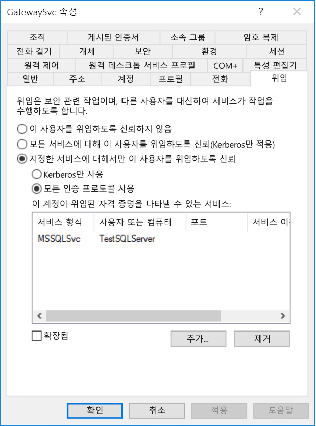
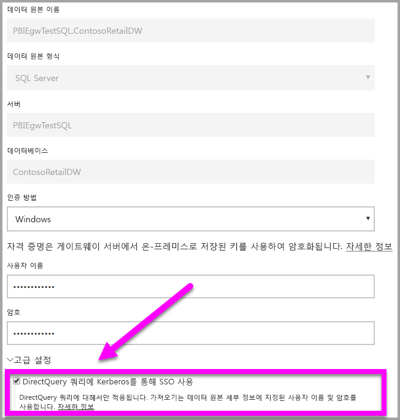
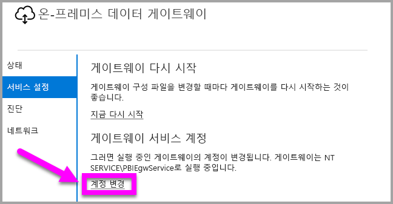
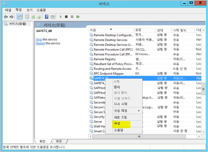
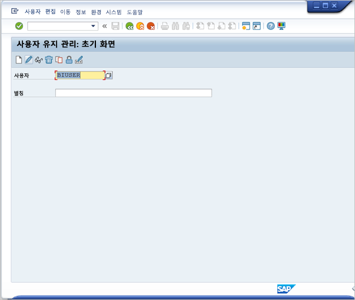
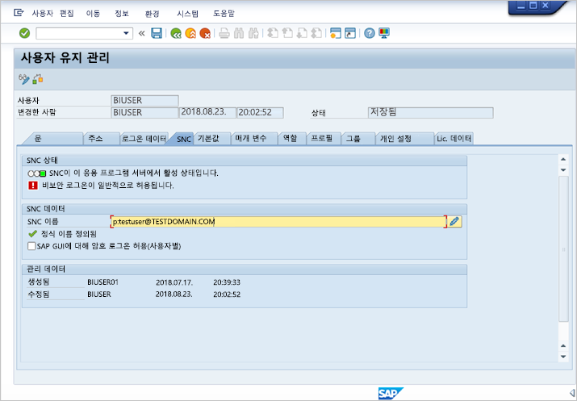
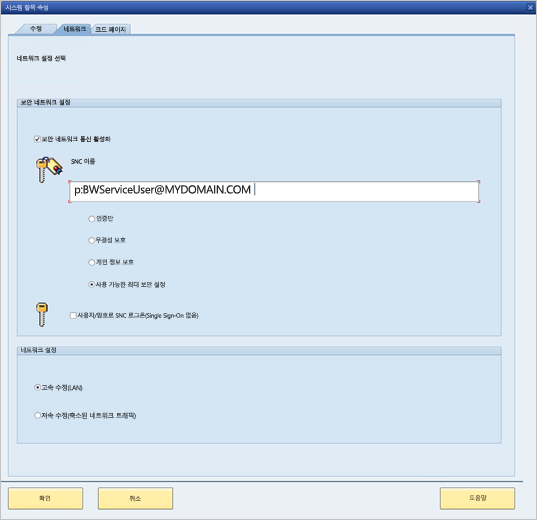

# <a name="use-kerberos-for-single-sign-on-sso-from-power-bi-to-on-premises-data-sources"></a>Power BI에서 온-프레미스 데이터 원본으로 SSO(Single Sign-On)에 대해 Kerberos 사용

[Kerberos 제한 위임](/windows-server/security/kerberos/kerberos-constrained-delegation-overview)을 사용하여 원활한 SSO(Single Sign-On) 연결을 사용하도록 설정하세요. SSO를 사용하도록 설정하면 Power BI 보고서 및 대시보드가 온-프레미스 원본의 데이터를 손쉽게 새로 고칠 수 있습니다.

## <a name="supported-data-sources"></a>지원되는 데이터 원본

현재 다음 데이터 원본이 지원됩니다.

* SQL Server
* SAP HANA
* SAP BW
* Teradata
* Spark
* Impala

또한 [SAML(Security Assertion Markup Language)](service-gateway-sso-saml.md)을 사용하는 SAP HANA도 지원합니다.

### <a name="sap-hana"></a>SAP HANA

SAP HANA에 SSO를 사용하도록 설정하려면 먼저 다음 단계를 수행합니다.

* SAP HANA 서버가 SAP HANA 서버 플랫폼 수준에 필요한 최소 버전을 실행 중인지 확인합니다.
  * [HANA 2 SPS 01 Rev 012.03](https://launchpad.support.sap.com/#/notes/2557386)
  * [HANA 2 SPS 02 Rev 22](https://launchpad.support.sap.com/#/notes/2547324)
  * [HANA 1 SP 12 Rev 122.13](https://launchpad.support.sap.com/#/notes/2528439)
* 게이트웨이 머신에 SAP의 최신 HANA ODBC 드라이버를 설치합니다.  최소 버전은 HANA ODBC 2017년 8월 릴리스된 2.00.020.00 버전입니다.

Kerberos를 사용하여 SAP HANA를 위한 SSO 설정에 대한 자세한 내용은 SAP HANA 보안 가이드에서 [Kerberos를 사용한 Single Sign-On](https://help.sap.com/viewer/b3ee5778bc2e4a089d3299b82ec762a7/2.0.03/1885fad82df943c2a1974f5da0eed66d.html)을 참조하세요. 또한 해당 페이지에서 특히 SAP Note 1837331 – HANA DBSSO Kerberos/Active Directory 방법 링크를 참조하세요.

## <a name="prepare-for-kerberos-constrained-delegation"></a>Kerberos 제한 위임을 위한 준비

Kerberos 제한 위임이 올바르게 작동하려면 서비스 계정의 *SPN(서비스 사용자 이름)* 및 위임 설정을 포함한 여러 개의 항목을 구성해야 합니다.

### <a name="prerequisite-1-install-and-configure-the-microsoft-on-premises-data-gateway"></a>필수 구성 요소 1: Microsoft 온-프레미스 데이터 게이트웨이 설치 및 구성

온-프레미스 데이터 게이트웨이의 이 릴리스는 기존 게이트웨이의 인계 설정뿐만 아니라 전체 업그레이드를 지원합니다.

### <a name="prerequisite-2-run-the-gateway-windows-service-as-a-domain-account"></a>필수 구성 요소 2: 도메인 계정으로 게이트웨이 Windows 서비스 실행

표준 설치에서 게이트웨이는 머신-로컬 서비스 계정(특히 *NT Service\PBIEgwService*)으로 실행됩니다.


Kerberos 제한 위임을 활성화하기 위해 게이트웨이는 Azure AD(Azure Active Directory) 인스턴스가 이미 로컬 Active Directory 인스턴스(Azure AD DirSync/Connect 사용)와 동기화된 상태가 아닌 경우 도메인 계정으로 실행해야 합니다. 도메인 계정으로 전환하려면 이 문서의 뒷부분에 나오는 [게이트웨이를 도메인 계정으로 전환](#switch-the-gateway-to-a-domain-account)을 참조하세요.

> [!NOTE]
> Azure AD Connect가 구성되고 사용자 계정이 동기화된 경우 게이트웨이 서비스는 런타임 시 로컬 Azure AD 조회를 수행하지 않아도 됩니다. 게이트웨이 서비스에 대해 로컬 서비스 SID(도메인 계정 요구 대신)를 사용할 수 있습니다. 이 문서에 간략히 나온 Kerberos 제한 위임 구성 단계는 해당 구성과 동일합니다. 도메인 계정 대신 Azure AD에서 게이트웨이의 컴퓨터 개체에 간단히 적용됩니다.

### <a name="prerequisite-3-have-domain-admin-rights-to-configure-spns-setspn-and-kerberos-constrained-delegation-settings"></a>필수 구성 요소 3: SPN(SetSPN) 및 Kerberos 제한 위임 설정을 구성하는 도메인 관리자 권한 갖기

도메인 관리자가 도메인 관리자 권한을 요구하지 않고 다른 사용자에게 SPN 및 Kerberos 위임을 구성하는 권한을 일시적 또는 영구적으로 허용하는 것은 권장되지 않습니다. 다음 섹션에서는 권장되는 구성 단계를 자세하게 다룹니다.

## <a name="configure-kerberos-constrained-delegation-for-the-gateway-and-data-source"></a>게이트웨이 및 데이터 원본에 대해 Kerberos 제한 위임 구성

도메인 관리자로 게이트웨이 서비스 도메인 계정에 대한 SPN을 구성하고 게이트웨이 서비스 도메인 계정에서 위임 설정을 구성합니다.

### <a name="configure-an-spn-for-the-gateway-service-account"></a>게이트웨이 서비스 계정에 대해 SPN 구성

먼저 게이트웨이 서비스 계정으로 사용된 도메인 계정에 대해 SPN이 이미 생성되어 있는지 확인합니다.

1. 도메인 관리자로 **Active Directory 사용자 및 컴퓨터**를 엽니다.

2. 도메인을 마우스 오른쪽 단추로 클릭하고, **찾기**를 선택한 후, 게이트웨이 서비스 계정의 계정 이름을 입력합니다.

3. 검색 결과에서 게이트웨이 서비스 계정을 마우스 오른쪽 단추로 클릭하고 **속성**을 선택합니다.

4. **위임** 탭이 **속성** 대화 상자에 표시되는 경우 이미 SPN이 생성된 것입니다. 위임 설정 구성으로 건너뛸 수 있습니다.

    **위임** 탭이 **속성** 대화 상자에 없는 경우에는 해당 계정에서 SPN을 수동으로 만들 수 있습니다. 그러면 **위임** 탭이 추가됩니다. Windows와 함께 제공되는 [setspn 도구](https://technet.microsoft.com/library/cc731241.aspx)를 사용합니다(SPN을 만드는 도메인 관리자 권한 필요).

    예를 들어, 게이트웨이 서비스 계정이 "PBIEgwTest\GatewaySvc"이며 실행 중인 게이트웨이 서비스가 있는 컴퓨터 이름이 **Machine1**이라고 가정합니다. 이 예제에서 해당 머신에 대한 게이트웨이 서비스 계정의 SPN을 설정하려면 다음 명령을 실행합니다.

    

    해당 단계가 완료되면 위임 설정 구성으로 이동할 수 있습니다.

### <a name="configure-delegation-settings-on-the-gateway-service-account"></a>게이트웨이 서비스 계정에서 위임 설정 구성

두 번째 구성 요구 사항은 게이트웨이 서비스 계정에서 위임 설정입니다. 이러한 단계를 수행할 수 있는 여러 도구가 있습니다. 여기서는 디렉터리에서 정보를 관리하고 게시하는 데 사용할 수 있는 MMC(Microsoft Management Console) 스냅인인 Active Directory 사용자 및 컴퓨터를 사용합니다. 기본적으로 도메인 컨트롤러에서 사용할 수 있습니다. 다른 머신에서 Windows 기능 구성을 통해 설정할 수도 있습니다.

프로토콜 전송을 사용하여 Kerberos 제한 위임을 구성해야 합니다. 제한된 위임을 사용하여 위임하려고 하는 서비스를 노출해야 합니다. 예를 들어, SQL Server 또는 SAP HANA 서버만 게이트웨이 서비스 계정에서 위임 호출을 수락합니다.

이 섹션에서는 기본 데이터 원본에 대해 이미 SPN을 구성했다고 가정합니다(예: SQL Server, SAP HANA, Teradata 및 Spark). 이러한 데이터 원본 서버 SPN을 구성하는 방법을 알아보려면 해당 데이터베이스 서버에 대한 기술 설명서를 참조하세요. 또한 [앱에 필요한 SPN은?](https://blogs.msdn.microsoft.com/psssql/2010/06/23/my-kerberos-checklist/) 블로그 게시물을 참조할 수도 있습니다.

다음 단계에서는 SQL Server를 실행 중인 데이터베이스 서버와 게이트웨이 머신이라는 두 머신을 사용하여 온-프레미스 환경을 가정합니다. 이 예에서는 다음과 같은 설정 및 이름을 가정합니다.

* 게이트웨이 머신 이름: **PBIEgwTestGW**
* 게이트웨이 서비스 계정: **PBIEgwTest\GatewaySvc**(계정 표시 이름: 게이트웨이 커넥터)
* SQL Server 데이터 원본 머신 이름: **PBIEgwTestSQL**
* SQL Server 데이터 원본 서비스 계정: **PBIEgwTest\SQLService**

위임 설정을 구성하는 방법은 다음과 같습니다.

1. 도메인 관리자 권한으로 **Active Directory 사용자 및 컴퓨터**를 엽니다.

2. 게이트웨이 서비스 계정(**PBIEgwTest\GatewaySvc**)을 마우스 오른쪽 단추로 클릭하고 **속성**을 선택합니다.

3. **위임** 탭을 선택합니다.

4. **지정한 서비스에 대한 위임용으로만 이 컴퓨터 신뢰** > **모든 인증 프로토콜 사용**을 차례로 선택합니다.

6. **이 계정이 위임된 자격 증명을 표시할 수 있는 서비스**에서 **추가**를 선택합니다.

7. 새 대화 상자에서 **사용자 또는 컴퓨터**를 선택합니다.

8. SQL Server 데이터 원본(**PBIEgwTest\SQLService**)에 대한 서비스 계정을 입력하고 **확인**을 선택합니다.

9. 데이터베이스 서버에 대해 만든 SPN을 선택합니다. 예제에서 SPN은 **MSSQLSvc**로 시작합니다. 데이터베이스 서비스에 대해 FQDN 및 NetBIOS SPN 모두를 추가한 경우 둘 다 선택합니다. 하나만 표시될 수도 있습니다.

10. **확인**을 선택합니다. 이제 목록에서 SPN이 표시됩니다.

    경우에 따라 **확장됨**을 선택하여 FQDN과 NetBIOS SPN을 모두 표시할 수 있습니다. **확장됨**을 선택한 경우 대화 상자는 다음과 유사하게 표시됩니다. **확인**을 선택합니다.

    

마지막으로, 게이트웨이 서비스(예제에서 **PBIEgwTestGW**)를 실행 중인 머신에서 게이트웨이 서비스 계정은 로컬 정책 **인증 후 클라이언트 가장**을 부여해야 합니다. 로컬 그룹 정책 편집기(**gpedit**)를 사용하여 이를 수행하고 확인할 수 있습니다.

1. 게이트웨이 머신에서 *gpedit.msc*를 실행합니다.

1. **로컬 컴퓨터 정책** > **컴퓨터 구성** > **Windows 설정** > **보안 설정** > **로컬 정책** > **사용자 권한 할당**으로 이동합니다.

    

1. **사용자 권한 할당**의 정책 목록에서 **인증 후 클라이언트 가장**을 선택합니다.

    

    마우스 오른쪽 단추로 클릭하고 **속성**을 엽니다. 계정 목록을 확인합니다. 게이트웨이 서비스 계정을 포함해야 합니다(**PBIEgwTest\GatewaySvc**).

1. **사용자 권한 할당**의 정책 목록에서 **운영 체제의 일부로 작동(SeTcbPrivilege)** 을 선택합니다. 게이트웨이 서비스 계정이 계정 목록에도 포함되어 있는지 확인합니다.

1. **온-프레미스 데이터 게이트웨이** 서비스 프로세스를 다시 시작합니다.

SAP HANA를 사용 중인 경우 약간의 성능 개선 효과를 볼 수 있는 다음과 같은 추가 단계를 수행하는 것이 좋습니다.

1. 게이트웨이 설치 디렉터리에서 다음 구성 파일을 찾아서 엽니다. *Microsoft.PowerBI.DataMovement.Pipeline.GatewayCore.dll.config*.

1. *FullDomainResolutionEnabled* 속성을 찾아 값을 *True*로 변경합니다.

    ```xml
    <setting name=" FullDomainResolutionEnabled " serializeAs="String">
          <value>True</value>
    </setting>
    ```

## <a name="run-a-power-bi-report"></a>Power BI 보고서 실행

모든 구성 단계를 완료한 후 Power BI에서 **게이트웨이 관리** 페이지를 사용하여 데이터 원본을 구성할 수 있습니다. 그런 다음, **고급 설정**에서 SSO를 활성화하고 해당 데이터 원본에 보고서 및 데이터 세트 바인딩을 게시합니다.



이 구성은 대부분의 경우에서 작동합니다. 그러나 Kerberos를 사용하는 경우 환경에 따라 서로 다른 구성이 있을 수 있습니다. 보고서가 여전히 로드되지 않는 경우 추가 조사를 위해 도메인 관리자에게 문의해야 합니다.

## <a name="switch-the-gateway-to-a-domain-account"></a>도메인 계정으로 게이트웨이 전환

필요한 경우 **온-프레미스 데이터 게이트웨이** 사용자 인터페이스를 사용하여 도메인 계정으로 실행되도록 로컬 서비스 계정에서 게이트웨이를 전환할 수 있습니다. 방법은 다음과 같습니다.

1. **온-프레미스 데이터 게이트웨이** 구성 도구를 엽니다.

   

2. 기본 페이지에서 **로그인** 단추를 선택하고 Power BI 계정으로 로그인합니다.

3. 로그인을 완료한 후 **서비스 설정** 탭을 선택합니다.

4. **계정 변경**을 선택하여 단계별 연습을 시작합니다.

   

## <a name="configure-sap-bw-for-sso"></a>SSO용 SAP BW 구성

Kerberos가 게이트웨이에서 어떻게 작동하는지 이해했으므로 SAP BW(SAP Business Warehouse)용 SSO를 구성할 수 있습니다. 다음 단계에서는 이 문서의 앞 부분에서 설명한 것처럼 이미 [Kerberos 제한된 위임이 준비](#prepare-for-kerberos-constrained-delegation)되어 있다고 가정합니다.

이 가이드에서는 가능한 한 포괄적으로 설명하려고 합니다. 이러한 단계 중 일부를 이미 완료한 경우에는 건너뛸 수 있습니다. 예를 들어 SAP BW 서버의 서비스 사용자를 이미 만들고 해당 사용자에게 SPN을 매핑했거나, 이미 `gsskrb5` 라이브러리를 설치했을 수도 있습니다.

### <a name="set-up-gsskrb5-on-client-machines-and-the-sap-bw-server"></a>클라이언트 머신 및 SAP BW 서버에 gsskrb5 설정

> [!NOTE]
> `gsskrb5`는 SAP에서 더 이상 적극적으로 지원되지 않습니다. 자세한 내용은 [SAP 참고 352295](https://launchpad.support.sap.com/#/notes/352295)를 참조하세요. 또한 `gsskrb5`는 데이터 게이트웨이에서 SAP BW Message Server로의 SSO 연결을 허용하지 않습니다. SAP BW Application Server에 대한 연결만 가능합니다. 게이트웨이를 통해 SSO 연결을 완료하려면 클라이언트 및 서버에서 모두 `gsskrb5`를 사용 중이어야 합니다. 이제 SAP BW용 공용 암호화 라이브러리(sapcrypto)를 지원합니다.

1. [SAP 노트 2115486](https://launchpad.support.sap.com/)에서 `gsskrb5` - `gx64krb5`를 다운로드합니다(SAP s-user 필요). gsskrb5.dll 및 gx64krb5.dll의 버전이 1.0.11.x 이상인지 확인합니다.

1. 게이트웨이 인스턴스에서 액세스할 수 있는(SAP 로그온을 사용하여 SSO 연결을 테스트하려는 경우 SAP GUI에서도 액세스 가능) 게이트웨이 머신의 특정 위치에 라이브러리를 저장합니다.

1. SAP BW 서버에서 액세스할 수 있는 위치에 있는 SAP BW 서버 머신에 다른 사본을 저장합니다.

1. 클라이언트 및 서버 머신에서 각각 gsskrb5.dll 및 gx64krb5.dll의 위치를 가리키도록 `SNC\_LIB` 및 `SNC\_LIB\_64` 환경 변수를 설정합니다.

### <a name="create-a-sap-bw-service-user-and-enable-snc-communication"></a>SAP BW 서비스 사용자 만들기 및 SNC 통신 활성화

이미 완료한 게이트웨이 구성 외에, 몇 가지 추가적인 SAP BW 관련 단계가 있습니다. 이 설명서의 [게이트웨이 서비스 계정에서 위임 설정 구성](#configure-delegation-settings-on-the-gateway-service-account) 섹션에서는 기본 데이터 원본의 SPN이 이미 구성되어 있다고 가정합니다. SAP BW의 이 구성을 완료하려면

1. Active Directory 도메인 컨트롤러 서버에서 Active Directory 환경의 SAP BW 애플리케이션 서버에 대한 서비스 사용자(처음에는 일반적인 Active Directory 사용자)를 만듭니다. 그런 다음, 여기에 SPN을 할당합니다.

    SAP는 `SAP/`를 사용하여 SPN을 시작하도록 권장하지만 `HTTP/`와 같은 다른 접두사를 사용할 수도 있습니다. `SAP/` 뒤에는 원하는 것을 지정할 수 있습니다. 한 가지 옵션은 SAP BW 서버의 서비스 사용자 이름을 사용하는 것입니다. 예를 들어 서비스 사용자로 `BWServiceUser@\<DOMAIN\>`을 만든 경우 SPN `SAP/BWServiceUser`를 사용할 수 있습니다. SPN 매핑을 설정하는 한 가지 방법은 setspn 명령입니다. 예를 들어 방금 만든 서비스 사용자에 대한 SPN을 설정하려면 도메인 컨트롤러 머신의 cmd 창에서 `setspn -s SAP/ BWServiceUser DOMAIN\ BWServiceUser`라는 명령을 실행합니다. 자세한 내용은 SAP BW 설명서를 참조하세요.

1. 서비스 사용자에게 SAP BW 애플리케이션 서버에 대한 액세스 권한을 부여합니다.

    1. SAP BW 서버 머신에서 SAP BW 서버에 대한 로컬 관리자 그룹에 서비스 사용자를 추가합니다. 컴퓨터 관리 프로그램을 열고 서버에 대한 로컬 관리자 그룹을 두 번 클릭합니다.

        

    1. 로컬 관리자 그룹을 두 번 클릭하고, **추가**를 선택하여 그룹에 서비스 사용자를 추가합니다. 이름을 올바르게 입력되었는지 확인하려면 **이름 확인**을 선택합니다. **확인**을 선택합니다.

1. SAP BW 서버의 서비스 사용자를 SAP BW 서버 머신에서 SAP BW 서버 서비스를 시작하는 사용자로 설정합니다.

    1. **실행**을 열고 “Services.msc”를 입력합니다. SAP BW 애플리케이션 서버 인스턴스에 해당하는 서비스를 찾습니다. 이를 마우스 오른쪽 단추로 클릭하고 **속성**을 선택합니다.

        

    1. **로그온** 탭으로 전환하고, 사용자를 자신의 SAP BW 서비스 사용자로 변경합니다. 사용자의 암호를 입력하고 **확인**을 선택합니다.

1. SAP 로그온의 서버에 로그인하고 RZ10 트랜잭션을 사용하여 다음 프로필 매개 변수를 설정합니다.

    1. snc/identity/as 프로필 매개 변수를 p:\<자신이 만든 SAP BW 서비스 사용자\>(예: p:BWServiceUser@MYDOMAIN.COM)로 설정합니다. 서비스 사용자의 UPN 앞에 오는 p:에 유의하세요. p:CN=이 아닙니다. 공용 암호화 라이브러리가 SNC 라이브러리로 사용될 때처럼 p:CN=이 아닙니다.

    1. snc/gssapi\_lib 프로필 매개 변수를o \<서버 머신의 gsskrb5.dll/gx64krb5.dll 경로(OS 비트 수에 따라 사용하는 라이브러리가 달라짐)\>로 설정합니다. 라이브러리는 SAP BW 애플리케이션 서버가 액세스할 수 있는 위치에 배치해야 합니다.

    1. 또한 다음 추가 프로필 매개 변수를 설정하고 필요에 맞게 값을 변경합니다. 마지막 5개 옵션은 클라이언트가 SNC를 구성하지 않고 SAP 로그온을 사용하여 SAP BW 서버에 연결할 수 있게 해줍니다.

        | **설정** | **값** |
        | --- | --- |
        | snc/data\_protection/max | 3 |
        | snc/data\_protection/min | 1 |
        | snc/data\_protection/use | 9 |
        | snc/accept\_insecure\_cpic | 1 |
        | snc/accept\_insecure\_gui | 1 |
        | snc/accept\_insecure\_r3int\_rfc | 1 |
        | snc/accept\_insecure\_rfc | 1 |
        | snc/permit\_insecure\_start | 1 |

    1. property snc/enable을 1로 설정합니다.

1. 이러한 프로필 매개 변수를 설정한 후 서버 머신에서 SAP 관리 콘솔을 열고 SAP BW 인스턴스를 다시 시작합니다. 서버가 시작되지 않으면 프로필 매개 변수를 올바르게 설정했는지 확인합니다. 프로필 매개 변수 설정에 자세한 내용은 [SAP 설명서](https://help.sap.com/saphelp_nw70ehp1/helpdata/en/e6/56f466e99a11d1a5b00000e835363f/frameset.htm)를 참조하세요. 또한 문제가 발생할 경우 이 섹션의 뒷부분에서 문제 해결 정보를 참조할 수 있습니다.

### <a name="map-a-sap-bw-user-to-an-active-directory-user"></a>SAP BW 사용자를 Active Directory 사용자에 매핑

SAP BW 애플리케이션 서버 사용자에 Active Directory 사용자를 매핑하고 SAP 로그온의 SSO 연결을 테스트합니다.

1. SAP 로그온을 사용하여 SAP BW 서버에 로그인합니다. 트랜잭션 SU01을 실행합니다.

1. **사용자**에 SSO 연결을 사용하도록 설정하려는 SAP BW 사용자를 입력합니다(위의 스크린샷에서는 BIUSER의 사용 권한 설정). SAP 로그온 창의 왼쪽 상단 근처에서 **편집** 아이콘(펜 이미지)을 선택합니다.

    

1. **SNC** 탭을 선택합니다. SNC 이름 입력란에 p:\<Active Directory 사용자\>@\<도메인\>을 입력합니다. Active Directory 사용자의 UPN 앞에 와야 하는 p:라는 필수 항목에 유의하세요. 지정하는 Active Directory 사용자는 SAP BW 애플리케이션 서버에 대한 SSO 액세스를 활성화하려는 개인이나 조직에 속해 있어야 합니다. 예를 들어 [testuser@TESTDOMAIN.COM](mailto:testuser@TESTDOMAIN.COM) 사용자에 대한 SSO 액세스를 허용하려면 p:testuser@TESTDOMAIN.COM을 입력합니다.

    

1. 화면 왼쪽 상단에서 **저장** 아이콘(플로피 디스크 이미지)을 선택합니다.

### <a name="test-sign-in-by-using-sso"></a>SSO를 사용하여 로그인 테스트

서버에 로그인할 수 있는지 확인합니다. 방금 설정한 SSO 액세스에 대해 Active Directory 사용자로 SSO를 통한 SAP 로그온을 사용합니다.

1. SAP 로그온이 설치된 머신에 방금 SSO 액세스를 활성화한 Active Directory 사용자로 로그인합니다. SAP 로그온을 시작하고 새 연결을 만듭니다.

1. **새 시스템 항목 만들기** 화면에서 **사용자 지정 시스템** > **다음**을 선택합니다.

    

1. 다음 화면에서 애플리케이션 서버, 인스턴스 번호 및 시스템 ID를 비롯한 적절한 세부 정보를 입력합니다. **마침**을 선택합니다.

1. 새 연결을 마우스 오른쪽 단추로 클릭하고 **속성**을 선택합니다. **네트워크** 탭을 선택합니다. **SNC 이름** 텍스트 상자에서 p:\<SAP BW 서비스 사용자의 UPN\>(예: p:BWServiceUser@MYDOMAIN.COM)을 입력합니다. 그런 다음, **확인**을 선택합니다.

    

1. 방금 만든 연결을 두 번 클릭하여 SAP BW 서버와의 SSO 연결을 시도합니다. 이 연결에 성공하면 다음 단계를 진행합니다. 또는 이 문서의 이전 단계를 검토하여 올바르게 완료되었는지 확인하거나 아래의 문제 해결 섹션을 검토하세요. 이 컨텍스트에서 SSO를 통해 SAP BW 서버에 연결할 수 없는 경우 게이트웨이 컨텍스트에서 SSO를 사용하여 SAP BW 서버에 연결할 수 없게 됩니다.

### <a name="troubleshoot-installation-and-connections"></a>설치 및 연결 문제 해결

문제가 발생하는 경우 다음 단계를 따라 SAP 로그온에서 gsskrb5 설치 및 SSO 연결 문제를 해결하세요.

- 서버 로그(서버 머신의 …work\dev\_w0)를 gsskrb5 설정 단계를 완료할 때 발생하는 오류를 해결하는 데 도움이 될 수 있습니다. 특히 프로필 매개 변수가 변경된 후 SAP BW 서버가 시작되지 않을 경우 유용합니다.

- 로그온 실패로 인해 SAP BW 서비스를 시작할 수 없는 경우 SAP BW “start-as” 사용자를 설정할 때 잘못된 암호를 제공한 것일 수 있습니다. Active Directory 환경의 머신에 SAP BW 서비스 사용자로 로그인하여 암호를 확인합니다.

- 서버 시작을 방해하는 SQL 자격 증명 관련 오류가 표시되면 서비스 사용자에게 SAP BW 데이터베이스에 대한 액세스 권한을 부여했는지 확인하세요.

- “(GSS-API) 알 수 없거나 연결할 수 없는 대상이 지정되었습니다.”라는 메시지가 표시될 수도 있습니다. 이는 일반적으로 잘못된 SNC 이름을 지정했음을 의미합니다. 클라이언트 애플리케이션에서는 서비스 사용자의 UPN보다는 “p:CN=”이 아닌 “p:”만 사용해야 합니다.

- “(GSS-API) 잘못된 이름이 제공되었습니다.”라는 메시지가 표시될 수도 있습니다. 서버의 SNC ID 프로필 매개 변수 값에 “p:”가 있는지 확인합니다.

- “(SNC 오류) 지정된 모듈을 찾지 못했습니다.”라는 메시지가 표시될 수도 있습니다. 이는 일반적으로 액세스하는 데 높은 권한(관리자 권한)이 필요한 위치에 `gsskrb5.dll/gx64krb5.dll`을 배치한 것이 원인입니다.

### <a name="add-registry-entries-to-the-gateway-machine"></a>게이트웨이 머신에 레지스트리 항목 추가

게이트웨이가 설치된 머신의 레지스트리에 필요한 레지스트리 항목을 추가합니다. 실행할 명령은 다음과 같습니다.

1. REG ADD HKLM\SOFTWARE\Wow6432Node\SAP\gsskrb5 /v ForceIniCredOK /t REG\_DWORD /d 1 /f

1. REG ADD HKLM\SOFTWARE\SAP\gsskrb5 /v ForceIniCredOK /t REG\_DWORD /d 1 /f

### <a name="set-configuration-parameters-on-the-gateway-machine"></a>게이트웨이 머신에서 구성 매개 변수 설정

사용자가 Power BI 서비스에 Azure AD 사용자로 로그인할 수 있도록 Azure AD Connect를 구성했는지 여부에 따라 구성 매개 변수를 설정하는 두 가지 옵션이 있습니다.

Azure AD Connect를 구성한 경우에는 다음 단계를 따르세요.

1. 기본 게이트웨이 구성 파일 `Microsoft.PowerBI.DataMovement.Pipeline.GatewayCore.dll`을 엽니다. 이 파일은 기본적으로 C:\Program Files\On-premises data gateway에 저장되어 있습니다.

1. **FullDomainResolutionEnabled** 속성이 **True**로 설정되고 **SapHanaSsoRemoveDomainEnabled**가 **False**로 설정되었는지 확인합니다.

1. 구성 파일을 저장합니다.

1. 작업 관리자의 **서비스** 탭에서 게이트웨이 서비스를 마우스 오른쪽 단추로 클릭하고 **다시 시작**을 선택합니다.

    

Azure AD Connect를 구성하지 않은 경우 Azure AD 사용자에게 매핑하려는 모든 Power BI 서비스 사용자에 대해 다음 단계를 수행합니다. 이러한 단계는 SAP BW에 로그인할 권한을 가진 Active Directory 사용자에게 Power BI 서비스 사용자를 수동으로 연결합니다.

1. 기본 게이트웨이 구성 파일 `Microsoft.PowerBI.DataMovement.Pipeline.GatewayCore.dll`을 엽니다. 이 파일은 기본적으로 C:\Program Files\On-premises data gateway에 저장되어 있습니다.

1. **ADUserNameLookupProperty**를 `msDS-cloudExtensionAttribute1`로, **ADUserNameReplacementProperty**를 `SAMAccountName`으로 설정합니다. 구성 파일을 저장합니다.

1. 작업 관리자의 **서비스** 탭에서 게이트웨이 서비스를 마우스 오른쪽 단추로 클릭하고 **다시 시작**을 선택합니다.

    

1. Active Directory 사용자의 `msDS-cloudExtensionAttribute1` 속성을 설정합니다. 이는 SAP BW 사용자에 매핑된 사용자입니다. 속성을 Kerberos SSO를 사용하도록 설정하려는 사용자에 대한 Power BI 서비스 사용자로 설정합니다. `msDS-cloudExtensionAttribute1` 속성을 설정하는 한 가지 방법은 Active Directory 사용자 및 컴퓨터 MMC 스냅인을 사용하는 것입니다. (다른 방법을 사용할 수도 있습니다.)

    1. 도메인 컨트롤러 머신에 관리자 사용자로 로그인합니다.

    1. 스냅인 창에서 **사용자** 폴더를 열고 SAP BW 사용자에 매핑한 Active Directory 사용자를 두 번 클릭합니다.

    1. **특성 편집기** 탭을 선택합니다.

        이 탭이 보이지 않으면 이를 활성화하는 방법에 대한 지침을 검색하거나 다른 방법을 사용하여 속성을 설정해야 합니다. 특성 중 하나를 선택한 다음, M 키를 사용하여 문자 m으로 시작되는 Active Directory 속성으로 이동합니다. `msDS-cloudExtensionAttribute1` 속성을 찾아 두 번 클릭합니다. 그런 다음, Power BI 서비스에 로그인하는 데 사용할 사용자 이름으로 값을 설정합니다(YourUser@YourDomain 형식).

    1. **확인**을 선택합니다.

        

    1. **적용**을 선택합니다. **값** 열에 올바른 값이 설정되었는지 확인합니다.

### <a name="add-a-new-sap-bw-application-server-data-source-to-the-power-bi-service"></a>Power BI 서비스에 새 SAP BW 애플리케이션 서버 데이터 원본 추가

이 문서의 앞 부분에 나온 [보고서 실행](#run-a-power-bi-report)에 대한 지침에 따라 게이트웨이에 SAP BW 데이터 원본을 추가합니다.

1. Power BI Desktop에서 SAP BW 서버에 로그인할 때 입력하는 애플리케이션 서버의 **호스트 이름**, **시스템 번호** 및 **클라이언트 ID**를 데이터 원본 구성 창에 입력합니다. **인증 방법**에 대해서는 **Windows**를 선택합니다.

1. **SNC 파트너 이름** 필드에 p: \<SAP BW 서비스 사용자에 매핑한 SPN\>을 입력합니다. 예를 들어 SPN이 SAP/BWServiceUser@MYDOMAIN.COM인 경우 **SNC 파트너 이름** 필드에 p:SAP/BWServiceUser@MYDOMAIN.COM을 입력해야 합니다.

1. SNC 라이브러리의 경우 **SNC\_LIB** 또는 **SNC\_LIB\_64**를 선택합니다.

1. **사용자 이름** 및 **암호**는 SSO를 사용하여 SAP BW 서버에 로그인하는 권한이 있는 Active Directory 사용자의 사용자 이름 및 암호여야 합니다. 즉, 이러한 값은 SU01 트랜잭션을 통해 SAP BW 사용자에 매핑된 Active Directory 사용자에 속해야 합니다. 이러한 자격 증명은 **DirectQuery 쿼리에 Kerberos를 통해 SSO 사용** 상자가 선택 해제되어 있는 경우에만 사용됩니다.

1. **DirectQuery 쿼리에 Kerberos를 통해 SSO 사용** 상자를 선택하고 **적용**을 선택합니다. 테스트 연결이 실패할 경우 이전의 설정 및 구성 단계가 올바르게 완료되었는지 확인합니다.

    게이트웨이는 항상 입력된 자격 증명을 사용하여 서버와의 테스트 연결을 설정하고, 가져오기 기반 보고서의 예약된 새로 고침을 수행합니다. 게이트웨이는 **DirectQuery 쿼리에 Kerberos를 통해 SSO 사용**이 선택되고 사용자가 직접 쿼리 기반 보고서 또는 데이터 세트에 액세스 중인 경우에만 SSO 연결을 설정하려고 시도합니다.

### <a name="test-your-setup"></a>설정 테스트

설정을 테스트하려면 Power BI Desktop에서 Power BI 서비스로 DirectQuery 보고서를 게시합니다. Power BI 서비스에 Azure AD 사용자로 또는 Azure AD 사용자의 `msDS-cloudExtensionAttribute1` 속성에 매핑한 사용자로 로그인했는지 확인합니다. 설정이 성공적으로 완료된 경우 Power BI 서비스의 게시된 데이터 세트에서 보고서를 만들 수 있어야 합니다. 또한 보고서의 시각적 개체를 통해 데이터를 끌어올 수 있어야 합니다.

### <a name="troubleshoot-gateway-connectivity-issues"></a>게이트웨이 연결 문제 해결

1. 게이트웨이 로그를 확인합니다. 게이트웨이 구성 애플리케이션을 열고 **진단** > **로그 내보내기**를 선택합니다. 가장 최근의 오류는 검사한 로그 파일의 맨 아래에 있습니다.

    

1. SAP BW 추적을 켜고 생성된 로그 파일을 살펴봅니다. 사용할 수 있는 SAP BW 추적에는 몇 가지 유형이 있습니다. 자세한 내용은 SAP 설명서를 참조하세요.

## <a name="errors-from-an-insufficient-kerberos-configuration"></a>부족한 Kerberos 구성의 오류

기본 데이터베이스 서버 및 게이트웨이가 Kerberos 제한 위임에 대해 제대로 구성되지 않은 경우 데이터 로드 실패에 관해 다음과 같은 오류 메시지를 받을 수 있습니다.


오류 메시지와 관련된 기술 세부 정보(DM_GWPipeline_Gateway_ServerUnreachable)는 다음과 같이 나타날 수 있습니다.


그 결과 게이트웨이는 원래 사용자를 적절하게 가장할 수 없었고, 데이터베이스 연결 시도가 실패했습니다.

## <a name="next-steps"></a>다음 단계

**온-프레미스 데이터 게이트웨이** 및 **DirectQuery**에 대한 자세한 내용은 다음 리소스를 확인하세요.

* [On-premises data gateway (온-프레미스 데이터 게이트웨이)](service-gateway-onprem.md)
* [Power BI의 DirectQuery](desktop-directquery-about.md)
* [DirectQuery에서 지원하는 데이터 원본](desktop-directquery-data-sources.md)
* [DirectQuery 및 SAP BW](desktop-directquery-sap-bw.md)
* [DirectQuery 및 SAP HANA](desktop-directquery-sap-hana.md)
