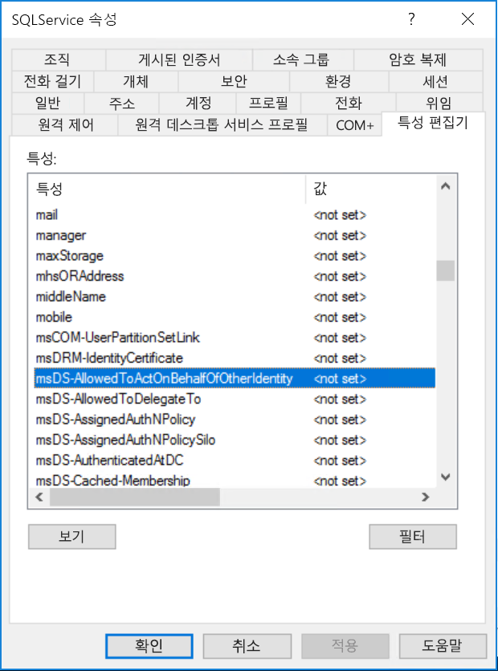
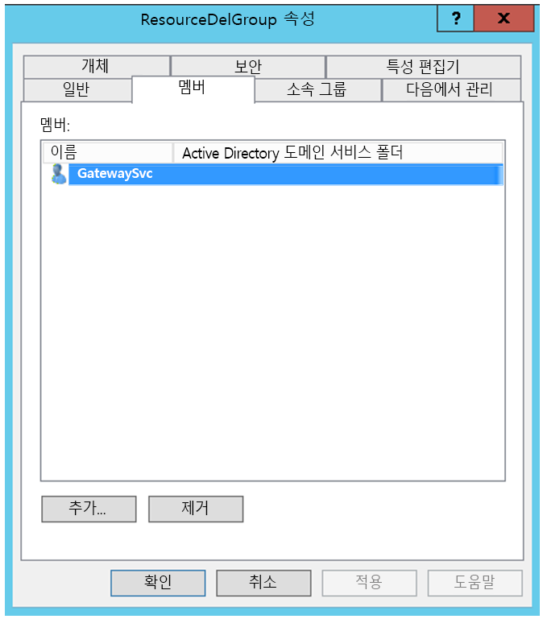
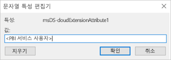

# <a name="configure-kerberos-based-sso-from-power-bi-service-to-on-premises-data-sources"></a>Power BI 서비스에서 온-프레미스 데이터 원본으로 Kerberos 기반 SSO 구성

SSO를 사용하도록 설정하면 Power BI 보고서 및 대시보드가 온-프레미스 원본에 구성된 사용자 수준 권한을 준수하면서 원본의 데이터를 손쉽게 새로 고칠 수 있습니다. [Kerberos 제한 위임](/windows-server/security/kerberos/kerberos-constrained-delegation-overview)을 사용하여 원활한 SSO 연결을 사용하도록 설정합니다. 

## <a name="prerequisites"></a>필수 조건

Kerberos 제한 위임이 제대로 작동하려면 _‘SPN(서비스 사용자 이름)’_ 및 서비스 계정의 위임 설정을 포함한 여러 항목을 구성해야 합니다.

### <a name="install-and-configure-the-microsoft-on-premises-data-gateway"></a>Microsoft 온-프레미스 데이터 게이트웨이 설치 및 구성

온-프레미스 데이터 게이트웨이는 현재 위치 업그레이드 및 기존 게이트웨이의 _설정 적용_을 지원합니다.

### <a name="run-the-gateway-windows-service-as-a-domain-account"></a>도메인 계정으로 게이트웨이 Windows 서비스 실행

표준 설치에서 게이트웨이는 머신-로컬 서비스 계정(**NT Service\PBIEgwService**)으로 실행됩니다.


Kerberos 제한 위임을 사용하도록 설정하려면, Azure AD DirSync/Connect를 통해 Azure AD(Azure Active Directory) 인스턴스가 로컬 Active Directory 인스턴스와 동기화되지 않은 경우 게이트웨이가 도메인 계정으로 실행되어야 합니다. 도메인 계정으로 전환하려면 [게이트웨이 서비스 계정 변경](/data-integration/gateway/service-gateway-service-account)을 참조하세요.

> [!NOTE]
> Azure AD Connect가 구성되고 사용자 계정이 동기화된 경우 게이트웨이 서비스는 런타임 시 로컬 Azure AD 조회를 수행하지 않아도 됩니다. 대신, 게이트웨이 서비스에 대해 로컬 서비스 SID를 사용하여 Azure AD에서 필요한 구성을 모두 완료할 수 있습니다. 이 문서에서 간략하게 설명된 Kerberos 제한 위임 구성 단계는 Azure AD 컨텍스트에서 필요한 구성 단계와 동일합니다. 단, 도메인 계정이 아니라 로컬 서비스 SID로 확인된 Azure AD의 게이트웨이 컴퓨터 개체에 적용됩니다.

## <a name="obtain-domain-admin-rights-to-configure-spns-setspn-and-kerberos-constrained-delegation-settings"></a>SPN(SetSPN) 및 Kerberos 제한 위임 설정을 구성하기 위해 도메인 관리자 권한 얻기

SPN 및 Kerberos 위임 설정을 구성하기 위해 도메인 관리자가 도메인 관리자 권한이 없는 사용자에게 권한을 부여하면 안 됩니다. 다음 섹션에서는 권장되는 구성 단계를 자세하게 다룹니다.

## <a name="configure-kerberos-constrained-delegation-for-the-gateway-and-data-source"></a>게이트웨이 및 데이터 원본에 대해 Kerberos 제한 위임 구성

필요한 경우 게이트웨이 서비스 도메인 계정의 SPN을 도메인 관리자로 구성하고 게이트웨이 서비스 도메인 계정에서 위임 설정을 구성합니다.

### <a name="configure-an-spn-for-the-gateway-service-account"></a>게이트웨이 서비스 계정에 대해 SPN 구성

먼저 게이트웨이 서비스 계정으로 사용된 도메인 계정에 대해 SPN이 이미 생성되어 있는지 확인합니다.

1. 도메인 관리자로, **Active Directory 사용자 및 컴퓨터** MMC(Microsoft Management Console) 스냅인을 시작합니다.

2. 왼쪽 창에서 도메인 이름을 마우스 오른쪽 단추로 클릭하고 **찾기**를 선택한 다음, 게이트웨이 서비스 계정의 계정 이름을 입력합니다.

3. 검색 결과에서 게이트웨이 서비스 계정을 마우스 오른쪽 단추로 클릭하고 **속성**을 선택합니다.

4. **속성** 대화 상자에 **위임** 탭이 표시되는 경우 SPN이 이미 생성된 것이므로 [리사용할 Kerberos 제한 위임 유형 결정](#decide-on-the-type-of-kerberos-constrained-delegation-to-use)으로 건너뛰어도 됩니다.

5. **속성** 대화 상자에 **위임** 탭이 없는 경우, 계정에서 SPN을 수동으로 만들어 사용하도록 설정할 수 있습니다. Windows와 함께 제공되는 [setspn 도구](https://technet.microsoft.com/library/cc731241.aspx)를 사용합니다(SPN을 만드는 도메인 관리자 권한 필요).

   예를 들어 게이트웨이 서비스 계정이 **Contoso\GatewaySvc**이고, 게이트웨이 서비스가 **MyGatewayMachine**이라는 머신에서 실행되고 있다고 가정합니다. 게이트웨이 서비스 계정의 SPN을 설정하려면 다음 명령을 실행합니다.

   ```setspn -a gateway/MyGatewayMachine Contoso\GatewaySvc```

   **Active Directory 사용자 및 컴퓨터** MMC 스냅인을 사용하여 SPN을 설정할 수도 있습니다.
   
### <a name="add-gateway-service-account-to-windows-authorization-and-access-group-if-required"></a>필요한 경우 Windows Authorization and Access Group 그룹에 게이트웨이 서비스 계정 추가

특정 시나리오에서는 Windows Authorization and Access Group에 게이트웨이 서비스 계정을 추가해야 합니다. 이러한 시나리오에는 Active Directory 환경의 보안을 강화하는 경우, 게이트웨이 서비스 계정 및 게이트웨이에서 가장할 사용자 계정이 별도의 도메인이나 포리스트에 있는 경우가 포함됩니다. 도메인/포리스트가 강화되지 않은 상황에도 Windows Authorization and Access Group에 게이트웨이 서비스 계정을 추가할 수 있지만 반드시 필요한 것은 아닙니다.

자세한 내용은 [Windows Authorization and Access Group](/windows/security/identity-protection/access-control/active-directory-security-groups#bkmk-winauthaccess)을 참조하세요.

이 구성 단계를 완료하려면 게이트웨이 서비스 계정이 가장할 수 있는 Active Directory 사용자를 포함하는 각 도메인에 대해 다음을 수행합니다.
1. 도메인의 컴퓨터에 로그인하고 Active Directory 사용자 및 컴퓨터 MMC 스냅인을 시작합니다.
2. **Windows Authorization and Access Group** 그룹을 찾습니다(일반적으로 **Builtin** 컨테이너에 있음).
3. 그룹을 두 번 클릭하고 **구성원** 탭을 클릭합니다.
4. **추가**를 클릭하고 도메인 위치를 게이트웨이 서비스 계정이 있는 도메인으로 변경합니다.
5. 게이트웨이 서비스 계정 이름을 입력하고 **이름 확인**을 클릭하여 이 게이트웨이 서비스 계정에 액세스할 수 있는지 확인합니다.
6. **확인**을 클릭합니다.
7. **적용**을 클릭합니다.
8. 게이트웨이 서비스를 다시 시작합니다.

### <a name="decide-on-the-type-of-kerberos-constrained-delegation-to-use"></a>사용할 Kerberos 제한 위임 유형 결정

표준 Kerberos 제한 위임 또는 리소스 기반 Kerberos 제한 위임의 위임 설정을 구성할 수 있습니다. 데이터 원본이 게이트웨이와 다른 도메인에 속해 있는 경우 리소스 기반 위임을 사용합니다(Windows Server 2012 이상 필요). 두 가지 위임 방법의 차이점에 대한 자세한 내용은 [Kerberos 제한 위임 개요](/windows-server/security/kerberos/kerberos-constrained-delegation-overview)를 참조하세요.

 사용하려는 방법에 따라 다음 섹션 중 하나를 진행합니다. 두 섹션을 모두 완료하면 안 됩니다.
 - [표준 Kerberos 제한 위임의 게이트웨이 서비스 계정 구성](#configure-the-gateway-service-account-for-standard-kerberos-constrained-delegation)
- [리소스 기반 Kerberos 제한 위임의 게이트웨이 서비스 계정 구성](#configure-the-gateway-service-account-for-resource-based-kerberos-constrained-delegation) 

## <a name="configure-the-gateway-service-account-for-standard-kerberos-constrained-delegation"></a>표준 Kerberos 제한 위임에 대한 게이트웨이 서비스 계정 구성

> [!NOTE]
> [표준 Kerberos 제한 위임](/windows-server/security/kerberos/kerberos-constrained-delegation-overview)을 사용하도록 설정하려는 경우 이 섹션의 단계를 완료합니다. 리소스 기반 Kerberos 제한 위임을 사용하도록 설정하려는 경우 [리소스 기반 Kerberos 제한 위임의 게이트웨이 서비스 계정 구성](#configure-the-gateway-service-account-for-resource-based-kerberos-constrained-delegation)의 단계를 완료합니다.

이제 게이트웨이 서비스 계정에 대한 위임 설정을 설정하겠습니다. 이러한 단계를 수행할 수 있는 여러 도구가 있습니다. 여기서는 **Active Directory 사용자 및 컴퓨터** MMC 스냅인을 사용하여 디렉터리의 정보를 관리하고 게시합니다. 도메인 컨트롤러에서는 이 스냅인을 기본적으로 사용할 수 있으며, 다른 머신에서는 Windows 기능 구성을 통해 사용하도록 설정할 수 있습니다.

프로토콜 전송을 사용하여 Kerberos 제한 위임을 구성해야 합니다. 제한된 위임을 사용하여 게이트웨이가 위임된 자격 증명을 제공할 수 있도록 허용할 서비스를 명시적으로 지정해야 합니다. 예를 들어, SQL Server 또는 SAP HANA 서버만 게이트웨이 서비스 계정에서 위임 호출을 수락합니다.

이 섹션에서는 기본 데이터 원본에 대해 이미 SPN을 구성했다고 가정합니다(예: SQL Server, SAP HANA, SAP BW, Teradata 또는 Spark). 이러한 데이터 원본 서버 SPN을 구성하는 방법을 알아보려면 해당 데이터베이스 서버에 대한 기술 설명서 및 [My Kerberos Checklist](https://techcommunity.microsoft.com/t5/SQL-Server-Support/My-Kerberos-Checklist-8230/ba-p/316160)(내 Kerberos 검사 목록) 블로그 게시물의 ‘앱에 필요한 SPN’ 섹션을 참조하세요. 

다음 단계에서는 이미 Kerberos 기반 SSO에 대해 구성된 SQL Server를 실행 중인 데이터베이스 서버와 게이트웨이 컴퓨터라는 두 컴퓨터가 동일한 도메인에 있는 온-프레미스 환경을 가정합니다. 데이터 원본이 이미 Kerberos 기반 Single Sign-On에 대해 구성된 경우에는 지원되는 다른 데이터 원본 중 하나에 대해 이 단계를 채택할 수 있습니다. 이 예제에서는 다음 설정을 사용합니다.

* Active Directory 도메인(Netbios): **Contoso**
* 게이트웨이 머신 이름: **MyGatewayMachine**
* 게이트웨이 서비스 계정: **Contoso\GatewaySvc**
* SQL Server 데이터 원본 머신 이름: **TestSQLServer**
* SQL Server 데이터 원본 서비스 계정: **Contoso\SQLService**

위임 설정을 구성하는 방법은 다음과 같습니다.

1. 도메인 관리자 권한으로 **Active Directory 사용자 및 컴퓨터** MMC 스냅인을 엽니다.

2. 게이트웨이 서비스 계정(**Contoso\GatewaySvc**)을 마우스 오른쪽 단추로 클릭하고 **속성**을 선택합니다.

3. **위임** 탭을 선택합니다.

4. **지정한 서비스에 대한 위임용으로만 이 컴퓨터 신뢰** > **모든 인증 프로토콜 사용**을 차례로 선택합니다.

5. **이 계정이 위임된 자격 증명을 표시할 수 있는 서비스**에서 **추가**를 선택합니다.

6. 새 대화 상자에서 **사용자 또는 컴퓨터**를 선택합니다.

7. 데이터 원본의 서비스 계정을 입력하고 **확인**을 선택합니다.

   예를 들어 SQL Server 데이터 원본에는 *Contoso\SQLService*와 같은 서비스 계정이 있을 수 있습니다. 이 계정에는 데이터 원본에 적절한 SPN이 이미 설정되어 있어야 합니다. 

8. 데이터베이스 서버에 대해 만든 SPN을 선택합니다. 

   예제에서 SPN은 *MSSQLSvc*로 시작합니다. 데이터베이스 서비스에 대해 FQDN 및 NetBIOS SPN 모두를 추가한 경우 둘 다 선택합니다. 하나만 표시될 수도 있습니다.

9. **확인**을 선택합니다. 

   이제 게이트웨이 서비스 계정에서 위임된 자격 증명을 제공할 수 있는 서비스 목록에 SPN이 표시됩니다.

    

10. 설정 프로세스를 계속하려면 [게이트웨이 서비스 계정에 게이트웨이 머신에 대한 로컬 정책 권한 부여](#grant-the-gateway-service-account-local-policy-rights-on-the-gateway-machine)를 계속 진행합니다.

## <a name="configure-the-gateway-service-account-for-resource-based-kerberos-constrained-delegation"></a>리소스 기반 Kerberos 제한 위임에 대한 게이트웨이 서비스 계정 구성

> [!NOTE]
> [리소스 기반 Kerberos 제한 위임](/windows-server/security/kerberos/kerberos-constrained-delegation-overview#resource-based-constrained-delegation-across-domains)을 사용하도록 설정하려는 경우 이 섹션의 단계를 완료합니다. 표준 Kerberos 제한 위임을 사용하도록 설정하려는 경우 [표준 Kerberos 제한 위임의 게이트웨이 서비스 계정 구성](#configure-the-gateway-service-account-for-standard-kerberos-constrained-delegation)의 단계를 완료합니다.

[리소스 기반 Kerberos 제한 위임](/windows-server/security/kerberos/kerberos-constrained-delegation-overview#resource-based-constrained-delegation-across-domains)을 사용하여 Windows Server 2012 이상 버전에 대해 Single Sign-On 연결을 사용하도록 설정합니다. 이 위임 유형을 사용하면 프런트 엔드 서비스와 백 엔드 서비스가 서로 다른 도메인에 있을 수 있습니다. 제대로 작동하려면 백 엔드 서비스 도메인이 프런트 엔드 서비스 도메인을 신뢰해야 합니다.

다음 단계에서는 이미 Kerberos 기반 SSO에 대해 구성된 SQL Server를 실행 중인 데이터베이스 서버와 게이트웨이 머신이라는 두 머신이 서로 다른 도메인에 있는 온-프레미스 환경을 가정합니다. 데이터 원본에 Kerberos 기반 Single Sign-On이 이미 구성되어 있기만 하면, 다른 지원되는 데이터 원본 중 하나에서 이 단계를 수행할 수 있습니다. 이 예제에서는 다음 설정을 사용합니다.

* Active Directory 프런트 엔드 도메인(Netbios): **ContosoFrontEnd**
* Active Directory 백 엔드 도메인(Netbios): **ContosoBackEnd**
* 게이트웨이 머신 이름: **MyGatewayMachine**
* 게이트웨이 서비스 계정: **ContosoFrontEnd\GatewaySvc**
* SQL Server 데이터 원본 머신 이름: **TestSQLServer**
* SQL Server 데이터 원본 서비스 계정: **ContosoBackEnd\SQLService**

다음 구성 단계를 완료합니다.

1. **ContosoFrontEnd** 도메인의 도메인 컨트롤러에서 **Active Directory 사용자 및 컴퓨터** MMC 스냅인을 사용하고 게이트웨이 서비스 계정에 대해 위임 설정이 적용되지 않았는지 확인합니다.

    

2. **ContosoBackEnd** 도메인의 도메인 컨트롤러에서 **Active Directory 사용자 및 컴퓨터**를 사용하고 백 엔드 서비스 계정에 대해 위임 설정이 적용되지 않았는지 확인합니다.

    

3. 계정 속성의 **특성 편집기** 탭에서 **msDS-AllowedToActOnBehalfOfOtherIdentity** 특성이 설정되지 않았는지 확인합니다.

    

4. **Active Directory 사용자 및 컴퓨터**에서 **ContosoBackEnd** 도메인의 도메인 컨트롤러에 그룹을 만듭니다. **GatewaySvc** 게이트웨이 서비스 계정을 **ResourceDelGroup** 그룹에 추가합니다. 

    

5. 명령 프롬프트를 열고 **ContosoBackEnd** 도메인의 도메인 컨트롤러에서 다음 명령을 실행하여 백 엔드 서비스 계정의 **msDS-AllowedToActOnBehalfOfOtherIdentity** 특성을 업데이트합니다.

    ```powershell
    $c = Get-ADGroup ResourceDelGroup
    Set-ADUser SQLService -PrincipalsAllowedToDelegateToAccount $c
    ```

6. **Active Directory 사용자 및 컴퓨터**에서 백 엔드 서비스 계정 속성의 **특성 편집기** 탭에 업데이트가 반영되었는지 확인합니다. 

## <a name="grant-the-gateway-service-account-local-policy-rights-on-the-gateway-machine"></a>게이트웨이 서비스 계정에 게이트웨이 머신에 대한 로컬 정책 권한 부여

마지막으로, 게이트웨이 서비스를 실행 중인 머신(예제에서는 **MyGatewayMachine**)에서 게이트웨이 서비스 계정에 로컬 정책 **인증 후 클라이언트 가장** 및 **운영 체제의 일부로 작동(SeTcbPrivilege)** 을 부여합니다. 로컬 그룹 정책 편집기(**gpedit.msc**)를 사용하여 이 구성을 수행합니다.

1. 게이트웨이 머신에서 **gpedit.msc**를 실행합니다.

2. **로컬 컴퓨터 정책** &gt; **컴퓨터 구성** &gt; **Windows 설정** &gt; **보안 설정** &gt; **로컬 정책** &gt; **사용자 권한 할당**으로 이동합니다.

    

3. **사용자 권한 할당**의 정책 목록에서 **인증 후 클라이언트 가장**을 선택합니다.

    
    
4. 정책을 마우스 오른쪽 단추로 클릭하고 **속성**을 연 다음, 계정 목록을 봅니다. 

    목록에는 게이트웨이 서비스 계정(제한된 위임 유형에 따라 **Contoso\GatewaySvc** 또는 **ContosoFrontEnd\GatewaySvc**)이 포함되어 있어야 합니다.

5. **사용자 권한 할당** 아래의 정책 목록에서 **운영 체제의 일부로 작동(SeTcbPrivilege)** 을 선택합니다. 게이트웨이 서비스 계정이 계정 목록에 포함되어 있는지 확인합니다.

6. **온-프레미스 데이터 게이트웨이** 서비스 프로세스를 다시 시작합니다.

### <a name="set-user-mapping-configuration-parameters-on-the-gateway-machine-if-necessary"></a>게이트웨이 머신에서 사용자 매핑 구성 매개 변수 설정(필요한 경우)

Azure AD Connect가 구성되지 않은 경우 다음 단계에 따라 Power BI 서비스 사용자를 로컬 Active Directory 사용자에 매핑합니다. 이러한 방식으로 매핑된 각 Active Directory 사용자는 데이터 원본에 대한 SSO 권한이 있어야 합니다. 자세한 내용은 [Guy in a Cube 동영상](https://www.youtube.com/watch?v=NG05PG9aiRw)을 참조하세요.

1. 기본 게이트웨이 구성 파일 Microsoft.PowerBI.DataMovement.Pipeline.GatewayCore.dll을 엽니다. 이 파일은 기본적으로 C:\Program Files\On-premises data gateway에 저장되어 있습니다.

1. **ADUserNameLookupProperty**를 사용하지 않는 Active Directory 특성으로 설정합니다. 이후 단계에서는 `msDS-cloudExtensionAttribute1`을 사용합니다. 이 특성은 Windows Server 2012 이상에서만 사용할 수 있습니다. 

1. **ADUserNameReplacementProperty**를 `SAMAccountName`으로 설정하고 구성 파일을 저장합니다.

1. 작업 관리자의 **서비스** 탭에서 게이트웨이 서비스를 마우스 오른쪽 단추로 클릭하고 **다시 시작**을 선택합니다.

    

1. Kerberos SSO를 사용하도록 설정할 각 Power BI 서비스 사용자에 대해 로컬 Active Directory 사용자(데이터 원본에 대한 SSO 권한 포함)의 `msDS-cloudExtensionAttribute1` 속성을 Power BI 서비스 사용자의 전체 사용자 이름(UPN)으로 설정합니다. 예를 들어 Power BI 서비스에 test@contoso.com으로 로그인하고 이 사용자를 SSO 권한이 있는 로컬 Active Directory 사용자(예: test@LOCALDOMAIN.COM)로 매핑하려면, 이 사용자의 `msDS-cloudExtensionAttribute1` 특성을 test@contoso.com으로 설정합니다.

    Active Directory 사용자 및 컴퓨터 MMC 스냅인을 사용하여 `msDS-cloudExtensionAttribute1` 속성을 설정할 수 있습니다.
    
    1. 도메인 관리자로 **Active Directory 사용자 및 컴퓨터**를 시작합니다.
    
    1. 도메인 이름을 마우스 오른쪽 단추로 클릭하고 **찾기**를 선택한 다음, 매핑할 로컬 Active Directory 사용자의 계정 이름을 입력합니다.
    
    1. **특성 편집기** 탭을 선택합니다.
    
        `msDS-cloudExtensionAttribute1` 속성을 찾아 두 번 클릭합니다. Power BI 서비스에 로그인하는 데 사용할 사용자의 전체 사용자 이름(UPN)으로 값을 설정합니다.
    
    1. **확인**을 선택합니다.
    
        
    
    1. **적용**을 선택합니다. **값** 열에 올바른 값이 설정되었는지 확인합니다.

## <a name="complete-data-source-specific-configuration-steps"></a>데이터 원본 관련 구성 단계 완료

SAP HANA 및 SAP BW에는 이러한 데이터 원본에 대한 게이트웨이를 통해 SSO 연결을 설정하기 전에 충족해야 하는 추가 데이터 원본 관련 구성 요구 사항 및 필수 구성 요소가 있습니다. 자세한 내용은 [SAP HANA 구성](service-gateway-sso-kerberos-sap-hana.md) 및 [SAP BW - CommonCryptoLib(sapcrypto.dll) 구성 페이지](service-gateway-sso-kerberos-sap-bw-commoncryptolib.md)를 참조하세요. [SAP BW에서 gx64krb5 SNC 라이브러리를 사용하도록 구성](service-gateway-sso-kerberos-sap-bw-gx64krb.md)할 수도 있지만, 이 라이브러리는 SAP에서 더 이상 지원되지 않으므로 권장되지 않습니다. CommonCryptoLib _또는_ gx64krb5를 SNC 라이브러리로 사용해야 합니다. 두 라이브러리에 대해 구성 단계를 모두 완료하면 안 됩니다.

> [!NOTE]
> 다른 SNC 라이브러리도 BW SSO에 사용할 수 있지만 Microsoft에서 공식적으로 지원하지는 않습니다.

## <a name="run-a-power-bi-report"></a>Power BI 보고서 실행

모든 구성 단계를 완료한 후에는 Power BI의 **게이트웨이 관리** 페이지를 사용하여 SSO에 사용할 데이터 원본을 구성할 수 있습니다. 게이트웨이가 여러 개인 경우 Kerberos SSO에 대해 구성한 게이트웨이를 선택해야 합니다. 그런 다음 데이터 원본에 대한 **고급 설정**에서 **DirectQuery 쿼리에 Kerberos를 통한 SSO 사용**이 선택되어 있는지 확인합니다.


 Power BI Desktop에서 DirectQuery 기반 보고서를 게시합니다. 이 보고서는 Power BI 서비스에 로그인하는 (Azure) Active Directory 사용자에 매핑된 사용자가 액세스할 수 있는 데이터를 사용해야 합니다. 새로 고침의 작동 방식 때문에 가져오기 대신 DirectQuery를 사용해야 합니다. 게이트웨이는 가져오기 기반 보고서를 새로 고칠 때 데이터 원본 생성 시 **사용자 이름** 및 **암호** 필드에 입력한 자격 증명을 사용합니다. 즉, Kerberos SSO가 사용되지 *않습니다*. 게시할 때 여러 게이트웨이가 있는 경우 SSO에 대해 구성한 게이트웨이를 선택합니다. Power BI 서비스에서 이제 보고서를 새로 고치거나, 게시된 데이터 세트를 토대로 새 보고서를 만들 수 있습니다.

이 구성은 대부분의 경우에서 작동합니다. 그러나 Kerberos를 사용하는 경우 환경에 따라 서로 다른 구성이 있을 수 있습니다. 보고서가 로드되지 않는 경우, 도메인 관리자에게 자세히 조사하도록 요청해야 합니다. 데이터 원본이 SAP BW인 경우, 선택한 SNC 라이브러리에 따라 [CommonCryptoLib](service-gateway-sso-kerberos-sap-bw-commoncryptolib.md#troubleshooting) 및 [gx64krb5/gsskrb5](service-gateway-sso-kerberos-sap-bw-gx64krb.md#troubleshooting)의 데이터 원본 관련 구성 페이지에서 문제 해결 섹션을 참조하세요.

## <a name="next-steps"></a>다음 단계

온-프레미스 데이터 게이트웨이 및 DirectQuery에 대한 자세한 내용은 다음 리소스를 참조하세요.

* [온-프레미스 데이터 게이트웨이란?](/data-integration/gateway/service-gateway-onprem)
* [Power BI의 DirectQuery](desktop-directquery-about.md)
* [DirectQuery에서 지원하는 데이터 원본](desktop-directquery-data-sources.md)
* [DirectQuery 및 SAP BW](desktop-directquery-sap-bw.md)
* [DirectQuery 및 SAP HANA](desktop-directquery-sap-hana.md)
