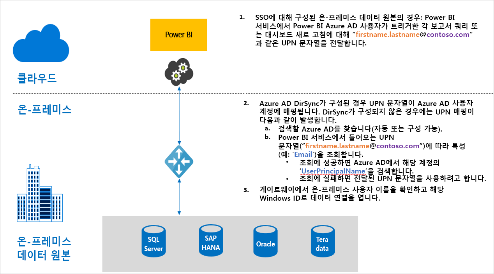

# Power BI의 게이트웨이 SSO(Single Sign-On) 개요

온-프레미스 데이터 게이트웨이를 Kerberos 제한 위임 또는 SAML(Security Assertion Markup Language)로 구성하여 원활한 Single Sign-On 연결을 얻어 Power BI 보고서 및 대시보드를 온-프레미스 데이터에서 업데이트할 수 있습니다. 온-프레미스 데이터 게이트웨이는 온-프레미스 데이터 원본에 연결하는 데 사용하는 DirectQuery를 통한 SSO 연결을 도와줍니다.

현재 다음 데이터 원본이 지원됩니다.

* SQL Server([Kerberos](service-gateway-sso-kerberos.md))
* SAP HANA([Kerberos](service-gateway-sso-kerberos.md) 및 [SAML](service-gateway-sso-saml.md))
* SAP BW([Kerberos](service-gateway-sso-kerberos.md))
* Teradata([Kerberos](service-gateway-sso-kerberos.md))
* Spark([Kerberos](service-gateway-sso-kerberos.md))
* Impala([Kerberos](service-gateway-sso-kerberos.md))

사용자가 Power BI 서비스에서 DirectQuery 보고서와 상호 작용하는 경우 각 교차 필터, 조각, 정렬 및 보고서 편집 작업은 기본 온-프레미스 데이터 원본에 대해 라이브를 실행하는 쿼리에서 발생할 수 있습니다. SSO가 데이터 원본에 대해 구성된 경우 쿼리는 Power BI와 상호 작용하는 사용자의 ID에서 실행합니다(즉, 웹 환경 또는 Power BI 모바일 앱을 통해). 따라서 각 사용자는 구성된 Single Sign-On으로 기본 데이터 원본에서 사용 권한이 있는 데이터를 정확하게 보며, 서로 다른 사용자 간에는 공유 데이터 캐싱이 없습니다.

## SSO를 실행하는 경우 쿼리 단계

SSO로 실행하는 쿼리는 다음 다이어그램에 나와 있는 것처럼 세 단계로 구성됩니다.

이러한 단계에 대한 자세한 내용은 다음과 같습니다.

1. 각 쿼리의 경우 **Power BI 서비스**는 구성된 게이트웨이에 쿼리 요청을 보낼 때 *사용자 계정 이름*(UPN)을 포함합니다.

2. 게이트웨이는 Azure Active Directory UPN을 로컬 Active Directory ID에 매핑해야 합니다.

   a.  Azure AD DirSync(*Azure AD Connect*라고도 함)가 구성된 경우 매핑이 게이트웨이에서 자동으로 적용됩니다.

   b.  그렇지 않으면 게이트웨이가 로컬 Active Directory 도메인에 대해 조회를 수행하여 조회 후 로컬 사용자에게 Azure AD UPN을 매핑합니다.

3. 게이트웨이 서비스 프로세스는 매핑된 로컬 사용자를 가장하고, 기본 데이터베이스에 대한 연결을 열고 쿼리를 보냅니다. 게이트웨이를 데이터베이스와 동일한 컴퓨터에 설치할 필요가 없습니다.

## 다음 단계

SSO의 기초를 이해했으므로 Kerberos 및 SAML에 대한 자세한 정보를 읽어 보세요.

* [SSO(Single Sign-On) - Kerberos](service-gateway-sso-kerberos.md)
* [SSO(Single Sign-On) - Kerberos - 리소스 기반](service-gateway-sso-kerberos-resource.md)
* [SSO(Single Sign-On) - SAML](service-gateway-sso-saml.md)
