---
title: Power BI 서비스 시작
description: Power BI 온라인 서비스 시작(app.powerbi.com)
author: maggiesMSFT
ms.reviewer: ''
ms.service: powerbi
ms.subservice: powerbi-service
ms.topic: tutorial
ms.date: 09/05/2019
ms.author: maggies
LocalizationGroup: Get started
ms.openlocfilehash: 3a9b2a5e7de0a5072b266c7b146488e5d546f616
ms.sourcegitcommit: 64c860fcbf2969bf089cec358331a1fc1e0d39a8
ms.translationtype: HT
ms.contentlocale: ko-KR
ms.lasthandoff: 11/09/2019
ms.locfileid: "73872317"
---
# 자습서:  Power BI 서비스 시작
이 자습서는 *Power BI 서비스* 기능 중 일부를 소개합니다. 자습서를 통해 데이터에 연결하고, 보고서 및 대시보드를 만들고, 데이터에 대해 질문할 수 있습니다. Power BI 서비스에서 훨씬 더 많은 작업을 수행할 수 있습니다. 이 자습서는 의욕을 높여줍니다. Power BI 서비스를 다른 Power BI 제품에 적용하는 방법을 이해하려면 [Power BI란?](fundamentals/power-bi-overview.md)을 읽어 보시기 바랍니다.

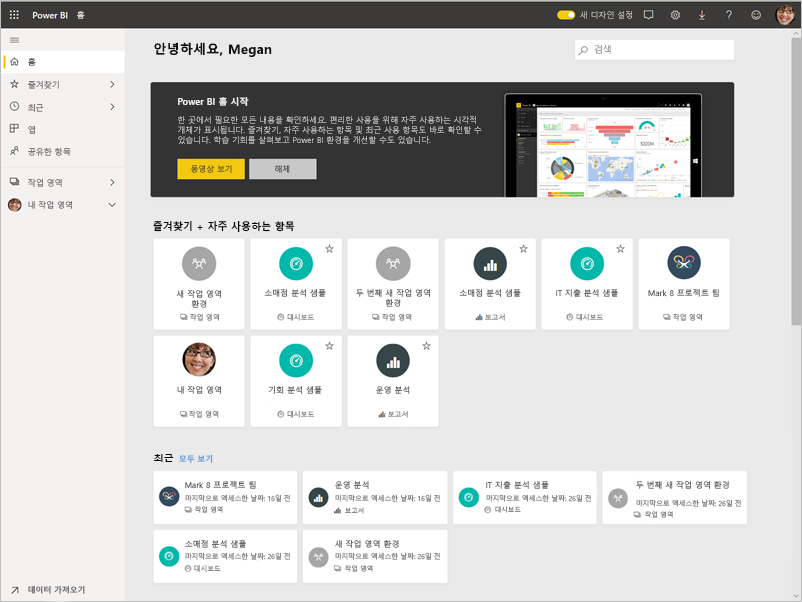

이 자습서에서 수행하는 단계는 다음과 같습니다.

> [!div class="checklist"]
> * Power BI 온라인 계정에 로그인하거나, 계정이 아직 없는 경우 등록합니다.
> * Power BI 서비스를 엽니다.
> * 일부 데이터를 가져와 보고서 뷰에서 엽니다.
> * 해당 데이터를 사용하여 시각화를 만들고 보고서로 저장합니다.
> * 보고서에서 타일을 고정하여 대시보드를 만듭니다.
> * 질문 및 답변 자연어 도구를 사용하여 대시보드에 다른 시각화를 추가합니다.
> * 대시보드의 타일 크기를 조정하고, 다시 정렬하고, 상호 작용합니다.
> * 데이터 세트, 보고서 및 대시보드를 삭제하여 리소스를 정리합니다.

> [!TIP]
> 대신 무료 자가 진행식 교육 과정을 더 선호합니까? [EdX에서 데이터 분석 및 시각화 코스에 등록](https://aka.ms/edxpbi)합니다.

## Power BI 서비스에 등록
Power BI 계정이 없는 경우, 시작하기 전에 [Power BI Pro 평가판에 등록](https://app.powerbi.com/signupredirect?pbi_source=web)합니다.

계정이 있으면 브라우저에 *app.powerbi.com*을 입력하여 Power BI 서비스를 엽니다. 

## 1단계: 데이터 가져오기

Power BI 보고서를 만들고자 하는 경우 Power BI Desktop에서 시작하는 경우가 많습니다. 이번에는 Power BI 서비스에서 보고서를 처음부터 만드는 것부터 시작합니다.

이 자습서에서는 CSV 파일에서 데이터를 가져옵니다. 함께 진행해볼까요? [재무 샘플 CSV 파일을 다운로드합니다](https://go.microsoft.com/fwlink/?LinkID=521962).

1. [Power BI에 로그인합니다](https://www.powerbi.com/). 계정이 없는 경우 평가판에 등록할 수 있습니다.
2. Power BI는 브라우저에서 열립니다. 탐색 창 아래쪽에서 **데이터 가져오기**를 선택합니다.

    **데이터 가져오기** 페이지가 열립니다.   

3. **새 콘텐츠 만들기** 섹션에서 **파일**을 선택합니다. 
   
   
4.  **로컬 파일**을 선택합니다.
   
    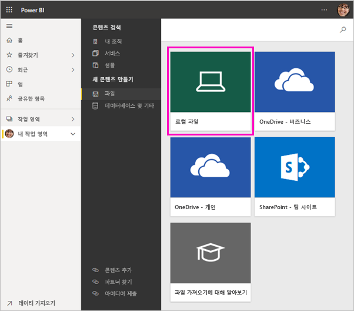

5. 컴퓨터에서 파일을 찾은 다음 **열기**를 선택합니다.

5. 이 자습서에 대해 **가져오기**를 선택하여 Excel 파일을 데이터 세트로 추가합니다. 그런 다음, 보고서와 대시보드를 만드는 데 사용할 수 있습니다. **업로드**를 선택하면 전체 Excel 통합 문서가 Power BI에 업로드되고, Excel Online에서 열어 편집할 수 있습니다.
   
   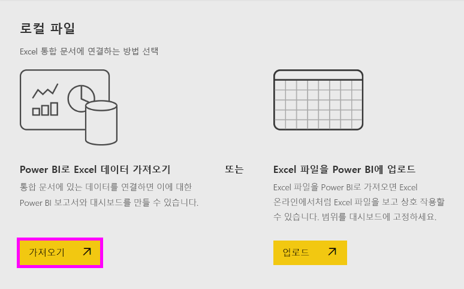
6. 데이터 세트가 준비되면 **데이터 세트**를 선택하고, **재무 샘플** 데이터 세트 옆에 있는 **보고서 만들기**를 선택하여 보고서 편집기를 엽니다. 

    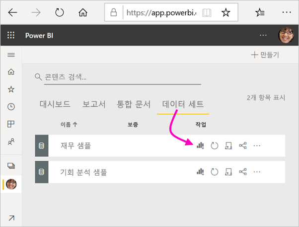

    보고서 캔버스가 비어 있습니다. 오른쪽에는 **필터**, **시각화** 및 **필드** 창이 있습니다.

    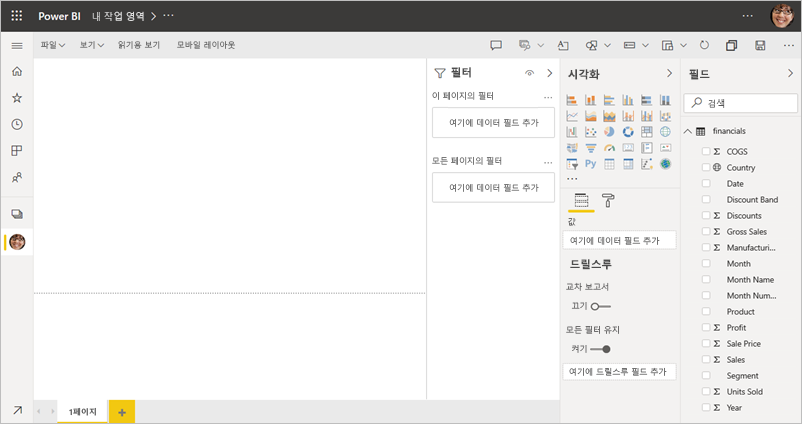

7. 위쪽 탐색 창에 **읽기용 보기** 옵션이 있는 것을 확인합니다. 이 옵션이 있다는 것은 현재 편집용 보기를 사용 중인 것입니다. [둘러보기](service-the-report-editor-take-a-tour.md)를 통해 보고서 편집기를 살펴볼 수 있습니다.

    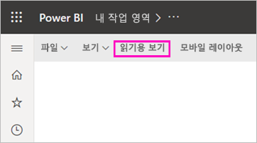

    편집용 보기에서는 자신이 보고서의 ‘소유자’이므로 보고서를 만들고 수정할 수 있습니다.  즉, 사용자가 ‘작성자’입니다.  동료와 보고서를 공유하는 경우, 동료는 ‘소비자’이므로 읽기용 보기에서 보고서를 조작할 수만 있습니다.  [읽기용 보기 및 편집용 보기](consumer/end-user-reading-view.md)에 대해 자세히 알아보세요.

## 2단계: 보고서에서 차트 만들기
데이터에 연결되었으므로 탐색을 시작합니다.  관심 있는 항목을 발견했다면 대시보드를 만들어 이를 모니터링하고 시간이 지남에 따라 어떻게 변경되는지 확인할 수 있습니다. 작동 원리를 살펴보겠습니다.
    
1. 보고서 편집기에서 페이지의 오른쪽에 있는 **필드** 창을 사용하여 시각화를 구축할 수 있습니다. **Gross Sales** 및 **Date** 확인란을 선택합니다.
   
   

    Power BI에서 데이터를 분석하고 시각적 개체를 만듭니다. **Date** 를 먼저 선택한 경우에는 테이블이 표시되고, **Gross Sales**를 먼저 선택한 경우에는 세로 막대형 차트가 표시됩니다. 

2. 데이터를 표시하는 다른 방법으로 전환합니다. 이 데이터를 꺾은선형 차트로 표시해 보겠습니다. **시각화** 창에서 꺾은선형 차트 아이콘을 선택합니다.
   
   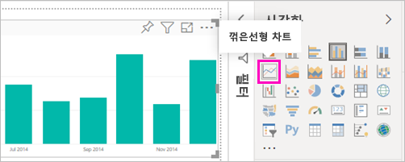

3. 이 차트가 흥미로워 보이므로 대시보드에 *고정*해 보겠습니다. 시각화를 마우스로 가리키고 고정 아이콘을 선택합니다. 이 시각화를 고정하면 대시보드에 저장되고 최신 상태로 유지되므로 최신 값을 한눈에 추적할 수 있습니다.
   
   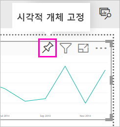

4. 이 보고서는 새로운 항목이므로, 먼저 저장해야 시각화를 대시보드에 고정할 수 있다는 메시지가 표시됩니다. 보고서에 이름(예: *기간별 매출*)을 지정하고 **저장**을 선택합니다. 

5. **새 대시보드**를 선택하고 *자습서용 재무 샘플*로 이름을 지정합니다. 
   
   
   
6. **고정**을 선택합니다.
   
    오른쪽 위에 표시되는 성공 메시지를 통해 시각화가 타일로 대시보드에 추가되었음을 알 수 있습니다.
   
    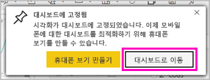

7. **대시보드로 이동**을 선택하여 새 대시보드에 타일로 고정한 꺾은선형 차트를 확인합니다. 
   
   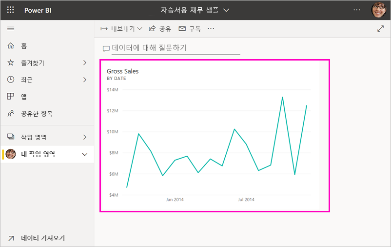
   
8. 대시보드에서 새 타일을 선택하여 보고서로 돌아갑니다. Power BI가 읽기용 보기에서 보고서로 돌아갑니다. 

1. 편집용 보기로 다시 전환하려면, 위쪽 탐색 창에서 **추가 옵션**(...) > **편집**을 선택합니다. 편집용 보기로 돌아가 타일을 계속 탐색하고 고정할 수 있습니다.

    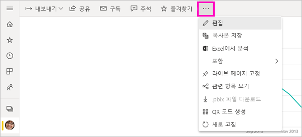

## 3단계: 질문 및 답변을 사용한 탐색

데이터의 빠른 탐색을 위해 질문 및 답변 상자에 질문을 합니다. 질문 및 답변은 데이터에 대한 자연 언어 쿼리를 만듭니다. 대시보드에서 질문 및 답변 상자는 위쪽에 있습니다(**데이터에 대해 질문하기**). 보고서에서는 위쪽 탐색 창에 있습니다(**질문하기**).

1. 대시보드로 돌아가려면 검은색 **Power BI** 막대에서 **내 작업 영역**을 선택합니다.

    

1. **대시보드** 탭에서 대시보드를 선택합니다.

    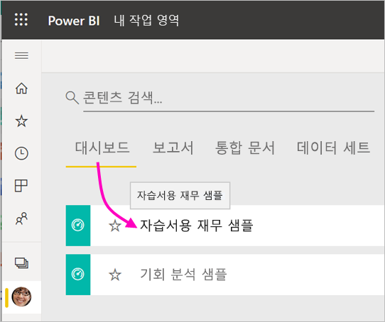

1. **데이터에 대해 질문하기**를 선택합니다. 질문 및 답변에서 자동으로 몇 가지 제안을 제공합니다.

    

    > [!NOTE]
    > 제안이 표시되지 않는 경우 **새 질문 및 답변 환경**을 켭니다.

2. 일부 제안은 단일 값을 반환합니다. 예를 들어 **maximum sale**를 선택합니다.

    질문 및 답변에서 답변을 검색하고 *카드* 시각화 형태로 제공합니다.

    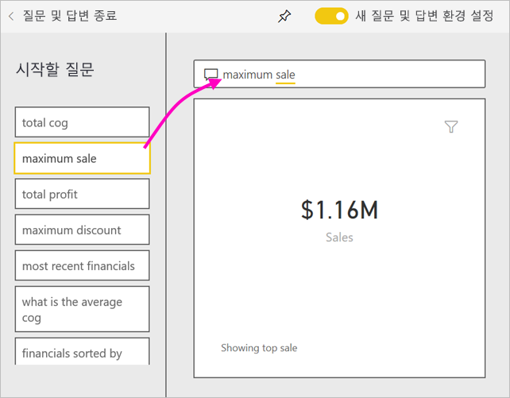

3. 고정 아이콘  을 선택하여 자습서용 재무 샘플 대시보드에 이 시각화를 표시합니다.

1. **시작할 질문** 목록에서 아래로 스크롤한 다음 **average cog for each month**를 선택합니다. 

    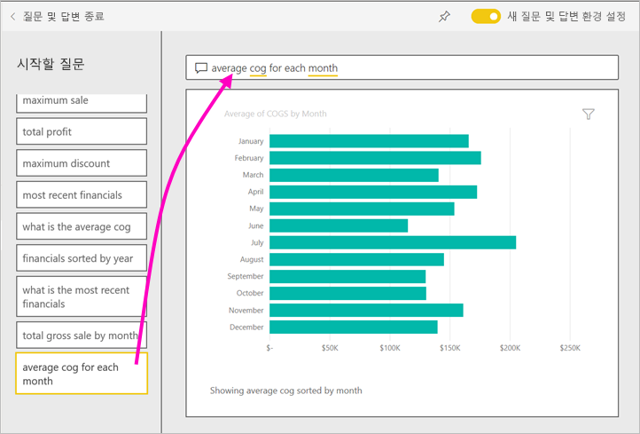

1. **자습서용 재무 샘플** 대시보드에 가로 막대형 차트를 고정합니다.

1. 질문 및 답변 상자의 *by month* 뒤에 커서를 배치하고 *as line*을 입력합니다. **꺾은선형(시각화 유형)** 을 선택합니다. 

    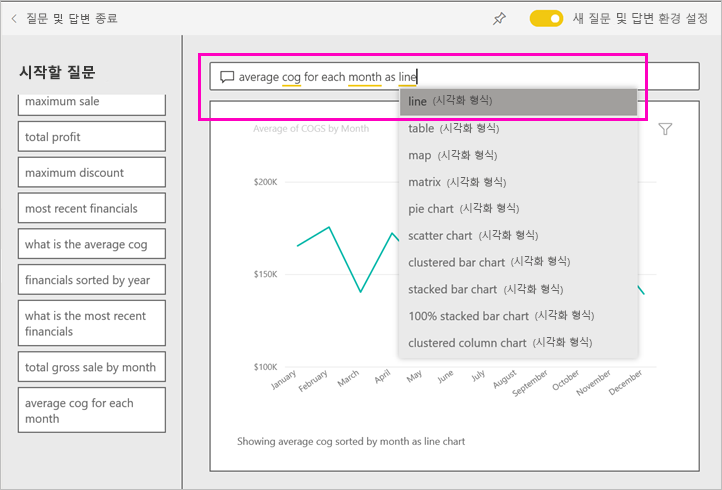

4. **질문 및 답변 끝내기**를 선택하여 대시보드로 돌아가면 만들어진 새 타일이 표시됩니다. 

   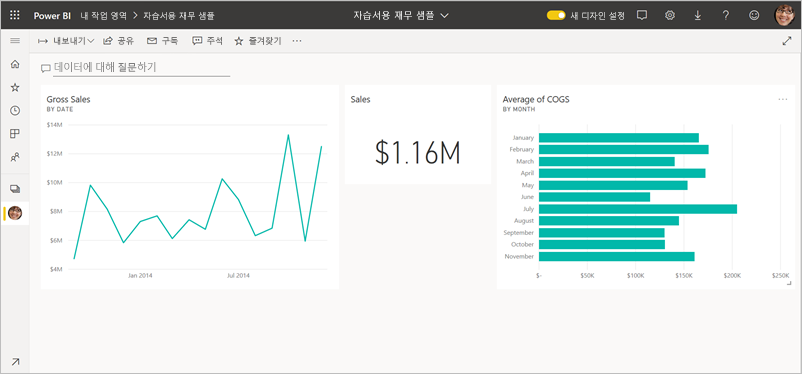

   차트를 꺾은선형 차트로 변경한 경우에도 타일은 고정된 것이기 때문에 가로 막대형 차트로 표시됩니다. 

## 4단계: 타일 위치 변경

대시보드는 넓습니다. 타일을 재정렬하여 대시보드 공간을 더 효율적으로 사용할 수 있습니다.

1. Sales 타일과 같은 높이로 맞춰질 때까지 *Gross Sales* 꺾은선형 차트 타일의 오른쪽 아래 모퉁이를 위로 끈 다음 놓습니다.

    

    이제 두 타일의 높이가 같습니다.

    

1. *Gross Sales* 꺾은선형 차트 아래로 맞춰질 때까지 *Average of COGS* 가로 막대형 차트 타일을 끕니다.

    이편이 훨씬 낫습니다.

    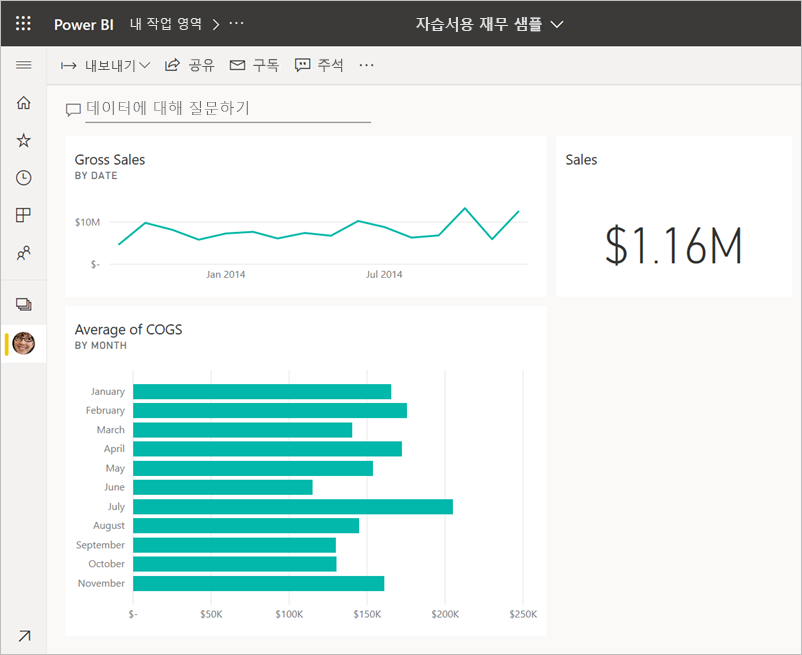

## 5단계: 타일과 상호 작용

고유한 대시보드 및 보고서를 만들기를 시작하기 전에 살펴봐야 하는 마지막 상호 작용이 있습니다. 다른 타일을 선택하면 다른 결과가 발생합니다. 

1. 먼저 보고서에서 고정한 *Gross Sales* 꺾은선형 차트 타일을 선택합니다. 

    Power BI가 보고서를 읽기용 보기로 엽니다. 

2. 브라우저 뒤로 단추를 선택합니다. 

1. 이제 질문 및 답변에서 만든 *Average of COGS* 가로 막대형 차트 타일을 선택합니다. 

    Power BI에서 보고서를 열지 않습니다. 대신 질문 및 답변이 열리는데, 여기에서 이 차트를 만들었기 때문입니다.

## 리소스 정리
자습서를 완료했으므로 데이터 세트, 보고서 및 대시보드를 삭제할 수 있습니다. 

1. 탐색 창에서 **내 작업 영역**이 있는지 확인합니다.
2. **데이터 세트** 탭을 선택하고 이 자습서에 가져온 데이터 세트를 찾습니다.  
3. **추가 옵션**(...) > **삭제**를 선택합니다.

    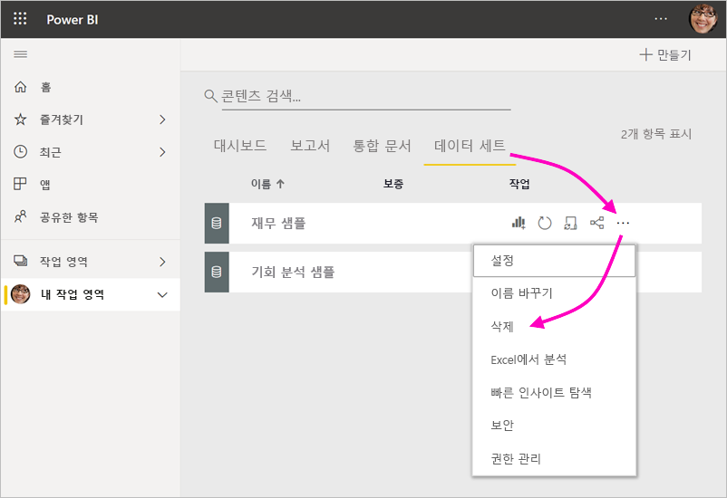

    데이터 세트를 삭제하면 **이 데이터 세트의 데이터를 포함하는 모든 보고서 및 대시보드 타일이 삭제됩니다**라는 경고가 표시됩니다.

4. **삭제**를 선택합니다.

## 다음 단계

시각화 타일을 추가하고 [타일의 이름을 바꾸고, 크기를 조정하고, 연결하고, 위치를 변경](service-dashboard-edit-tile.md)하여 대시보드의 모양을 개선합니다.

