# 자습서: Power BI 서비스 시작(app.powerbi.com)
이 자습서는 ***Power BI 서비스***를 시작할 때 도움이 됩니다. Power BI 서비스를 다른 Power BI 제품에 적용하는 방법을 이해하려면 [Power BI란?](power-bi-overview.md)을 참조하여 시작하는 것이 좋습니다.

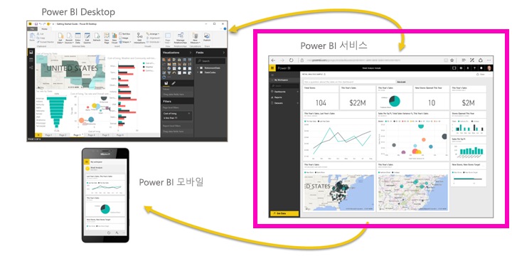

이 자습서에서 수행하는 단계는 다음과 같습니다.

> [!div class="checklist"]
> * Power BI 서비스에 대한 다른 시작 콘텐츠 찾기
> * Power BI 온라인 계정에 로그인 또는 계정이 아직 없는 경우 등록
> * Power BI 서비스 열기
> * 일부 데이터를 가져오고 보고서 보기에서 열기
> * 해당 데이터를 사용하여 시각화를 만들고 보고서로 저장
> * 보고서에서 타일을 고정하여 대시보드 만들기
> * 질문 및 답변 자연어 도구를 사용하여 대시보드에 다른 시각화 추가
> * 데이터 세트, 보고서 및 대시보드를 삭제하여 리소스 정리

## Power BI 서비스에 등록
아직 Power BI에 등록하지 않은 경우 시작하기 전에 [Power BI Pro 평가판에 등록](https://app.powerbi.com/signupredirect?pbi_source=web)합니다.

계정이 이미 있는 경우 브라우저를 열고 app.powerbi.com을 입력하여 Power BI 서비스를 엽니다. 

Power BI Desktop에 대한 도움말 찾고 있는 경우 [Power BI Desktop 시작](desktop-getting-started.md)을 참조하세요. Power BI 모바일에 도움을 찾고 있는 경우 [모바일 디바이스에 대한 Power BI 앱](consumer/mobile/mobile-apps-for-mobile-devices.md)을 참조하세요.

> [!TIP]
> 대신 무료 자가 진행식 교육 과정을 더 선호합니까? [EdX에서 데이터 분석 및 시각화 코스에 등록](http://aka.ms/edxpbi)합니다.

[YouTube 재생 목록](https://www.youtube.com/playlist?list=PL1N57mwBHtN0JFoKSR0n-tBkUJHeMP2cP)을 방문합니다. 시작하는 데 도움이 되는 유용한 비디오는 Power BI 서비스 소개입니다.
> 
> <iframe width="560" height="315" src="https://www.youtube.com/embed/B2vd4MQrz4M" frameborder="0" allowfullscreen></iframe>
> 

## Power BI 서비스란?
Microsoft Power BI 서비스는 Power BI 온라인 또는 app.powerbi.com이라고도 합니다. Power BI는 중요한 정보를 최신 상태로 유지하는 데 도움이 됩니다.  Power BI 서비스를 사용하면 ***대시보드***를 통해 비즈니스의 상태를 파악할 수 있습니다.  대시보드에는 클릭하여 ***보고서***를 열고 자세히 탐색할 수 있는 ***타일***이 표시됩니다.  여러 ***데이터 세트***에 연결하여 관련 데이터를 모두 한 곳으로 가져옵니다. Power BI의 구성 요소를 이해하는 데 도움이 필요한 경우  [Power BI 서비스의 디자이너를 위한 기본 개념](service-basic-concepts.md)을 참조하세요.

Excel 또는 CSV 파일에 중요한 데이터가 있는 경우 Power BI 대시보드를 만들어 어디서나 최신 정보를 받고 다른 사람과 통찰력을 공유할 수 있습니다.  Salesforce와 같은 SaaS 애플리케이션에 대한 구독이 있는 경우  먼저 Salesforce에 연결하여 해당 데이터에서 자동으로 대시보드를 생성하거나 [다른 모든 SaaS 앱을 체크 아웃](service-get-data.md)합니다. 조직의 일부인 경우 [앱](service-create-distribute-apps.md)이 자신에게 게시되었는지 확인합니다.

[Power BI에 대한 데이터를 가져오는](service-get-data.md) 다른 모든 방법에 대해 알아보세요.

## 1단계: 데이터 가져오기
다음은 CSV 파일에서 데이터를 가져오는 예제입니다. 이 자습서의 설명을 따라하려면 [이 샘플 CSV 파일을 다운로드](http://go.microsoft.com/fwlink/?LinkID=521962)하세요.

1. [Power BI에 로그인합니다](http://www.powerbi.com/). 계정이 없는 경우 평가판에 등록할 수 있습니다.
2. Power BI는 브라우저에서 열립니다. 왼쪽 탐색 표시줄의 맨 아래에 있는 **데이터 가져오기**를 선택합니다.
   
   
3. **파일**을 선택합니다. 
   
   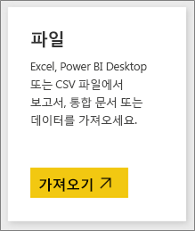
4. 컴퓨터에서 파일을 찾은 다음 **열기**를 선택합니다. 비즈니스용 OneDrive에 저장한 경우 해당 옵션을 선택합니다. 로컬에 저장한 경우 **로컬 파일**을 선택합니다. 
   
   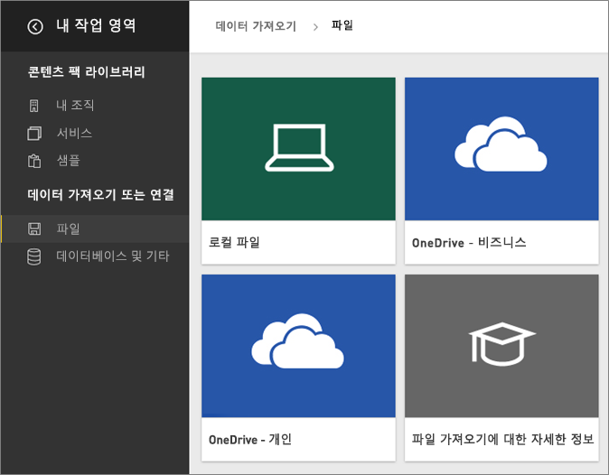
5. 이 자습서에서는 **가져오기**를 선택하여 보고서 및 대시보드를 만드는 데 사용할 수 있는 Excel 파일을 데이터 세트로 추가하겠습니다. **업로드**를 선택할 경우 전체 Excel 통합 문서가 Power BI에 업로드되어 Excel에서 온라인으로 열어 편집할 수 있습니다.
   
   
6. 데이터 세트가 준비되면 **데이터 세트 보기**를 선택하여 보고서 편집기에서 엽니다. 

    

    아직 시각화를 만들지 않았기 때문에 보고서 캔버스는 비어 있을 것입니다.

    

6. 상단의 메뉴 모음을 살펴보고 **읽기용 보기**에 대한 옵션이 있는 것을 확인합니다. 읽기용 보기에 대한 옵션이 있다는 것은 현재 **편집용 보기**에 있다는 것입니다. 

    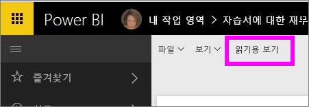

    편집용 보기 상태인 경우 자신이 보고서의 *소유자*이거나 *작성자*이므로 보고서를 만들고 수정할 수 있습니다. 동료와 보고서를 공유할 경우 동료는 *소비자*이므로 읽기용 보기에서 보고서와 상호 작용만 가능합니다. [읽기용 보기 및 편집용 보기](consumer/end-user-reading-view.md)에 대해 자세히 알아보세요.
    
    [둘러보기](service-the-report-editor-take-a-tour.md)를 통해 보고서 편집기에 익숙해질 수 있습니다.
   > 
 

## 2단계: 데이터 세트 살펴보기 시작
데이터에 연결되었으므로 탐색을 시작합니다.  관심 있는 항목을 발견했다면 대시보드를 만들어 이를 모니터링하고 시간이 지남에 따라 어떻게 변경되는지 확인할 수 있습니다. 작동 원리를 살펴보겠습니다.
    
1. 보고서 편집기에서 페이지의 오른쪽에 있는 **필드** 창을 사용하여 시각화를 구축할 수 있습니다.  **총 판매량** 및 **날짜** 옆에 있는 확인란을 선택합니다.
   
   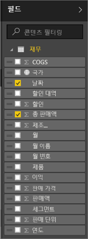

2. Power BI에서 데이터를 분석하고 시각적 개체를 만듭니다.  **날짜**를 먼저 선택한 경우에는 테이블이 표시되고,  **총 판매량**을 먼저 선택한 경우에는 차트가 표시됩니다. 데이터를 표시하는 다른 방법으로 전환합니다. 이 데이터를 꺾은선형 차트로 표시해 보겠습니다. **시각화 창**에서 꺾은선형 차트 아이콘(템플릿이라고도 함)을 선택합니다.
   
   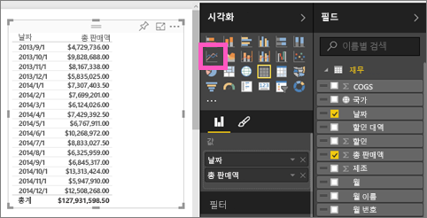

3. 이 차트가 흥미로워 보이므로 대시보드에 *고정*해 보겠습니다. 시각화를 마우스로 가리키고 **고정** 아이콘을 선택합니다.  이 시각화를 고정하면 대시보드에 저장되고 최신 상태로 유지되므로 최신 값을 한눈에 추적할 수 있습니다.
   
   

4. 이 보고서는 새로운 항목이므로 먼저 저장해야 시각화를 대시보드에 고정할 수 있다는 메시지가 표시됩니다. 보고서에 이름(예: *기간별 매출*)을 지정하고 **저장 후 계속**을 선택합니다. 
   
   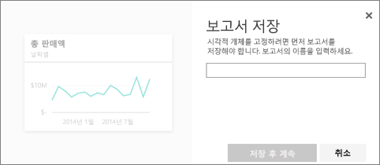
   
5. 새 대시보드에 꺾은선형 차트를 고정하고 "자습서에 대한 재무 샘플"이라는 이름을 지정하겠습니다. 
   
   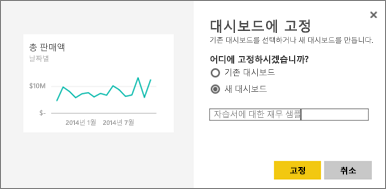
   
1. **고정**을 선택합니다.
   
    오른쪽 위 모서리에 나타나는 성공 메시지를 통해 시각화가 타일로 대시보드에 추가되었음을 알 수 있습니다.
   
    

6. **대시보드로 이동**을 선택하여 꺾은선형 차트가 새 대시보드에 타일로 고정되었는지 확인합니다. 시각화 타일을 추가하고 [타일의 이름을 바꾸고, 크기를 조정하고, 연결하고, 위치를 변경](service-dashboard-edit-tile.md)하여 대시보드의 모양을 개선합니다.
   
   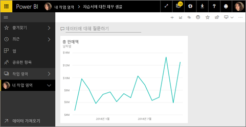
   
   언제든지 대시보드에서 새 타일을 선택하면 보고서로 돌아갑니다. Power BI가 읽기용 보기에서 보고서 편집기로 돌아갑니다. 편집용 보기로 다시 전환하려면 상단 메뉴 모음에서 **보고서 편집**을 선택합니다. 편집용 보기로 전환되면 타일을 계속 탐색하고 고정합니다. 

## 3단계:  질문 및 답변 탐색 계속(자연어 쿼리)
1. 데이터의 빠른 탐색을 위해 질문 및 답변 상자에 질문을 합니다. 질문 및 답변의 질문 상자는 대시보드의 상단(**데이터에 대해 질문하기**) 및 보고서의 상단 메뉴 모음(**질문하기**)에 있습니다. 예를 들어 "어떤 세그먼트에서 가장 많은 수익을 냈나요"라고 입력해 보세요.
   
   

2. 질문 및 답변에서 답변을 검색하고 시각화 형태로 제공합니다. 고정 아이콘 선택  이 시각화도 대시보드에 표시합니다.
3. 시각화를 "자습서용 재무 샘플" 대시보드에 고정합니다.
   
    

4. 대시보드로 돌아가면 새 타일이 표시됩니다.

   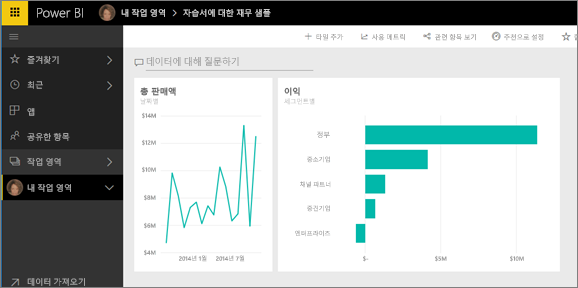

## 리소스 정리
자습서를 완료했으므로 데이터 세트, 보고서 및 대시보드를 삭제할 수 있습니다. 

1. 왼쪽 탐색 모음에서 **내 작업 영역**을 선택합니다.
2. **데이터 세트** 탭을 선택하고 이 자습서에 가져온 데이터 세트를 찾습니다.  
3. 줄임표(...) > **삭제**를 선택합니다.

    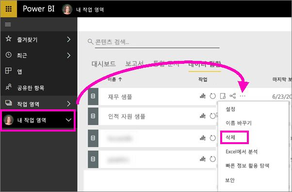

    데이터 세트를 삭제하면 보고서 및 대시보드도 삭제합니다. 

## 다음 단계
더 시도할 준비가 되었다면  Power BI를 자세히 탐색하는 몇 가지 유용한 방법은 다음과 같습니다.

> [!div class="nextstepaction"]
> [사용하는 온라인 서비스에 연결](service-connect-to-services.md)

