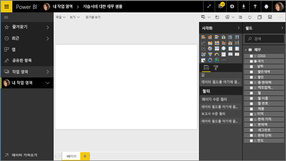
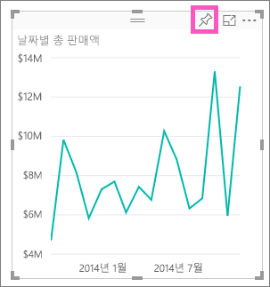
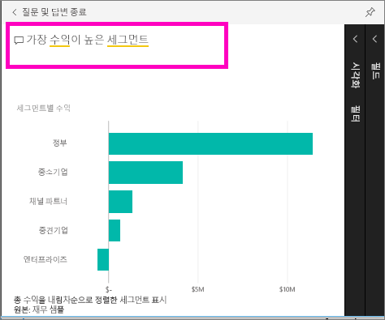
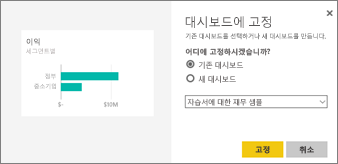

# Power BI 서비스 시작
이 자습서는 ***Power BI 서비스***를 시작할 때 도움이 됩니다. Power BI 서비스를 다른 Power BI 제품에 적용하는 방법을 이해하려면 [Power BI란?](guided-learning/gettingstarted.yml#step-1)을 참조하여 시작하는 것이 좋습니다.

Power BI 서비스에는 무료 버전과 프로 버전에 있습니다. 사용 중인 버전에 관계 없이 브라우저를 열고 시작하려면 www.powerbi.com을 입력합니다. 이미 등록했으면 오른쪽 상단 코너에 표시되는 **로그인** 링크를 선택합니다. Power BI 서비스에 아직 등록하지 않은 경우 **무료 등록** 링크를 대신 선택합니다.

Power BI Desktop에 대한 도움말 찾고 있는 경우 [데스크톱 시작](desktop-getting-started.md)을 참조하세요. Power BI 모바일에 도움을 찾고 있는 경우 [모바일 장치에 대한 Power BI 앱](mobile-apps-for-mobile-devices.md)을 참조하세요.

> [!TIP]
> 대신 무료 자가 진행식 교육 과정을 더 선호합니까? [EdX에서 데이터 분석 및 시각화 코스에 등록](http://aka.ms/edxpbi)합니다.

[YouTube 재생 목록](https://www.youtube.com/playlist?list=PL1N57mwBHtN0JFoKSR0n-tBkUJHeMP2cP)을 방문합니다. 시작하는 데 도움이 되는 유용한 비디오는 Power BI 서비스 소개입니다.
> 
> <iframe width="560" height="315" src="https://www.youtube.com/embed/B2vd4MQrz4M" frameborder="0" allowfullscreen></iframe>
> 
> 
> 

Microsoft Power BI는 중요한 정보를 최신 상태로 유지하는 데 도움이 됩니다.  Power BI 서비스를 사용하면 ***대시보드***를 통해 비즈니스의 실상을 잘 파악할 수 있습니다.  대시보드에는 클릭하여 ***보고서***를 열고 자세히 탐색할 수 있는 ***타일***이 표시됩니다.  여러 ***데이터 집합***에 연결하여 관련 데이터를 모두 한 곳으로 가져옵니다. Power BI의 구성 요소를 이해하는 데 도움이 필요한 경우  [Power BI - 기본 개념](service-basic-concepts.md)을 참조하세요.

Excel 또는 CSV 파일에 중요한 데이터가 있는 경우 Power BI 대시보드를 만들어 어디서나 최신 정보를 받고 다른 사람과 통찰력을 공유할 수 있습니다.  Salesforce와 같은 SaaS 응용 프로그램에 대한 구독이 있는 경우  먼저 [Salesforce에 연결](service-connect-to-salesforce.md)하여 해당 데이터에서 자동으로 대시보드를 생성하거나 [다른 모든 SaaS 앱을 체크 아웃](service-get-data.md)합니다. 조직의 일부인 경우 [앱](service-create-distribute-apps.md)이 자신에게 게시되었는지 확인합니다.

[Power BI에 대한 데이터를 가져오는](service-get-data.md) 다른 모든 방법에 대해 알아보세요.

## 1단계: 데이터 가져오기
다음은 CSV 파일에서 데이터를 가져오는 예제입니다. 이 자습서의 설명을 따라하려면 [이 샘플 CSV 파일을 다운로드](http://go.microsoft.com/fwlink/?LinkID=521962)하세요.

1. [Power BI에 로그인합니다](http://www.powerbi.com/). 계정이 없는 경우 무료로 등록할 수 있습니다.
2. Power BI는 브라우저에서 열립니다. 왼쪽 탐색 창의 맨 아래에 있는 **데이터 가져오기** 를 선택합니다.
   
   
3. **파일**을 선택합니다. 
   
   
4. **로컬 파일**을 선택하고 컴퓨터에서 파일을 찾은 다음 **열기**를 선택합니다.
   
   
5. 이 자습서에서는 보고서 및 대시보드를 만드는 데 사용할 수 있게 Excel 파일을 데이터 집합으로 추가하기 위해 **가져오기**를 선택할 것입니다.  
   
   > [!NOTE]
   > **업로드**를 선택할 경우 전체 Excel 통합 문서가 Power BI에 업로드되어 Excel에서 온라인으로 열어 편집할 수 있습니다.
   > 
   > 
   
   
6. 데이터 집합이 준비되면 **데이터 집합 보기**를 선택하여 보고서 편집기에서 엽니다. .
   
   > [!TIP]
   > [둘러보기](service-the-report-editor-take-a-tour.md)를 통해 보고서 편집기에 익숙해질 수 있습니다.
   > 
   > 

## 2단계: 데이터 집합 살펴보기 시작
이제 데이터에 연결했으므로 탐색을 통해 개요를 파악합니다.  모니터링하려는 항목을 찾은 경우 대시보드를 만들어 변경 내용을 최신 상태로 확인할 수 있습니다.

1. 대시보드에서 데이터 집합 이미지를 선택하여 방금 연결한 데이터를 탐색하거나 **데이터 집합** 제목 아래에서 데이터 집합 이름을 선택하여 엽니다. 데이터 집합이 빈 보고서로 열립니다.
   
   
   
   > [!NOTE]
> 데이터를 탐색하는 다른 방법은 **신속한 정보 활용**입니다.  자세한 내용은 [신속한 정보 활용 소개](service-insights.md)를 참조하세요.
   > 
   > 
2. 페이지 오른쪽에 있는 **필드** 목록에서 시각화를 작성할 필드를 선택합니다.  **총 판매량** 및 **날짜** 옆에 있는 확인란을 선택합니다.
   
   
3. Power BI에서 데이터를 분석하고 시각적 개체를 만듭니다.  **날짜**를 먼저 선택한 경우에는 테이블이 표시되고,  **총 판매량**을 먼저 선택한 경우에는 차트가 표시됩니다. 데이터를 표시하는 다른 방법으로 전환합니다. 꺾은선형 차트 옵션을 선택하여 꺾은선형 차트로 변경해 보세요.
   
   
4. 대시보드에 표시하려는 시각화가 있는 경우 해당 시각화를 마우스 포인터로 가리키고 **고정** 아이콘을 선택합니다.  이 시각화를 고정하면 대시보드에 저장되므로 최신 값을 한눈에 추적할 수 있습니다.
   
   
5. 새 보고서이므로 먼저 저장해야 보고서의 시각화를 대시보드에 고정할 수 있습니다. 보고서에 이름(예: *기간별 매출*)을 지정하고 **저장 및 계속**을 선택합니다. 
   
   
   
   새 보고서가 탐색 창의 **보고서** 제목 아래에 나타납니다.
6. 기존 대시보드 또는 새 대시보드에 타일을 고정합니다. 
   
   
   
   * **기존 대시보드**: 드롭다운에서 대시보드의 이름을 선택합니다.
   * **새 대시보드**: 새 대시보드의 이름을 입력합니다.
7. **고정**을 선택합니다.
   
   오른쪽 위에 나타나는 성공 메시지를 통해 시각화가 타일로 대시보드에 추가되었음을 알 수 있습니다.
   
   
8. **대시보드로 이동**을 선택하여 고정된 타일이 있는 새 대시보드를 확인합니다. 꺾은선형 차트는 대시보드에 타일로 고정됩니다. [타일의 이름을 바꾸고, 크기를 조정하고, 연결하고, 위치를 변경](service-dashboard-edit-tile.md)하여 대시보드의 모양을 개선합니다.
   
   
   
   언제든지 대시보드에서 새 타일을 선택하여 보고서로 돌아갑니다.

## 3단계: 질문 및 답변 탐색 계속(자연어 쿼리)
1. 데이터의 빠른 탐색을 위해 질문 및 답변 상자에 질문을 합니다. 질문 및 답변 상자는 대시보드의 위쪽에 있습니다. 예를 들어 "**어떤 세그먼트에서 가장 많은 수익을 냈나요**"라고 입력해 보세요.
   
   
2. 고정 아이콘 을 선택하여 이 시각화도 대시보드에 표시합니다.
3. 시각화를 재무 샘플 대시보드에 고정합니다.
   
    
4. **Q&A 종료** 에 대한 뒤로 화살표를 선택하여 새 타일이 표시될 대시보드로 돌아갑니다.

## 다음 단계
더 시도할 준비가 되었다면  Power BI를 자세히 탐색하는 몇 가지 유용한 방법은 다음과 같습니다.

* [다른 데이터 집합에 연결](service-get-data.md)합니다.
* 동료와 [대시보드를 공유](service-share-dashboards.md)합니다.
* [대시보드를 설계하는 팁](service-dashboards-design-tips.md)을 확인합니다.
* 대시보드를 [모바일 장치의 Power BI 앱](mobile-apps-for-mobile-devices.md)에서 봅니다.

바로 시작할 준비가 되지 않았다면 Power BI에 익숙해질 수 있도록 설계된 다음 항목에서 시작합니다.

* [보고서, 데이터 집합, 대시보드 및 타일이 모두 결합되는 방법에 대한 자세한 정보](service-basic-concepts.md)
* [Power BI 비디오](videos.md)
* [사용할 수 있는 샘플 확인](sample-datasets.md)

### Power BI를 사용하여 최신 정보 확인
* [@MSPowerBI Twitter](https://twitter.com/mspowerbi)에서 팔로우
* [YouTube 비디오 채널](https://www.youtube.com/channel/UCy--PYvwBwAeuYaR8JLmrfg) 구독
* 필요에 따라 [Power BI 시작 웹 세미나](webinars.md) 시청
* 어디에서 도움을 얻을 수 있는지 알고 계십니까? [도움을 받을 수 있는 10가지 팁](service-tips-for-finding-help.md) 페이지를 참조하세요.

궁금한 점이 더 있나요? [Power BI 커뮤니티에 질문합니다.](http://community.powerbi.com/)

