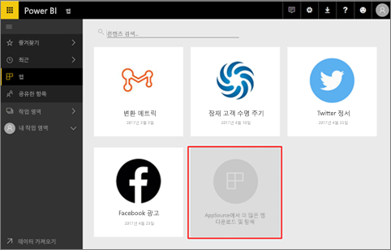
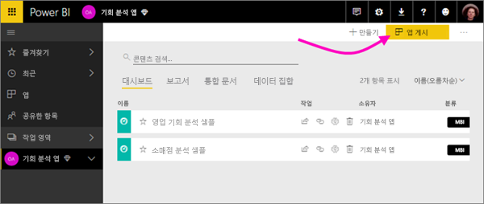
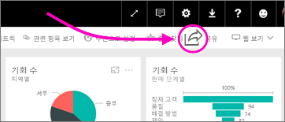
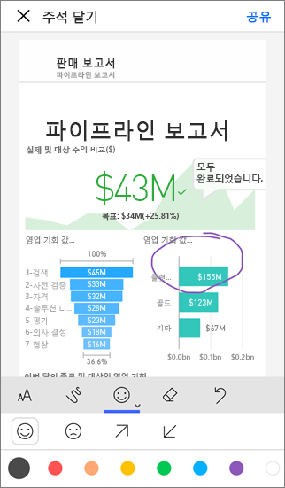

# Power BI에서 공동 작업하고 공유하려면 어떻게 해야 하나요?

대시보드 및 보고서를 만들었습니다. 아마 동료와 공동 작업도 수행할 것입니다. 그런 다음 다른 사람이 액세스할 수 있도록 하려고 합니다. 가장 좋은 배포 방법은 무엇일까요?

이 문서에서는 Power BI에서의 공동 작업 및 공유 옵션을 비교합니다. 

* 의미 있는 보고서와 대시보드를 만들기 위해 *앱 작업 영역*에서 동료들과 공동 작업
* 그러한 대시보드와 보고서를 *앱*에 추가하고 더 큰 규모의 그룹이나 전체 조직에 게시
* 서비스 또는 Power BI 모바일 앱에서 사람들과 대시보드 또는 보고서 공유
- 보고서 인쇄
* 공용 웹 사이트의 웹에 게시합니다. 그러면 전세계 누구든지 해당 항목을 보고 상호 작용할 수 있습니다.

선택하는 옵션에 상관 없이 대시보드를 공유하려면 [Power BI Pro](service-free-vs-pro.md) 라이선스가 필요하거나 콘텐츠가 [프리미엄 용량](service-premium.md)에 있어야 합니다. 선택한 옵션에 따라 대시보드를 보는 동료에 대해 라이선스 요구 사항이 달라집니다. 다음 섹션에 자세한 내용이 나와 있습니다. 

*Power BI 서비스의 앱*

## 앱 작업 영역에서 동료와 공동 작업

팀이 함께 작업하는 경우 신속하게 공동 작업할 수 있도록 동일한 문서에 액세스해야 합니다. Power BI에서 앱 작업 영역은 팀이 소유권 및 중요한 대시보드, 보고서, 데이터 집합 및 통합 문서에 대한 소유권를 공유하는 장소를 제공합니다. 경우에 따라 Power BI 사용자는 조직 구조에 따라 해당 작업 영역을 구성하거나 특정 프로젝트에 대해 작업 영역을 만듭니다. 다른 조직에서는 작업 영역을 사용하여 사용할 다양한 버전의 보고서 또는 대시보드를 저장합니다. 

앱 작업 영역은 동료가 가진 사용 권한을 결정하는 역할을 제공합니다. 해당 역할을 사용하여 전체 작업 영역을 관리하거나 내부 콘텐츠를 제공할 수 있는 사용자를 결정할 수 있습니다.

일부 사용자는 기본적으로 콘텐츠를 내 작업 영역에 배치하고 공유합니다. 앱 작업 영역은 콘텐츠의 공동 소유권을 제공하기 때문에 내 작업 영역보다 공동 작업에 더 적합합니다. 사용자 및 전체 팀은 쉽게 업데이트를 수행하거나 다른 사용자에게 액세스 권한을 제공할 수 있습니다. 내 작업 영역은 일회성 또는 개인 콘텐츠에서 개별 사용자에 의해 사용되기에 적합합니다.

완료된 대시보드가 있다고 가정하면 동료와 공유해야 합니다. 대시보드에 대한 액세스 권한을 제공하는 가장 좋은 방법은 무엇인가요? 대답은 다양한 요인에 따라 다릅니다. 특정 동료가 대시보드를 소유하고 최신 상태로 유지해야 하거나 앱 작업 영역에 있는 모든 콘텐츠에 액세스해야 하는 경우 작업 영역에 추가하는 것이 가장 좋습니다. 동료가 작업 영역에서 모든 콘텐츠가 아닌 대시보드만을 보려는 경우 대안 집합에서 다시 선택할 수 있습니다. 대시보드가 많은 동료에게 배포해야 하는 큰 콘텐츠 집합의 일부인 경우 앱을 게시하는 것이 가장 좋습니다. 그러나 동료에게 하나의 대시보드만이 필요한 경우 대시보드를 공유하는 것이 빠른 진행 방법일 수 있습니다. 

[앱 작업 영역 만들기](service-create-workspaces.md)에 대해 자세히 알아보세요.

**알고 계십니까?** Power BI는 새 작업 영역 환경을 미리 보기 상태로 제공합니다. [새 작업 영역 만들기(미리 보기)](service-create-the-new-workspaces.md)를 참고하여 나중에 작업 영역을 변경하는 방법을 알아봅니다. 

## 앱을 만들어서 데이터 및 인사이트 배포

광범위한 대상에 대시보드를 배포하려 한다고 가정해 봅시다. 사용자는 동료와 *앱 작업 영역*을 만든 다음, 앱 작업 영역에서 대시보드, 보고서 및 데이터 집합을 만들고 다듬었습니다. 이제 그룹이나 전체 조직에 대해 앱으로 게시할 대시보드 및 보고서를 선택합니다. 

앱은 Power BI 서비스([https://powerbi.com](https://powerbi.com))에서 쉽게 찾아 설치할 수 있습니다. 앱에 대한 직접 링크를 비즈니스 사용자에게 보내거나, 해당 사용자가 AppSource에서 해당 앱을 검색할 수 있습니다. Power BI 관리자가 권한을 부여한 경우 동료의 Power BI 계정에 해당 앱을 자동으로 설치할 수 있습니다. [앱 게시](service-create-distribute-apps.md)에 대해 자세히 알아봅니다. 

앱을 설치한 후에 브라우저 또는 모바일 장치에서 볼 수 있습니다.

사용자가 앱을 보려면 Power BI Pro 라이선스가 있거나 앱을 Power BI 프리미엄 용량에 저장해야 합니다. 자세한 내용은 [Power BI 프리미엄이란?](service-premium.md)을 참조하세요.

조직 외부의 사용자에게도 앱을 게시할 수 있습니다. 외부 사용자는 앱 콘텐츠를 보고 상호 작용할 수는 있지만 다른 사용자와 공유할 수는 없습니다.

## 대시보드 및 보고서 공유
고유한 내 작업 영역 또는 앱 작업 영역에서 대시보드 및 보고서를 종료했고 다른 사용자가 액세스하도록 하려는 경우를 가정하겠습니다. 한 가지 방법은 공유하는 것입니다. 

콘텐츠를 공유하려면 Power BI Pro 라이선스가 필요하고 공유하려는 사람도 동일합니다. 또는 콘텐츠가 [프리미엄 용량](service-premium.md)의 작업 영역에 있어야 합니다. 대시보드 또는 보고서를 공유할 경우 공유 대상이 대시보드를 보고 상호 작용할 수는 있지만 편집은 불가능합니다. 기본 데이터 집합에 RLS(행 수준 보안)를 적용하지 않는 한 다른 사용자는 귀하가 대시보드 및 보고서에서 확인할 수 있는 동일한 데이터를 봅니다. 허용하는 경우 사용자와 항목을 공유하는 동료는 자신의 동료와도 공유할 수 있습니다. 

조직 외부 사용자와도 공유할 수 있습니다. 외부 사용자는 대시보드 또는 보고서를 보고 상호 작용할 수는 있지만 공유는 할 수 없습니다. 

Power BI 서비스에서 [대시보드 및 보고서 공유](service-share-dashboards.md)에 대해 자세히 알아보세요. 링크에 필터를 추가하고 [보고서의 필터링된 보기를 공유](service-share-reports.md)할 수도 있습니다.

## Power BI 모바일 앱에서 주석 달기 및 공유
iOS 및 Android 장치용 Power BI 모바일 앱에서 타일, 보고서 또는 시각적 개체에 주석을 달 수 있으며 전자 메일을 통해 다른 사람과 공유할 수 있습니다. 

타일, 보고서 또는 시각적 개체의 스냅숏을 공유하고, 수신자는 귀하가 메일을 보낸 바로 그대로를 확인합니다. 메일에는 대시보드 또는 보고서에 대한 링크가 포함되어 있습니다. Power BI Pro 라이선스가 있거나 콘텐츠가 [프리미엄 용량](service-premium.md)에 있고 이미 다른 사람과 공유했다면 다른 사람이 열 수 있습니다. 타일의 스냅숏은 동일한 메일 도메인의 동료뿐만 아니라 누구에게든 보낼 수 있습니다.

iOS 및 Android 모바일 앱에서 [타일, 보고서 및 시각적 개체 주석 달기 및 공유](consumer/mobile/mobile-annotate-and-share-a-tile-from-the-mobile-apps.md)에 대해 자세히 알아보세요.

또한 Windows 10 장치용 Power BI 앱에서 [타일의 스냅숏을 공유](consumer/mobile/mobile-windows-10-phone-app-get-started.md)할 수 있습니다.

## PDF 또는 기타 정적 파일로 저장 또는 인쇄
또한 Power BI 서비스에서 전체 대시보드, 대시보드 타일, 보고서 페이지 또는 시각화 개체를 PDF(또는 기타 정적 파일 형식)로 인쇄 또는 저장할 수 있습니다. 보고서는 한 번에 한 페이지만 인쇄할 수 있습니다. 전체 보고서를 한 번에 인쇄할 수는 없습니다. [정적 파일로 인쇄 또는 저장](service-print.md)하는 방법에 대해 자세히 알아보세요.

## 웹에 게시

> [!WARNING]
> **웹에 게시**를 사용해야만 콘텐츠를 내부가 아닌 공개적으로 공유합니다.

Power BI 보고서는 어떤 장치에서든 블로그 게시물, 웹 사이트, 소셜 미디어 및 기타 온라인 통신에 대화형 시각화를 포함하여 전체 인터넷에 게시할 수 있습니다. 보고서는 인터넷 상의 누구든지 볼 수 있으며, 자신이 게시한 것을 볼 수 있는 사람을 제어할 수는 없습니다. 보는 사람은 Power BI 라이선스가 필요하지 않습니다. 자신이 편집할 수 있는 보고서만 웹에 게시할 수 있습니다. 자신과 공유되지 않았거나 앱에 없는 보고서는 웹에 게시할 수 없습니다. [웹에 게시](service-publish-to-web.md)에 대한 자세한 내용을 알아보세요.

## 다음 단계
* [동료 및 다른 사용자와 대시보드 공유](service-share-dashboards.md)
* [Power BI에서 앱 만들기 및 게시](service-create-distribute-apps.md)
* 의견이 있으신가요? 제안 사항이 있으시면 [Power BI 커뮤니티 사이트](https://community.powerbi.com/)를 방문하세요.
* 궁금한 점이 더 있나요? [Power BI 커뮤니티를 이용](http://community.powerbi.com/)하세요.

