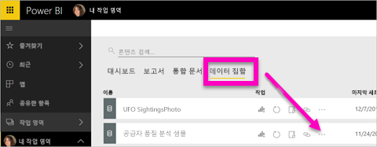
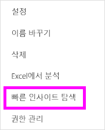
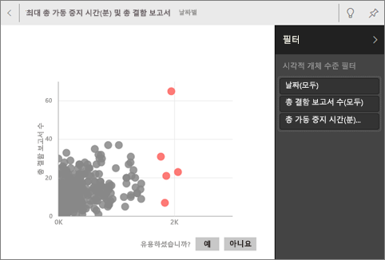
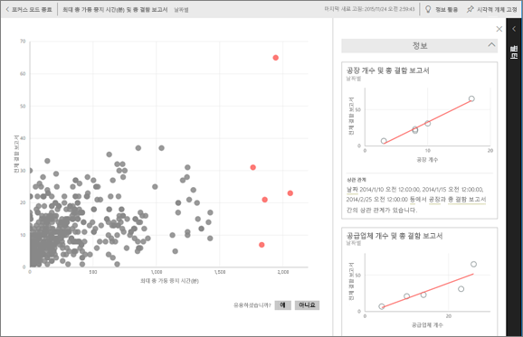

# Power BI를 사용하여 데이터 인사이트를 자동으로 생성
새 데이터 세트가 있는데 어디서 시작해야 할지가 잘 모르나요? 빠르게 대시보드를 만들어야 하나요? 놓쳤을 수도 있는 인사이트를 찾고 싶나요?

빠른 인사이트를 실행하여 데이터를 기준으로 흥미로운 대화형 시각화를 생성합니다. 신속한 정보 활용은 데이터 세트 전체에 대해 실행하거나(신속한 정보 활용) 특정 대시보드 타일에 대해 실행할 수 있습니다(지정된 범위의 신속한 정보 활용). 인사이트에 대해서도 인사이트를 실행할 수 있습니다.

> [!NOTE]
> 인사이트는 DirectQuery에서 작동하지 않고, Power BI에 업로드한 데이터에서만 작동합니다.
> 

인사이트 기능은 Microsoft Research와의 연계를 통해 개발되는 [고급 분석 알고리즘 집합](service-insight-types.md)의 성장을 기반으로 구축됩니다. 당사는 더 많은 사람들이 새롭고 직관적인 방식으로 각자 데이터의 정보를 활용할 수 있도록 하기 위해 노력할 것입니다.

## 데이터 세트에서 신속한 정보 활용을 실행합니다.
Amanda가 데이터 세트에 대한 빠른 인사이트를 실행하고, 정보를 포커스 모드에서 열고, 정보 중 하나를 대시보드에 타일로 고정한 다음, 대시보드 타일에 대한 정보를 얻는 비디오를 시청하세요.

<iframe width="560" height="315" src="https://www.youtube.com/embed/et_MLSL2sA8" frameborder="0" allowfullscreen></iframe>

이제 여러분 차례입니다. [공급업체 품질 분석 샘플](sample-supplier-quality.md)을 사용하여 인사이트를 살펴보세요.

1. **데이터 세트** 탭에서 줄임표(...)를 선택한 다음, **빠른 인사이트 탐색**을 선택합니다.
   
    
   
    
2. Power BI는 [다양한 알고리즘](service-insight-types.md)을 사용하여 데이터 세트의 추세를 검색합니다.
   
    
3. 몇 초 이내에 정보가 준비됩니다.  **인사이트 보기**를 선택하여 시각화를 표시합니다.
   
    
   
    > [!NOTE]
    > 데이터가 통계적으로 중요하지 않기 때문에 일부 데이터 세트는 인사이트를 생성할 수 없습니다.  자세한 내용은 [인사이트에 대한 데이터 최적화](service-insights-optimize.md)를 참조하세요.
    > 
    
4. 최대 32개의 개별 정보 카드가 있는 특수 **빠른 인사이트** 캔버스에 시각화가 표시됩니다. 각 카드에는 차트 또는 그래프와 간략한 설명이 있습니다.
   
    

## 인사이트 카드와 상호 작용

1. 시각화를 대시보드에 추가하려면 카드를 마우스로 가리키고 고정 아이콘을 선택합니다.

2. 카드를 마우스로 가리키고 줄임표(...)를 선택한 다음, **인사이트 보기**를 선택합니다. 

    인사이트 화면이 포커스 모드로 열립니다.
   
    
3. 포커스 모드에서는 다음 작업을 수행할 수 있습니다.
   
   * 시각화를 필터링합니다. **필터** 창이 아직 열려 있지 않은 경우 창 오른쪽에 있는 화살표를 선택하여 확장합니다.

       
   * **시각적 개체 고정**을 선택하여 대시보드에 인사이트 카드를 고정합니다.
   * 카드 자체에서 인사이트를 실행합니다. 이 작업을 ‘지정된 범위의 인사이트’라고도 합니다. 오른쪽 위에서 전구 모양 아이콘  또는 **인사이트 얻기**를 선택합니다.
     
       
     
     인사이트가 왼쪽에 표시되고 해당 단일 인사이트의 데이터에만 기초한 새 카드는 오른쪽에 표시됩니다.
     
       
4. 원래의 인사이트 캔버스로 돌아가려면 왼쪽 위 모서리에서 **포커스 모드 종료**를 선택합니다.

## 대시보드 타일에서 인사이트 실행
데이터 세트 전체를 대상으로 인사이트를 검색하는 것보다, 검색 범위를 좁혀 단일 대시보드 타일을 만드는 데 사용되는 데이터에 대해 지정된 범위의 인사이트를 수행합니다. 

1. 대시보드를 엽니다.
2. 타일을 마우스로 가리킵니다. 줄임표(...)를 선택한 다음, **인사이트 보기**를 선택합니다. 타일이 오른쪽에 표시되는 인사이트 카드와 함께 [포커스 모드](service-focus-mode.md)로 열립니다.    
   
        
3. 인사이트 하나로 호기심이 자극되나요? 자세히 알아보려면 해당 인사이트 카드를 선택합니다. 선택한 인사이트는 왼쪽에 나타나고 해당 단일 인사이트의 데이터에만 기초한 새 인사이트 카드는 오른쪽에 표시됩니다.    
4. 데이터를 계속 꼼꼼히 살펴보고, 흥미로운 정보가 있으면, 오른쪽 위 모서리에서 **시각적 개체 고정**을 선택하여 대시보드에 고정하세요.

## 다음 단계
- 데이터 세트의 소유자인 경우 [빠른 인사이트 활용을 위해 데이터 세트를 최적화](service-insights-optimize.md)합니다.
- [사용 가능한 빠른 인사이트 유형](service-insight-types.md)에 대해 알아봅니다.

궁금한 점이 더 있나요? [Power BI 커뮤니티를 이용](http://community.powerbi.com/)하세요.

