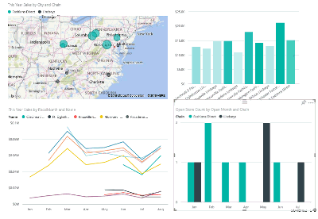
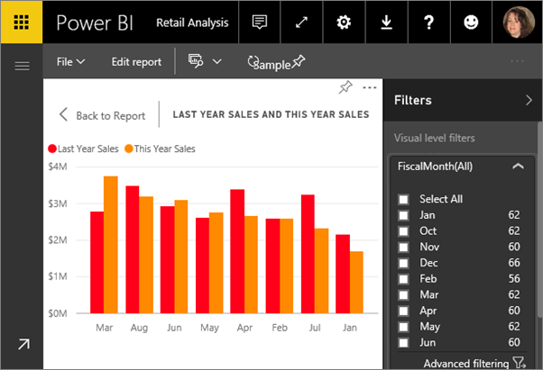

# Power BI의 읽기용 보기에서 보고서와 상호 작용
## 읽기용 보기
읽기용 보기는 [편집용 보기](service-interact-with-a-report-in-editing-view.md)만큼 대화형은 아니지만 데이터를 조사하기 위한 여러 가지 옵션을 제공합니다. 읽기용 보기에서만 열 수 있는 [사용자와 공유된](service-share-dashboards.md) 보고서를 볼 때 유용합니다.

읽기용 보기는 데이터를 다루고 알아가는 데 있어서 재미있고 안전한 방법입니다. 읽기용 보기에서 페이지의 시각화 개체를 상호 간에 강조 표시하고 필터링할 수 있습니다.  하나의 시각적 개체에서 값을 강조 표시하거나 선택하고 즉시 다른 시각적 개체에 미치는 영향을 확인합니다. 필터 창을 사용하여 보고서 페이지에 필터를 추가하고 수정하며 시각화에 값이 정렬되는 방식을 변경합니다. 사용자가 수행한 필터링 및 강조 표시는 보고서와 함께 저장되지 않습니다.

## 페이지에서 관련 시각화 상호 간에 강조 표시.
단일 보고서 페이지에 있는 시각화는 모두 서로 "연결되어" 있습니다.  즉, 하나의 시각화에서 하나 이상의 값을 선택하면 동일한 값을 사용하는 다른 시각화가 선택 항목에 따라 변경됩니다.

> [!NOTE]
> 시각화에서 요소를 둘 이상 선택하려면 Ctrl 키를 누른 상태로 선택합니다.
> 
> 

## 세부 정보를 보려면 시각적 요소를 마우스로 가리킵니다.

## 시각화에서 데이터 정렬
줄임표(...)를 선택하여 **정렬 기준**을 엽니다. 드롭다운 화살표를 선택하여 정렬 기준으로 사용할 필드를 선택하거나 AZ 아이콘을 선택하여 오름차순과 내림차순 사이를 전환합니다. 

 

## 필터와 상호 작용
보고서 작성자가 보고서의 페이지에 필터를 추가한 경우 읽기용 보기에서 필터와 상호 작용할 수 있습니다. 변경 내용은 보고서와 함께 저장되지 않습니다.

1. 오른쪽 상단에 있는 필터 아이콘을 선택합니다.
   
     
2. 사용자가 선택한 시각적 개체에 적용된 모든 필터(시각적 수준 필터)가 전체 보고서 페이지(페이지 수준 필터) 및 전체 보고서(보고서 수준 필터)에 표시됩니다.
   
   
3. 필터를 마우스로 가리키고 아래쪽 화살표를 선택하여 확장합니다.
   
   
4. 필터를 변경하고 시각적 개체에 준 영향을 확인합니다.  
   
   * 이 예제에서는 **체인**의 페이지 수준 필터가 있습니다. 하나에서 확인 표시를 제거하고 다른 곳에 추가하여 **Lindseys** 대신 **Fashions Direct**로 변경합니다.
     
     
   * 또는 지우개 아이콘 을 선택하거나 체인 저장소를 모두 선택하여 **체인**에 대한 필터링을 완전히 제거합니다.
   * **District** 페이지 수준 필터를 선택하고 **고급 필터링**으로 전환합니다. **FD**로 시작하고 숫자 4를 포함하지 않는 구역만 표시하도록 필터링합니다.
     
     

자세한 내용은 [보고서에 필터 추가](power-bi-report-add-filter.md) 및 [보고서에서 필터 정보 및 강조 표시](power-bi-reports-filters-and-highlighting.md)를 참조하세요.

## 개별 시각적 개체 확대
시각적 개체를 마우스로 가리키고 **포커스 모드** 아이콘 을 선택합니다. 아래와 같이 포커스 모드에서 시각화를 보고 전체 보고서 캔버스를 채우도록 확장합니다.

메뉴 표시줄, 필터 창, 기타 크롬 없이 동일한 시각화를 표시하려면 상위 메뉴 모음 에서 **전체 화면** 아이콘을 선택합니다.

자세한 내용은 [보고서에 대한 포커스 모드](service-focus-mode.md) 및 [보고서에 대한 전체 화면 모드](service-fullscreen-mode.md)를 참조하세요.

## 표시 크기 조정
보고서는 다양한 장치에서 다양한 화면 크기 및 가로 세로 비율로 볼 수 있습니다.  기본 렌더링으로는 장치에서 보고자 하는 모습이 아닐 수 있습니다.  조정하려면 **보기**를 선택하고 다음을 선택합니다.

* 페이지에 맞추기: 페이지에 가장 잘 맞게 콘텐츠 조정
* 너비에 맞추기: 페이지의 너비에 맞게 콘텐츠 조정
* 실제 크기: 콘텐츠를 전체 크기로 표시  

  읽기용 보기에서 선택한 표시 옵션은 임시이며 보고서를 닫을 때 저장되지 않습니다.

  자세한 내용은 [자습서: 보고서의 표시 설정 변경](power-bi-change-report-display-settings.md)을 참조하세요.

## 다음 단계
[Power BI의 보고서](service-reports.md)

[편집용 보기 열기](service-reading-view-and-editing-view.md)

궁금한 점이 더 있나요? [Power BI 커뮤니티를 이용하세요.](http://community.powerbi.com/)

