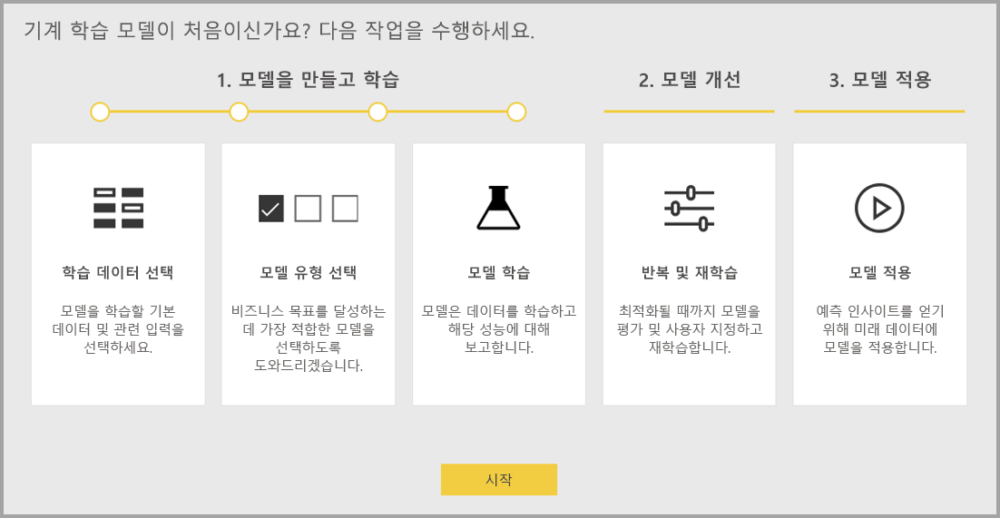
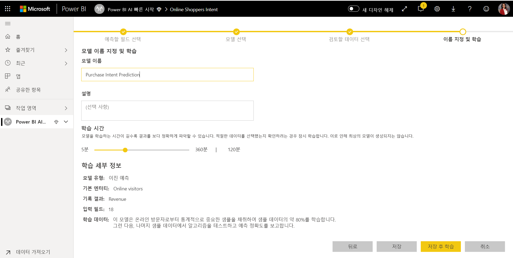
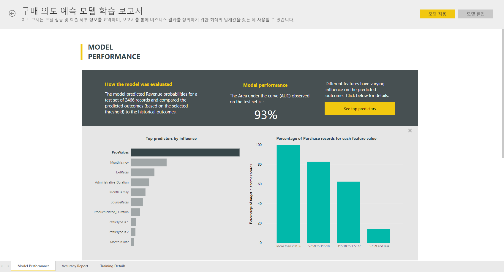
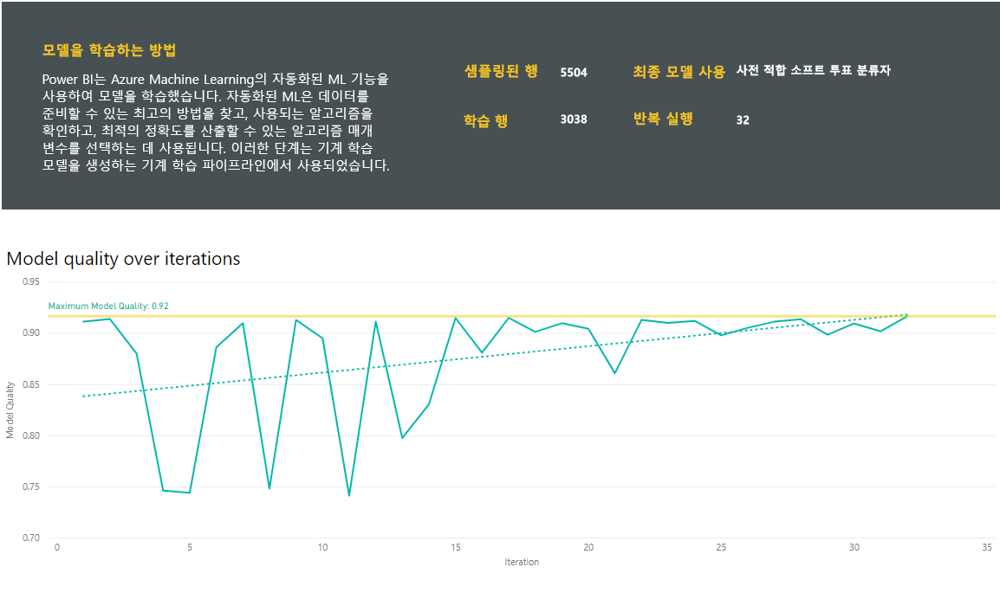
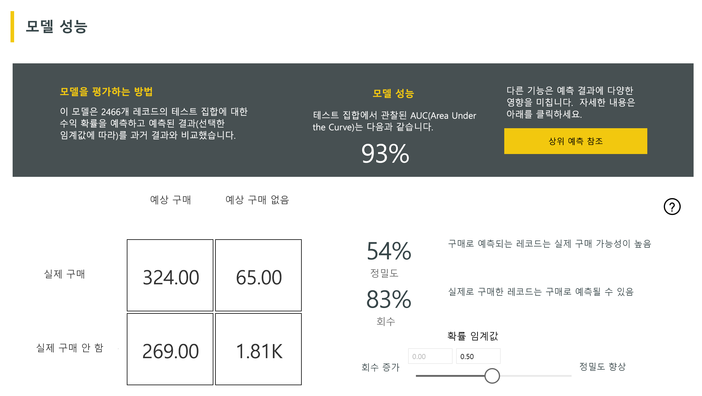
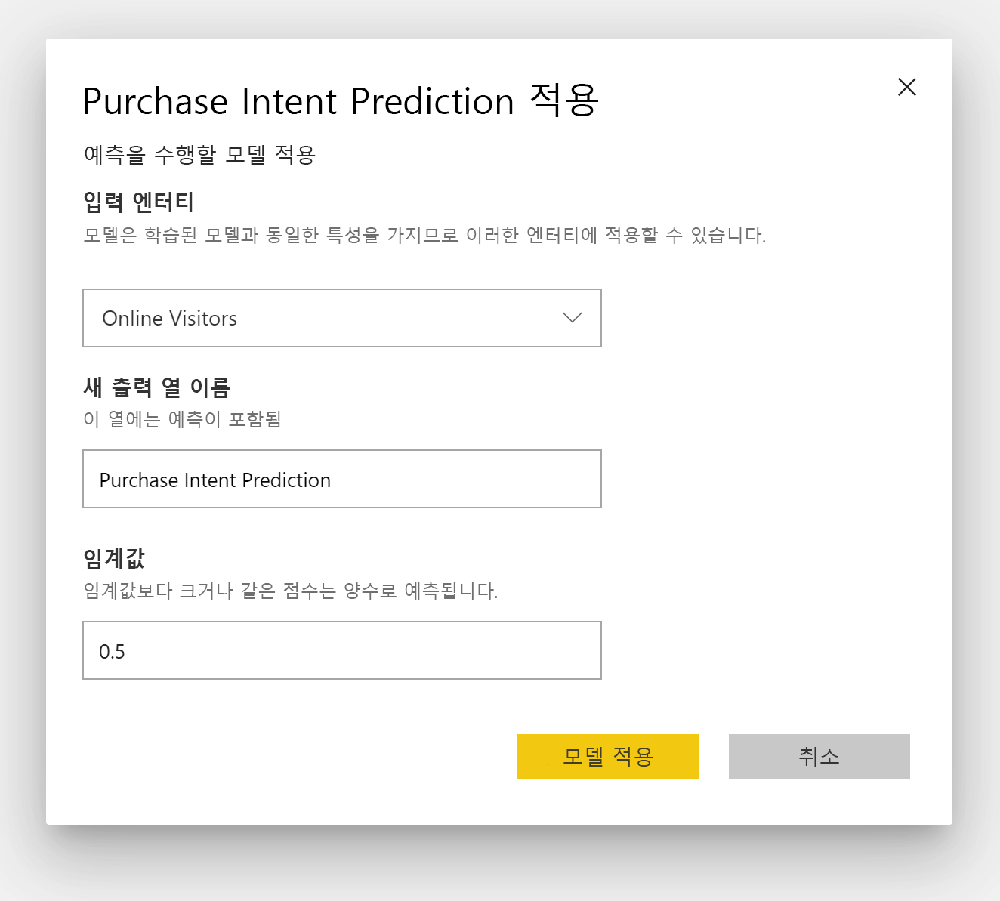

# Power BI에서 Machine Learning 자동화(미리 보기)

데이터 흐름을 위한 자동화된 기계 학습(AutoML)을 통해 비즈니스 분석가는 Power BI에서 직접 Machine Learning 모델을 학습, 유효성 검사 및 호출할 수 있습니다. AutoML은 분석가들이 그들의 데이터 흐름을 사용하여 모델을 학습시키기 위한 입력 데이터를 지정할 수 있는 새로은 ML 모델을 만드는 간단한 환경을 포함합니다. 이 서비스는 자동으로 가장 관련성이 높은 기능을 추출하고, 적절한 알고리즘을 선택 및 튜닝하고 ML 모델의 유효성을 검사합니다. 모델을 학습시킨 후, Power BI는 분석가에게 결과와 성능을 설명하는 유효성 검사의 결과를 포함하는 보고서를 자동으로 생성합니다. 이후, 데이터 흐름 내에서 모든 새로운 또는 업데이트된 데이터에 대해 모델을 호출할 수 있습니다.

자동화된 기계 학습은 Power BI Premium 및 Embedded 용량에서 호스트되는 데이터 흐름에 대해서만 사용할 수 있습니다. 이 미리 보기에서, AutoML을 사용하면 이진 예측, 분류 및 회귀 모델에 대한 기계 학습 모델을 학습시킬 수 있습니다.

## AutoML 사용

[Power BI 데이터 흐름](service-dataflows-overview.md)은 빅 데이터에 대한 셀프 서비스 데이터 준비를 제공합니다. AutoML를 사용하면 Power BI 내에서 바로 기계 학습 모델을 빌드하기 위한 데이터 준비 작업을 활용할 수 있습니다.

Power BI에서 AutoML을 통해 데이터 분석가는 데이터 흐름을 사용하여 Power BI 기술만 사용하여 단순화된 환경으로 기계 학습 모델을 빌드할 수 있습니다. ML 모델 생성의 이면에 있는 대부분의 데이터 과학은 Power BI에 의해 자동화되며, 생산된 모델이 높은 품질의 모델이 되도록 가이드되며 ML 모델을 생성하는 데 사용된 프로세스에 대한 완전한 통찰력을 제공합니다.

AutoML은 데이터 흐름에 대한 **이진 예측**, **분류** 및 **회귀** 모델의 생성을 지원합니다. 이들은 과거 관찰로 알려진 결과로부터 학습하여 다른 관찰의 결과를 예측하는 것을 의미하는 지도 기계 학습 모델의 유형입니다. AutoML 모델을 학습시키기 위한 입력 데이터 집합은 알려진 결과를 사용하여 **레이블이 지정된** 레코드 집합입니다.

Power BI에서 AutoML은 ML 모델을 만들기 위해 [Azure Machine Learning 서비스](https://docs.microsoft.com/azure/machine-learning/service/overview-what-is-azure-ml)에서 [자동화된 ML](https://docs.microsoft.com/azure/machine-learning/service/concept-automated-ml)을 통합합니다. 그러나 Power BI에서 AutoML를 사용하기 위해 Azure 구독이 필요하지는 않습니다. ML 모델을 학습하고 호스팅하는 프로세스는 Power BI 서비스에서 완전히 관리됩니다.

ML 모델을 학습시킨 후, AutoML은 ML 모델의 예상 성능을 설명하는 Power BI 보고서를 자동으로 생성합니다. AutoML은 모델이 반환한 예측에 영향을 주는, 입력 중 주요 영향 요인을 강조 표시하여 설명 가능성을 강조합니다. 보고서에는 ML 모델 유형에 따라 모델에 대한 주요 메트릭도 포함됩니다.

생성된 보고서의 다른 페이지는 모델의 통계 요약과 학습 상세 정보를 표시합니다. 통계 요약은 모델에 대한 성능의 표준 데이터 과학 측정을 보려고 하는 사용자에게 유용합니다. 학습 상세 정보에는 모델을 만들기 위해 실행된 모든 반복이 관련된 모델링 매개 변수와 함께 요약되어 있습니다. 또한 ML 모델을 생성하기 위해 각 입력이 사용된 방법이 설명되어 있습니다.

그런 다음 ML 모델을 데이터에 적용하여 점수를 매길 수 있습니다. 데이터 흐름을 새로 고칠 때, ML 모델의 예측은 데이터에 자동으로 적용됩니다. Power BI는 ML 모델이 생성하는 각 특정 예측 점수에 대한 개별화된 설명을 제공합니다.

## 기계 학습 모델 만들기

이 섹션에는 AutoML 학습 모델을 만드는 방법을 설명 합니다. 

### ML 모델을 만들기 위한 데이터 준비

Power BI에서 기계 학습 모델을 만들려면 먼저 ML 모델 학습에 사용되는 기록 결과 정보를 사용하여 데이터에 대한 데이터 흐름을 만들어야 합니다. 데이터 흐름 구성에 대한 세부 정보는 [Power BI의 셀프 서비스 데이터 준비](service-dataflows-overview.md)를 참조하세요.

현재 릴리스에서, Power BI는 ML 모델을 학습시키는 단일 엔터티에서 데이터를 사용합니다. 따라서 기록 데이터가 여러 엔터티로 구성된 경우, 데이터를 단일 데이터 흐름 엔터티로 수동으로 연결해야 합니다. 또한 예측하려는 결과에 대한 강력한 예측 요소가 될 수 있는 모든 비즈니스 메트릭에 대한 계산된 열을 추가해야 합니다.

AutoML에는 기계 학습 모델을 학습시키는 것에 대한 특정 데이터 요구 사항이 있습니다. 이러한 요구 사항은 각 모델 유형에 따라 아래 섹션에서 설명합니다.

### ML 모델 입력 구성

AutoML 모델을 만들려면, 기록 데이터가 있는 데이터 흐름 엔터티의 **작업** 열에서 ML 아이콘을 선택하고 **기계 학습 모델 추가**를 선택합니다.

ML 모델을 만드는 과정을 안내하는 마법사로 구성된 간소화된 환경이 시작됩니다. 마법사는 다음과 같은 간단한 단계를 포함합니다.

1. 기록 결과 데이터가 있는 엔터티를 선택하고 예측하려는 필드를 선택합니다.
2. 참조하려는 예측의 유형에 따라 모델 형식을 선택합니다.
3. 모델이 예측 신호로 사용할 입력을 선택합니다.
4. 모델 이름을 지정하고 구성을 저장합니다.

다음 그림에서, 기록 결과 필드는 ML 모델 학습에 대한 레이블 특성을 식별합니다.

기록 결과 필드를 지정하면, AutoML은 레이블 데이터를 분석하여 해당 데이터에 대해 학습시킬 수 있는 ML 모델의 유형을 식별하고 학습시킬 수 있는 가능성이 가장 높은 ML 모델 유형을 제안합니다. 

> [!NOTE]
> 일부 모델 유형은 선택한 데이터에 대해 지원되지 않을 수 있습니다.

또한 AutoML은 ML 모델 학습에 사용할 수 있는 입력을 제안하기 위해 선택한 엔터티에서 모든 필드를 분석합니다. 이 과정은 대략적이며 통계적 분석에 기반하므로 사용된 입력을 검토해야 합니다. 기록 결과 필드(또는 레이블 필드)에 종속된 모든 입력은 해당 성능에 영향을 미치므로 ML 모델 학습을 위해 사용할 수 없습니다.

마지막 단계에서는 모델 이름과 해당 설정을 저장 합니다.

이 단계에서는 ML 모델 학습 프로세스를 시작하는 데이터 흐름을 새로 고치라는 메시지가 표시됩니다.

### ML 모델 학습

AutoML 모델의 학습은 데이터 흐름 새로 고침의 일부입니다. 먼저 AutoML은 학습용 데이터를 준비합니다.

AutoML은 제공하는 기록 데이터를 학습 및 테스트 데이터 집합으로 분할합니다. 테스트 데이터 집합은 학습 후 모델 성능의 유효성을 검사하는 데 사용되는 홀드 아웃 집합입니다. 이는 데이터 흐름의 **학습 및 테스트** 엔터티로 실현됩니다. AutoML은 모델 유효성 검사에 대한 교차 유효성 검사를 사용합니다.

다음으로, 각 입력 필드는 분석되고 대체된 값을 사용하여 모든 누락 값을 대체하는 귀속이 적용됩니다. 몇 가지 다른 귀속 전략이 AutoML에 사용됩니다. 그런 다음 모든 필요한 샘플링 및 정규화가 데이터에 적용됩니다.

AutoML은 데이터 유형 및 통계적 특성을 기반으로 선택한 각 입력 필드에 여러 변환을 적용합니다. AutoML은 이러한 변환을 사용하여 ML 모델 학습에서 사용하기 위해 기능을 추출합니다.

AutoML 모델 학습 프로세스는 다양한 모델링 알고리즘 및 최고 성능의 모델을 검색하는 하이퍼 매개 변수 설정을 사용하여 최대 50개의 반복으로 구성됩니다. 홀드 아웃 테스트 데이터 집합으로 유효성을 검사하여 이러한 각 모델의 성능을 평가합니다. 이 학습 단계 중, AutoML은 이러한 반복에 대해 학습 및 유효성 검사에 대한 여러 파이프라인을 만듭니다. 모델의 성능을 평가하는 프로세스는 데이터 집합 크기 및 사용 가능한 전용 용량 리소스에 따라 몇 분에서 몇 시간까지 걸릴 수 있습니다.

일부 경우에, 생성된 최종 모델은 더 나은 예측 성능을 제공하기 위해 여러 모델이 사용되는 앙상블 학습을 사용할 수 있습니다.

### AutoML 모델 설명성

모델을 학습시킨 후, AutoML은 입력 기능 및 모델 출력 간의 관계를 분석합니다. 각 입력 기능에 대한 홀드 아웃 테스트 데이터 집합에 대한 모델 출력의 변화의 방향과 크기를 평가합니다. 이것을 *기능 중요도*라고 합니다.

### AutoML 모델 보고서

AutoML은 전역 기능 중요도와 함께 유효성 검사 중 모델의 성능을 요약하는 Power BI 보고서를 생성합니다. 이 보고서는 홀드 아웃 테스트 데이터에 ML 모델을 적용하고 예측을 알려진 결과 값과 비교한 결과를 요약합니다.

모델 보고서를 검토하여 성능을 파악할 수 있습니다. 모델의 주요 영향 요인이 알려진 결과에 대한 비즈니스 통찰력과 일치하는지 검증할 수도 있습니다.

보고서에서 모델 성능을 설명하는 데 사용되는 차트 및 측정값은 모델 유형에 따라 다릅니다. 이러한 성능 차트 및 측정값은 다음 섹션에 설명되어 있습니다.

보고서의 추가 페이지에서는 데이터 과학 관점에서 모델에 대한 통계 측정값을 설명할 수 있습니다. 예를 들어, **이진 예측** 보고서에는 모델에 대한 게인(gain) 차트 및 ROC 곡선이 포함됩니다.

보고서에는 또한 모델의 학습 방법에 대한 설명이 포함되고, 각 반복 실행 시의 모델 성능을 설명하는 차트가 포함된 **학습 세부 정보** 페이지가 포함됩니다.

이 페이지의 다른 섹션에서는, 모델에 사용된 기능을 추출하기 위해 각 입력 필드가 변환된 방법 뿐만 아니라 입력 필드에 대한 누락된 값을 채우기 위해 사용된 귀속 방법을 설명합니다. 또한 최종 모델에서 사용된 매개 변수를 포함합니다.

생성된 모델이 앙상블 학습을 사용하는 경우, **학습 세부 정보** 페이지에는 해당 매개 변수를 비롯하여, 앙상블에서 각 구성 요소 모델의 가중치를 설명하는 섹션도 포함되어 있습니다.

## AutoML 모델 적용

만든 기계 학습 모델의 성능에 만족 하는 경우 데이터 흐름은 새로 고칠 때 새롭거나 업데이트 된 데이터에 적용할 수 있습니다. 선택 하 여 모델 보고서에서 이렇게 하려면 합니다 **적용** 오른쪽 위 모서리에 있는 단추입니다.

기계 학습 모델을 적용 하려면 모델 출력에 대 한이 엔터티에 추가할 열에 대 한를 적용 해야, 엔터티 및 접두사 이름을 지정 해야 합니다. 열 이름에 대 한 기본 접두사는 모델 이름입니다. 합니다 *적용* 함수는 특정 모델 유형에 따라 추가 매개 변수를 포함할 수 있습니다.

접미사를 사용 하 여 새 데이터 흐름 엔터티를 만듭니다 기계 학습 모델을 적용 **보강 < 모델 이름 >** 합니다. 예를 들어 적용 하는 경우는 _PurchaseIntent_ 모델를 _OnlineShoppers_ 엔터티에 출력이 생성 됩니다는 **OnlineShoppers 보강 PurchaseIntent**합니다.

현재, 파워 쿼리 편집기에서 기계 학습 모델 결과를 미리 볼 출력 엔터티를 사용할 수 없습니다. 출력 열에는 항상 null로 표시 결과입니다. 결과 보려면 두 번째 출력 접미사를 사용 하 여 엔터티 **< 모델 이름 > 미리 보기를 보강 한** 모델이 적용 될 때 생성 됩니다.

쿼리 편집기에서 결과를 미리 볼 데이터 흐름을 새로 고쳐야 합니다.

모델을 적용 하는 경우 AutoML 항상 유지 여 예측의 최신 데이터 흐름은 새로 고칠 때.

AutoML 출력 엔터티에서 해당 점수는 각 행에 대 한 개별화 된 설명이 포함 됩니다.

정보 및 기계 학습 모델에서 예측을 사용 하 여 Power BI 보고서에서를 연결할 수 출력 엔터티를 사용 하 여 Power BI Desktop에서의 **데이터 흐름** 커넥터.

## 이진 예측 모델

이진 예측 모델을 공식적으로 알려진 **이진 분류 모델**, 두 그룹으로 데이터 집합을 분류 하는 데 사용 됩니다. 있는 이벤트 수 영업 기회를 변환 하는 여부와 같은 이진 결과 계정 이탈가 있는지 여부를 송장은 시간에 지급 하 고 있는지 여부를 예측 하는 데 사용 트랜잭션 인지 여부, 사기성 등에입니다.

Power BI를 레이블이 지정 되는 알려진된 결과 사용 하 여 부울 이진 예측 모델에 대 한 레이블을 예상 결과 이진 이므로 **true** 하거나 **false**합니다. 예를 들어, 영업 기회 변환 모델에서 성공한 매출 기회 레이블이 지정 되 true false 레이블은 손실 되었을 것 고 열린 영업 기회 null 이라는 레이블이 지정 됩니다.

이진 예측 모델의 출력은 true 레이블 값에 해당 하는 결과 얻을 수 있습니다 가능성을 식별 하는 확률 점수입니다.

### 이진 예측 모델을 학습

이진 예측 모델을 만들려면 학습 데이터를 포함 하는 입력된 엔터티 지난 알려진된 결과 식별 하는 기록 결과 필드와 부울 필드가 있어야 합니다.

필수 조건:

* 기록 결과 필드와 부울 필드를 사용 해야 합니다.
* 결과의 각 클래스에 대 한 기록 데이터의 50 개 행의 최소 필요

일반적으로 이전 결과 다른 데이터 형식의 필드로 식별 하는 경우 파워 쿼리를 사용 하 여 부울 값으로 변환 하는 계산된 열을 추가할 수 있습니다.

생성 프로세스의 이진 예측 모델을 따르는 동일한 단계 섹션에서 설명한 다른 AutoML 모델 **ML 모델 입력 구성** 위에 있습니다.

### 이진 예측 모델 보고서

이진 예측 모델은 레코드를 True로 부울 레이블 값으로 정의 된 결과 달성할 확률을 출력으로 생성 합니다. 보고서 위쪽 및 아래쪽 확률 임계값 점수 해석 되는 방식에 영향을 줍니다 확률 임계값에 대 한 슬라이서를 포함 합니다.

보고서 설명의 측면에서 모델의 성능을 *참 긍정*, *거짓 긍정*하십시오 *참 부정* 및 *거짓 부정*. True 긍정 및 참 부정 결과 데이터의 두 클래스에 대 한 결과 올바르게 예측된 됩니다. 거짓 긍정은 사용 하는 실제 부울 값 False 레이블의 있었지만 True로 예측 된 결과입니다. 반대로, 거짓 부정 결과 실제 부울 레이블 값을 True 했지만 False로 예측 된 경우

정확도 재현 율와 같은 측정값 예측된 결과에 확률 임계값의 효과 설명 합니다. 분산 된 절충 정확도 재현 율을 달성 하는 임계값을 선택할 확률 임계값 슬라이서를 사용할 수 있습니다.

합니다 **정확도 보고서** 모델 보고서의 페이지에는 *누적 게인* 모델에 대 한 차트 및는 ROC 곡선입니다. 이들은 모델 성능 통계 측정값입니다. 보고서에 표시 된 차트의 설명을 포함 됩니다.

### 이진 예측 모델을 적용합니다.

이진 예측 모델을 적용 하는 기계 학습 모델의 예측을 적용 하려는 데이터를 사용 하 여 엔터티를 지정 해야 합니다. 다른 매개 변수는 출력 열 이름 접두사와 예측 된 결과 분류 하는 것에 대 한 확률 임계값을 포함 합니다.

이진 예측 모델을 적용 하면 세 개의 출력 열 풍부한 출력 엔터티에 추가 합니다. 이들은 합니다 **PredictionScore**를 **PredictionOutcome** 하 고 **PredictionExplanation**합니다. 열 이름은 엔터티의 모델에 적용 될 때 지정 된 접두사가 있습니다.

합니다 **PredictionOutcome** 열 예측된 결과 레이블 포함 됩니다. 임계값을 초과 하는 확률을 사용 하 여 레코드를 예측 하는 결과 얻을 가능성이 있어 및 아래 것을 예측 하는 결과 달성 하기 위해으로 가능성이 있습니다.

**PredictionExplanation** 열에 입력된 기능에는 특정 영향 사용 하 여 설명 합니다 **PredictionScore**합니다. 예측에 대 한 입력 기능 가중치를 JSON 형식 컬렉션입니다.

## 분류 모델

분류 모델은 여러 그룹 또는 클래스를 데이터 집합을 분류 하는 데 사용 됩니다.  고객이 매우 높은, 높음, 보통 또는 낮은 수명 값을 갖고 있는지 여부와 같이 여러 가능한 결과 중 하나를 가질 수 있는 이벤트를 예측 하는 데 사용 높음, 보통, 낮음 또는 매우 낮음;의 기본에 대 한 위험 인지 등에입니다.

분류 모델의 출력은 레코드는 지정된 된 클래스에 대 한 조건을 달성 가능성을 식별 하는 확률 점수입니다.

### 분류 모델 학습

기록 결과 필드로 지난 알려진된 결과 식별 하는 문자열 또는 숫자 필드를 분류 모델의 학습 데이터를 포함 하는 입력된 엔터티가 있어야 합니다.

필수 조건:

* 결과의 각 클래스에 대 한 기록 데이터의 50 개 행의 최소 필요

생성 프로세스는 분류 모델을 따르는 동일한에 대 한 단계 섹션에서 설명한 다른 AutoML 모델 **ML 모델 입력 구성** 위에 있습니다.

### 분류 모델 보고서

홀드 아웃에 기계 학습 모델을 적용 하 여 모델 보고서가 생성 됩니다 분류 테스트 데이터 및 실제 알려진된 클래스를 사용 하 여 레코드에 대 한 예측 된 클래스를 비교 합니다.

모델 보고서 알려진된 각 클래스에 대해 올바르게 또는 잘못 분류 된 레코드의 분석 결과 포함 하는 차트를 포함 합니다.

추가 클래스 관련 드릴 다운 알려진된 클래스에 대 한 예측을 분산 하는 방법에 대 한 분석을 수 있습니다. 이 클래스를 알려진의 레코드를 오 분류 될 수 있는 다른 클래스를 포함 합니다.

보고서에 모델 설명에는 각 클래스에 대 한 상위 예측도 포함 됩니다.

분류 모델 보고서도 포함 되어 있습니다 다른 모델 유형에 대 한 페이지와 유사한 교육 세부 정보 페이지 섹션에 설명 된 대로 **AutoML 모델 보고서** 이 문서의 앞부분에 있는 합니다.

### 분류 모델을 적용합니다.

분류 ML 모델을 적용 하려면 입력된 데이터 및 출력 열 이름 접두사를 사용 하 여 엔터티를 지정 해야 합니다.

분류 모델을 적용 하면 3 개의 출력 열 풍부한 출력 엔터티에 추가 합니다. 이들은 합니다 **PredictionScore**를 **PredictionClass** 하 고 **PredictionExplanation**합니다. 열 이름은 엔터티의 모델에 적용 될 때 지정 된 접두사가 있습니다.

합니다 **PredictionClass** 레코드에 대해 가장 가능성이 높은 예측된 클래스를 포함 하는 열입니다. 합니다 **PredictionScore** 열 목록이 가능한 각 클래스에 대 한 레코드에 대 한 확률 점수입니다.

**PredictionExplanation** 열에 입력된 기능에는 특정 영향 사용 하 여 설명 합니다 **PredictionScore**합니다. 예측에 대 한 입력 기능 가중치를 JSON 형식 컬렉션입니다.

## 회귀 모델

회귀 모델, 지급 청구서를 지불 수를 날짜 가능성이 있는 receivable 청구서의 크기를 판매 거래, 계정의 수명 값에서 실현 될 가능성이 수익과 같은 값을 예측 하는 데는 등입니다.

회귀 모델의 출력은 예측 된 값입니다.

### 회귀 모델 학습

회귀 모델에 대 한 학습 데이터를 포함 하는 입력된 엔터티 지난 알려진된 결과 값을 식별 하는 기록 결과 필드로 숫자 필드가 있어야 합니다.

필수 조건:

* 회귀 모델에 대 한 100 개 행 기록 데이터의 최소 필요

생성 프로세스에 회귀 모델을 따르는 동일한 단계 섹션에서 설명한 다른 AutoML 모델 **ML 모델 입력 구성** 위에 있습니다.

### 회귀 모델 보고서

다른 AutoML 모델 보고서를 같은 회귀 보고서는 홀드 아웃 테스트 데이터에 모델을 적용의 결과 기반으로 합니다.

모델 보고서는 실제 값으로 예측된 값을 비교 하는 차트를 포함 합니다. 이 차트, 대각선 거리는 예측에 오류를 나타냅니다.

나머지 오류 차트 홀드 아웃 테스트 데이터 집합의 다른 값에 대 한 평균 오차 백분율의 분포를 보여 줍니다. 가로 축에는 해당 범위의 빈도 또는 값의 개수를 보여 주는 거품 크기를 사용 하 여 그룹에 대 한 실제 값의 평균을 나타냅니다. 세로 축에는 평균 잔여 오류입니다.

회귀 모델 보고서도 포함 되어 있습니다 다른 모델 유형에 대 한 보고서와 같은 학습 세부 정보 페이지 섹션에 설명 된 대로 **AutoML 모델 보고서** 위에 있습니다.

### 회귀 모델을 적용합니다.

회귀 ML 모델을 적용 하려면 입력된 데이터 및 출력 열 이름 접두사를 사용 하 여 엔터티를 지정 해야 합니다.

회귀 모델에 적용 되 면 두 개의 출력 열 풍부한 출력 엔터티에 추가 합니다. 이들은 합니다 **PredictionValue**, 및 **PredictionExplanation**합니다. 열 이름은 엔터티의 모델에 적용 될 때 지정 된 접두사가 있습니다.

합니다 **PredictionValue** 열 입력된 필드를 기반으로 레코드에 대 한 예측된 값을 포함 합니다. **PredictionExplanation** 열에 입력된 기능에는 특정 영향 사용 하 여 설명 합니다 **PredictionValue**합니다. 입력 기능 가중치를 JSON 형식 컬렉션입니다.

## 다음 단계

이 문서에서는 Power BI 서비스에서 데이터 흐름에 대 한 자동화 된 Machine Learning의 개요를 제공 합니다. 다음 문서도 유용할 수 있습니다.

* [자습서: Power BI (미리 보기)에서 Machine Learning 모델 빌드](service-tutorial-build-machine-learning-model.md)
* [자습서: Power BI에서 Cognitive Services 사용](service-tutorial-use-cognitive-services.md)
* [자습서: Power BI에서 Machine Learning Studio 모델 호출(미리 보기)](service-tutorial-invoke-machine-learning-model.md)
* [Power BI에서 Cognitive Services 사용(미리 보기)](service-cognitive-services.md)
* [Power BI에서 Azure Machine Learning 통합(미리 보기)](service-machine-learning-integration.md)

데이터 흐름에 대한 자세한 내용은 다음 문서를 참조할 수 있습니다.
* [Power BI에서 데이터 흐름 만들기 및 사용](service-dataflows-create-use.md)
* [Power BI 프리미엄에 계산 된 엔터티를 사용 하 여](service-dataflows-computed-entities-premium.md)
* [데이터 흐름을 사용 하 여 온-프레미스 데이터 원본](service-dataflows-on-premises-gateways.md)
* [Power BI 데이터 흐름에 대 한 개발자 리소스](service-dataflows-developer-resources.md)
* [데이터 흐름 및 Azure Data Lake 통합(미리 보기)](service-dataflows-azure-data-lake-integration.md)

