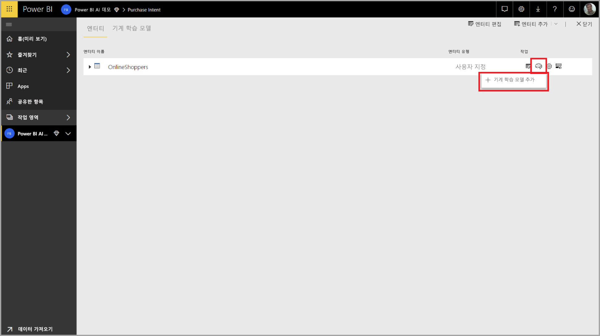
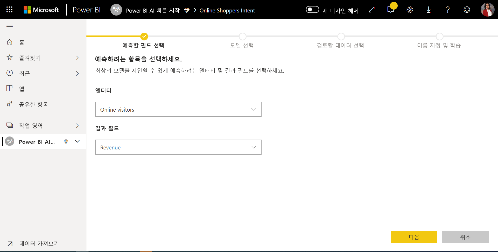
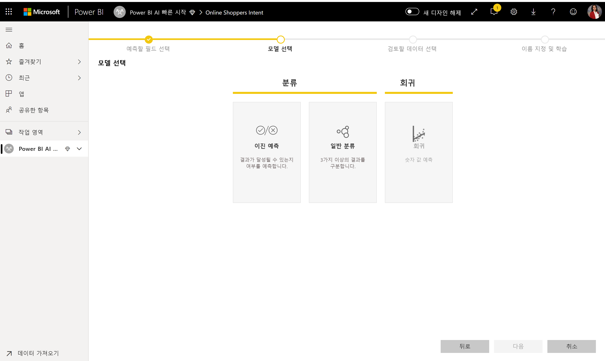
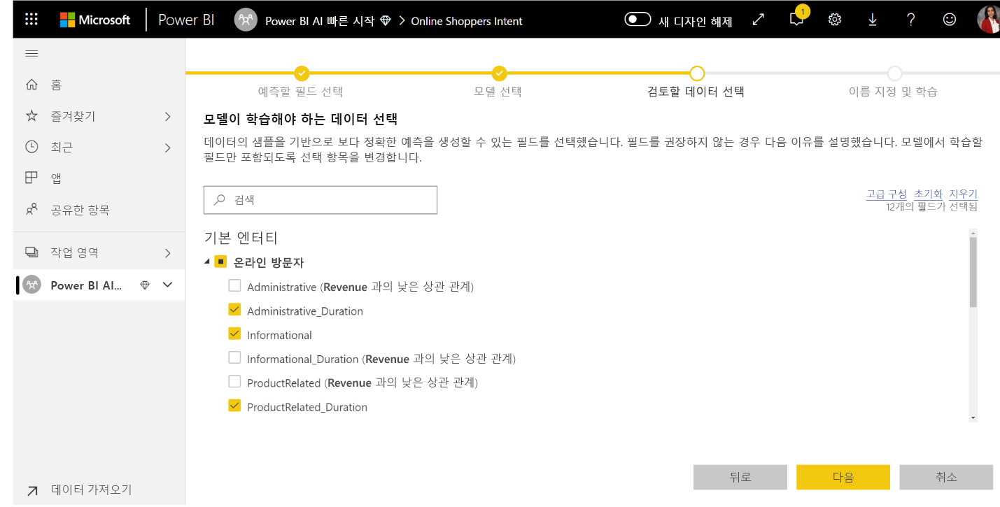
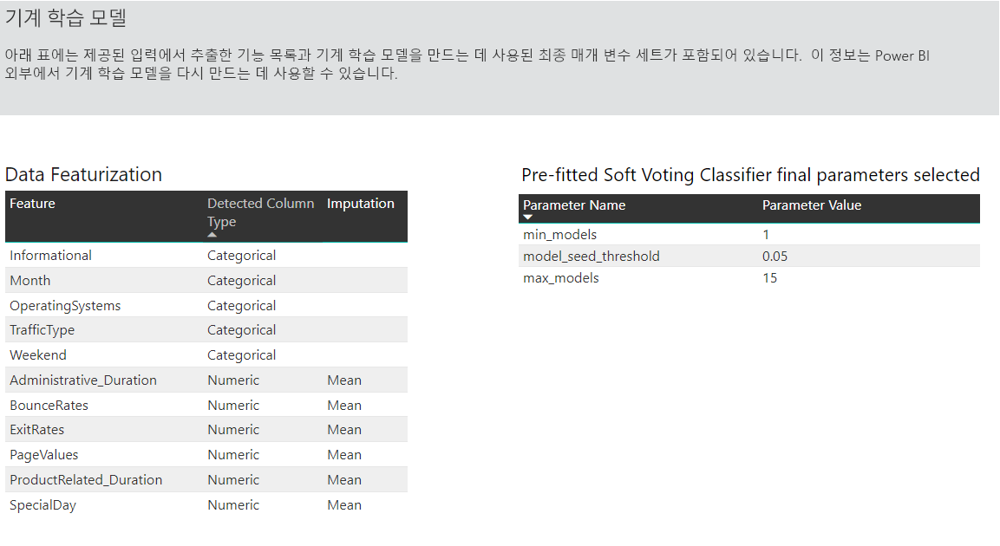
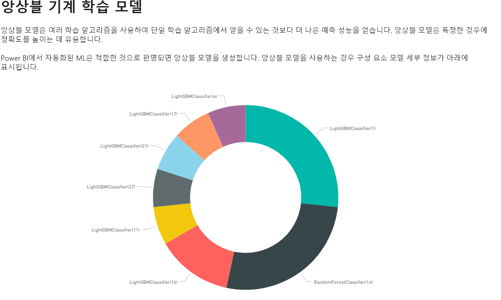
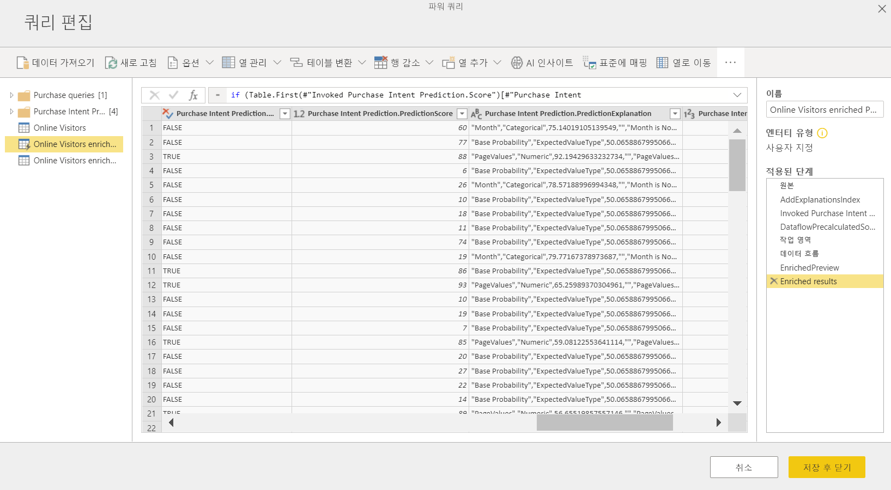
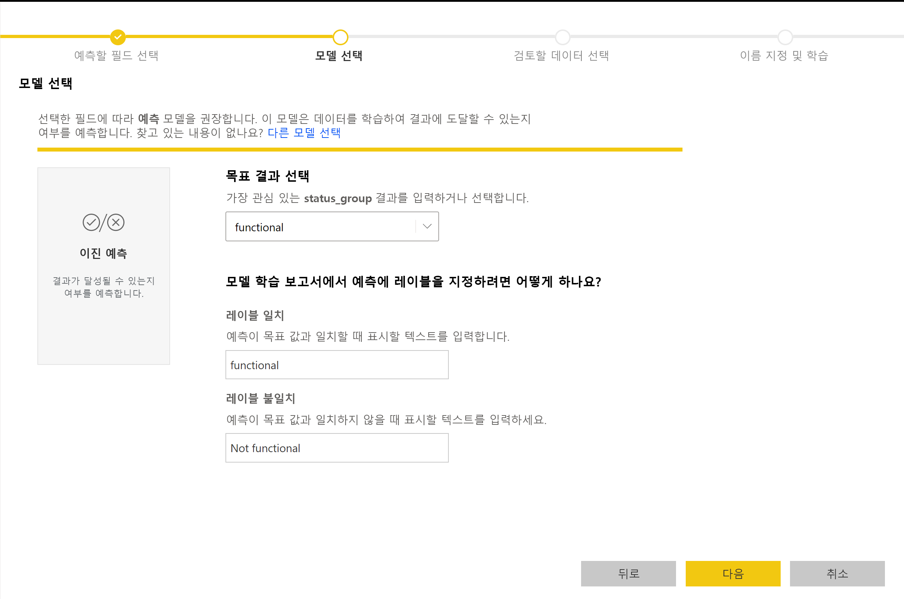
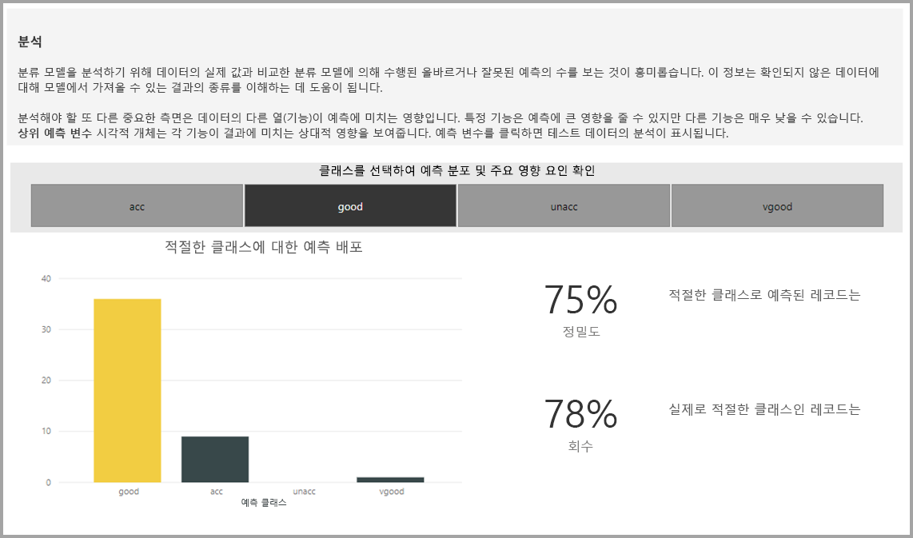

# Power BI에서 Machine Learning 자동화(미리 보기)

데이터 흐름에 대한 AutoML(자동화된 Machine Learning)을 사용하면 비즈니스 분석가가 Power BI에서 직접 기계 학습 모델을 학습하고, 유효성을 검사하고, 호출할 수 있습니다. 분석가가 데이터 흐름을 사용하여 모델 학습을 위한 입력 데이터를 지정할 수 있는 새로운 ML 모델을 만들기 위한 간단한 환경이 포함되어 있습니다. 서비스는 가장 관련성이 높은 기능을 자동으로 추출하고, 적절한 알고리즘을 선택하고, ML 모델의 유효성을 검사합니다. 모델을 학습한 후에는 Power BI 성능 및 결과를 설명하는 유효성 검사 결과가 포함된 보고서를 자동으로 생성합니다. 그런 다음 데이터 흐름 내의 새 데이터 또는 업데이트된 데이터에 대해 모델을 호출할 수 있습니다.

자동화된 Machine Learning은 Power BI Premium에서 호스트되는 데이터 흐름 및 Embedded 용량에 대해서만 사용할 수 있습니다. 이 미리 보기에서는 AutoML을 사용하여 이진 예측, 분류 및 회귀 모델에 대한 기계 학습 모델을 학습할 수 있습니다.

## AutoML 작업

[Power BI 데이터 흐름](service-dataflows-overview.md)은 빅 데이터를 위한 셀프 서비스 데이터 준비를 제공합니다. AutoML을 사용하면 Power BI에서 바로 기계 학습 모델을 빌드하기 위한 데이터 준비 작업을 활용할 수 있습니다.

Power BI의 AutoML을 사용하면 데이터 분석가가Power BI 기술만 사용하여 간소화된 환경에서 데이터 흐름를 사용해 기계 학습 모델을 빌드할 수 있습니다. ML 모델을 만든 이후의 데이터 과학은 대부분 Power BI에 의해 자동화되므로 생성된 모델의 품질이 우수하고, ML 모델을 만드는 데 사용되는 프로세스에 대한 자세한 정보를 제공하는 가시성이 확보됩니다.

AutoML은 데이터 흐름에 대한 **이진 예측**, **분류** 및 **회귀** 모델 생성을 지원합니다. 이들은 감독된 기계 학습 모델의 유형입니다. 즉, 이전 관찰에서 알려진 결과를 학습하여 다른 관찰의 결과를 예측합니다. AutoML 모델 학습을 위한 입력 데이터 세트는 알려진 결과로 **레이블이 지정된** 레코드 집합입니다.

Power BI의 AutoML은 [Azure Machine Learning Service](https://docs.microsoft.com/azure/machine-learning/service/overview-what-is-azure-ml)의 [자동화된 ML](https://docs.microsoft.com/azure/machine-learning/service/concept-automated-ml)을 통합하여 ML 모델을 만듭니다. 그러나 Power BI에서 AutoML을 사용하기 위해 Azure 구독이 필요하지는 않습니다. ML 모델을 학습 및 호스팅하는 프로세스는 전적으로 Power BI 서비스에 의해 관리됩니다.

ML 모델을 학습한 후 AutoML은 ML 모델의 성능에 대해 설명하는 Power BI 보고서를 자동으로 생성합니다. AutoML은 모델에서 반환하는 예측에 영향을 주는 입력 중 주요 영향 요인을 강조 표시하여 설명성을 강조합니다. 또한 보고서에는 ML 모델 유형에 따른 모델의 주요 메트릭이 포함됩니다.

생성된 보고서의 다른 페이지에는 모델의 통계 요약과 학습 정보가 표시됩니다. 통계 요약은 모델의 성능에 대한 표준 데이터 과학 측정치를 보려는 사용자에게 중요합니다. 학습 세부 정보에는 모델을 만들기 위해 실행된 모든 반복이 연결된 모델링 매개 변수와 함께 요약되어 있습니다. 또한 각 입력이 ML 모델을 만드는 데 사용된 방법도 설명합니다.

그런 다음 점수 매기기를 위해 ML 모델을 데이터에 적용할 수 있습니다. 데이터 흐름을 새로 고치면 ML 모델의 예측이 데이터에 자동으로 적용됩니다. 또한 Power BI에는 ML 모델이 생성하는 각 특정 예측 점수에 대한 개별 설명이 포함되어 있습니다.

## 기계 학습 모델 만들기

이 섹션에서는 AutoML 학습 모델을 만드는 방법에 대해 설명합니다. 

### ML 모델을 만들기 위한 데이터 준비

Power BI에서 기계 학습 모델을 만들려면 먼저 ML 모델 학습에 사용되는 기록 결과 정보를 포함하는 데이터에 대한 데이터 흐름을 만들어야 합니다. 데이터 흐름을 구성하는 방법에 대한 자세한 내용은 [Power BI에서 셀프 서비스 데이터 준비](service-dataflows-overview.md)를 참조하세요.

현재 릴리스에서 Power BI는 단일 엔터티의 데이터를 사용하여 ML 모델을 학습합니다. 따라서 기록 데이터가 여러 엔터티로 구성된 경우 수동으로 데이터를 단일 데이터 흐름 엔터티로 조인해야 합니다. 또한 예측하려는 결과에 대해 강력한 예측 변수일 수 있는 모든 비즈니스 메트릭에 대해 계산 열을 추가해야 합니다.

AutoML에는 기계 학습 모델을 학습하기 위한 특정 데이터 요구 사항이 있습니다. 이러한 요구 사항은 아래 섹션에 각 모델 유형에 따라 설명되어 있습니다.

### ML 모델 입력 구성

AutoML 모델을 만들려면 기록 데이터를 포함하는 데이터 흐름 엔터티의 **작업** 열에서 ML 아이콘을 선택하고 **기계 학습 모델 추가**를 선택합니다.

ML 모델을 만드는 과정을 안내하는 마법사로 구성된 간소화된 환경이 시작됩니다. 이 마법사는 다음과 같은 간단한 단계를 포함합니다.

1. 기록 결과 데이터를 포함하는 엔터티와 예측을 원하는 필드를 선택
2. 보려는 예측의 유형을 기반으로 모델 유형을 선택
3. 모델에서 예측 신호로 사용할 입력을 선택
4. 모델 이름을 지정하고 구성을 저장

기록 결과 필드는 다음 그림에 표시된 것처럼 ML 모델 학습을 위한 레이블 특성을 식별합니다.

기록 결과 필드를 지정하는 경우 AutoML은 레이블 데이터를 분석하여 해당 데이터에 대해 학습할 수 있는 ML 모델 유형을 식별하고 가장 학습 가능성이 높은 ML 모델 유형을 제안합니다. 

> [!NOTE]
> 일부 모델 유형은 사용자가 선택한 데이터에 대해 지원되지 않을 수 있습니다.

또한 AutoML은 선택한 엔터티의 모든 필드를 분석하여 ML 모델 학습에 사용할 수 있는 입력을 제안합니다. 이 프로세스는 대략적이며 통계 분석을 기반으로 하므로 사용자가 사용된 입력을 검토해야 합니다. 기록 결과 필드(또는 레이블 필드)에 따라 달라지는 입력은 성능에 영향을 주므로 ML 모델 학습에 사용하면 안 됩니다.

마지막 단계에서는 모델의 이름을 지정할 수 있으며 해당 설정을 저장할 수 있습니다.

이 단계에서는 ML 모델에 대한 학습 프로세스를 시작하는 데이터 흐름을 새로 고치라는 메시지가 표시됩니다.

### ML 모델 학습

AutoML 모델 학습은 데이터 흐름 새로 고침의 일부입니다. AutoML은 먼저 학습을 위해 데이터를 준비합니다.

AutoML은 사용자가 제공하는 기록 데이터를 학습 및 테스트 데이터 세트로 분할합니다. 테스트 데이터 세트는 학습 후 모델 성능의 유효성을 검사하는 데 사용되는 홀드아웃 집합입니다. 이들은 데이터 흐름에서 **학습 및 테스트** 엔터티로 실현됩니다. AutoML은 모델 유효성 검사에 교차 유효성 검사를 사용합니다.

그런 다음 각 입력 필드를 분석하고 대체를 적용하여 누락된 값을 대체된 값으로 바꿉니다. AutoML에서는 몇 가지 대체 전략을 사용합니다. 그런 다음 필요한 샘플링 및 정규화를 데이터에 적용합니다.

AutoML은 데이터 형식 및 통계 속성에 따라 선택된 각 입력 필드에 여러 변환을 적용합니다. AutoML은 이러한 변환을 사용하여 ML 모델 학습에 사용할 기능을 추출합니다.

AutoML 모델에 대한 학습 프로세스는 최상의 성능을 가진 모델을 찾기 위해 다양한 모델링 알고리즘 및 하이퍼 매개 변수 설정을 사용하는 최대 50회 반복으로 구성됩니다. 이러한 각 모델의 성능은 홀드아웃 테스트 데이터 세트를 사용하여 유효성 검사를 통해 평가됩니다. 이 학습 단계 중 AutoML은 이러한 반복의 학습 및 유효성 검사를 위한 여러 파이프라인을 만듭니다. 모델 성능을 평가하는 프로세스는 데이터 세트의 크기 및 사용 가능한 전용 용량 리소스에 따라 몇 분에서 몇 시간까지 걸릴 수 있습니다.

경우에 따라 생성되는 최종 모델은 여러 모델을 사용하여 더 나은 예측 성능을 제공하는 앙상블 학습을 사용할 수 있습니다.

### AutoML 모델 설명성

모델을 학습한 후 AutoML은 입력 기능과 모델 출력 간의 관계를 분석합니다. 각 입력 기능의 홀드아웃 테스트 데이터 세트에 대한 모델 출력의 변화 크기 및 방향을 평가합니다. 이를 *기능 중요도*라고 합니다.

### AutoML 모델 보고서

AutoML은 전역 기능 중요도와 함께 유효성 검사 중 모델의 성능을 요약하는 Power BI 보고서를 생성합니다. 이 보고서에는 ML 모델을 홀드아웃 테스트 데이터에 적용하고 예측을 알려진 결과 값과 비교한 결과가 요약되어 있습니다.

모델 보고서를 검토하여 성능을 파악할 수 있습니다. 또한 모델의 주요 영향 요인에 대한 유효성을 검사하여 알려진 결과에 대한 비즈니스 인사이트에 맞출 수 있습니다.

보고서의 모델 성능을 설명하는 데 사용되는 차트와 측정값은 모델 유형에 따라 달라집니다. 이러한 성능 차트와 측정값에 대해서는 다음 섹션에서 설명합니다.

보고서의 추가 페이지는 데이터 과학 관점에서 모델에 대한 통계 측정값을 설명할 수 있습니다. 예를 들어 **이진 예측** 보고서에는 모델에 대한 게인 차트와 ROC 곡선이 포함되어 있습니다.

또한 보고서에는 모델이 학습된 방법에 대한 설명이 포함된 **학습 세부 정보** 페이지와 실행된 각 반복에 대해 모델 성능을 설명하는 차트가 포함되어 있습니다.

이 페이지의 다른 섹션에서는 입력 필드에 누락된 값을 채우는 데 사용되는 대체 방법과 각 입력 필드가 모델에 사용되는 기능을 추출하도록 변환되는 방법에 대해 설명합니다. 또한 최종 모델에 사용되는 매개 변수도 포함합니다.

생성된 모델에서 앙상블 학습을 사용하는 경우 **학습 세부 정보** 페이지에는 앙상블의 각 구성 모델의 가중치와 해당 매개 변수를 설명하는 섹션도 포함되어 있습니다.

## AutoML 모델 적용

만들어진 ML 모델의 성능에 만족하는 경우 데이터 흐름을 새로 고치면 새 데이터 또는 업데이트된 데이터에 적용할 수 있습니다. 모델 보고서에서 오른쪽 위 모서리에 있는 **적용** 단추를 선택하여 이 작업을 수행할 수 있습니다.

ML 모델을 적용하려면 해당 모델을 적용해야 하는 엔터티의 이름과 모델 출력에서 이 엔터티에 추가될 열에 대한 접두사를 지정해야 합니다. 열 이름에 대한 기본 접두사는 모델 이름입니다. *적용* 함수는 모델 유형과 관련된 추가 매개 변수를 포함할 수 있습니다.

ML 모델을 적용하면 **enriched < model_name>** 접미사를 사용하여 새 데이터 흐름 엔터티가 생성됩니다. 예를 들어, _PurchaseIntent_ 모델을 _OnlineShoppers_ 엔터티에 적용하면 출력에서 **OnlineShoppers enriched PurchaseIntent**가 생성됩니다.

현재, 출력 엔터티를 사용하여 파워 쿼리 편집기에서 ML 모델 결과를 미리 볼 수 없습니다. 출력 열에는 항상 null이 결과로 표시됩니다. 결과를 보기 위해 모델이 적용될 때 **enriched < model_name > Preview** 접미사를 사용하는 두 번째 출력 엔터티가 생성됩니다.

쿼리 편집기에서 결과를 미리 보려면 데이터 흐름을 새로 고쳐야 합니다.

모델을 적용할 경우 AutoML은 데이터 흐름을 새로 고칠 때 항상 예측을 최신 상태로 유지합니다.

AutoML에는 출력 엔터티에서 점수를 매기는 각 행에 대한 개별 설명도 포함됩니다.

Power BI 보고서에서 ML 모델의 인사이트 및 예측을 사용하려면 **dataflows** 커넥터를 사용하여 Power BI Desktop에서 출력 엔터티에 연결할 수 있습니다.

## 이진 예측 모델

보다 공식적으로는 **이진 분류 모델**로 알려진 이진 예측 모델은 데이터 세트를 두 그룹으로 분류하는 데 사용됩니다. 이러한 모델은 판매 기회가 전환되는지 여부, 계정이 이탈하는지 여부, 청구서가 제때 지불되는지 여부, 거래가 사기인지 여부 등 이진 결과를 가질 수 있는 이벤트를 예측하는 데 사용됩니다.

결과가 이진이기 때문에 Power BI는 이진 예측 모델에 대한 레이블을 부울로 예상하고 알려진 결과는 **true** 또는 **false**로 레이블이 지정됩니다. 예를 들어 영업 기회 전환 모델에서, 성공한 판매 기회는 true로 레이블이 지정되고 실패한 판매 기회는 false로 레이블이 지정되며 결정되지 않은 판매 기회는 null로 레이블이 지정됩니다.

이진 예측 모델의 출력은 레이블 값에 해당하는 결과가 충족될 가능성을 식별하는 확률 점수입니다.

### 이진 예측 모델 학습

이진 예측 모델을 만들려면 학습 데이터를 포함하는 입력 엔터티는 이전의 알려진 결과를 식별하기 위해 기록 결과 필드로 부울 필드를 포함해야 합니다.

필수 조건:

* 부울 필드는 기록 결과 필드로 사용해야 합니다.
* 각 결과 클래스에는 최소 50개 행의 기록 데이터가 필요합니다.

일반적으로 과거 결과가 다른 데이터 형식의 필드로 식별되면 계산 열을 추가하여 파워 쿼리를 사용하여 이를 부울로 변환할 수 있습니다.

이진 예측 모델에 대한 생성 프로세스는 위의 **ML 모델 입력 구성** 섹션에 설명된 다른 AutoML 모델과 동일한 단계를 따릅니다.

### 이진 예측 모델 보고서

이진 예측 모델은 레코드에서 부울 레이블 값으로 정의된 결과를 True로 얻을 확률을 출력으로 생성합니다. 보고서에 확률 임계값 슬라이서가 포함되어 확률 임계값을 상회 또는 하회하는 점수를 해석하는 방법에 영향을 줍니다.

이 보고서는 *참 긍정*, *거짓 긍정*, *참 부정*, *거짓 부정*을 기준으로 모델의 성능을 설명합니다. 참 긍정 및 참 부정이 결과 데이터의 두 클래스에 대해 올바르게 예측된 결과입니다. 거짓 긍정은 실제 부울 레이블 값이 False이지만 True로 예측된 결과입니다. 반대로, 거짓 부정은 실제 부울 레이블 값이 True이지만 False로 예측된 결과입니다.

정밀도 및 재현율과 같은 측정값은 예측된 결과에 대한 확률 임계값의 영향을 설명합니다. 확률 임계값 슬라이서를 사용하여 정밀도와 재현율 사이에서 균형 있게 타협한 임계값을 선택할 수 있습니다.

모델 보고서의 **정확도 보고서** 페이지에는 모델에 대한 *누적 게인* 차트와 ROC 곡선이 포함되어 있습니다. 이들은 모델 성능의 통계 측정값입니다. 보고서에는 표시된 차트에 대한 설명이 포함됩니다.

### 이진 예측 모델 적용

이진 예측 모델을 적용하려면 ML 모델에서 예측을 적용하려는 데이터가 포함된 엔터티를 지정해야 합니다. 다른 매개 변수에는 예측 결과를 분류하기 위한 출력 열 이름 접두사 및 확률 임계값이 포함됩니다.

이진 예측 모델이 적용되면 보강된 출력 엔터티에 3개의 출력 열이 추가됩니다. 각각 **PredictionScore**, **PredictionOutcome**, **PredictionExplanation**입니다. 모델을 적용할 때 엔터티의 열 이름에 접두사가 지정됩니다.

**PredictionOutcome** 열에는 예측된 결과 레이블이 포함되어 있습니다. 확률이 임계값을 초과하는 레코드는 결과를 달성할 수 있는 것으로 예측되며, 미달하는 레코드는 결과를 달성할 가능성이 거의 없는 것으로 예측됩니다.

**PredictionExplanation** 열에는 입력 기능이 **PredictionScore**에 미치는 특정 영향에 대한 설명이 포함되어 있습니다. 이는 예측에 대한 입력 기능 가중치의 JSON 형식 컬렉션입니다.

## 분류 모델

분류 모델은 데이터 세트를 여러 그룹이 나 클래스로 분류하는 데 사용됩니다.  이러한 모델은 고객의 수명 주기 가치가 매우 높음, 높음, 중간 또는 낮음인지 여부, 미지급 위험이 높음, 보통, 낮음 또는 매우 낮음인지 여부 등 가능한 여러 결과 중 하나를 가질 수 있는 이벤트를 예측하는 데 사용됩니다.

분류 모델의 출력은 레코드가 특정 클래스에 대한 조건을 달성할 가능성을 식별하는 확률 점수입니다.

### 분류 모델 학습

분류 모델에 대한 학습 데이터를 포함하는 입력 엔터티는 과거의 알려진 결과를 식별하는 기록 결과 필드로 문자열 또는 숫자 필드를 포함해야 합니다.

필수 조건:

* 각 결과 클래스에는 최소 50개 행의 기록 데이터가 필요합니다.

분류 모델에 대한 생성 프로세스는 위의 **ML 모델 입력 구성** 섹션에 설명된 다른 AutoML 모델과 동일한 단계를 따릅니다.

### 분류 모델 보고서

분류 모델 보고서는 홀드아웃 테스트 데이터에 ML 모델을 적용하고 실제 알려진 클래스와 레코드의 예측된 클래스를 비교하여 생성됩니다.

모델 보고서에는 알려진 각 클래스에 대해 정확하게 분류된 레코드와 잘못 분류된 레코드를 구분하는 차트가 포함됩니다.

추가 클래스 관련 드릴 다운을 사용하면 알려진 클래스에 대한 예측을 분산하는 방법을 분석할 수 있습니다. 여기에는 알려진 클래스의 레코드가 잘못 분류될 가능성이 있는 다른 클래스가 포함됩니다.

또한 보고서의 모델 설명에는 각 클래스에 대한 상위 예측 변수도 포함됩니다.

분류 모델 보고서에는 이 문서의 앞부분에 나오는 **AutoML 모델 보고서** 섹션에서 설명한 다른 모델 유형에 대한 페이지와 유사한 학습 세부 정보 페이지도 포함됩니다.

### 분류 모델 적용

분류 ML 모델을 적용하려면 입력 데이터를 포함하는 엔터티와 출력 열 이름 접두사를 지정해야 합니다.

분류 모델이 적용되면 보강된 출력 엔터티에 3개의 출력 열이 추가됩니다. 각각 **PredictionScore**, **PredictionClass**, **PredictionExplanation**입니다. 모델을 적용할 때 엔터티의 열 이름에 접두사가 지정됩니다.

**PredictionClass** 열에는 레코드에 대한 가장 가능성이 높은 예측 클래스가 포함됩니다. **PredictionScore** 열에는 가능한 각 클래스에 대한 레코드의 확률 점수가 나열됩니다.

**PredictionExplanation** 열에는 입력 기능이 **PredictionScore**에 미치는 특정 영향에 대한 설명이 포함되어 있습니다. 이는 예측에 대한 입력 기능 가중치의 JSON 형식 컬렉션입니다.

## 회귀 모델

회귀 모델은 판매 거래에서 실현될 가능성이 있는 수익, 계정의 수명 주기 가치, 지불 가능성이 있는 미수금 청구서 금액, 청구서가 지불될 수 있는 날짜 등의 값을 예측하는 데 사용됩니다.

회귀 모델의 출력은 예측 값입니다.

### 회귀 모델 학습

회귀 모델에 대한 학습 데이터를 포함하는 입력 엔터티는 과거의 알려진 결과 값을 식별하는 기록 결과 필드로 숫자 필드를 포함해야 합니다.

필수 조건:

* 회귀 모델에는 최소 100개 행의 기록 데이터가 필요합니다.

회귀 모델에 대한 생성 프로세스는 위의 **ML 모델 입력 구성** 섹션에 설명된 다른 AutoML 모델과 동일한 단계를 따릅니다.

### 회귀 모델 보고서

다른 AutoML 모델 보고서와 마찬가지로 회귀 보고서는 홀드아웃 테스트 데이터에 모델을 적용한 결과를 기반으로 합니다.

모델 보고서에는 예측 값을 실제 값과 비교하는 차트가 포함됩니다. 이 차트에서 대각선 거리는 예측의 오차를 나타냅니다.

잔여 오차 차트는 홀드아웃 테스트 데이터 세트의 여러 값에 대한 평균 오차 백분율의 분포를 보여 줍니다. 가로 축은 그룹에 대한 실제 값의 평균을 나타내며, 거품 크기는 해당 범위의 값 빈도 또는 횟수를 표시합니다. 세로 축은 평균 잔여 오차입니다.

회귀 모델 보고서에는 위의 **AutoML 모델 보고서** 섹션에서 설명한 다른 모델 유형에 대한 보고서와 같은 학습 세부 정보 페이지도 포함됩니다.

### 회귀 모델 적용

회귀 ML 모델을 적용하려면 입력 데이터를 포함하는 엔터티와 출력 열 이름 접두사를 지정해야 합니다.

회귀 모델이 적용되면 보강된 출력 엔터티에 2개의 출력 열이 추가됩니다. 각각 **PredictionValue** 및 **PredictionExplanation**입니다. 모델을 적용할 때 엔터티의 열 이름에 접두사가 지정됩니다.

**PredictionValue** 열에는 입력 필드를 기준으로 하는 레코드에 대한 예측 값이 포함됩니다. **PredictionExplanation** 열에는 입력 기능이 **PredictionValue**에 미치는 특정 영향에 대한 설명이 포함되어 있습니다. 이는 입력 기능 가중치의 JSON 형식 컬렉션입니다.

## 다음 단계

이 문서에서는 Power BI 서비스의 데이터 흐름에 대한 자동화된 Machine Learning의 개요를 제공했습니다. 다음 문서도 유용할 수 있습니다.

* [자습서: Power BI에서 Machine Learning 모델 빌드(미리 보기)](service-tutorial-build-machine-learning-model.md)
* [자습서: Power BI에서 Cognitive Services 사용](service-tutorial-use-cognitive-services.md)
* [자습서: Power BI에서 Machine Learning Studio 모델 호출(미리 보기)](service-tutorial-invoke-machine-learning-model.md)
* [Power BI에서 Cognitive Services 사용(미리 보기)](service-cognitive-services.md)
* [Power BI에서 Azure Machine Learning 통합(미리 보기)](service-machine-learning-integration.md)

데이터 흐름에 대한 자세한 내용은 다음 문서를 참조할 수 있습니다.
* [Power BI에서 데이터 흐름 만들기 및 사용](service-dataflows-create-use.md)
* [Power BI Premium의 계산된 엔터티 사용](service-dataflows-computed-entities-premium.md)
* [온-프레미스 데이터 원본으로 만든 데이터 흐름 사용](service-dataflows-on-premises-gateways.md)
* [Power BI 데이터 흐름에 사용할 수 있는 개발자 리소스](service-dataflows-developer-resources.md)
* [데이터 흐름 및 Azure Data Lake 통합(미리 보기)](service-dataflows-azure-data-lake-integration.md)

