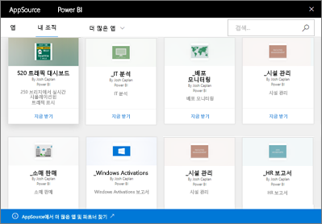

# Power BI의 조직 콘텐츠 팩 소개
> [!NOTE]
> 조직 콘텐츠 팩을 만들 수 없거나 새 작업 영역 환경에 설치할 수 없습니다. 아직 시작하지 않은 경우 이제 콘텐츠 팩을 앱으로 업그레이드하세요. [새 작업 영역 환경에 대해 자세히](service-create-the-new-workspaces.md) 알아봅니다.
> 

팀으로 보내는 메일로 보고서를 정기적으로 배포하나요? 대신 이 방법을 사용해 보세요. 대시보드, 보고서, Excel 통합 문서 및 데이터 세트를 패키지하여 *조직 콘텐츠 팩*으로 팀에 게시합니다. 만든 콘텐츠 팩은 팀이 쉽게 찾을 수 있습니다. 즉, 모두 AppSource에 있습니다. 콘텐츠 팩은 Power BI의 일부이기 때문에 대화형 데이터 탐색, 새로운 시각적 개체, 질문 및 답변, 다른 데이터 원본과의 통합, 데이터 새로 고침 등 Power BI의 기능을 모두 활용할 수 있습니다.

콘텐츠 팩을 만드는 것은 대시보드를 공유하거나 작업 영역에서 협업하는 것과 다릅니다. [대시보드 및 보고서를 공동 작업 및 공유하는 방법](service-how-to-collaborate-distribute-dashboards-reports.md)에 대해 알아보고 상황에 맞는 최상의 옵션을 결정하세요. 

AppSource에서 전체 조직, 배포 또는 보안 그룹 및 [사용자가 속한 Office 365 그룹](https://support.office.com/article/Create-a-group-in-Office-365-7124dc4c-1de9-40d4-b096-e8add19209e9)에 게시된 콘텐츠 팩을 찾거나 검색할 수 있습니다. 특정 그룹의 멤버가 아닌 경우 해당 그룹과 공유한 콘텐츠 팩이 표시되지 않습니다. 그룹의 모든 구성원은 콘텐츠 팩 데이터, 보고서, 통합 문서 및 대시보드에 대한 동일한 읽기 전용 액세스 권한을 갖습니다. SSAS(SQL Server Analysis Services) 데이터 원본인 경우가 아니면 권한이 데이터 원본과 함께 상속됩니다.

대시보드, 보고서 및 Excel 통합 문서는 읽기 전용이지만, 자신만의 개인화된 콘텐츠 팩 버전을 만들기 위한 시작 지점으로 대시보드와 보고서를 복사하여 사용할 수 있습니다.

> [!NOTE]
> 조직 콘텐츠 팩은 사용자 또는 동료에게 [Power BI Pro 라이선스](service-features-license-type.md)가 있는 경우에만 사용할 수 있습니다.
> 
> 

## *AppSource*란?
조직 콘텐츠 팩을 게시하면 AppSource에 추가됩니다.  이 중앙 리포지토리를 사용하면 멤버가 게시된 대시보드, 보고서 및 데이터 세트를 쉽게 찾아 검색할 수 있습니다.  

* AppSource를 보려면 **데이터 가져오기** > **내 조직** > **가져오기**를 선택합니다.

## 조직 콘텐츠 팩의 수명 주기
모든 Power BI Pro 사용자는 조직 콘텐츠 팩을 만들고 게시하고 액세스할 수 있습니다. 콘텐츠 팩 작성자만 통합 문서와 데이터 세트를 수정하고, 새로 고침을 예약하고, 삭제할 수 있습니다.

수명 주기는 다음과 유사한 형태입니다.

1. Power BI Pro에서 Nate가 콘텐츠 팩을 만들어 마케팅 배포 그룹에 게시합니다. 새로 고침 설정은 데이터 세트와 함께 상속되며 Nate만 변경할 수 있습니다.
   
   > [!NOTE]
   > Nate가 현재 속해 있는 [Power BI 작업 영역](service-create-distribute-apps.md) 내에서 콘텐츠 팩을 만드는 경우, Nate가 작업 영역을 나가더라도 Power BI 작업 영역의 다른 사용자가 소유권을 인수할 수 있습니다.
   > 
   > 
2. Nate는 배포 그룹에 메일을 보내어 새 콘텐츠 팩에 대해 알려줍니다.
3. Power BI Pro에서 마케팅 배포 그룹의 구성원인 Jane은 AppSource에서 콘텐츠 팩을 검색하고 연결합니다. 이제 Jane에게 읽기 전용 복사본이 있습니다. Jane은 탐색 창에서 대시보드 이름 및 보고서 이름의 왼쪽에 공유 아이콘이 있기 때문에 읽기 전용임을 알고 있습니다. 또한 Jane은 대시보드를 선택할 때 잠금 아이콘이 표시되므로 다른 사용자가 콘텐츠 팩 대시보드를 보고 있음을 알 수 있습니다. 
4. Jane이 콘텐츠 팩을 사용자 지정하기로 결정한다고 가정합니다. 이제 Jane은 대시보드 및 보고서의 자체 복사본을 갖게 됩니다. Jane의 작업은 원본, 원래 콘텐츠 팩 또는 다른 배포 그룹 구성원에게 영향을 주지 않습니다. 이제 각각 대시보드 및 보고서의 자체 복사본에서 작업하고 있는 것입니다.
5. Nate가 대시보드를 업데이트하고, 준비가 되면 새 버전의 콘텐츠 팩을 게시합니다.
   
   * 또 다른 배포 그룹 구성원인 Julio는 원래의 콘텐츠 팩을 사용자 지정하지 않았습니다. 새 변경 내용은 Julio의 콘텐츠 팩 버전에 자동으로 적용됩니다.  
   * Jane은 콘텐츠 팩을 사용자 지정했습니다. 그런 다음, Jane은 새 버전이 있다는 알림을 받습니다.  Jane은 AppSource로 이동한 다음, 맞춤형 버전의 손실 없이 업데이트된 콘텐츠 팩을 가져올 수 있습니다. 이제 Jane은 맞춤형 버전과 업데이트된 콘텐츠 팩의 두 가지 버전이 있습니다.
6. 예를 들어, Nate가 보안 설정을 변경하는 경우, Julio과 Jane에게는 더 이상 콘텐츠에 대한 액세스 권한이 없습니다. 또는 이들이 마케팅 배포 그룹에서 제거되었다고 가정하는 경우.
   
   * Julio가 원래 콘텐츠 팩을 사용자 지정하지 않았으므로 콘텐츠가 자동으로 제거됩니다. 
   * Jane은 콘텐츠 팩을 사용자 지정했습니다. Jane이 다음에 대시보드를 열면 원래 콘텐츠 팩의 모든 타일은 사라지지만 Jane이 다른 보고서에서 고정한 타일(여전히 Jane에게 사용 권한이 있음)은 여전히 표시됩니다. 연결된 보고서 및 데이터 세트는 더 이상 사용할 수 없으며 탐색 창에 표시되지 않습니다.
7. 또는 Nate가 콘텐츠 팩을 삭제합니다.
   
   * Julio가 원래 콘텐츠 팩을 사용자 지정하지 않았으므로 콘텐츠가 자동으로 제거됩니다. 
   * Jane은 콘텐츠 팩을 사용자 지정했습니다. Jane이 다음에 대시보드를 열면 원래 콘텐츠 팩의 모든 타일은 사라지지만 Jane이 다른 보고서에서 고정한 타일은 여전히 표시됩니다. 연결된 보고서 및 데이터 세트는 더 이상 사용할 수 없으며 탐색 창에 표시되지 않습니다.

## 데이터 보안
모든 배포 그룹 멤버는 데이터에 대해 콘텐츠 팩 작성자와 동일한 권한을 갖습니다. 단, 데이터가 SSAS(SQL Server Analysis Services) 온-프레미스 테이블 형식 데이터 세트인 경우는 예외입니다. 보고서 및 대시보드는 온-프레미스 SSAS 모델에 라이브로 연결되므로 각 개별 배포 그룹 구성원의 자격 증명을 사용하여 액세스할 수 있는 데이터를 결정합니다.

## 다음 단계
* [조직 콘텐츠 팩 만들기 및 게시](service-organizational-content-pack-create-and-publish.md)
* [Power BI에서 앱 만들기 및 배포](service-create-distribute-apps.md) 
* [Power BI 서비스의 디자이너를 위한 기본 개념](service-basic-concepts.md)
* 궁금한 점이 더 있나요? [Power BI 커뮤니티를 이용하세요.](https://community.powerbi.com/)

