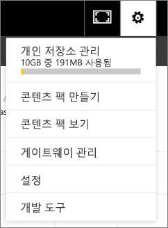

# 조직 콘텐츠 팩 관리, 업데이트 및 삭제
> [!NOTE]
> 조직 콘텐츠 팩을 만들 수 없거나 새 작업 영역 환경 미리 보기에 설치할 수 없습니다. 아직 시작하지 않은 경우 이제 콘텐츠 팩을 앱으로 업그레이드하세요. [새 작업 영역 환경에 대해 자세히](service-create-the-new-workspaces.md) 알아봅니다.
> 

대시보드, 보고서, Excel 통합 문서 및 데이터 세트를 [조직 콘텐츠 팩](service-organizational-content-pack-introduction.md)으로 패키징하고 동료와 공유할 수 있습니다. 동료는 이것을 그대로 사용하거나 자신만의 복사본을 만들 수 있습니다.

콘텐츠 팩을 만드는 것은 대시보드를 공유하거나 그룹 내에서 공동 작업하는 것과 다릅니다. [대시보드 및 보고서를 공동 작업 및 공유하는 방법](service-how-to-collaborate-distribute-dashboards-reports.md)에 대해 알아보고 상황에 맞는 최상의 옵션을 결정하세요.

콘텐츠 팩 작성자일 경우 일부 조직 콘텐츠 팩 작업만 수행할 수 있습니다.

* 다시 게시
* 콘텐츠 팩에 대한 액세스 제한 또는 확장
* 예약된 새로 고침 설정 및 변경
* 콘텐츠 팩 삭제

## 조직 콘텐츠 팩 수정 및 다시 게시
원래 콘텐츠 팩 대시보드, 보고서 또는 Excel 통합 문서를 변경하는 경우 Power BI에서 다시 게시할지 묻는 메시지가 표시됩니다. 또한 콘텐츠 팩 작성자로 원래 콘텐츠 팩을 만들 때 콘텐츠 팩 만들기 창에서 선택한 옵션을 업데이트할 수 있습니다. 

## 새 콘텐츠 다시 게시
콘텐츠 팩에 포함된 대시보드를 변경하고 저장하면 Power BI에서 다른 사람이 변경 내용을 볼 수 있도록 알려줍니다. 예를 들어, 새 타일을 고정하거나 대시보드의 이름을 단순히 변경하는 경우 알림을 제공합니다.

1. 메시지에서 **콘텐츠 팩 보기**를 선택합니다.
   
   
2. 또는 오른쪽 위 모퉁이에서 톱니바퀴 아이콘 을 선택하고 **콘텐츠 팩 보기**를 선택합니다.
   
   
   
   경고 아이콘 이 표시됩니다.  이렇게 하면 어떤 방식으로든 콘텐츠 팩을 수정했고 게시했던 내용이 더 이상 일치하지 않음을 알 수 있습니다.
3. **편집**을 선택합니다.  
4. **콘텐츠 팩 업데이트** 창에서 필요한 변경을 수행하고 **업데이트**를 선택합니다. **성공** 메시지가 나타납니다.
   
   * 콘텐츠 팩을 사용자 지정하지 않은 그룹 구성원인 경우 업데이트가 자동으로 적용됩니다.
   * 콘텐츠 팩을 사용자 지정한 그룹 구성원은 새 버전이 있다는 알림을 받게 됩니다.  구성원은 AppSource로 가서 자신의 개인 설정된 버전을 손실하지 않고도 업데이트된 콘텐츠 팩을 얻을 수 있습니다.  이제 구성원에게는 개인 설정된 버전과 업데이트된 콘텐츠 팩의 두 가지 버전이 있습니다.  개인 설정된 버전에서 원래 콘텐츠 팩의 모든 타일이 사라집니다.  그러나 다른 보고서에서 고정한 타일은 계속 렌더링됩니다. 그러나 콘텐츠 팩 소유자가 콘텐츠 팩이 기반으로 하는 데이터 세트를 삭제하면 전체 보고서가 삭제됩니다.  

## 대상 그룹 업데이트: 액세스 확장 또는 제한
콘텐츠 팩 작성자에 제공되는 다른 수정 항목으로는 콘텐츠 팩에 대한 액세스를 확장 및 제한하는 것입니다.  사용자는 콘텐츠 팩을 광범위한 대상 그룹에 게시했고 작은 그룹에 대한 액세스를 제한하도록 결정했을 것입니다.  

1. 톱니 아이콘 을 선택하고 **콘텐츠 팩 보기**를 선택합니다.
2. **편집**을 선택합니다. 
3. **콘텐츠 팩 업데이트** 창에서 필요한 변경을 수행하고 **업데이트**를 선택합니다. 예를 들어 **특정 그룹** 필드에서 원래 메일 그룹을 삭제하고 구성원 수가 적은 다른 메일 그룹으로 바꿉니다.
   
   성공 메시지가 나타납니다.
   
   새 별칭에 포함되지 않은 동료의 경우:
   
   * 콘텐츠 팩을 사용자 지정하지 않은 그룹 구성원인 경우 해당 콘텐츠 팩과 연결된 대시보드 및 보고서를 더 이상 사용할 수 없고 콘텐츠 팩이 탐색 창에 표시되지 않습니다.
   * 콘텐츠 팩을 사용자 지정한 그룹 구성원인 경우 다음에 사용자 지정된 대시보드를 열 때 원래 콘텐츠 팩의 모든 타일이 사라집니다.  그러나 다른 보고서에서 고정한 타일은 계속 렌더링됩니다. 원래 콘텐츠 팩 보고서 및 데이터 세트는 더 이상 사용할 수 없으며 콘텐츠 팩이 탐색 창에 나타나지 않습니다.   

## 조직 콘텐츠 팩 새로 고침
콘텐츠 팩 작성자로 [데이터 세트의 새로 고침을 예약](refresh-data.md)할 수 있습니다.  콘텐츠 팩을 만들고 업로드하는 경우 새로 고침 일정이 데이터 세트로 업로드됩니다. 새로 고침 일정을 변경하는 경우 콘텐츠 팩을 다시 게시해야 합니다.(위 참조)

## AppSource에서 조직 콘텐츠 팩 삭제
콘텐츠 팩을 만든 경우 AppSource에서 그것을 삭제할 수 있습니다. 앱 작업 영역에서 조직 콘텐츠 팩을 만든 다음, 해당 작업 영역을 삭제하도록 결정하는 경우 콘텐츠 팩을 먼저 삭제해야 합니다. 콘텐츠 팩을 먼저 삭제하지 않고 작업 영역을 삭제하면 해당 콘텐츠 팩에 대한 모든 액세스 권한을 손실합니다. 도움말은 Microsoft 지원에 문의해야 합니다. 

> [!TIP]
> 다른 사람이 만든 [콘텐츠 팩에 대한 연결을 삭제](service-organizational-content-pack-disconnect.md)할 수 있습니다. AppSource에서 콘텐츠 팩을 삭제하지 않습니다.
> 
> 

1. AppSource에서 콘텐츠 팩을 삭제하려면 콘텐츠 팩을 만든 앱 작업 영역으로 이동하여 톱니바퀴 아이콘 을 선택하고 **콘텐츠 팩 보기**를 합니다.
2. **삭제 \> 삭제**를 선택합니다. 
   
   * 콘텐츠 팩을 사용자 지정하지 않은 그룹 구성원의 경우 해당 콘텐츠 팩과 연결된 대시보드 및 보고서가 자동으로 제거됩니다. 이러한 대시보드 및 보고서는 더 이상 사용할 수 없으며 콘텐츠 팩이 탐색 창에 표시되지 않습니다.
   * 콘텐츠 팩을 사용자 지정한 그룹 구성원인 경우 다음에 사용자 지정된 대시보드를 열 때 원래 콘텐츠 팩의 모든 타일이 사라집니다.  그러나 다른 보고서에서 고정한 타일은 계속 렌더링됩니다. 원래 콘텐츠 팩 보고서 및 데이터 세트는 더 이상 사용할 수 없으며 콘텐츠 팩이 탐색 창에 나타나지 않습니다.   

## 다음 단계
* [조직 콘텐츠 팩 소개](service-organizational-content-pack-introduction.md)
* [Power BI에서 앱 만들기 및 배포](service-create-distribute-apps.md) 
* 궁금한 점이 더 있나요? [Power BI 커뮤니티를 이용하세요.](http://community.powerbi.com/)

