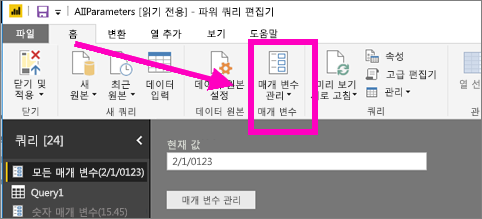
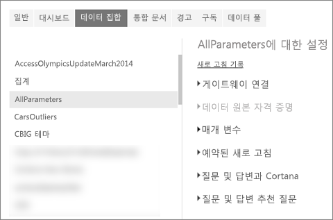
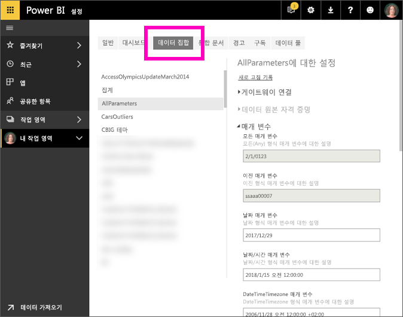

# 쿼리 매개 변수란?
쿼리 매개 변수는 보고서 작성자에 의해 Power BI Desktop에 추가됩니다. 매개 변수를 사용하면 보고서의 일부가 하나 이상의 매개 변수 *값*을 사용하도록 할 수 있습니다. 예를 들어 보고서 작성자는 단일 국가/지역으로 데이터를 제한하는 매개 변수 또는 날짜, 시간 및 텍스트와 같은 필드에 적합한 형식을 정의하는 매개 변수를 만들 수 있습니다.

## Power BI 서비스에서 매개 변수 검토 및 편집

데스크톱에서 매개 변수가 정의되면 [보고서가 Power BI 서비스에 게시된](desktop-upload-desktop-files.md) 경우 해당 보고서를 사용하여 매개 변수 설정 및 선택 영역을 바꿉니다. 일부 매개 변수 설정은 사용 가능한 데이터를 제한하는 매개 변수가 아니라 허용되는 값을 정의하고 설명하는 매개 변수를 Power BI 서비스에서 검토하고 편집할 수 있습니다.

1. Power BI 서비스에서 톱니바퀴 아이콘 을 선택하여 **설정**을 엽니다.

2. **데이터 집합**에 대한 탭을 선택하고 목록에서 데이터 집합을 강조 표시합니다. 
    
    

3. **매개 변수**를 확장합니다.  선택한 데이터 집합에 매개 변수가 없는 경우 쿼리 매개 변수의 자세한 내용에 대한 링크가 포함된 메시지가 표시됩니다. 하지만 데이터 집합에 매개 변수가 있는 경우 **매개 변수** 머리글을 확장하면 이러한 매개 변수를 표시합니다. 

    

    매개 변수 설정을 검토하고 필요한 경우 변경합니다. 회색 필드는 편집할 수 없습니다. 

## 다음 단계
간단한 매개 변수를 추가하는 임시 방법은 [URL을 수정](service-url-filters.md)하는 것입니다.