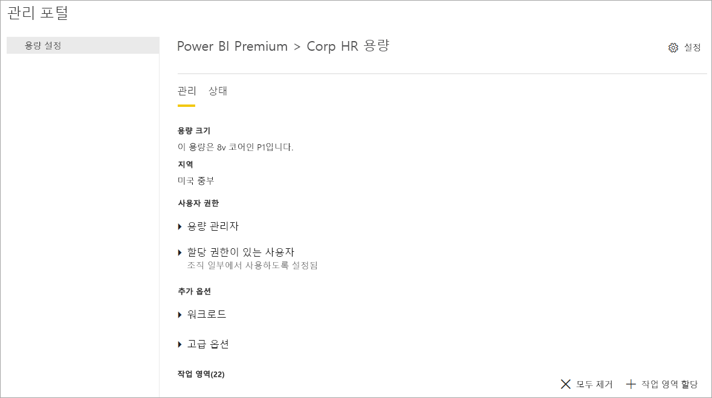
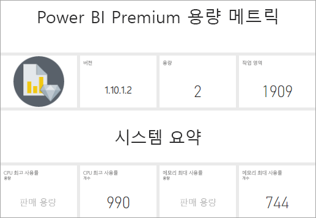
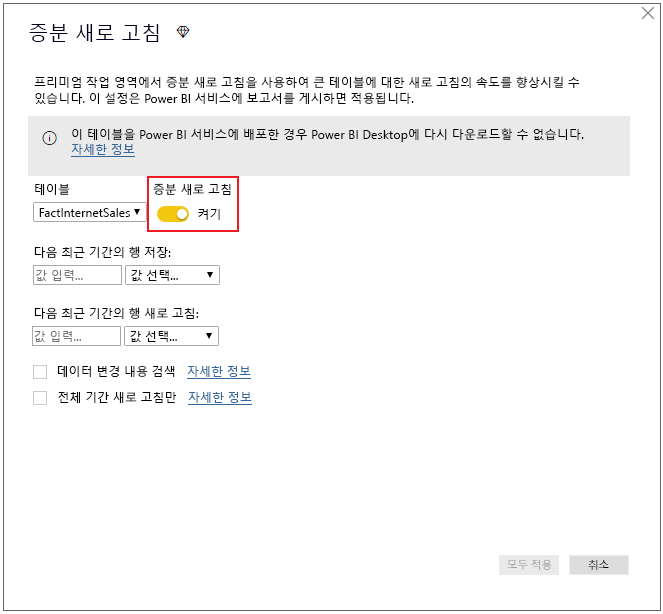
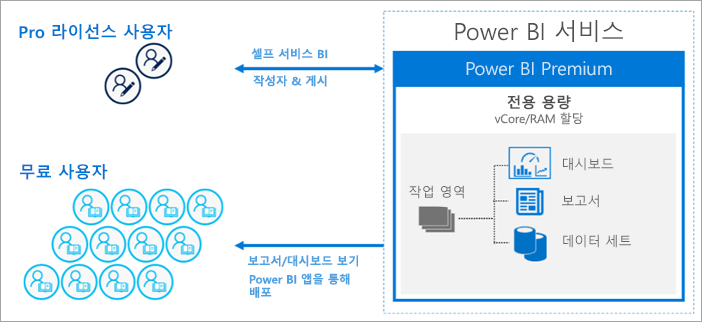

# Power BI Premium이란?

Power BI 프리미엄 조직용 Power BI 서비스를 실행 하는 전용 기능과 향상 된 리소스를 제공 합니다. 예:

- 더 커진 규모 및 성능
- 용량으로 라이선스 수
- 셀프 서비스 및 엔터프라이즈 BI 통합
- Power BI Report Server 사용 하 여 온-프레미스 BI 확장
- (다중 지역) 지역에서 데이터 상주에 대 한 지원
- 사용자별 라이선스를 구입 하지 않고 다른 사람과 공유 데이터

이 문서에서는 Power BI 프리미엄의 모든 기능에 대 한 자세한 정보를 실제로 제공 하기 위한 것, 화면에 바로 이어지도록 합니다. 필요한 경우 자세한 정보를 사용 하 여 추가 문서에 대 한 링크가 제공 됩니다.

## 구독 및 라이선스

Power BI 프리미엄은 Office 365 테 넌 트 수준 구독 두 SKU (Stock Keeping Unit) 제품군에서 사용할 수 있습니다.

- **EM** Sku ((em1-EM3)를 포함 하 여 매월 청구 연간 약정을 요구 합니다.
- **P** 월간 또는 연간 약정이 필요 포함 및 엔터프라이즈 기능에 대 한 Sku (P1-P3) 매달 요금이 청구 및 Power BI Report Server 온-프레미스 설치에 대 한 라이선스가 포함 되어 있습니다.

또 다른 방법은 구입 하는 **Azure Power BI Embedded** 단일 구독에 **는** (A1-A6) SKU 제품군 포함 및 용량 테스트를 위한 목적 으로만 합니다. 모든 Sku 용량을 만들려는 v 코어를 제공 하지만 EM Sku를 포함 하는 더 작은 크기 조정에 대 한 제한 됩니다. EM1, EM2, A1 및 A2 Sku 보다 작은 4 개 v 코어를 사용 하 여 전용된 인프라에서 실행 되지 않습니다.

이 기사의 초점은 P Sku에 설명 된 대로 많은 A Sku 관련도 합니다. Premium 구독 달리 Sku, Azure Sku 시간 약정 없이 필요 및 시간당 요금이 청구 됩니다. 이러한 확장을 사용 하도록 설정 하는 전체 탄력성을 제공, 축소, pause, resume 및 삭제 합니다. 

이 문서에서는 다루지 주로 azure Power BI Embedded는 하지만에 설명 되어는 [접근 방식 테스트](service-premium-capacity-optimize.md#testing-approaches) 테스트 하 고 워크 로드를 측정 실용적이 고 경제적인 옵션으로 최적화 프리미엄 용량 문서의 섹션입니다. Azure Sku에 대 한 자세한 내용은 참조 하세요 [Azure Power BI Embedded 설명서](https://azure.microsoft.com/services/power-bi-embedded/)합니다.

### 구매

Power BI Premium subscriptions는 Microsoft 365 관리 센터에서 관리자가 구입 합니다. 특히, Office 365 전역 관리자 또는 대금 청구 관리자만 Sku를 구입할 수 있습니다. 구입, 테 넌 트 받습니다 라고 용량에 할당할 v 코어의 해당 되는 수만큼을 *v 코어 풀링을*합니다. 예를 들어 P3 SKU를 구매 32v-코어를 사용 하 여 테 넌 트를 제공 합니다. 자세한 내용은 참조 하세요 [Power BI 프리미엄 구매 방법](service-admin-premium-purchase.md)합니다.

## 전용된 용량

Power BI 프리미엄을 이용할 수 있습니다 *전용 용량*합니다. 다른 고객과 공유 하는 계산 리소스에서 워크 로드 실행 위치는 공유 용량에서 달리 전용된 용량을 조직에서 배타적으로 사용입니다. 호스팅된 콘텐츠에 대 한 신뢰할 수 있는 및 일관 된 성능을 제공 하는 전용된 계산 리소스를 사용 하 여 격리 합니다. 

용량 내 작업 영역에 상주 합니다. 각 Power BI 사용자에 게는 개인 작업 영역 이라고 **내 작업 영역**합니다. 공동 작업 및 배포를 사용 하도록 설정 하려면 추가 작업 영역을 만들 수 있습니다 및 이러한 라고 **앱 작업 영역**합니다. 기본적으로 개인 작업 영역을 포함 하 여 작업 영역 공유 용량에서 만들어집니다. 프리미엄 용량에 있는 경우 내 작업 영역 및 앱 작업 영역을 프리미엄 용량에 할당할 수 있습니다.

### 용량 노드

에 설명 된 대로 합니다 [구독 및 라이선스](#subscriptions-and-licensing) 섹션에 있는 두 개의 Power BI Premium SKU 제품군: **EM** 하 고 **P**합니다. 모든 Power BI Premium Sku는 사용 가능한 용량으로 *노드*, 프로세서, 메모리 및 저장소 구성 된 리소스 집합 크기를 나타내는 각 합니다. 리소스와 함께 각 SKU 초당 DirectQuery 및 라이브 연결 연결 수에 대 한 운영 상의 제한 하 고 병렬 모델 수가 새로 고칩니다.

처리는 개수의 v 코어, 프런트 엔드 및 백 엔드 간에 동일 하 게 분할 하 여 이루어집니다.

**백 엔드 v 코어** 처리, 캐시 관리, R services, 모델 새로 고침, 자연어 처리 (Q & A) 및 보고서 및 이미지의 서버 쪽 렌더링을 실행 하는 쿼리를 비롯 한 핵심 Power BI 기능을 담당 합니다. 백 엔드 v 코어는 주로 사용 되는 메모리의 일정량 호스트 모델 라고도 활성 데이터 집합에 할당 됩니다.

**프런트 엔드 v 코어** 는 웹 서비스, 대시보드 및 보고서 문서 관리, 액세스 권한 관리, 예약, Api, 업로드, 다운로드 하며 일반적으로 사용자와 관련 된 모든 항목에 대 한 환경에 대 한 책임이 있습니다.

저장소로 설정 되어 **100TB 용량 노드당**합니다.

리소스 및 각 프리미엄 SKU의 제한 (및 SKU를 동등 하 게 크기)는 다음 표에 설명 되어 있습니다.

| 용량 노드 | 총 V 코어 | 백 엔드 V 코어 | RAM (GB) | 프런트 엔드 V 코어 | Y/라이브 연결 (초당) | 모델 새로 고침 병렬 처리 |
| --- | --- | --- | --- | --- | --- | --- |
| EM1/A1 | 1 | 0.5 | 2.5 | 0.5 | 3.75 | 1 |
| EM2/A2 | 2 | 1 | 5 | 1 | 7.5 | 2 |
| EM3/A3 | 4 | 2 | 10 | 2 | 15 | 3 |
| P1/A4 | 8 | 4 | 25 | 4 | 30 | 6 |
| P2/A5 | 16 | 8 | 50 | 8 | 60 | 12 |
| P3/A6 | 32 | 16 | 100 | 16 | 120 | 24 |
| | | | | | | |

### 용량 워크 로드

용량 워크 로드는 사용자에 게 제공 하는 서비스입니다. Premium 및 Azure 용량은 기본적으로 Power BI 쿼리 실행과 관련 된 데이터 집합 작업만을 지원 합니다. 데이터 집합 작업을 해제할 수 없습니다. 추가 워크 로드에 사용할 수 있습니다 [AI (Cognitive Services)](https://powerbi.microsoft.com/blog/easy-access-to-ai-in-power-bi-preview/)를 [데이터 흐름](service-dataflows-overview.md#dataflow-capabilities-on-power-bi-premium), 및 [페이지를 매긴 보고서](paginated-reports-save-to-power-bi-service.md)합니다. 이러한 워크 로드에서 Premium subscription에만 지원 됩니다. 

각 추가 워크 로드는 워크 로드에서 사용할 수 있는 사용 가능한 총 메모리의 백분율) (으로 최대 메모리를 구성할 수 있습니다. 최대 메모리에 대 한 기본값은 SKU 기준으로 결정 됩니다. 사용 되는 경우 해당 추가 워크 로드만을 사용 하 여 사용 가능한 리소스 용량을 최대화할 수 있습니다. 및 설정 기본 설정을 확인 한 경우에 용량 리소스 요구 사항을 충족 하지 않는 메모리를 변경할 수 있습니다. 워크 로드를 사용 하도록 설정 및 사용 하 여 용량으로 용량 관리자를 위한 구성 수 있습니다 **용량 설정** 에 [관리 포털](service-admin-portal.md) 또는 사용 하 여는 [용량 REST Api](https://docs.microsoft.com/rest/api/power-bi/capacities)합니다.  

자세한 내용은 참조 하세요 [프리미엄 용량에서 워크 로드 구성](service-admin-premium-workloads.md)합니다. 

### 어떻게 용량 함수

모든 시간에 Power BI 서비스에서 수행 용량 리소스 용량에 적용 된 제한을 초과 하지 않는 하는 동안 효과적으로 사용 합니다.

용량 작업 중 하나로 분류 됩니다 *대화형* 하거나 *백그라운드*합니다. 대화형 작업 요청 렌더링과 사용자 상호 작용 (필터링, 질문 및 답변 쿼리 등)에 대 한 응답에 포함 됩니다. 일반적으로 가져오기 모델 쿼리 DirectQuery 및 라이브 연결 모델 쿼리는 CPU를 많이 사용 하는 동안 메모리 리소스를 많이 사용 됩니다. 백그라운드 작업이 데이터 흐름을 포함 하 고 모델 새로 고침 및 대시보드 쿼리 캐시를 가져옵니다.

대화형 작업 항상 최상의 사용자 환경을 보장 하려면 백그라운드 작업 보다 우선적으로 이해 하는 것이 반드시 합니다. 리소스가 부족 한 경우 백그라운드 작업은 리소스를 확보 하는 경우 처리에 대 한 큐에 추가 됩니다. 데이터 집합 새로 고침 하는 등 백그라운드 작업은 Power BI 서비스에서 프로세스 중간에 중지 될 수 있습니다 및 큐에 추가 합니다.

가져오기 모델 메모리에 완전히 로드 해야 하므로 쿼리 하거나 새로 고칠 수 있습니다. Power BI 서비스를 사용 하 여 정교한 알고리즘 사용 가능한 메모리의 최대 사용 되도록 사용량과 용량을 과도 하 게 커밋 하면 메모리를 관리 합니다. 가능한 여러 가져오기 저장 용량 (프리미엄 용량 당 최대 100TB)를 모델링 하는 동안, 지원 되는 메모리를 초과 하는 결합 된 디스크 저장소 (및 추가 메모리가 필요한 쿼리 및 새로 고침) 하는 경우, 다음 모두 로드할 수 없습니다 메모리 위치에 동일한 시간입니다.

따라서 가져오기 모델에 로드 되며 사용량에 따라 메모리에서 제거 합니다. 가져오기 모델을 쿼리 (대화형 작업) 및 아직 메모리에 또는 때 새로 고칠 때 로드 됩니다 (백그라운드 작업).

메모리에서 모델의 제거 라고 *제거*합니다. Power BI 모델의 크기에 따라 신속 하 게 수행할 수는 연산입니다. 용량 모든 메모리 압력을 발생 하지는 단순히 메모리에 로드 된 모델과 남아 있습니다. 그러나 메모리가 부족 하 여 모델을 로드 하는 사용 가능한 경우 Power BI 서비스는 먼저 메모리를 확보 합니다. 비활성화 된 마지막 3 분 간격으로 사용 되지 않은 모델을 검색 하 여 모델을 감지 하 여 메모리를 해제 \[ [1](#endnote-1)\], 다음 제거 하 고 있습니다. 제거 하려면 비활성 없는 모델의 경우 Power BI 서비스를 백그라운드 작업에 대 한 로드 되는 모델을 제거 하려면 검색 합니다. 실패 한 시도의 30 초 후 최후의 \[ [1](#endnote-1)\], 대화형 작업이 실패 하는 것입니다. 이 경우 보고서 사용자가 잠시 후 다시 시도 하려면을 사용 하 여 오류의 알려집니다. 경우에 따라 모델 서비스 작업으로 인해 메모리에서 언로드할 수 있습니다.

데이터 집합 제거가 정상적으로 예상 된 동작을 강조 하는 것이 반드시 합니다. 이 로드 및 언로드 결합 된 크기가 사용 가능한 메모리를 초과할 수 있습니다 하는 모델의 메모리 사용량 극대화 하려고 합니다. 이 기본적으로 보고서 사용자에 게 완전히 투명 하 게 있습니다. 높은 제거 율 의미 하지는 않습니다 반드시 용량 하지 정보 충분히 됩니다. 그러나 쿼리 또는 새로 고침 응답성 높은 제거 요금으로 인해 저하 되는지 하는 경우에 문제가 될 수 있습니다.

모델 메모리에 로드 해야 하는 대로 가져오기 모델의 새로 고침은 항상 메모리 집약적 가상 컴퓨터입니다. 추가 메모리는 처리를 위해 필요 합니다. 전체 새로 고침을 모델에 필요한 메모리 양의 2 배 정도 사용할 수 있습니다. 이렇게 하면 새로 고침을 완료 하 고 새 모델 데이터를 사용할 수 있는 될 때까지 기존 모델에 쿼리 전송 되기 때문에 처리 중인 경우에 모델을 쿼리할 수 있습니다. 증분 새로 고침 더 빠르게 완료할 수 없습니다 및 따라서 용량 리소스에 대 한 압력을 줄일 수 있는 메모리를 적게 필요 합니다. 새로 고침 CPU를 많이 사용 될 수도 있습니다 모델에 대 한 복잡 한 변환을 파워 쿼리 또는 계산 된 테이블/열을 사용 하 여 특히는 복잡 하거나 큰 테이블을 기반으로 합니다.

쿼리와 마찬가지로, 새로 고침 모델을 메모리에 로드 해야 합니다. 메모리가 부족 한 경우 Power BI 서비스 비활성 모델을 제거 하려고 하 고 (모든 모델은 활성) 수 없는 경우 새로 고침 작업을 큐에 대기 됩니다. 새로 고침은 일반적으로 CPU 집약적인도 더 많이 쿼리보다 합니다. 따라서 백 엔드 v 코어, 반올림의 수를 곱한 1.5로 설정 하는 동시 새로 고침 수에 용량 제한이 있습니다. 너무 많은 동시 새로 고침의 경우 예약된 된 새로 고침 대기 됩니다. 이러한 경우 발생 하는 경우 새로 고침이 완료 오래 걸립니다. 사용자 요청에 의해 트리거되고 같은 주문형 새로 고치거 나 API 호출을 세 번 다시 시도 \[ [1](#endnote-1)\]합니다. 충분 한 리소스가 아직 없으면 새로 고침이 실패 합니다.

섹션 참고 사항:   
\[1\] 변경 될 수 있습니다.

### 지역 지원

새 용량, Office 365 전역 관리자 및 Power BI 서비스 관리자 만들기를 지정할 수 용량에 작업 영역을 할당 하는 위치는 지역 상주할 수 있습니다. 이 이라고 **다중 지역**합니다. 다중 지역 기능을 사용 하 여 조직 충족할 수 데이터 상주 요구 사항을 특정 지역의 데이터 센터에 콘텐츠를 배포 하 여 Office 365 구독이 상주 하는 지역과 다른 경우에 합니다. 자세한 내용은 참조 하세요 [Power BI 프리미엄에 대 한 다중 지역 지원을](service-admin-premium-multi-geo.md)합니다.

### 용량 관리

프리미엄 용량 관리 만들기 또는 용량을 삭제, 관리자를 할당, 작업 영역 할당, 모니터링 및 용량 성능을 최적화 하기 위해 조정 워크 로드를 구성 해야 합니다. 

Office 365 전역 관리자 및 서비스 관리자 Power BI 프리미엄 용량에서 사용 가능한 v 코어를 만들거나 수정할 수 있습니다 기존 프리미엄 용량입니다. 용량 만들어지면 용량 크기와 지역을 지정 하 고 하나 이상의 용량 관리자로 할당 됩니다. 

대부분의 관리 작업을 완료할 수 있습니다 용량을 만들면 합니다 [관리자 포털](service-admin-portal.md)합니다.

용량 관리자 용량에 작업 영역을 할당 하 고 사용자 권한을 관리 하 고 다른 관리자를 할당할 수 있습니다. 또한 용량 관리자 메모리 할당을 조정 하는 워크 로드를 구성 하 고 필요한 경우 용량 오버 로드를 발생 시 작업을 다시 설정 하는 용량을 다시 시작할 수 있습니다.

또한 용량 관리자 수 용량을 원활 하 게 실행 되 고 있는지 확인 합니다. 관리 포털에서 또는 프리미엄 용량 메트릭을 응용 프로그램을 사용 하 여 용량 상태 오른쪽을 모니터링할 수 있습니다.

자세한 정보 생성 용량, 할당 관리자 및 작업 영역 할당에 대해 알아보려면 [관리 프리미엄 용량](service-premium-capacity-manage.md)합니다. 역할에 대 한 자세한 내용은 참조 하세요 [Power BI와 관련 된 관리자 역할](service-admin-administering-power-bi-in-your-organization.md#administrator-roles-related-to-power-bi)입니다.

### 모니터링

프리미엄 용량을 모니터링 용량을 수행 하는 방법을 알고 있는 상태 관리자를 제공 합니다. 용량 관리 포털을 사용 하 여 모니터링할 수 있습니다 및 [Power BI Premium 용량 메트릭을 앱](https://app.powerbi.com/groups/me/getapps/services/capacitymetrics)합니다.

포털의 모니터링 로드 배치 및 용량에는 지난 7 일간 평균에서 사용 하는 리소스를 나타내는 상위 수준 메트릭을 사용 하 여 빠른 보기를 제공 합니다. 

합니다 **Power BI Premium 용량 메트릭을** 여 용량을 수행 하는 방법에 가장 자세한 정보를 제공 하는 앱입니다. 자세한 보고서 및 앱 고급 대시보드를 제공 합니다.

앱의 대시보드에서 메트릭 셀에 대 한 자세한 보고서를 열려면 클릭 수 있습니다. 보고서 제공 심층적인 메트릭 및 필터링 기능 드릴 다운 가장 중요 한 정보를 원활 하 게 실행 하 여 용량을 유지 해야 합니다.

용량을 모니터링 하는 방법에 대 한 자세한 내용은 참조 하세요 [Power BI 관리 포털에서 모니터링](service-admin-premium-monitor-portal.md) 하 고 [Power BI Premium 용량 메트릭을 응용 프로그램을 사용 하 여 모니터링](service-admin-premium-monitor-capacity.md)합니다.

### 용량 최적화

사용자 가져오기 성능을 보장 하는 데 반드시 여 용량을 최대한 활용 하기 및 프리미엄 투자에 대 한 가장 많은 가치를 창출 하는 합니다. 주요 메트릭을 모니터링 하 여 관리자를 병목 상태를 해결 하 여 필요한 조치를 취할 최선의 방법을 결정할 수 있습니다. 자세한 내용은 참조 하세요 [최적화 프리미엄 용량](service-premium-capacity-optimize.md) 하 고 [프리미엄 용량 시나리오](service-premium-capacity-scenarios.md)합니다.

### 용량 REST Api

Power BI REST Api의 컬렉션을 포함 [용량 Api](https://docs.microsoft.com/rest/api/power-bi/capacities)합니다. Api를 통해 관리자 사용 등 작업 영역에 용량을 할당 하는 워크 로드를 사용 하지 않도록 설정 하 여 프리미엄 용량의 다양 한 측면을 프로그래밍 방식으로 관리할 수 있습니다.

## 큰 데이터 집합

Power BI Premium SKU에 따라 Power BI Desktop (.pbix) 모델 파일의 최대 업로드를 지 원하는 **10GB** 크기에서입니다. 로드 되 면 모델을 프리미엄 용량에 할당 된 작업 영역에 게시할 수 있습니다. 데이터 집합까지 고칠 수 있습니다 **12GB** 크기에서입니다.

### 크기 고려 사항

큰 모델 리소스를 많이 사용 될 수 있습니다. 1GB 보다 큰 모든 모델에 대 한 최소 P1 SKU를 해야 합니다. A3 최대 A Sku에서 지 원하는 큰 모델 작업 영역에 게시 하지만 수 작업을 새로 고침 되지 않습니다.

다음 표에는 다양한 .pbix 크기에 대한 권장 SKU를 설명합니다.

   |SKU  |.pbix의 크기   |
   |---------|---------|
   |P1    | < 3GB        |
   |P2    | < 6GB        |
   |P3, P4, P5    | 최대 10GB   |

Power BI Embedded A4 SKU는 P1 SKU, A5 = P2 및 A6 = P3과 같습니다. 대형 모델을 A 및 EM SKU에 게시하면 공유 용량의 모델 크기 제한 오류와 관련이 없는 오류가 반환될 수 있습니다. A 및 EM SKU의 대형 모델에 대한 새로 고침 오류로 인해 시간 초과를 가리킬 가능성이 높습니다. 

.Pbix 파일의 데이터를 나타낼를 *고도로 압축 상태*합니다. 데이터는 메모리에 로드될 때 여러 번 확장할 가능성이 있으며, 거기서부터 데이터 새로 고침 중 여러 번 더 확장할 수도 있습니다.

큰 데이터 집합의 예약 된 새로 고침 시간이 오래 걸릴 하 고 리소스를 많이 사용 될 수 있습니다. 너무 많은 겹치는 새로 고침은 예약 하지 하는 것이 반드시 합니다. 것이 좋습니다 [증분 새로 고침](service-premium-incremental-refresh.md) 빠르고 안정적으로 되 고 더 적은 리소스를 소비 하기 때문에 구성 됩니다.

큰 데이터 집합의 초기 보고서 로드 데이터 집합 사용 된 마지막 시간 이후 잠시 되었으면 시간이 오래 걸릴 수 있습니다. 로딩 시간이 더 긴 보고서의 로딩 표시줄에 로드 진행률이 표시됩니다.

쿼리당 메모리 및 시간 제약 조건은 프리미엄 용량에서 훨씬 더 중일 필요한 것만 표시 하도록 시각적 개체를 제한 하려면 필터 및 슬라이서를 사용 하는 것이 좋습니다.

## 증분 새로 고침

증분 새로 고침 및 Power BI 프리미엄의 큰 데이터 집합을 유지 관리의 핵심을 제공 합니다. 증분 새로 고침에 많은 이점이, 예를 들어, 새로 고침 사용 되므로 빠르게 변경된 해야 새로 고칠 수 있는 데이터만 있습니다. 새로 고침 안정적 되므로 휘발성 데이터 원본에 대 한 장기 실행 연결을 유지할 필요는 없습니다. 적은 양의 데이터를 새로 고치려면 메모리 및 기타 리소스의 전반적인 사용량을 줄일 수 있으므로 리소스 소비가 줄어듭니다. 증분 새로 고침 정책에 정의 된 **Power BI Desktop**, 프리미엄 용량에 작업 영역에 게시 하는 경우 적용 합니다. 

자세한 내용은 참조 하세요 [Power BI 프리미엄의 증분 새로 고침](service-premium-incremental-refresh.md)합니다.

## 페이지가 매겨진 보고서

P1-P3 및 A4_A6 Sku에서 지원 되는 페이지 매긴된 보고서에서 SQL Server Reporting Services 보고서 정의 언어 (RDL) 기술을 기반으로 합니다. RDL 기술을 기반으로 하는 동안 없기는 다운로드 가능한 보고 플랫폼으로 온-프레미스 Power BI 프리미엄도 함께 설치할 수 있는 Power BI Report Server와 동일 합니다. 페이지가 매겨진된 보고서를 인쇄 하거나 공유할 수 있는 페이지에 맞게 형식이 지정 됩니다. 여러 페이지에 걸쳐 있는 경우에 테이블의 데이터가 표시 됩니다. 무료를 사용 하 여 [ **Power BI 보고서 작성기** ](https://go.microsoft.com/fwlink/?linkid=2086513) Windows 데스크톱 응용 프로그램 사용자가 만든 페이지를 매긴 보고서 및 서비스에 게시 합니다.

Power BI 프리미엄 Paginated 보고서에는 관리 포털을 사용 하 여 용량에 대 한 사용 되어야 하는 워크 로드. 용량 관리자 수를 사용 하도록 설정 하 고 전반적인 메모리 리소스 용량에 대 한 백분율로 메모리의 양을 지정 합니다. 다른 유형의 워크 로드와 달리 프리미엄 용량 내 포함 된 공간에서 페이지 매긴된 보고서를 실행합니다. 이 공간에 대 한 지정 된 최대 메모리는 워크 로드 활성화 되어 있는지 여부에 사용 됩니다. 기본값은 20%입니다. 

자세한 내용은 참조 하세요 [페이지를 매긴 보고서에서 Power BI 프리미엄](paginated-reports-report-builder-power-bi.md)합니다. Paginated 보고서 작업을 사용 하도록 설정 하는 방법에 대 한 자세한 내용은 참조 하세요 [워크 로드 구성](service-admin-premium-workloads.md)합니다.

## Power BI Report Server
 
Power BI 프리미엄을 사용 하 여, Power BI Report Server에는 포함 되어는 *온-프레미스* 보고서 서버 웹 포털을 사용 합니다. 환경 온-프레미스에 BI 구축 하 고 조직의 방화벽 뒤에 보고서를 배포할 수 있습니다. 보고서 서버 사용자가 액세스 풍부한 대화형 SQL Server Reporting Services의 엔터프라이즈 보고 기능을 제공합니다. 사용자는 시각적 데이터를 탐색 하 고 신속 하 게 결정을 빠르게 내릴 더 효과적으로 패턴을 검색할 수 있습니다. 보고서 서버는 고유한 용어에 거 버 넌 스를 제공합니다. 시점이 경우 Power BI Report Server 있도록 조직의 모든 Power BI 프리미엄 기능을 완전히 활용을 걸릴 수 있습니다를 클라우드로 쉽게 마이그레이션할 수 있습니다.

자세한 내용은 참조 하세요 [Power BI Report Server](report-server/get-started.md)합니다.

## 무제한 콘텐츠 공유

Premium을 사용 하 여 다른 사람에 게 내부 또는 조직 외부이 든 상관 없이 볼 수 개별 라이선스를 구입 하지 않고도 대화형 페이지 매긴된 보고서를 비롯 하 여 Power BI 콘텐츠. 

프리미엄은 콘텐츠를 볼 있는 받는 사람에 게 Pro 라이선스가 필요 없이 광범위 하 게 Pro 사용자가 콘텐츠 배포를 수 있습니다. Pro 라이선스는 콘텐츠 작성자가 필요 합니다. 작성자는 모델 데이터를 데이터 원본에 연결 하 고 앱 작업 영역으로 패키지 되는 보고서와 대시보드를 만듭니다. 

자세한 내용은 참조 하세요 [Power BI 라이선스](service-admin-licensing-organization.md)합니다.

## 도구 연결 (미리 보기)

내부적으로 Microsoft의 입증 된 엔터프라이즈 **Analysis Services Vertipaq 엔진** Power BI 데이터 집합을 구동 합니다. 클라이언트 라이브러리 및 XMLA 개방형 표준 프로토콜을 지 원하는 Api를 통해 클라이언트 응용 프로그램 및 도구 지원 및 analysis Services 프로그래밍 기능을 제공 합니다. 현재 Power BI 프리미엄 데이터 집합 지원 *읽기 전용* Microsoft 및 타사 클라이언트 응용 프로그램 및 도구를 통해 operations **XMLA 끝점**합니다. 

SQL Server Management Studio 및 SQL Server Profiler 및 DAX Studio 및 데이터 시각화 응용 프로그램에서와 같은 타사 앱과 같은 Microsoft 도구에 연결 하 고 XMLA, DAX, MDX, Dmv에 및 추적 이벤트를 사용 하 여 프리미엄 데이터 집합을 쿼리할 수 있습니다. 

자세한 내용은 참조 하세요 [클라이언트 응용 프로그램 및 도구를 사용 하 여 데이터 집합에 Connect](service-premium-connect-tools.md)합니다.

## 승인

Peter Myers, 데이터 플랫폼 MVP 이며 독립 BI 전문가로 [비트 솔루션](https://www.bitwisesolutions.com.au/), Microsoft Power BI 고객 자문 팀 (CAT)는이 문서의 주요 참여자 및 합니다.

## 다음 단계

> [!div class="nextstepaction"]
> [프리미엄 용량 관리](service-premium-capacity-manage.md)

궁금한 점이 더 있나요? [Power BI 커뮤니티에 질문합니다.](https://community.powerbi.com/)

||||||
