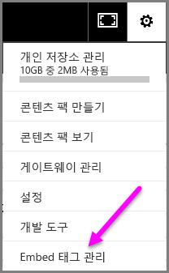
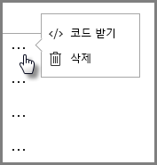

# Power BI에서 웹에 게시

Power BI를 사용 하 여 **웹에 게시** 옵션을 포함할 수 있습니다 쉽게 대화형 Power BI 시각화를 온라인으로 에서처럼 이러한 블로그 게시물, 웹 사이트, 메일 이나 소셜 미디어를 통해 모든 장치에서. 또한 게시된 시각적 개체를 편집하거나, 업데이트하거나, 새로 고치거나, 공유 해제할 수 있습니다.

> [!WARNING]
> 사용 하는 경우 **웹에 게시**, 게시 된 보고서 또는 시각적 개체는 인터넷에서 누구나 볼 수 있습니다. 이 인증이 필요 없습니다 하 고 집계 보고서 세부 수준 데이터를 보기 포함 합니다. 보고서를 게시 하기 전에 데이터 및 시각화를 공개적으로 공유할 수 있도록 정상 인지를 확인 합니다. 기밀 또는 소유 정보는 게시하지 마십시오. 확실하지 않은 경우 게시하기 전에 조직의 정책을 확인합니다.

>[!Note]
>내부 포털 또는 웹 사이트에서 콘텐츠를 안전하게 포함하려면 [포함](service-embed-secure.md) 또는 [SharePoint Online에 포함](service-embed-report-spo.md) 옵션을 사용합니다. 이렇게 하면 사용자가 내부 데이터를 볼 때 모든 사용 권한 및 데이터 보안이 적용됩니다.

## 웹에 게시를 사용하는 방법

**웹에 게시** 편집할 수 있습니다 개인 또는 그룹 작업 영역에 보고서를 사용할 수 있습니다.  보고서, 또는 공유 행 수준 보안에 의존 하는 것과 데이터 보호를 위해 사용할 수 없습니다. 참조 된 [ **제한** ](#limitations) 사례의 전체 목록은 아래 섹션 여기서 **웹에 게시** 지원 되지 않습니다. 검토 합니다 **경고** 사용 하기 전에이 문서의 앞부분 **웹에 게시**합니다.

다음 *짧은 비디오* 이 기능의 작동 방식을 보여 줍니다. 그런 다음 직접 해 보기 아래 단계에 있습니다.

<iframe width="560" height="315" src="https://www.youtube.com/embed/UF9QtqE7s4Y" frameborder="0" allowfullscreen></iframe>

다음 단계는 **웹에 게시**를 사용하는 방법을 설명합니다.

1. 편집 하 고 선택할 수 있는 작업 영역의 보고서를 엽니다 **파일 > 웹에 게시**합니다.

   

2. 콘텐츠 및 선택 대화 상자를 검토 **embed 태그 만들기**합니다.

   

3. 다음과 같이 경고를 검토 하 고 데이터를 공용 웹 사이트에 포함할 수 있는지 확인 합니다. 이 경우 선택 **게시**합니다.

   

4. 링크와 함께 대화 상자가 나타납니다. 이 링크를 전자 메일로 보내기 하, 코드 예: iFrame 포함 하거나 웹 페이지 또는 블로그에에 직접 붙여넣을 수 있습니다.

   

5. 보고서의 embed 코드를 이전에 만든 및 선택한 경우 **웹에 게시**, 2-4 단계에서 대화 상자를 표시 되지 않습니다. 대신 합니다 **Embed 코드** 대화 상자가 나타납니다.

   

   각 보고서에 대한 embed 태그는 하나만 만들 수 있습니다.

## 보기 모드를 위한 팁과 요령

블로그 게시물에 콘텐츠를 포함 하는 경우에 일반적으로 특정 화면 크기에 맞춰야 필요 합니다.  필요에 따라 iFrame 태그의 너비 및 높이 조정할 수 있습니다. 그러나 보고서를 편집할 때 적절 한 보기 모드를 설정 해야 하도록 지정된 iFrame 영역 내에서 적합 한 보고서를 확인 해야 합니다.

다음 표는 보기 모드에 대한 지침과 포함했을 때 표시되는 모양을 제공합니다.

| 보기 모드 | 포함되었을 때 구현되는 모양 |
| --- | --- |
|  |**페이지에 맞추기** 보고서의 페이지 높이 및 너비 적용 합니다. 16:9 또는 4:3 'Dynamic' 비율로 페이지 설정한 경우 콘텐츠는 iFrame 내에 맞게 확장 됩니다. IFrame에 포함 하는 경우 사용 하 여 **페이지에 맞추기** 될 수 있습니다 **letterboxing**있는 회색 배경이 표시 됩니다 iFrame 영역에서 콘텐츠 후 크기를 조정 하는 대로 iFrame 내에 맞게 합니다. Letterboxing을 최소화 하려면 적절 하 게 iFrame의 높이 너비 설정 합니다. |
|  |**실제 크기** 보고서는 보고서 페이지에 설정 된 대로 해당 크기를 그대로 유지 되도록 합니다. 이 스크롤 막대가 iFrame에 표시 될 수 있습니다. IFrame 높이 및 너비 스크롤 막대를 방지 하려면 설정 합니다. |
|  |**너비에 맞추기** iFrame의 가로 영역 내에서 콘텐츠를 맞춥니다. 테두리가 여전히 표시 되지만 콘텐츠 크기가 사용 가능한 가로 공간을 모두 사용 하 합니다. |

## iFrame 높이 및 너비에 대한 팁과 트릭

A **웹에 게시** embed 코드는 다음과 같습니다.

 
너비와 높이 포함 하는 페이지에 맞게 원하는 정확 하 게 상태인을 수동으로 편집할 수 있습니다.

더 완벽 하 게 알맞게 아래쪽 표시줄의 현재 크기에 맞게 iFrame의 높이에 56 픽셀 추가 시도할 수 있습니다. 보고서 페이지가 동적 크기를 사용하고 아래 표에서 몇 가지 크기를 제공하는 경우 letterboxing 없이 맞추도록 사용할 수 있습니다.

| 비율 | 크기 | 차원(너비 x 높이) |
| --- | --- | --- |
| 16:9 |소형 |640 x 416px |
| 16:9 |중형 |800 x 506px |
| 16:9 |대형 |960 x 596px |
| 4:3 |소형 |640 x 536px |
| 4:3 |중형 |800 x 656px |
| 4:3 |대형 |960 x 776px |

## embed 태그 관리

만들고 나면를 **웹에 게시** embed 코드를 사용자 코드에서 관리할 수 있습니다 합니다 **설정** Power BI의 메뉴. Embed 코드 관리 (렌더링 embed 코드를 사용할 수 없는) 하는 코드에 대 한 보고서를 대상 시각적 개체를 제거 하는 기능을 포함 하거나 embed 코드를 가져오기.

1. **웹에 게시** embed 태그를 관리하려면 톱니바퀴 모양의 **설정** 아이콘을 클릭하고 **embed 태그 관리**를 선택합니다.

   

2. Embed 코드에 표시 됩니다.

   

3. 검색 하거나 embed 코드를 삭제할 수 있습니다. 삭제 하는 보고서 또는 시각적 개체에 대 한 링크 사용 하지 않도록 설정 합니다.

   

4. 선택 하는 경우 **삭제**를 묻는 확인 합니다.

   

## 보고서 업데이트 및 데이터 새로 고침

만든 후에 **웹에 게시** 확인 embed 코드 및 모든 변경 내용으로 업데이트는 보고서는 공유 하 고 embed 코드 링크가 즉시 활성화 된 링크는 사람은 누구나 볼 수 있습니다. 그러나이 초기 작업 후 보고서 또는 시각적 개체에 대 한 업데이트를 사용자에 게 표시 되기 전에 한 시간 정도 걸릴 수 있습니다. 업데이트를 즉시 사용할 수 있어야 하는 경우 embed 코드를 삭제하고 새로 만들 수 있습니다. 자세한 내용은 참조는 [ **작동 하는 방법** ](#howitworks) 이 문서의 뒷부분에 나오는 섹션입니다. 

## 데이터 새로 고침

데이터 새로 고침은 포함된 보고서 또는 시각적 개체에 자동으로 반영됩니다. embed 태그에서 새로 고친 데이터를 보는 데에는 약 1시간 정도 걸릴 수 있습니다. 자동 새로 고침을 사용 하지 않으려면 선택할 수 있습니다 **를 새로 고치지 않음** 보고서에서 사용 하는 데이터 집합의 일정에 따라 합니다.  

## 사용자 지정 시각적 개체

사용자 지정 시각적 개체는 **웹에 게시**에서 지원됩니다. 사용 하는 경우 **웹에 게시**, 게시 된 시각적 개체를 공유 하는 사용자가 보고서를 보려면 사용자 지정 시각적 개체를 사용 하도록 설정 하지 않아도 됩니다.

## 제한 사항

**그러나 웹에 게시** 대부분의 데이터 원본 및 다음은 Power BI 서비스에서 보고서에 대 한 지원 됩니다 **현재 지원 되지 않거나 사용할 수 있습니다** 사용 하 여 **웹에 게시** :

- 행 수준 보안을 사용하는 보고서
- 온-프레미스에 호스트된 Analysis Services 테이블 형식, Analysis Service 다차원 및 Azure Analysis Services를 비롯한 모든 라이브 연결 데이터 원본을 사용하는 보고서
- 사용자에게 직접적으로 또는 조직 콘텐츠 팩을 통해 공유되는 보고서
- 편집 멤버가 아닌 그룹의 보고서
- "R" 시각적 개체에서 현재 지원 되지 않습니다 **웹에 게시** 보고서입니다.
- 보고서의 시각적 개체에서 데이터를 내보내기, 웹에 게시 된입니다.
- ArcGIS Maps for Power BI 시각적 개체입니다.
- 보고서 수준 DAX 측정값을 포함 하는 보고서입니다.
- Single sign-on이 데이터 모델을 쿼리 합니다.
- [보안 기밀 또는 소유 정보](#publish-to-web-from-power-bi)합니다.
- **포함** 옵션에 제공되는 자동 인증 기능은 Power BI JavaScript API에서 작동하지 않습니다. Power BI JavaScript API의 경우 포함에 대해 [사용자 소유 데이터](developer/embed-sample-for-your-organization.md) 접근 방식을 사용합니다. [사용자 소유 데이터](developer/embed-sample-for-your-organization.md)에 대해 자세히 알아보세요.

## 테넌트 설정

Power BI 관리자 활성화 하거나 비활성화할 수는 **웹에 게시** 기능입니다. Embed 코드를 만드는 기능에 영향을 줄 수 있는 특정 그룹에 액세스를 제한할 수도 있습니다.

|특정 |전체 조직에 대해 사용 |전체 조직에 대해 사용 안 함 |특정 보안 그룹   |
|---------|---------|---------|---------|
|**웹에 게시** 보고서의 아래 **파일** 메뉴|모든 사용자에 대해 사용|모든 사용자에게 표시 안 함|권한 있는 사용자 또는 그룹에만 표시.|
|**설정** 아래의 **embed 태그 관리**|모든 사용자에 대해 사용|모든 사용자에 대해 사용|모든 사용할 수 있습니다.  권한 있는 사용자 또는 그룹에만 * **삭제** 옵션 제공. 모든 사용자에 대해 * **코드 가져오기** 사용.|
|관리자 포털 내의 **embed 태그**|상태는 다음 중 하나를 반영합니다. * 활성 * 지원되지 않음 * 차단됨|상태가 **사용 안 함**으로 표시됨|상태는 다음 중 하나를 반영합니다. * 활성 * 지원되지 않음 * 차단됨  테넌트 설정에 따라 사용자에게 권한이 없으면 상태가 **침해됨**으로 표시됩니다.|
|게시된 기존 보고서|모두 사용|모두 사용 안 함|보고서가 모든 사용자에 대해 계속 렌더링합니다.|

## embed 태그 상태 열 이해

합니다 **embed 코드 관리** 페이지 상태 열이 포함 됩니다. 기본적으로 embed 코드는 **활성**, 하지만 아래에 나열 된 상태 중 하나일 수도 있습니다.

| 상태 | 설명 |
| --- | --- |
| **활성** |보고서를 인터넷 사용자가 보고 상호 작용할 수 있습니다. |
| **차단** |보고서 내용을 위반 합니다 [Power BI 서비스 약관](https://powerbi.microsoft.com/terms-of-service)합니다. Microsoft는이 차단 했습니다. 콘텐츠가 오류로 차단되었다고 판단되면 고객 지원으로 문의하세요. |
| **지원되지 않음** |보고서의 데이터 집합이 행 수준 보안 또는 지원되지 않는 다른 구성을 사용합니다. 참조 된 [ **제한** ](#limitations) 목록은 섹션입니다. |
| **침해됨** |Embed 코드를 정의 된 테 넌 트 정책을 벗어납니다. Embed 태그를 만들 때 일반적으로 발생 차례로 합니다 **웹에 게시** 테 넌 트 설정 embed 코드를 소유 하는 사용자를 제외 하도록 변경 되었습니다. Embed 태그, 코드 표시를 포함할 기존 테 넌 트 설정이 비활성화 된 경우 사용자가 더 이상 만들려면 수는 **침해 됨** 상태입니다. |

## 웹에 게시 콘텐츠로 문제를 보고하는 방법

에 관련 된 문제 보고서에 **웹에 게시** 웹 사이트 또는 블로그에 포함 된 콘텐츠를 사용 합니다 **플래그** 다음 이미지에 표시 된 대로 아래쪽 막대에서 아이콘입니다. 메시지가 표시 됩니다 Microsoft에 전자 메일을 보내려면 중요 한 설명입니다. Microsoft는 Power BI 서비스 약관에 따라 콘텐츠를 평가 하 고 적절 한 작업을 수행 합니다.

문제를 보고 하려면 선택 합니다 **플래그** 의 아래쪽 막대에서 아이콘을 **웹에 게시** 표시 보고서입니다.

## 라이선스 및 가격

**웹에 게시**를 사용하려면 Microsoft Power BI 사용자여야 합니다. 보고서의 뷰어는 Power BI 사용자가 되도록 필요가 없습니다.

## 작동 방법(기술 세부 사항)

사용 하 여 embed 코드를 만들 때 **웹에 게시**, 보고서를 인터넷 사용자에 게 표시 되도록 설정 됩니다. 이므로 공개적으로 사용할 수 있는 소셜 미디어를 통해 보고서를 나중에 쉽게 공유할 수 있는 뷰어를 예상할 수 있습니다. 사용자가 직접 공용 URL을 열어 보고서를 보거나 웹 페이지 또는 블로그에 포함된 보고서를 보면 Power BI는 보고서 정의 및 보고서를 보는 데 필요한 쿼리 결과를 캐시합니다. 이렇게 하면 수천 명의 동시 사용자가 성능에 영향을 주지 않고 보고서를 볼 수 있습니다.

캐시 수명이 이므로 (예: 보기 모드를 변경 하는 경우) 보고서 정의 업데이트 하거나 보고서 데이터를 새로 고칠 경우 사용자에 게 보고 하는 보고서의 버전에서 변경 내용이 반영 되기 전에 한 시간 정도 걸릴 수 있습니다. 따라서 작업을 미리 준비하고 설정에 만족하는 경우에만 **웹에 게시** embed 태그를 만드는 것이 좋습니다.

## 다음 단계

- [SharePoint Online 보고서 웹 파트](service-embed-report-spo.md) 

- [보안 포털 또는 웹 사이트에 보고서 포함](service-embed-secure.md)

궁금한 점이 더 있나요? [Power BI 커뮤니티를 이용하세요.](http://community.powerbi.com/)
