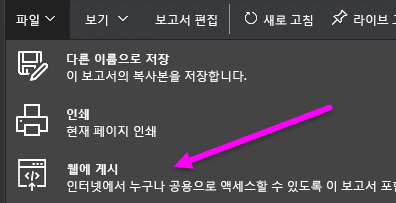
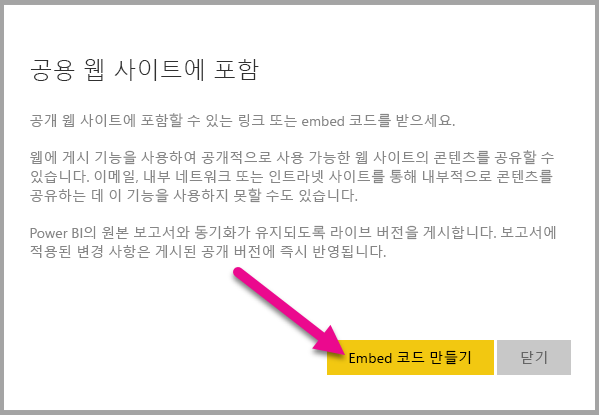
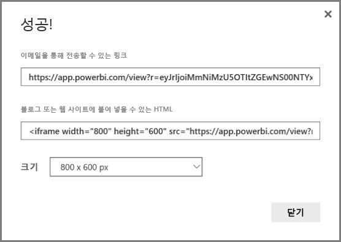
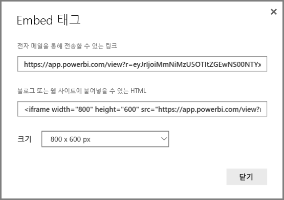
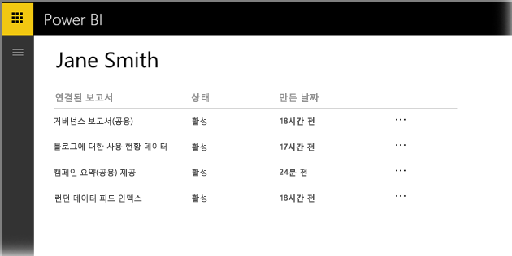

# Power BI에서 웹에 게시

Power BI의 **웹에 게시** 옵션을 사용하면 모든 디바이스에서 이메일이나 소셜 미디어를 통해 블로그 게시물, 웹 사이트 등에 대화형 Power BI 시각화를 온라인으로 쉽게 포함할 수 있습니다. 또한 게시된 시각적 개체를 편집, 업데이트, 새로 고침 또는 공유 중지할 수 있습니다.

> [!WARNING]
> **웹에 게시**를 사용하는 경우 인터넷에 있는 모든 사용자가 게시된 보고서나 시각적 개체를 볼 수 있습니다. 여기에는 인증이 필요 없으며 보고서가 집계한 상세 수준 데이터도 포함됩니다. 보고서를 게시하기 전에 데이터 및 시각화를 공개적으로 공유하는 것이 괜찮은지 확인합니다. 기밀 또는 소유 정보는 게시하지 마십시오. 확실하지 않은 경우 게시하기 전에 조직의 정책을 확인합니다.

>[!Note]
>내부 포털 또는 웹 사이트에서 콘텐츠를 안전하게 포함하려면 [포함](service-embed-secure.md) 또는 [SharePoint Online에 포함](service-embed-report-spo.md) 옵션을 사용합니다. 이렇게 하면 사용자가 내부 데이터를 볼 때 모든 사용 권한 및 데이터 보안이 적용됩니다.

## 웹에 게시를 사용하는 방법

**웹에 게시**는 개인 또는 그룹 작업 영역에서 편집할 수 있는 보고서에 사용할 수 있습니다.  사용자와 공유되는 보고서나 데이터를 보호하기 위해 행 수준 보안에 의존하는 보고서에는 사용할 수 없습니다. **웹에 게시**가 지원되지 않는 경우의 전체 목록은 아래 [**제한**](#limitations) 섹션을 참조하세요. **웹에 게시**를 사용하기 전에 이 문서의 앞부분에 있는 **경고**를 확인해 보세요.

다음의 짧은 비디오는 이 기능의 작동 방식을 보여줍니다. 그런 다음, 아래 단계에 따라 직접 시도해 보세요.

<iframe width="560" height="315" src="https://www.youtube.com/embed/UF9QtqE7s4Y" frameborder="0" allowfullscreen></iframe>

다음 단계는 **웹에 게시**를 사용하는 방법을 설명합니다.

1. 편집할 수 있는 작업 영역에서 보고서를 열고 **파일 > 웹에 게시**를 선택합니다.

   
   
2. embed 태그를 만들 수 있는 권한이 없는 경우 [Power BI 관리자](service-admin-role.md)에게 문의하세요.

   
   
   조직에서 웹에 게시를 사용하도록 설정할 수 있는 사람을 찾는 데 도움이 필요하면 [다음 팁을 참조하세요](#how-to-find-your-power-bi-administrator).

3. 대화 상자 콘텐츠를 검토하고 **embed 태그 만들기**를 선택합니다.

   

4. 여기에 표시된 대로 경고를 검토하고 공용 웹 사이트에 데이터를 포함해도 괜찮은지 확인합니다. 이 경우 **게시**를 선택합니다.

   

5. 링크가 있는 대화 상자가 나타납니다. 이 링크를 이메일로 보내거나 iFrame과 같은 코드에 포함시키거나 웹 페이지나 블로그에 직접 붙여넣을 수 있습니다.

   

6. 이전에 보고서의 embed 태그를 만들고 **웹에 게시**를 선택한 경우 2-4 단계에서 대화 상자가 표시되지 않습니다. 대신 **Embed 태그** 대화 상자가 나타납니다.

   

   각 보고서에 대한 embed 태그는 하나만 만들 수 있습니다.

## 보기 모드에 대한 팁과 요령

블로그 게시물에 콘텐츠를 포함하는 경우 일반적으로 특정 화면 크기에 맞추어야 합니다.  필요에 따라 iFrame 태그의 높이와 너비를 조정할 수 있습니다. 그러나 보고서가 지정된 iFrame 영역 내에 맞는지 확인해야 하므로 보고서를 편집할 때 적절한 보기 모드도 설정해야 합니다.

다음 표는 보기 모드에 대한 지침과 포함했을 때 표시되는 모양을 제공합니다.

| 보기 모드 | 포함되었을 때 구현되는 모양 |
| --- | --- |
|  |**페이지에 맞추기**는 보고서의 페이지 높이 및 너비를 고려합니다. 16:9 또는 4:3과 같은 *동적* 비율로 페이지를 설정하는 경우 콘텐츠가 iFrame 내에 맞게 확장됩니다. iFrame에 포함된 경우 **페이지에 맞추기**를 사용하면 *letterboxing*이 발생할 수 있으며 여기에서 콘텐츠가 iFrame 내에 맞게 확장된 후 iFrame 영역에 회색 배경이 표시됩니다. letterboxing을 최소화하려면 iFrame의 높이와 너비를 적절하게 설정합니다. |
|  |**실제 크기**는 보고서 페이지에 설정된 대로 보고서의 크기를 유지합니다. 따라서 iFrame에 스크롤 막대가 표시될 수 있습니다. 스크롤 막대를 피하도록 iFrame 높이 및 너비를 설정합니다. |
|  |**너비에 맞추기**는 iFrame의 가로 영역에 콘텐츠가 채워지도록 합니다. 테두리는 계속 표시되지만, 콘텐츠는 사용 가능한 가로 공간을 모두 사용하도록 확장됩니다. |

## iFrame 높이 및 너비에 대한 팁과 트릭

**웹에 게시** embed 태그는 다음 예제와 같습니다.

 
너비와 높이를 수동으로 편집하여 보고서를 포함하는 페이지에 원하는 대로 정확하게 맞출 수 있습니다.

더 완벽하게 맞추기 위해 아래쪽 표시줄의 현재 크기에 맞추어 iFrame의 높이에 56픽셀을 추가할 수 있습니다. 보고서 페이지가 동적 크기를 사용하고 아래 표에서 몇 가지 크기를 제공하는 경우 letterboxing 없이 맞추도록 사용할 수 있습니다.

| 비율 | 크기 | 차원(너비 x 높이) |
| --- | --- | --- |
| 16:9 |소형 |640 x 416px |
| 16:9 |중간 |800 x 506px |
| 16:9 |대형 |960 x 596px |
| 4:3 |소형 |640 x 536px |
| 4:3 |중간 |800 x 656px |
| 4:3 |대형 |960 x 776px |

## embed 태그 관리

**웹에 게시** embed 태그를 만들면 Power BI의 **설정** 메뉴에서 코드를 관리할 수 있습니다. embed 태그 관리에는 대상 시각적 개체 또는 코드에 대한 보고서(사용할 수 없는 embed 코드 렌더링)를 제거하거나 embed 태그를 가져오는 기능이 포함되어 있습니다.

1. **웹에 게시** embed 태그를 관리하려면 톱니바퀴 모양의 **설정** 아이콘을 클릭하고 **embed 태그 관리**를 선택합니다.

   

2. embed 태그가 나타납니다.

   

3. embed 태그를 검색하거나 삭제할 수 있습니다. 삭제하면 보고서 또는 시각적 개체에 대한 링크가 비활성화됩니다.

   

4. **삭제**를 선택하면 확인을 요청하는 메시지가 나타납니다.

   

## 보고서 업데이트 및 데이터 새로 고침

**웹에 게시** embed 태그를 만들고 공유하면 보고서가 변경된 내용으로 업데이트되고 embed 태그 링크가 즉시 활성화됩니다. 링크를 열면 누구나 볼 수 있습니다. 하지만 이 초기 작업 후 보고서 또는 시각적 개체의 업데이트가 사용자에게 표시되려면 2~3시간이 소요될 수 있습니다. 자세한 내용은 이 문서의 뒷부분에 나오는 [**작동 방법**](#howitworks) 섹션을 참조하세요. 

## 데이터 새로 고침

데이터 새로 고침은 포함된 보고서 또는 시각적 개체에 자동으로 반영됩니다. embed 태그에서 새로 고친 데이터를 보는 데에는 약 1시간 정도 걸릴 수 있습니다. 자동 새로 고침을 비활성화하려면 보고서에서 사용하는 데이터 세트에 대한 일정에서 **새로 고치지 않음**을 선택합니다.  

## 사용자 지정 시각적 개체

사용자 지정 시각적 개체는 **웹에 게시**에서 지원됩니다. **웹에 게시**를 사용하면 게시된 시각적 개체를 공유하는 대상 사용자는 보고서를 보기 위해 사용자 지정 시각적 개체를 활성화하지 않아도 됩니다.

## 제한 사항

**웹에 게시**는 Power BI 서비스에서 대부분의 데이터 원본과 보고서에 대해 지원되지만, 다음은 **웹에 게시**에서 현재 지원되지 않거나 사용할 수 없습니다.

- 행 수준 보안을 사용하는 보고서
- 온-프레미스에 호스트된 Analysis Services 테이블 형식, Analysis Service 다차원 및 Azure Analysis Services를 비롯한 모든 라이브 연결 데이터 원본을 사용하는 보고서
- 보고서와 다른 작업 영역에 저장된 [공유 데이터 세트](service-datasets-across-workspaces.md)를 사용하는 보고서
- 사용자에게 직접적으로 또는 조직 콘텐츠 팩을 통해 공유되는 보고서
- 편집 멤버가 아닌 그룹의 보고서
- "R" 시각적 개체는 현재 **웹에 게시** 보고서에서 지원되지 않습니다.
- 웹에 게시된 보고서의 시각적 개체에서 데이터 내보내기.
- ArcGIS Maps for Power BI 시각적 개체.
- 보고서 수준 DAX 측정값을 포함하는 보고서.
- Single Sign-On 데이터 쿼리 모델.
- 보안 기밀 또는 소유 정보.
- [공유 및 인증된 데이터 세트](service-datasets-share.md).
- **포함** 옵션에 제공되는 자동 인증 기능은 Power BI JavaScript API에서 작동하지 않습니다. Power BI JavaScript API의 경우 포함에 대해 [사용자 소유 데이터](developer/embed-sample-for-your-organization.md) 접근 방식을 사용합니다.

## 테넌트 설정

**웹에 게시** 설정은 사용자가 embed 태그를 만들 수 있는 옵션을 제공합니다.

**embed 태그 작동 방식 선택** 옵션이 **기존 코드만 허용**으로 설정되고 **웹에 게시** 설정이 **사용**으로 설정된 경우 embed 태그를 만들려면 Power BI 관리자에게 연락해야 합니다.

Power BI 관리자는 **웹에 게시** 기능을 사용하거나 사용하지 않도록 설정할 수 있습니다. 특정 그룹에 대한 액세스를 제한할 수 있으며, 이로 인해 embed 태크를 만드는 기능에 영향을 줄 수도 있습니다. **웹에 게시** 설정에 따라 UI에 다른 옵션이 표시됩니다.

|기능 |전체 조직에 대해 사용 |전체 조직에 대해 사용 안 함 |특정 보안 그룹   |
|---------|---------|---------|---------|
|보고서의 **파일** 메뉴 아래에 있는 **웹 게시**|모든 사용자에 대해 사용|모든 사용자에게 표시 안 함|권한 있는 사용자 또는 그룹에만 표시.|
|**설정** 아래의 **embed 태그 관리**|모든 사용자에 대해 사용|모든 사용자에 대해 사용|모든 사용자에 대해 사용.  *  권한 있는 사용자 또는 그룹에만 **삭제** 옵션 제공. *  모든 사용자에 대해 **코드 가져오기** 사용.|
|관리자 포털 내의 **embed 태그**|상태는 다음 중 하나를 반영합니다. * 활성 * 지원되지 않음 * 차단됨|상태가 **사용 안 함**으로 표시됨|상태는 다음 중 하나를 반영합니다. * 활성 * 지원되지 않음 * 차단됨  테넌트 설정에 따라 사용자에게 권한이 없으면 상태가 **침해됨**으로 표시됩니다.|
|게시된 기존 보고서|모두 사용|모두 사용 안 함|보고서가 모든 사용자에 대해 계속 렌더링합니다.|

## embed 태그 상태 열 이해

>[!Note]
>게시한 embed 태그를 정기적으로 검토하여 더 이상 공개적으로 사용할 필요가 없으면 제거해야 합니다. 

**embed 태그 관리** 페이지에 상태 열이 포함됩니다. 기본적으로 embed 태그는 **활성**이지만 아래에 나열된 상태 중 하나일 수도 있습니다.

| 상태 | 설명 |
| --- | --- |
| **활성** |보고서를 인터넷 사용자가 보고 상호 작용할 수 있습니다. |
| **차단** |보고서 콘텐츠가 [Power BI 서비스 약관](https://powerbi.microsoft.com/terms-of-service)을 위반합니다. Microsoft가 차단했습니다. 콘텐츠가 오류로 차단되었다고 판단되면 고객 지원으로 문의하세요. |
| **지원되지 않음** |보고서의 데이터 집합이 행 수준 보안 또는 지원되지 않는 다른 구성을 사용합니다. 전체 목록은 [**제한**](#limitations) 섹션을 참조하세요. |
| **침해됨** |embed 태그가 정의된 테넌트 정책을 벗어납니다. 이 문제는 일반적으로 embed 태그가 생성된 다음, **웹에 게시** 테넌트 설정이 해당 embed 태그를 소유한 사용자를 제외하도록 변경된 경우에 발생합니다. 테넌트 설정이 비활성화되거나 사용자가 더 이상 embed 태그를 만들 수 없는 경우 기존 embed 태그는 **침해됨** 상태를 표시합니다. |

## 웹에 게시 콘텐츠로 문제를 보고하는 방법

웹 사이트 또는 블로그에 포함된 **웹에 게시** 콘텐츠와 관련된 문제를 보고하려면 다음 이미지에 표시된 대로 아래쪽 막대에서 **플래그** 아이콘을 사용합니다. Microsoft에 문제를 설명하는 이메일을 보낼 것인지 묻는 메시지가 표시됩니다. Microsoft는 Power BI 서비스 약관에 따라 콘텐츠를 평가하고 적절한 조치를 취합니다.

문제를 보고하려면 보이는 **웹에 게시** 보고서의 아래쪽 막대에서 **플래그** 아이콘을 선택합니다.

## 라이선스 및 가격

**웹에 게시**를 사용하려면 Microsoft Power BI 사용자여야 합니다. 보고서의 뷰어는 Power BI 사용자가 될 필요는 없습니다.

## 작동 방법(기술 세부 사항)

**웹에 게시**를 사용하여 embed 태그를 만들면 보고서는 인터넷 사용자에게 표시됩니다. 공개적으로 사용할 수 있으므로 뷰어는 나중에 소셜 미디어를 통해 보고서를 쉽게 공유할 수 있습니다. 사용자가 직접 공용 URL을 열어 보고서를 보거나 웹 페이지 또는 블로그에 포함된 보고서를 보면 Power BI는 보고서 정의 및 보고서를 보는 데 필요한 쿼리 결과를 캐시합니다. 이렇게 하면 수천 명의 동시 사용자가 성능에 영향을 주지 않고 보고서를 볼 수 있습니다.

캐시는 수명이 길기 때문에 보고서 정의를 업데이트하거나(예: 보기 모드를 변경하는 경우) 보고서 데이터를 새로 고치는 경우 사용자가 보는 보고서 버전에 변경 사항이 반영되기까지 약 1시간이 걸릴 수 있습니다. 따라서 작업을 미리 준비하고 설정에 만족하는 경우에만 **웹에 게시** embed 태그를 만드는 것이 좋습니다.

## Power BI 관리자를 찾는 방법

[웹에 게시 테넌트 설정](#tenant-setting)을 변경하려면 조직의 [Power BI 관리자](service-admin-role.md)와 함께 작업해야 합니다.

Power BI에 등록한 소규모 조직이나 개인의 경우 아직 Power BI 관리자가 없을 수 있습니다. [테넌트 관리자 인수 프로세스](https://docs.microsoft.com/azure/active-directory/users-groups-roles/domains-admin-takeover)를 따라야 합니다. Power BI 관리자가 생기면 embed 태그를 만들 수 있습니다.

일반적으로 기존 조직에는 이미 Power BI 관리자가 있습니다. 다음 역할의 사람들이 Power BI 관리자 역할을 할 수 있습니다.

- Office 365 관리자
- Azure Active Directory 관리자
- Azure Active Directory에서 Power BI 서비스 관리자 역할이 있는 사용자

조직에서 [위의 역할을 가진 사람](https://docs.microsoft.com/office365/admin/admin-overview/admin-overview#who-has-admin-permissions-in-my-business)을 찾으면 설정을 업데이트할 수 있습니다.

## 다음 단계

- [SharePoint Online 보고서 웹 파트](service-embed-report-spo.md) 

- [보안 포털 또는 웹 사이트에 보고서 포함](service-embed-secure.md)

궁금한 점이 더 있나요? [Power BI 커뮤니티를 이용하세요.](https://community.powerbi.com/)
