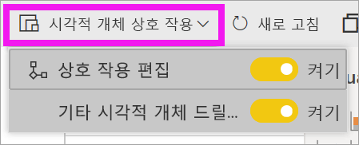
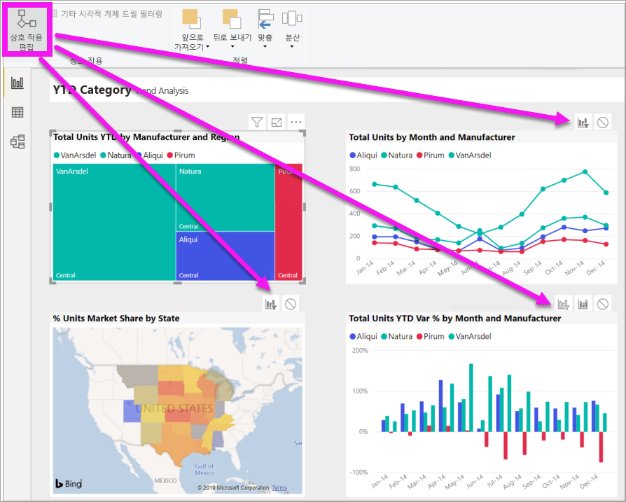
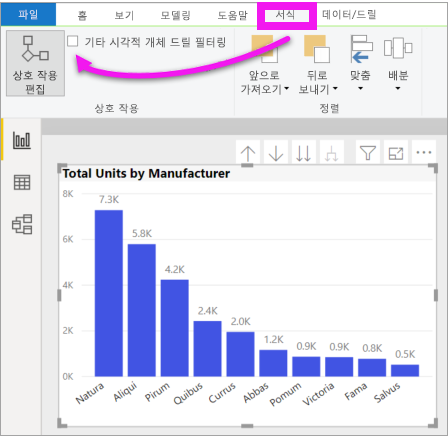

# Power BI 보고서에서 시각적 개체가 조작되는 방식 변경
보고서에 대한 편집 권한이 있는 경우 **시각적 상호 작용**을 사용하여 보고서 페이지의 시각화들이 서로 영향을 주는 방식을 변경할 수 있습니다. 

## 시각적 개체 상호 작용 소개
기본적으로 보고서 페이지의 시각화는 페이지에서 다른 시각화를 교차 필터링 및 교차 강조 표시하는 데 사용할 수 있습니다.
예를 들어 지도 시각화에서 시/도를 선택하면 세로 막대형 차트가 강조 표시되고 해당 시/도에 적용되는 데이터만 표시하도록 꺾은선형 차트가 필터링됩니다.
[필터링 및 강조 표시 정보](power-bi-reports-filters-and-highlighting.md)를 참조하세요. 또한 [드릴링](consumer/end-user-drill.md)을 지원하는 시각화가 있는 경우 기본적으로 하나의 시각화 드릴링이 보고서 페이지의 다른 시각화에 영향을 주지 않습니다. 그러나 이러한 기본 동작 모두를 재정의하고 상호 작용을 시각화 단위로 설정할 수 있습니다.

이 문서에서는 Power BI Desktop에서 **시각적 개체 상호 작용**을 사용하는 방법을 보여줍니다. 이 프로세스는 Power BI 서비스 [편집용 보기](service-interact-with-a-report-in-editing-view.md)에서 동일합니다. 읽기용 보기 액세스만 있거나 보고서를 공유하는 경우에는 시각적 개체 상호 작용 설정을 변경할 수 없습니다.

*교차 필터* 및 *교차 강조 표시*는 여기서 설명하는 동작을 **필터** 창에서 시각화를 *필터링*하고 *강조 표시*할 때 나타나는 결과와 구분하는 데 사용합니다.  

> [!NOTE]
> 이 비디오에서는 이전 버전의 Power BI Desktop 및 Power BI 서비스를 사용합니다. 
>
>

<iframe width="560" height="315" src="https://www.youtube.com/embed/N_xYsCbyHPw?list=PL1N57mwBHtN0JFoKSR0n-tBkUJHeMP2cP" frameborder="0" allowfullscreen></iframe>

## 시각적 개체 상호 작용 컨트롤 사용
보고서에 대한 편집 권한이 있는 경우 시각적 개체 상호 작용 컨트롤을 켜고 보고서 페이지의 시각화가 서로 필터링하고 강조 표시하는 방법을 사용자 지정할 수 있습니다. 

1. 시각화를 선택하여 활성화합니다.  
2. **시각적 상호 작용** 옵션을 표시합니다.
    

    - Power BI Desktop 에서 **형식 > 상호 작용 편집** 을 선택합니다.

        

    - Power BI 서비스의 편집용 보기에서 보고서를 열고 보고서 메뉴 모음에서 드롭다운을 선택합니다.

        

3. 시각화 상호 작용 컨트롤을 표시하려면 **상호 작용 편집**을 선택합니다. Power BI는 보고서 페이지의 다른 모든 시각화에 필터 및 강조 표시 아이콘을 추가합니다. 이 트리 맵은 꺾은선형 차트와 맵을 교차 필터링하고 세로 막대형 차트를 교차 강조 표시하는 것을 볼 수 있습니다. 이제 선택한 시각화가 보고서 페이지의 다른 시각화와 상호 작용하는 방식을 변경할 수 있습니다.
   
    

## 상호 작용 동작 변경
보고서 페이지에서 한 번에 하나씩 시각화를 선택하여 시각화가 상호 작용하는 방법에 대해 알아봅니다.  데이터 요소 또는 막대나 셰이프를 선택하고 다른 시각화에 미치는 영향을 확인합니다. 표시되는 동작이 원하는 결과가 아닌 경우 상호 작용을 변경할 수 있습니다. 이러한 변경 내용은 보고서와 함께 저장되므로 보고서 작성자와 보고서 소비자는 동일한 시각적 상호 작용 환경을 갖습니다.

먼저 시각화를 선택하여 활성 상태로 만듭니다.  이제 페이지의 다른 모든 시각화에 상호 작용 아이콘이 표시됩니다. 굵게 표시된 아이콘이 적용되는 아이콘입니다. 그런 다음 **선택한 시각화**가 다른 시각화에 줄 영향을 결정합니다.  그리고 필요에 따라 보고서 페이지의 다른 모든 시각화에 대해 이 작업을 반복합니다.

선택한 시각화가
   
   * 페이지의 다른 시각화 중 하나를 교차 필터링해야 하는 경우 시각화 의 오른쪽 위 모서리에 있는 **필터** 아이콘을 선택합니다.
   * 페이지의 다른 시각화 중 하나를 교차 강조 표시해야 하는 경우 **강조 표시** 아이콘 을 선택합니다.
   * 페이지의 다른 시각화에 영향을 주지 않는 경우 **영향 없음** 아이콘 을 선택합니다.

## 드릴 가능한 시각화의 상호 작용 변경
[일부 Power BI 시각화는 드릴이 가능](consumer/end-user-drill.md)합니다. 기본적으로 시각화를 드릴하면 보고서 페이지의 다른 시각화 요소에는 영향을 주지 않습니다. 그러나 이 동작을 변경할 수 있습니다. 

> [!TIP]
> [인적 자원 샘플 PBIX 파일](https://download.microsoft.com/download/6/9/5/69503155-05A5-483E-829A-F7B5F3DD5D27/Human%20Resources%20Sample%20PBIX.pbix)을 사용하여 직접 시도해 보세요. **새 채용** 탭에 드릴다운을 포함하는 세로 막대형 차트가 있습니다.
>

1. 드릴 가능한 시각적 개체를 선택하여 활성화합니다. 

2. 드릴 다운 아이콘을 선택하여 드릴 다운을 설정합니다.

    

2. 메뉴 모음에서 **형식** > **기타 시각적 개체 드릴 필터링**을 선택합니다.  이제 시각화에서 드릴다운(및 드릴업)하면 보고서 페이지의 다른 시각화가 현재 드릴링 선택을 반영하도록 변경됩니다. 

    

3. 표시되는 동작이 원하는 결과가 아닌 경우 [위에 표시된 대로](#change-the-interaction-behavior) 상호 작용을 변경할 수 있습니다.
    
## 다음 단계
[Power BI 보고서의 필터링 및 강조 표시](power-bi-reports-filters-and-highlighting.md)